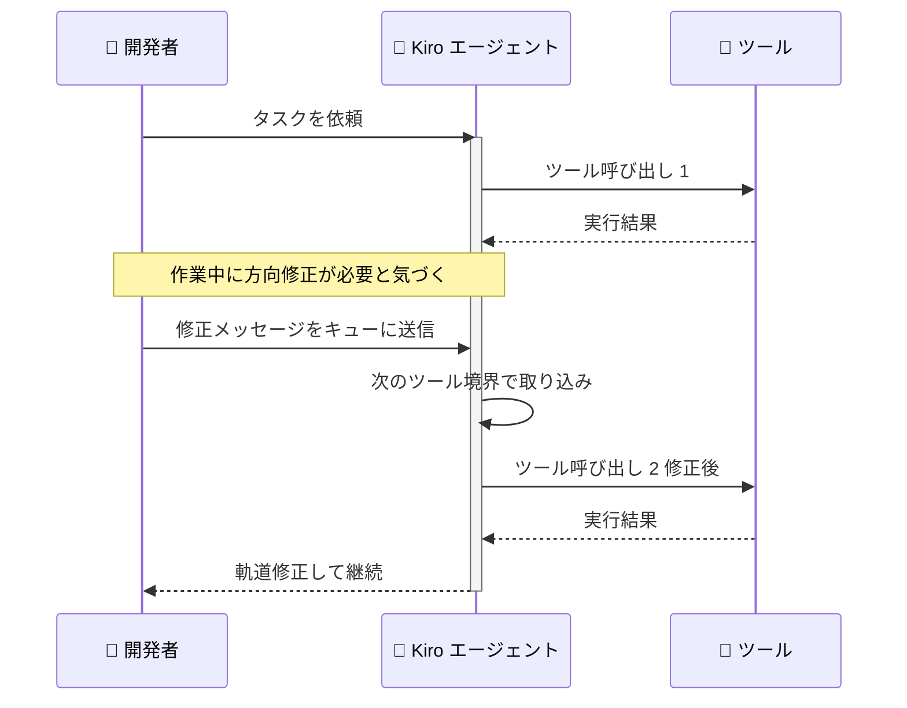

# Kiro - /goal、Queue Steering、強化された /rewind

**リリース日**: 2026 年 6 月 12 日
**サービス**: Kiro (CLI 2.7)
**機能**: /goal コマンド、Queue Steering、強化された /rewind プレビュー

📊 [このアップデートのインフォグラフィックを見る](https://takech9203.github.io/aws-news-summary/20260612-kiro-changelog-2026-06-12.html)
<!-- INFOGRAPHIC_BASE_URL は環境変数から取得 -->

## 概要

Kiro CLI 2.7 では、エージェントの動作方向と自律性に対する制御を強化する 3 つの機能が追加されました。これにより、開発者はエージェントの実行を待つことなく方向を修正したり、完了を検証する反復ループを実行したり、過去のターンを詳細に確認して巻き戻したりできます。

今回のアップデートの中心となるのは、エージェントとの協働体験の改善です。Queue Steering により、エージェントの作業中にメッセージを送信して次のツール境界で軌道修正できるようになりました。/goal コマンドは、受け入れ基準を満たすまでエージェントを反復実行させる目標駆動型ループを提供します。そして強化された /rewind プレビューは、各ターンで何が起きたかを高レベルで要約表示し、適切な分岐点を素早く特定できるようにします。

対象ユーザーは、Kiro CLI を使用してエージェント駆動の開発を行うすべての開発者です。特に、長時間実行されるマルチステップのタスクや、エージェントの方向性をきめ細かく制御したいユーザーにメリットがあります。

**アップデート前の課題**

- エージェントの作業中に誤った方向に進んでいることに気づいても、修正するにはキャンセルして最初からやり直す必要があった
- 通常のプロンプトでは、エージェントがタスクの完了を自己検証する仕組みがなく、不完全な状態で停止することがあった
- /rewind でターンを選択する際、各ターンで何が行われたかを把握するには個々のメッセージを展開して確認する必要があった

**アップデート後の改善**

- Queue Steering により、エージェントを停止せずにメッセージをキューに入れ、次のツール境界で軌道修正できるようになった
- /goal コマンドにより、エージェントが完了を検証してから停止する反復ループを実行できるようになった
- 強化された /rewind プレビューにより、各ターンのツール呼び出しや変更ファイルなどの要約を確認し、適切な分岐点を素早く特定できるようになった

## アーキテクチャ図



Queue Steering の動作フロー。開発者はエージェントを停止せずに修正メッセージを送信し、エージェントは次のツール境界でそれを取り込んで軌道修正します。

## サービスアップデートの詳細

### 主要機能

1. **/goal コマンド**
   - エージェントが目標に向かって反復的に作業し、完了前にタスクが完了したことを検証する目標駆動型ループを開始する
   - 通常のプロンプトとは異なり、受け入れ基準が満たされるまで実装と自己チェックの複数サイクルを繰り返す
   - デフォルトの反復回数は 5 回で、`--max` オプションで設定可能
   - 自律的な実行と品質ゲートを組み込んだマルチステップタスクに有用

2. **Queue Steering**
   - エージェントの作業中にメッセージを送信し、次のツール境界でそれを取り込ませる機能
   - 誤った方向に進んでいると気づいたときに、キャンセルして再起動する代わりに修正をキューに入れることで、エージェントがターンの途中で軌道修正する
   - Ctrl+S を押すことで、steer モード (ターンの途中で即座に注入) と queue モード (ターン終了までバッファリング) を切り替えられる

3. **強化された /rewind プレビュー**
   - /rewind のターン選択機能が、各ターンの高レベルな要約を表示するようになった
   - ツール呼び出し、変更されたファイル、実行されたコマンド、中間メッセージなどを表示する
   - 個々のメッセージを展開することなく、適切な分岐点を素早く特定できる

## 技術仕様

### 各機能の概要

| 項目 | 詳細 |
|------|------|
| /goal のデフォルト反復回数 | 5 回 |
| /goal の反復回数設定 | `--max` オプションで変更可能 |
| Queue Steering のモード切替 | Ctrl+S で steer モードと queue モードを切替 |
| steer モード | ターンの途中で即座にメッセージを注入 |
| queue モード | ターン終了までメッセージをバッファリング |
| /rewind プレビュー表示内容 | ツール呼び出し、変更ファイル、実行コマンド、中間メッセージ |

## 設定方法

### 前提条件

1. Kiro CLI 2.7 以降がインストールされていること
2. Kiro でエージェント駆動のチャットセッションが利用可能であること

### 手順

#### ステップ 1: /goal コマンドで目標駆動型ループを開始する

```bash
/goal テストカバレッジを 80% 以上に引き上げる
```

エージェントが指定した目標に向かって反復的に作業を行い、受け入れ基準を満たしたことを検証してから停止します。反復回数を変更する場合は `--max` オプションを使用します。

#### ステップ 2: 反復回数を指定して /goal を実行する

```bash
/goal --max 10 すべての failing テストを修正する
```

最大反復回数を 10 回に設定して目標駆動型ループを実行します。デフォルトの 5 回では不足する大規模なタスクに有用です。

#### ステップ 3: Queue Steering でエージェントを軌道修正する

エージェントの作業中にメッセージを入力して送信すると、エージェントが次のツール境界でそのメッセージを取り込みます。Ctrl+S を押すことで、ターンの途中で即座に注入する steer モードと、ターン終了までバッファリングする queue モードを切り替えられます。

## メリット

### ビジネス面

- **生産性の向上**: エージェントをキャンセルして再起動する必要がなくなり、軌道修正の待ち時間が削減される
- **品質の担保**: /goal による完了検証ループにより、不完全な成果物のまま作業が終了するリスクが低減する
- **作業の透明性**: 強化された /rewind プレビューにより、過去のターンの内容を素早く把握でき、意思決定が迅速化する

### 技術面

- **きめ細かい制御**: ツール境界でのメッセージ取り込みにより、エージェントの実行を妨げずに方向性を制御できる
- **自律実行と品質ゲートの両立**: /goal によりマルチステップのタスクを自律的に実行しつつ、検証ステップで品質を確保できる
- **効率的なデバッグ**: /rewind の要約表示により、適切な分岐点を特定して効率的にやり直しができる

## デメリット・制約事項

### 制限事項

- 本機能は Kiro CLI 2.7 以降で利用可能であり、それ以前のバージョンでは使用できない
- Queue Steering のメッセージ取り込みはツール境界で行われるため、即座に反映されるわけではない
- /goal の反復実行はエージェントの稼働時間を増やすため、クレジット消費が増加する可能性がある

### 考慮すべき点

- /goal の反復回数を多く設定すると、想定以上のクレジットを消費する場合があるため、`--max` の値は慎重に設定する
- 目標駆動型ループの受け入れ基準は明確に指定することで、検証の精度が向上する

## ユースケース

### ユースケース 1: 大規模リファクタリングの自律実行

**シナリオ**: 複数ファイルにまたがるリファクタリングを行い、すべてのテストがパスすることを確認したい。

**実装例**:
```
/goal --max 8 ユーザー認証モジュールをリファクタリングし、すべての既存テストがパスすることを確認する
```

**効果**: エージェントが実装と自己検証を繰り返し、受け入れ基準を満たすまで自律的に作業を継続します。

### ユースケース 2: 作業中の軌道修正

**シナリオ**: エージェントが実装を進めている途中で、別のアプローチを採用すべきだと気づいた。

**実装例**:
```
エージェント作業中にメッセージを入力:
「REST API ではなく GraphQL で実装してください」
→ 次のツール境界で取り込まれ軌道修正
```

**効果**: エージェントをキャンセルして最初からやり直すことなく、作業を継続したまま方向性を変更できます。

### ユースケース 3: 過去のターンへの巻き戻し

**シナリオ**: エージェントの作業が複数ターンにわたり進行した後、特定のターンの状態に戻したい。

**実装例**:
```
/rewind
→ 各ターンの要約 ツール呼び出し、変更ファイル、コマンド を確認
→ 適切な分岐点を選択
```

**効果**: 個々のメッセージを展開せずに、要約から適切な分岐点を素早く特定して巻き戻せます。

## 料金

これらの機能は Kiro CLI の一部として提供されます。Kiro の料金はクレジットベースのプランに基づいており、エージェントの実行に応じてクレジットを消費します。/goal の反復実行はエージェントの稼働を伴うため、クレジット消費が増加する可能性があります。

| プラン | 月額料金 | 月間クレジット |
|--------|----------|----------------|
| Kiro Free | 0 USD | 50 クレジット |
| Kiro Pro | 20 USD | 1,000 クレジット |
| Kiro Pro+ | 40 USD | 2,000 クレジット |
| Kiro Pro Max | 100 USD | 5,000 クレジット |
| Kiro Power | 200 USD | 10,000 クレジット |

最新の料金情報は [Kiro の料金ページ](https://kiro.dev/pricing/) を参照してください。

## 利用可能リージョン

グローバル (Kiro はグローバルに提供されるサービスです)

## 関連サービス・機能

- **Kiro CLI**: 本アップデートの提供基盤となるコマンドラインインターフェイス
- **Kiro エージェント**: /goal、Queue Steering、/rewind の対象となるエージェント機能
- **Kiro Specs**: 仕様駆動開発のワークフロー。エージェントによるマルチステップタスク実行と組み合わせて活用できる

## 参考リンク

- 📊 [インフォグラフィック](https://takech9203.github.io/aws-news-summary/20260612-kiro-changelog-2026-06-12.html)
- [公式発表 (Changelog)](https://kiro.dev/changelog/)
- [/goal コマンドのドキュメント](https://kiro.dev/docs/cli/chat/goal/)
- [Kiro ドキュメント](https://kiro.dev/docs/)
- [Kiro 料金ページ](https://kiro.dev/pricing/)

## まとめ

Kiro CLI 2.7 は、エージェントの方向制御と自律性を大きく向上させるアップデートです。Queue Steering による作業中の軌道修正、/goal による完了検証ループ、強化された /rewind プレビューにより、エージェント駆動開発の効率と品質が向上します。Kiro CLI を利用している開発者は、CLI を 2.7 以降に更新し、これらの機能を実際のワークフローに取り入れることを推奨します。
