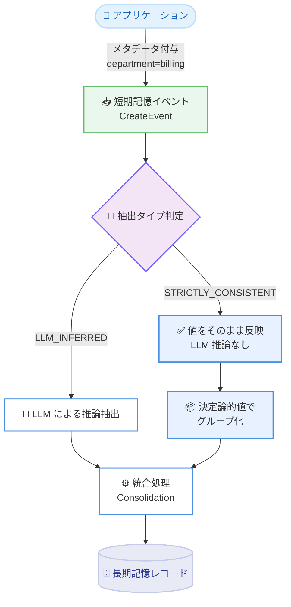

# Amazon Bedrock AgentCore Memory - 長期記憶向け厳密一貫メタデータ

**リリース日**: 2026年6月15日
**サービス**: Amazon Bedrock AgentCore Memory
**機能**: 長期記憶向けの厳密一貫メタデータ (Strictly Consistent Metadata)

📊 [このアップデートのインフォグラフィックを見る](https://takech9203.github.io/aws-news-summary/20260615-agentcore-memory-scmetadata.html)
<!-- INFOGRAPHIC_BASE_URL は環境変数から取得 -->

## 概要

Amazon Bedrock AgentCore Memory は、短期記憶 (short-term memory) から有用な情報を抽出し、長期記憶 (long-term memory) レコードとして保存します。これらのレコードに付与されるメタデータは、検索時にレコードを整理、フィルタリング、ルーティングするために利用されます。今回のアップデートにより、メタデータキーに対して新しい抽出タイプ STRICTLY_CONSISTENT を設定できるようになりました。

従来、メタデータの値は抽出 (extraction) の過程で大規模言語モデル (LLM) によって推論されるものに限られていました。新機能では、アプリケーションからメタデータの値を直接付与でき、その値は LLM による推論を経ることなく、抽出と統合 (consolidation) を通じて指定どおりそのまま長期記憶レコードへ反映されます。メタデータキーの抽出タイプを STRICTLY_CONSISTENT に設定すると、短期記憶イベントで指定した値が、変更されることなくそのまま結果の長期記憶レコードに記録されます。

さらに、厳密一貫メタデータはイベントのグループ化方法も分離します。同じ値を持つイベントは一緒に抽出され、一緒に統合されます。これにより、部門単位の検索、規制対象レコードと標準レコードの間のコンプライアンス境界、マルチテナント環境での記憶の分離といったユースケースに対応できます。AI エージェント開発者や、組織分類属性を正確に保持する必要があるユーザーが主な対象です。

**アップデート前の課題**

このアップデート以前は、長期記憶レコードのメタデータ値を一貫して制御することが困難でした。

- 以前はメタデータの値が抽出時に LLM によって推論されるのみで、アプリケーションが既に把握している正確な値をそのまま反映できなかった
- 以前は LLM 推論のばらつきにより、同じ概念でも `eng` と `Engineering` のように異なる表記が混在し、フィルタリングが不安定になる課題があった
- 以前は組織分類子 (部門、コンプライアンスレベル、エージェント ID など) のように決定論的に扱うべきキーまで LLM 推論に依存していた

**アップデート後の改善**

今回のアップデートにより、決定論的なメタデータの取り扱いが可能になりました。

- 今回のアップデートにより、抽出タイプを STRICTLY_CONSISTENT に設定したキーは、イベントで指定した値がそのまま変更されずにレコードへ反映されるようになった
- 今回のアップデートにより、LLM 推論によるメタデータ値のばらつきを排除し、正確で一貫した値を保証できるようになった
- 今回のアップデートにより、決定論的キーの値ごとにイベントの抽出と統合が分離され、異なる値を持つレコードが統合中に混ざらなくなった

## アーキテクチャ図



抽出タイプが STRICTLY_CONSISTENT のキーは LLM 推論を経ずに値がそのまま反映され、決定論的値でグループ化されてから統合される流れを示しています。

## サービスアップデートの詳細

### 主要機能

1. **STRICTLY_CONSISTENT 抽出タイプ**
   - メタデータスキーマのエントリで `extractionType` を `STRICTLY_CONSISTENT` に設定する
   - 短期記憶イベントで指定した値が、抽出と統合を通じて変更されることなく長期記憶レコードへ反映される
   - 当該キーについては LLM が参照されず、推論や競合解決 (conflict resolution) も行われない
   - `extractionType` を省略した場合のデフォルトは `LLM_INFERRED` となる

2. **抽出と統合の分離 (Isolation)**
   - STRICTLY_CONSISTENT キーは、決定論的な値の組み合わせによってイベントをグループ化する
   - 同じ値を共有するイベントは一緒に抽出され、一緒に統合される
   - 値が異なるイベントは個別に処理され、異なる値グループのレコードが統合中に混ざることはない
   - すべての決定論的キーの値が一致した場合にのみ、イベントが同一グループとして扱われる

3. **既存の LLM 推論型メタデータとの共存**
   - 同一リソース上で STRICTLY_CONSISTENT キーと LLM_INFERRED キーを併用できる
   - 組織分類子は決定論的に、会話内容から推論すべき属性 (感情、トピックなど) は LLM 推論で扱うといった使い分けが可能
   - 部門単位の検索、コンプライアンス境界、マルチテナント環境でのサブフィルタリングに適している

## 技術仕様

### 制約事項

| 項目 | 詳細 |
|------|------|
| 1 ストラテジーあたりの STRICTLY_CONSISTENT キー数 | 最大 3 |
| キーの型 | `STRING` のみ |
| インデックスキー要件 | メモリの `indexedKeys` に宣言されている必要がある |
| extractionConfig | STRICTLY_CONSISTENT キーには設定不可 (値はイベントから取得するため) |
| 対応ストラテジー | semantic、user preference、episodic (カスタムオーバーライドを含む)。summary ストラテジーは非対応 |
| 値の欠落時 | イベントに決定論的キーの値がない場合、そのイベントのグループ化から除外され、結果レコードにも記録されない |

### API変更履歴

| 日付 | サービス | 変更内容 |
|------|----------|----------|
| 2026/06/15 | Amazon Bedrock AgentCore Memory | メタデータスキーマに `extractionType` (STRICTLY_CONSISTENT / LLM_INFERRED) を追加 |

### メタデータスキーマ設定例

```json
{
  "metadataSchema": [
    {
      "key": "department",
      "type": "STRING",
      "extractionType": "STRICTLY_CONSISTENT"
    },
    {
      "key": "compliance_level",
      "type": "STRING",
      "extractionType": "STRICTLY_CONSISTENT"
    },
    {
      "key": "topic",
      "type": "STRING",
      "extractionType": "LLM_INFERRED",
      "extractionConfig": {
        "llmExtractionConfig": {
          "definition": "Primary topic of the conversation",
          "llmExtractionInstruction": "Identify the main topic discussed"
        }
      }
    }
  ]
}
```

## 設定方法

### 前提条件

1. Amazon Bedrock AgentCore へのアクセス権限を持つ AWS アカウント
2. 決定論的キーとして使用するキーが `STRING` 型でメモリの `indexedKeys` に宣言されていること
3. STRICTLY_CONSISTENT を設定するストラテジーが semantic、user preference、episodic のいずれかであること

### 手順

#### ステップ1: インデックスキーとメタデータスキーマを持つメモリを作成

```bash
aws bedrock-agentcore-control create-memory \
  --name "SupportMemory" \
  --event-expiry-duration 30 \
  --indexed-keys '[
    {"key": "department",       "type": "STRING"},
    {"key": "compliance_level", "type": "STRING"}
  ]' \
  --memory-strategies '[ ... semanticMemoryStrategy with metadataSchema ... ]'
```

`indexedKeys` に決定論的キーを `STRING` 型で宣言します。STRICTLY_CONSISTENT キーはインデックスキーに含まれている必要があります。

#### ステップ2: メタデータを付与してイベントを送信

```python
agentcore_client.create_event(
    memoryId="mem-support-abc123",
    actorId="customer-123",
    sessionId="session-escalation-001",
    payload=[{"conversational": {"role": "USER",
        "content": {"text": "請求書に重複請求があり、デプロイが止まっています。"}}}],
    metadata={
        "department": {"stringValue": "billing"},
        "priority": {"stringValue": "high"}
    }
)
```

イベントに付与した `department` などの決定論的キーの値は、そのまま長期記憶レコードへ反映されます。同じ決定論的値を持つイベント同士が同一グループとして抽出・統合されます。

#### ステップ3: メタデータフィルタで検索

```bash
aws bedrock-agentcore retrieve-memory-records \
  --memory-id "<memory-id>" \
  --namespace "support/customer-123" \
  --search-criteria '{
    "searchQuery": "billing issues",
    "topK": 10,
    "metadataFilters": [
      {"left": {"metadataKey": "department"}, "operator": "EQUALS_TO",
       "right": {"metadataValue": {"stringValue": "billing"}}}
    ]
  }'
```

決定論的キーは正確な値が保証されているため、`department=billing` のようなフィルタで意図したレコードのみを確実に取得できます。

## メリット

### ビジネス面

- **コンプライアンスの確実性**: コンプライアンスレベルが異なるレコードが統合中に混ざらないため、規制対象データの分離を確実に維持できる
- **マルチテナントの信頼性**: テナント固有の属性を指定どおり正確に保持し、クロスコンタミネーションを防止できる
- **運用の予測可能性**: LLM 推論のばらつきがなくなることで、検索結果の一貫性と再現性が向上する

### 技術面

- **正確なフィルタリング**: 値の表記揺れ (`eng` と `Engineering` など) が排除され、フィルタマッチングが安定する
- **柔軟な使い分け**: 決定論的キーと LLM 推論キーを同一リソースで併用でき、属性の性質に応じた設計が可能
- **明確なグルーピング**: 決定論的値ごとにイベントの抽出と統合が分離され、論理的な境界を保てる

## デメリット・制約事項

### 制限事項

- 1 ストラテジーあたりの STRICTLY_CONSISTENT キーは最大 3 つまで
- キーの型は `STRING` のみで、`STRINGLIST` や `NUMBER` は使用できない
- summary ストラテジーでは利用できない
- STRICTLY_CONSISTENT キーには `extractionConfig` を設定できない
- 各 STRICTLY_CONSISTENT キーはメモリの 10 個あるインデックスキー枠を 1 つ消費し、一度追加したインデックスキーは削除できない

### 考慮すべき点

- どのキーを STRICTLY_CONSISTENT に設定するかを変更すると、抽出と統合に使用されるグループ化も変わる。以前の設定で作成されたレコードは新しい設定のレコードから分離されるため、イベント取り込み前に決定論的キーの設定を計画する必要がある
- イベントに決定論的キーの値が含まれない場合、そのキーはグループ化から除外され結果レコードにも記録されない
- Batch API (`BatchCreateMemoryRecords` / `BatchUpdateMemoryRecords`) は抽出をバイパスするため、STRICTLY_CONSISTENT 抽出タイプの効果は及ばない

## ユースケース

### ユースケース1: コンプライアンス境界の分離

**シナリオ**: 医療系エージェントで、HIPAA 規制対象の会話と標準の会話を同一メモリで扱いつつ、両者を明確に分離したい。

**実装例**:
```
compliance_level を STRICTLY_CONSISTENT として設定し、
イベントごとに "hipaa" または "standard" を付与する
```

**効果**: `compliance_level: "hipaa"` のレコードが `compliance_level: "standard"` のレコードと統合中に混ざることがなく、規制境界を確実に維持できる。

### ユースケース2: 部門単位のルーティング

**シナリオ**: カスタマーサポートエージェントで、部門ごとに記憶を分離し、クロスコンタミネーションなく部門スコープの検索を実現したい。

**実装例**:
```
department を STRICTLY_CONSISTENT として設定し、
イベントに "billing" や "engineering" を正確に付与する
```

**効果**: `department=billing` でフィルタすると、エンジニアリング部門のレコードと混ざることなく請求関連の事実のみを取得できる。

### ユースケース3: マルチテナントのサブフィルタリング

**シナリオ**: SaaS 型エージェントで、ネームスペースによるテナント分離に加え、テナント階層などの属性を正確に保持したい。

**実装例**:
```
tenant_tier を STRICTLY_CONSISTENT として設定し、
アプリケーションが把握している値をそのまま付与する
```

**効果**: テナント固有の属性が LLM 推論によるばらつきなく指定どおり保持され、信頼性の高いサブフィルタリングが可能になる。

## 料金

本機能はメタデータの抽出タイプに関する設定機能であり、機能自体に追加料金は記載されていません。AgentCore Memory の通常の利用料金が適用されます。詳細は AWS の公式料金ページを参照してください。

## 利用可能リージョン

AgentCore Memory がサポートされているすべての AWS リージョンで利用可能です。

## 関連サービス・機能

- **Amazon Bedrock AgentCore Memory**: 短期記憶からの抽出と長期記憶レコードの管理を担う基盤機能。本アップデートはそのメタデータ処理を拡張する
- **メタデータフィルタリング**: インデックスキーと `metadataFilters` を用いた検索機能。決定論的メタデータと組み合わせて正確な絞り込みを実現する
- **Batch API (BatchCreateMemoryRecords / BatchUpdateMemoryRecords)**: 抽出をバイパスして直接レコードへメタデータを付与する経路。STRICTLY_CONSISTENT とは別の制御パスとなる

## 参考リンク

- 📊 [インフォグラフィック](https://takech9203.github.io/aws-news-summary/20260615-agentcore-memory-scmetadata.html)
- [公式発表 (What's New)](https://aws.amazon.com/about-aws/whats-new/2026/05/agentcore-memory-scmetadata)
- [ドキュメント](https://docs.aws.amazon.com/bedrock-agentcore/latest/devguide/long-term-memory-metadata.html)

## まとめ

今回のアップデートは、AgentCore Memory において組織分類子などアプリケーションが既に把握している値を、LLM 推論のばらつきなく正確に長期記憶レコードへ反映できるようにする重要な機能です。コンプライアンス境界やマルチテナント分離が求められるエージェントを構築する場合は、決定論的キーの設計をイベント取り込み前に計画したうえで STRICTLY_CONSISTENT の活用を検討することを推奨します。
