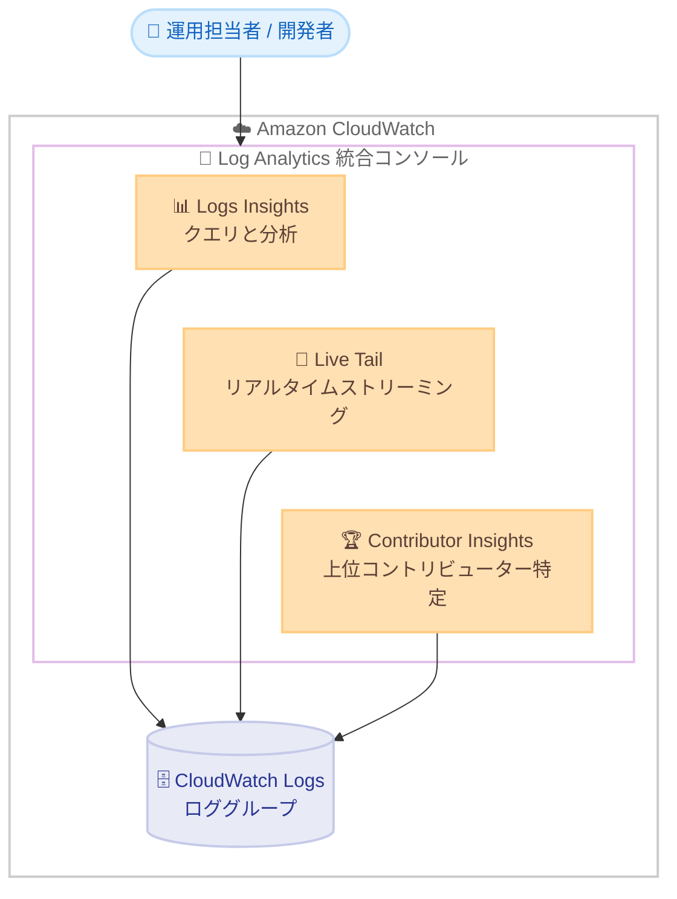

# Amazon CloudWatch - Log Analytics

**リリース日**: 2026 年 6 月 15 日
**サービス**: Amazon CloudWatch
**機能**: Log Analytics (統合ログ分析エクスペリエンス)

📊 [このアップデートのインフォグラフィックを見る](https://takech9203.github.io/aws-news-summary/20260615-amazon-cloudwatch-log-analytics.html)
<!-- INFOGRAPHIC_BASE_URL は環境変数から取得 -->

## 概要

Amazon CloudWatch は、ログ分析を 1 つのコンソールエクスペリエンスに統合する Log Analytics を発表しました。Log Analytics は、ログデータのクエリと分析を行う CloudWatch Logs Insights、リアルタイムのログストリーミングを行う Live Tail、上位のコントリビューターを特定する Contributor Insights を、1 つの画面にまとめて提供します。

これまでログの調査やトラブルシューティングでは、クエリ、リアルタイム監視、コントリビューター分析といった目的ごとに別々の画面を切り替える必要がありました。Log Analytics により、これらの機能を 1 か所で利用でき、異なるタブで複数のクエリを同時に実行できるようになります。Log Analytics はデフォルトのエクスペリエンスとして提供され、オプトアウトしたお客様は従来どおり Logs Insights、Live Tail、Contributor Insights を Log Analytics と並べて利用できます。

対象ユーザーは、アプリケーションやインフラのログを日常的に調査する運用担当者、開発者、Site Reliability Engineer (SRE) です。Log Analytics はすべての商用 AWS リージョンで利用でき、基盤となる各機能と同じ料金体系が適用されるため、追加コストは発生しません。

**アップデート前の課題**

- 以前はログのクエリ (Logs Insights)、リアルタイムストリーミング (Live Tail)、コントリビューター分析 (Contributor Insights) がそれぞれ独立した画面に分かれており、目的に応じて画面を切り替える必要がありました
- 以前は複数のクエリを並行して実行し比較する操作が行いにくく、調査の効率が低下していました
- 以前はログ調査のワークフローが分断され、関連する分析機能へのアクセスに手間がかかっていました

**アップデート後の改善**

- 今回のアップデートにより、Logs Insights、Live Tail、Contributor Insights を 1 つの統合コンソールから利用できるようになりました
- 今回のアップデートにより、異なるタブで複数のクエリを同時に実行できるようになりました
- 今回のアップデートにより、パターン分析、パラメータ付き保存クエリ、ファセット、自然言語クエリ生成、可視化といった既存の Logs Insights 機能をそのまま統合エクスペリエンス内で利用できるようになりました

## アーキテクチャ図

Log Analytics は CloudWatch Logs のロググループに対して、クエリ、リアルタイムストリーミング、コントリビューター分析の 3 つの機能を 1 つのコンソールから提供します。

## サービスアップデートの詳細

### 主要機能

1. **統合コンソールエクスペリエンス**
   - Logs Insights、Live Tail、Contributor Insights を 1 つの画面に集約
   - Log Analytics はデフォルトのエクスペリエンスとして提供
   - オプトアウトしたお客様は、従来の Logs Insights、Live Tail、Contributor Insights を Log Analytics と並べて利用可能

2. **マルチタブによる複数クエリ実行**
   - 異なるタブで複数のクエリを同時に実行可能
   - 複数の調査を並行して進めることで、ログ分析の効率を向上

3. **既存 Logs Insights 機能の継承**
   - パターン分析 (patterns) によるログの傾向把握
   - パラメータ付き保存クエリ (saved queries with parameters) による再利用
   - ファセット (facets) を用いたインタラクティブなログ探索
   - 自然言語クエリ生成によるクエリ作成の簡素化
   - 可視化 (visualizations) によるデータの視覚的な把握

4. **Live Tail と Contributor Insights の統合アクセス**
   - Live Tail によるログのリアルタイムストリーミング
   - Contributor Insights による上位コントリビューターの特定
   - いずれも Log Analytics 内から直接アクセス可能

## 技術仕様

### 機能の構成要素

| 項目 | 詳細 |
|------|------|
| Logs Insights | ログデータのクエリと分析。パターン、保存クエリ、ファセット、自然言語クエリ生成、可視化に対応 |
| Live Tail | ログのリアルタイムストリーミング |
| Contributor Insights | 上位コントリビューターの特定 |
| デフォルト設定 | Log Analytics がデフォルトエクスペリエンス。オプトアウト可能 |
| 料金 | 基盤となる各機能と同じ料金体系 (追加料金なし) |

## 設定方法

### 前提条件

1. CloudWatch Logs にログを送信しているロググループが存在すること
2. CloudWatch コンソールへアクセスできる IAM 権限を保有していること
3. Logs Insights、Live Tail、Contributor Insights の利用に必要な権限を保有していること

### 手順

#### ステップ 1: Log Analytics を開く

CloudWatch コンソールを開き、ナビゲーションから Log Analytics を選択します。Log Analytics はデフォルトのエクスペリエンスとして表示されます。

#### ステップ 2: クエリを実行する

分析対象のロググループを選択し、クエリを入力して実行します。異なるタブで複数のクエリを同時に実行することで、複数の調査を並行して進められます。自然言語クエリ生成を利用すると、自然言語からクエリを作成できます。

#### ステップ 3: Live Tail と Contributor Insights を利用する

同じ Log Analytics 内から Live Tail に切り替えてログをリアルタイムでストリーミングしたり、Contributor Insights で上位コントリビューターを特定したりできます。従来の個別画面を希望する場合は、オプトアウトすることで Log Analytics と並べて従来の各機能を利用できます。

## メリット

### ビジネス面

- **トラブルシューティングの迅速化**: クエリ、リアルタイム監視、コントリビューター分析を 1 か所で行えるため、インシデント対応の時間短縮につながります
- **追加コストなし**: 基盤となる各機能と同じ料金体系のため、新たなコスト負担なく統合エクスペリエンスを利用できます
- **学習コストの低減**: 既存の Logs Insights 機能をそのまま利用できるため、新しい操作を覚える負担が少なくなります

### 技術面

- **画面切り替えの削減**: 複数のログ分析機能を 1 つのコンソールに集約し、操作の分断を解消します
- **並行調査の効率化**: マルチタブにより複数のクエリを同時に実行し、結果を比較できます
- **既存機能の継承**: パターン、ファセット、保存クエリ、自然言語クエリ生成、可視化を統合エクスペリエンス内で継続利用できます

## デメリット・制約事項

### 制限事項

- 商用 AWS リージョンでの提供です (AWS GovCloud (US) や中国リージョンについては公式発表に記載がないため、利用可否は別途確認が必要です)
- 基盤となる各機能 (Logs Insights、Live Tail、Contributor Insights) の制限はそのまま適用されます

### 考慮すべき点

- Log Analytics はデフォルトのエクスペリエンスに変更されるため、従来の画面構成に慣れたユーザーは操作感の変化に注意が必要です
- 従来の個別画面を引き続き利用したい場合は、オプトアウト設定を行う必要があります

## ユースケース

### ユースケース 1: インシデント対応時の集約的なログ調査

**シナリオ**: 本番アプリケーションでエラー率が上昇した際、運用担当者がログのクエリ、リアルタイム監視、原因となっている上位コントリビューターの特定を同時に行いたい。

**効果**: Log Analytics の統合コンソールから 3 つの機能を切り替えることなく利用でき、原因特定までの時間を短縮できます。

### ユースケース 2: マルチタブによる並行調査

**シナリオ**: 複数のサービスにまたがる問題を調査する際、サービスごとに異なるクエリを並行して実行し結果を比較したい。

**効果**: 異なるタブで複数のクエリを同時に実行することで、複数の調査を並行して進め、横断的な分析を効率化できます。

### ユースケース 3: 自然言語クエリによるログ分析の民主化

**シナリオ**: クエリ構文に不慣れなチームメンバーが、ログから必要な情報を抽出したい。

**効果**: 自然言語クエリ生成機能を Log Analytics 内で利用することで、構文を意識せずにクエリを作成でき、より多くのメンバーがログ分析に参加できます。

## 料金

Log Analytics は、基盤となる各機能 (CloudWatch Logs Insights、Live Tail、Contributor Insights) と同じ料金体系を使用します。Log Analytics 自体に追加料金は発生せず、実行したクエリや利用した各機能に応じた既存の CloudWatch 料金が適用されます。詳細は CloudWatch の料金ページを参照してください。

## 利用可能リージョン

すべての商用 AWS リージョンで利用可能です。

## 関連サービス・機能

- **Amazon CloudWatch Logs**: Log Analytics が分析対象とするログを保管するサービス
- **CloudWatch Logs Insights**: ログのクエリと分析を行う基盤機能。Log Analytics の中核を構成
- **CloudWatch Live Tail**: ログのリアルタイムストリーミング機能。Log Analytics から直接利用可能
- **CloudWatch Contributor Insights**: 上位コントリビューターを特定する機能。Log Analytics から直接利用可能

## 参考リンク

- 📊 [インフォグラフィック](https://takech9203.github.io/aws-news-summary/20260615-amazon-cloudwatch-log-analytics.html)
- [公式発表 (What's New)](https://aws.amazon.com/about-aws/whats-new/2026/06/amazon-cloudwatch-log-analytics/)
- [ドキュメント](https://docs.aws.amazon.com/AmazonCloudWatch/latest/logs/WhatIsCloudWatchLogs.html)
- [料金ページ](https://aws.amazon.com/cloudwatch/pricing/)

## まとめ

Amazon CloudWatch Log Analytics は、Logs Insights、Live Tail、Contributor Insights を 1 つの統合コンソールにまとめ、ログ調査のワークフローを大幅に効率化するアップデートです。追加料金なくすべての商用リージョンで利用できるため、ログ分析を行うチームはまず CloudWatch コンソールで Log Analytics を開き、マルチタブでのクエリ実行や既存機能の継承による操作性の向上を確認することをおすすめします。
