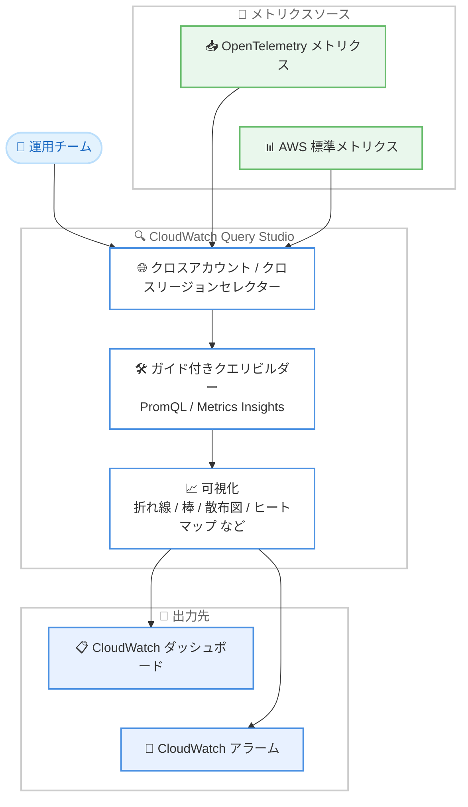

# Amazon CloudWatch - Query Studio

**リリース日**: 2026 年 6 月 15 日
**サービス**: Amazon CloudWatch
**機能**: Amazon CloudWatch Query Studio (一般提供開始)

📊 [このアップデートのインフォグラフィックを見る](https://takech9203.github.io/aws-news-summary/20260615-amazon-cloudwatch-query-studio-generally-available.html)
<!-- INFOGRAPHIC_BASE_URL は環境変数から取得 -->

## 概要

AWS は、Amazon CloudWatch Query Studio の一般提供を開始しました。Query Studio は、CloudWatch コンソール内の単一インターフェイスからメトリクスを探索できる、統合されたクエリおよび可視化のエクスペリエンスです。クエリの作成からグラフによる可視化までを 1 つの画面で完結できます。

Query Studio を使用すると、複数の AWS アカウントやリージョンにまたがってサービスを運用するチームが、PromQL または Metrics Insights を使って OpenTelemetry メトリクスと AWS 標準メトリクスを単一のワークスペースからクエリできます。クエリごとに設定できるクロスアカウントおよびクロスリージョンのセレクターにより、フリート全体のレイテンシーやエラー率を容易に相関分析できます。

PromQL と Metrics Insights (SQL) のそれぞれにガイド付きビルダーが用意されており、視覚的にクエリを構築できます。可視化タイプは折れ線、棒、散布図、ヒートマップ、ヒストグラム、円、ゲージ、数値ウィジェットから選択でき、デュアル Y 軸の設定やシリーズオーバーライドにも対応します。さらに CloudWatch ダッシュボードとの統合、Grafana のインポート、クエリ実行用のキーボードショートカットも提供されます。

**アップデート前の課題**

- メトリクスの探索、クエリ作成、可視化を行う際に、複数の画面や手順を行き来する必要があった
- マルチアカウント、マルチリージョン環境のメトリクスを横断的に相関分析することが容易ではなかった
- PromQL や Metrics Insights のクエリを記述するために、構文を手動で組み立てる必要があった

**アップデート後の改善**

- 単一インターフェイスからメトリクスの探索、クエリ、可視化を完結できるようになった
- クエリごとにクロスアカウント、クロスリージョンのセレクターを指定し、フリート全体を横断的に分析できるようになった
- PromQL と Metrics Insights のガイド付きビルダーにより、視覚的にクエリを構築できるようになった

## アーキテクチャ図



運用チームが複数のメトリクスソースを Query Studio で横断的にクエリし、可視化結果をダッシュボードやアラームに反映する流れを示しています。

## サービスアップデートの詳細

### 主要機能

1. **統合されたクエリおよび可視化エクスペリエンス**
   - CloudWatch コンソール内の単一インターフェイスからメトリクスを探索できる
   - クエリの作成、実行、可視化を 1 つのワークスペースで完結できる
   - OpenTelemetry メトリクスと AWS 標準メトリクスの両方を対象にできる

2. **クロスアカウント / クロスリージョンクエリ**
   - クエリごとにクロスアカウントおよびクロスリージョンのセレクターを指定できる
   - 複数の AWS アカウントやリージョンにまたがるフリート全体を単一ワークスペースから分析できる
   - レイテンシーやエラー率などの指標を横断的に相関分析できる

3. **ガイド付きクエリビルダー**
   - PromQL と Metrics Insights (SQL) のそれぞれにガイド付きビルダーを用意
   - ビルダーモードでメトリクス名、ラベル、集計関数を参照しながら選択できる
   - エディターモードで直接クエリを記述することも可能
   - クエリ実行用のキーボードショートカットを提供

4. **豊富な可視化タイプ**
   - 折れ線、棒、散布図、ヒートマップ、ヒストグラム、円、ゲージ、数値ウィジェットから選択可能
   - デュアル Y 軸の設定に対応
   - シリーズオーバーライドに対応

5. **ダッシュボード統合と Grafana インポート**
   - 任意の可視化を CloudWatch ダッシュボードのウィジェットとして追加できる
   - ウィジェットはダッシュボードの更新間隔でクエリを継続実行し、最新の状態を維持する
   - Grafana のインポートをサポート
   - 単一の時系列を返すクエリからは CloudWatch アラームを直接作成できる

## 技術仕様

### 対応するクエリ言語とメトリクスソース

| 項目 | 詳細 |
|------|------|
| クエリ言語 | PromQL、Metrics Insights (SQL) |
| メトリクスソース | OpenTelemetry メトリクス (OTLP 経由で取り込み)、AWS 標準メトリクス |
| クエリ実行 | Query Studio でのインタラクティブ実行、または CloudWatch API によるプログラム実行 |
| 結果表示 | 時系列グラフとテーブルビューを切り替え可能 |
| 可視化タイプ | 折れ線、棒、散布図、ヒートマップ、ヒストグラム、円、ゲージ、数値ウィジェット |
| 軸とシリーズ | デュアル Y 軸の設定、シリーズオーバーライド |
| 統合機能 | CloudWatch ダッシュボード、Grafana インポート、CloudWatch アラーム作成 |

### PromQL クエリの例

```promql
# OpenTelemetry で取り込んだアクティブリクエスト数を参照
{"http.server.active_requests"}
```

エディターモードで PromQL クエリを直接入力する例です。ビルダーモードを使用すると、メトリクス名、ラベル、集計関数を参照しながらクエリを組み立てられます。

## 設定方法

### 前提条件

1. Amazon CloudWatch を利用している AWS アカウントがあること
2. OpenTelemetry メトリクス (OTLP 経由) または AWS 標準メトリクスが CloudWatch に取り込まれていること
3. クロスアカウントクエリを使用する場合は、CloudWatch のクロスアカウントオブザーバビリティが設定されていること

### 手順

#### ステップ1: Query Studio を開く

1. [CloudWatch コンソール](https://console.aws.amazon.com/cloudwatch/) を開く
2. ナビゲーションペインで [Query Studio] を選択する

CloudWatch コンソールから Query Studio のインタラクティブなクエリ環境にアクセスします。

#### ステップ2: クエリを構築する

1. クエリエディターのドロップダウンメニューから [PromQL] または Metrics Insights を選択する
2. [Builder] モードでメトリクス名、ラベル、集計関数を参照しながら選択する
3. または [Editor] モードでクエリを直接入力する
4. 必要に応じて画面上部の時間間隔セレクターで時間範囲を調整する
5. [Run] を選択してクエリを実行し、結果を確認する

ガイド付きビルダーまたはエディターでクエリを作成し、実行して結果を確認します。

#### ステップ3: 可視化を活用する

実行結果は時系列グラフとして表示されます。グラフとテーブルのビューを切り替えてデータを分析できます。さらに [Add to dashboard] で可視化を CloudWatch ダッシュボードのウィジェットとして保存したり、単一の時系列を返すクエリから [Create alarm] でアラームを作成したりできます。

## メリット

### ビジネス面

- **運用効率の向上**: メトリクスの探索、クエリ、可視化を単一画面で完結でき、運用チームの作業時間を短縮できる
- **マルチアカウント環境の可視性向上**: フリート全体を横断的に相関分析でき、問題の特定を迅速化できる
- **既存資産の活用**: Grafana のインポートにより、既存のダッシュボード資産を CloudWatch に取り込める

### 技術面

- **オープン標準への対応**: PromQL と OpenTelemetry メトリクスに対応し、オープンソースのオブザーバビリティ標準を活用できる
- **柔軟な可視化**: 8 種類の可視化タイプ、デュアル Y 軸、シリーズオーバーライドにより、データを適切に表現できる
- **ガイド付き構築**: ビルダーモードによりクエリ構文を手動で組み立てる負担を軽減できる

## デメリット・制約事項

### 制限事項

- 中東 (UAE)、中東 (バーレーン)、イスラエル (テルアビブ) リージョンでは利用できない
- アラームの直接作成は、単一の時系列を返すクエリに限定される

### 考慮すべき点

- クロスアカウントクエリを使用するには、CloudWatch のクロスアカウントオブザーバビリティの事前設定が必要となる
- PromQL クエリや Metrics Insights クエリ、メトリクスの取り込みに伴う CloudWatch の料金が発生する点に注意する

## ユースケース

### ユースケース1: マルチアカウントフリートの障害調査

**シナリオ**: 複数の AWS アカウントとリージョンにマイクロサービスを展開しているチームが、特定サービスのレイテンシー急増を調査する。

**実装例**:
```
1. Query Studio を開く
2. クエリのクロスアカウント / クロスリージョンセレクターで対象アカウントとリージョンを選択
3. PromQL でレイテンシーとエラー率をクエリし、ヒートマップで可視化
```

**効果**: フリート全体のレイテンシーとエラー率を 1 つのワークスペースで相関分析でき、障害の発生源を迅速に特定できる。

### ユースケース2: OpenTelemetry メトリクスの可視化

**シナリオ**: OTLP 経由でアプリケーションメトリクスを CloudWatch に取り込んでいるチームが、アクティブリクエスト数をモニタリングする。

**実装例**:
```promql
{"http.server.active_requests"}
```

**効果**: ガイド付きビルダーで PromQL クエリを構築し、折れ線グラフで可視化したうえでダッシュボードに追加することで、継続的にモニタリングできる。

### ユースケース3: 既存 Grafana ダッシュボードの移行

**シナリオ**: 既存の Grafana ダッシュボードを CloudWatch に集約したいチームが、可視化資産を移行する。

**実装例**:
```
1. Query Studio で Grafana インポート機能を使用
2. インポートしたクエリと可視化を確認
3. CloudWatch ダッシュボードのウィジェットとして保存
```

**効果**: 既存の可視化資産を再利用しながら CloudWatch に統合でき、移行コストを抑えられる。

## 料金

Query Studio 自体の追加料金に関する記載は、公式発表およびドキュメントには含まれていません。実際の費用は、Query Studio から実行する PromQL クエリや Metrics Insights クエリ、メトリクスの取り込みに伴う Amazon CloudWatch の料金体系に基づきます。最新かつ正確な料金は、CloudWatch の料金ページで確認することを推奨します。

## 利用可能リージョン

中東 (UAE)、中東 (バーレーン)、イスラエル (テルアビブ) を除く、すべての商用 AWS リージョンで利用可能です。

## 関連サービス・機能

- **Amazon CloudWatch ダッシュボード**: Query Studio の可視化をウィジェットとして追加し、継続的にモニタリングできる
- **Amazon CloudWatch アラーム**: 単一の時系列を返すクエリからアラームを直接作成できる
- **AWS Distro for OpenTelemetry**: OTLP 経由でメトリクスを CloudWatch に取り込み、Query Studio で可視化できる
- **Amazon Managed Grafana**: Grafana のインポートを通じて既存の可視化資産を活用できる

## 参考リンク

- 📊 [インフォグラフィック](https://takech9203.github.io/aws-news-summary/20260615-amazon-cloudwatch-query-studio-generally-available.html)
- [公式発表 (What's New)](https://aws.amazon.com/about-aws/whats-new/2026/06/amazon-cloudwatch-query-studio-generally-available)
- [ドキュメント (Running PromQL queries in Query Studio)](https://docs.aws.amazon.com/AmazonCloudWatch/latest/monitoring/CloudWatch-PromQL-QueryStudio.html)
- [料金ページ (Amazon CloudWatch Pricing)](https://aws.amazon.com/cloudwatch/pricing/)

## まとめ

Amazon CloudWatch Query Studio の一般提供により、メトリクスの探索、クエリ、可視化を単一インターフェイスで完結できるようになりました。特にマルチアカウント、マルチリージョン環境を運用するチームにとって、フリート全体の横断的な分析を効率化する有力な選択肢となります。まずは CloudWatch コンソールから Query Studio を開き、ガイド付きビルダーで PromQL や Metrics Insights のクエリを試すことを推奨します。
