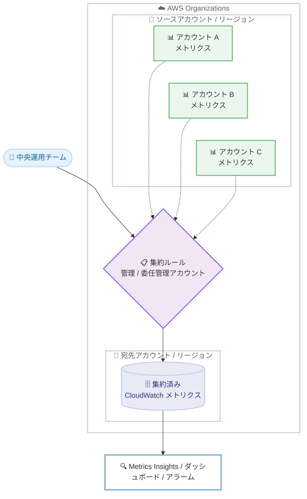

# Amazon CloudWatch - メトリクスセントラライゼーション

**リリース日**: 2026 年 6 月 15 日
**サービス**: Amazon CloudWatch
**機能**: CloudWatch Metrics Centralization (メトリクスの集約)

📊 [このアップデートのインフォグラフィックを見る](https://takech9203.github.io/aws-news-summary/20260615-amazon-cross-account-metrics-centralization.html)
<!-- INFOGRAPHIC_BASE_URL は環境変数から取得 -->

## 概要

AWS は、Amazon CloudWatch Metrics Centralization の一般提供 (GA) を発表しました。この機能を使用すると、複数のアカウントおよび複数のリージョンに分散している CloudWatch メトリクスを、単一の宛先アカウントに自動的に複製 (集約) できます。

エンタープライズ規模の組織では、マルチアカウント、マルチリージョンの複雑な構成を採用していることが多く、インフラストラクチャ全体の運用状態を統合的に把握したいというニーズがあります。CloudWatch Metrics Centralization は、AWS Organizations を通じて集約ルールを定義することで、ソースアカウントおよびソースリージョンからメトリクスを宛先アカウントへ自動的に複製し、この課題を解決します。中央の運用チームは、集約されたデータの完全な所有権を得て、クエリ、アラーム、コンプライアンス、ガバナンスの目的で活用できます。

集約されたメトリクスは、CloudWatch メトリクスと OpenTelemetry メトリクスの両方に対応しており、Metrics Insights、ダッシュボード、アラーム、Metric Math、異常検出、Metric Streams、PromQL と完全に互換性があります。

**アップデート前の課題**

- マルチアカウント、マルチリージョン環境では、メトリクスが各アカウントとリージョンに分散しており、統合的な可視化が困難でした
- 中央の運用チームがメトリクスを参照するには、ロールの引き受けやアカウント間の切り替えが必要で、データの完全な所有権を持てませんでした
- コンプライアンスやガバナンスの観点から、メトリクスデータを単一の場所に保持して管理する仕組みが不足していました

**アップデート後の改善**

- AWS Organizations を通じて集約ルールを定義するだけで、ソースアカウント、ソースリージョンのメトリクスが宛先アカウントへ自動的に複製されるようになりました
- 中央の運用チームが、集約データの完全な所有権を持ち、クエリ、アラーム、コンプライアンス、ガバナンスを一元的に実施できるようになりました
- CloudWatch メトリクスと OpenTelemetry メトリクスの両方を集約でき、Metrics Insights やダッシュボードなど既存の機能とそのまま連携できるようになりました

## アーキテクチャ図

ソースアカウントとリージョンのメトリクスが、AWS Organizations の集約ルールに基づいて宛先アカウントへ自動的に複製され、中央運用チームが統合的に分析できる構成を示しています。

## サービスアップデートの詳細

### 主要機能

1. **AWS Organizations による集約ルールの定義**
   - 管理アカウントまたは委任管理者アカウントで集約ルールを作成します
   - ルールでは、ソースとなるアカウント、OU (Organizational Unit)、リージョンと、宛先となるアカウント、リージョンを定義します
   - AWS Organizations の信頼されたアクセス (trusted access) を利用するため、この機能の利用には AWS Organizations が必須です

2. **メトリクスの自動複製とメタデータ付与**
   - ソースアカウントに到達したメトリクスが、宛先アカウントへ自動的にコピーされます
   - 複製時には、ソースのアカウント ID とリージョンといったメタデータが付与されるため、データの出所を識別できます
   - メトリクスデータは実際に宛先へ移動 (コピー) されるため、中央チームがデータの完全な所有権を持ちます

3. **幅広いメトリクスタイプと既存機能との互換性**
   - CloudWatch メトリクスと OpenTelemetry (OTLP) メトリクスの両方に対応します
   - PutMetricData によるカスタムメトリクス、Embedded Metric Format (EMF) もサポートします
   - 集約されたメトリクスは、Metrics Insights、ダッシュボード、アラーム、Metric Math、異常検出、Metric Streams、PromQL と完全に互換性があります

## 技術仕様

### CloudWatch のクロスアカウント機能の比較

CloudWatch には複数のクロスアカウント機能があり、それぞれ補完的に利用できます。

| 機能 | 概要 | データの移動 | クロスリージョン対応 |
|------|------|--------------|----------------------|
| CloudWatch クロスアカウントオブザーバビリティ | OAM を利用し、単一リージョン内でメトリクス、ログ、トレースを共有 | 共有 (移動しない) | 非対応 |
| クロスアカウントクロスリージョンコンソール | モニタリングアカウントが共有ロールを引き受けて他アカウントを参照 | 共有 (移動しない) | 対応 |
| メトリクスセントラライゼーション (今回) | Organizations の集約ルールで宛先アカウントへ複製 | 移動 (コピーする) | 対応 |

### サポートされるメトリクスタイプ

| 項目 | 詳細 |
|------|------|
| カスタムメトリクス | PutMetricData による送信に対応 |
| EMF | Embedded Metric Format に対応 |
| OpenTelemetry | OTLP メトリクスに対応 |
| プログラマティックアクセス | API による設定とアクセスに対応 |

## 設定方法

### 前提条件

1. AWS Organizations を有効化していること (この機能の利用には必須)
2. CloudWatch に対する AWS Organizations の信頼されたアクセスを有効化していること
3. 管理アカウントまたは委任管理者アカウントで集約ルールを作成する権限を持っていること

### 手順

#### ステップ 1: 信頼されたアクセスの有効化

AWS Organizations の管理アカウントで、CloudWatch に対する信頼されたアクセスを有効化します。これにより、Organizations 全体での集約ルールの適用が可能になります。

#### ステップ 2: 集約ルールの作成

管理アカウントまたは委任管理者アカウントで集約ルールを作成します。ルールでは、ソースとなるアカウント、OU、リージョンと、宛先となるアカウント、リージョンを指定します。これにより、対象範囲のメトリクスが宛先アカウントへ自動的に複製されるようになります。

#### ステップ 3: 集約済みメトリクスの活用

宛先アカウントで、集約されたメトリクスを Metrics Insights、ダッシュボード、アラーム、異常検出などで活用します。ソースのアカウント ID とリージョンのメタデータが付与されているため、出所ごとにメトリクスをフィルタリングして分析できます。

## メリット

### ビジネス面

- **ガバナンスとコンプライアンスの強化**: 中央チームがメトリクスデータの完全な所有権を持つため、組織全体での統制とコンプライアンス対応が容易になります
- **運用効率の向上**: アカウント切り替えやロール引き受けが不要になり、単一の宛先アカウントから組織全体の運用状態を把握できます
- **既存資産の活用**: ダッシュボードやアラームなど既存の CloudWatch 機能をそのまま利用できるため、追加の学習コストが少なく済みます

### 技術面

- **自動複製**: 集約ルールを定義するだけで、メトリクスが自動的に宛先へ複製され、手動でのデータ収集が不要です
- **幅広い互換性**: CloudWatch メトリクスと OpenTelemetry メトリクスの両方に対応し、PromQL や Metric Math とも連携できます
- **メタデータによる識別**: ソースのアカウント ID とリージョンが付与されるため、集約後も出所を明確に識別できます

## デメリット・制約事項

### 制限事項

- 本機能の利用には AWS Organizations が必須です
- 利用可能なリージョンが限定されています (利用可能リージョンを参照)
- 集約された最初のコピーは無料ですが、オプションのバックアップリージョン (2 つ目のコピー) は有料機能です

### 考慮すべき点

- メトリクスデータが実際に宛先アカウントへ移動 (コピー) されるため、データの保存場所とアクセス制御を設計時に考慮する必要があります
- 集約対象のアカウントとリージョンの範囲を集約ルールで適切に設計し、不要なデータの複製を避けることが重要です

## ユースケース

### ユースケース 1: 組織全体の統合運用監視

**シナリオ**: 数十のアカウントと複数リージョンで本番ワークロードを運用している企業が、中央の SRE チームで全体の運用状態を一元的に監視したい。

**効果**: 集約ルールを定義することで、全アカウント、全リージョンのメトリクスが中央アカウントに集約され、単一のダッシュボードで組織全体の健全性を把握できます。

### ユースケース 2: コンプライアンスとガバナンスの一元管理

**シナリオ**: 規制業界の組織が、運用メトリクスを中央で保持し、監査やコンプライアンス要件に対応する必要がある。

**効果**: 中央チームがメトリクスデータの完全な所有権を持つことで、組織のポリシーに基づいた保持、アクセス制御、監査対応を一元的に実施できます。

### ユースケース 3: クロスリージョン障害分析

**シナリオ**: マルチリージョン構成のアプリケーションで、リージョンをまたいだパフォーマンス劣化や障害の相関分析を行いたい。

**効果**: 複数リージョンのメトリクスを宛先アカウントに集約し、Metric Math や異常検出を用いてリージョン横断で相関分析を実施できます。

## 料金

集約されたテレメトリの最初のコピーは無料です。オプションのバックアップリージョン (2 つ目のコピー) は有料機能となります。詳細は Amazon CloudWatch の料金ページを参照してください。

## 利用可能リージョン

以下のリージョンで利用可能です。

- 米国東部 (バージニア北部)
- 米国東部 (オハイオ)
- 米国西部 (北カリフォルニア)
- 米国西部 (オレゴン)
- アジアパシフィック (ムンバイ)
- アジアパシフィック (大阪)
- アジアパシフィック (ソウル)
- アジアパシフィック (シンガポール)
- アジアパシフィック (シドニー)
- アジアパシフィック (東京)
- カナダ (中部)
- 欧州 (フランクフルト)
- 欧州 (アイルランド)
- 欧州 (ロンドン)
- 欧州 (パリ)
- 欧州 (ストックホルム)
- 南米 (サンパウロ)

## 関連サービス・機能

- **AWS Organizations**: 集約ルールの定義と信頼されたアクセスに利用する基盤サービスで、本機能の利用には必須です
- **CloudWatch Logs Centralization**: 同様の仕組みでログをクロスアカウント、クロスリージョンに集約する機能で、メトリクスセントラライゼーションと組み合わせて利用できます
- **CloudWatch クロスアカウントオブザーバビリティ**: 単一リージョン内でメトリクス、ログ、トレースを共有する補完的な機能です
- **OpenTelemetry**: OTLP メトリクスに対応しており、ベンダーニュートラルな計装と組み合わせて集約できます

## 参考リンク

- 📊 [インフォグラフィック](https://takech9203.github.io/aws-news-summary/20260615-amazon-cross-account-metrics-centralization.html)
- [公式発表 (What's New)](https://aws.amazon.com/about-aws/whats-new/2026/06/amazon-cross-account-metrics-centralization)
- [ドキュメント (クロスアカウント監視)](https://docs.aws.amazon.com/AmazonCloudWatch/latest/monitoring/CloudWatch-Cross-Account-Methods.html)
- [料金ページ](https://aws.amazon.com/cloudwatch/pricing/)

## まとめ

CloudWatch Metrics Centralization は、マルチアカウント、マルチリージョン環境のメトリクスを単一の宛先アカウントへ自動集約し、中央チームによる統合監視とガバナンスを実現する重要なアップデートです。AWS Organizations を利用している組織では、集約ルールを定義することで運用の可視性とコンプライアンス対応を大幅に強化できます。まずは対象範囲を絞った集約ルールで効果を検証し、段階的に展開することを推奨します。
