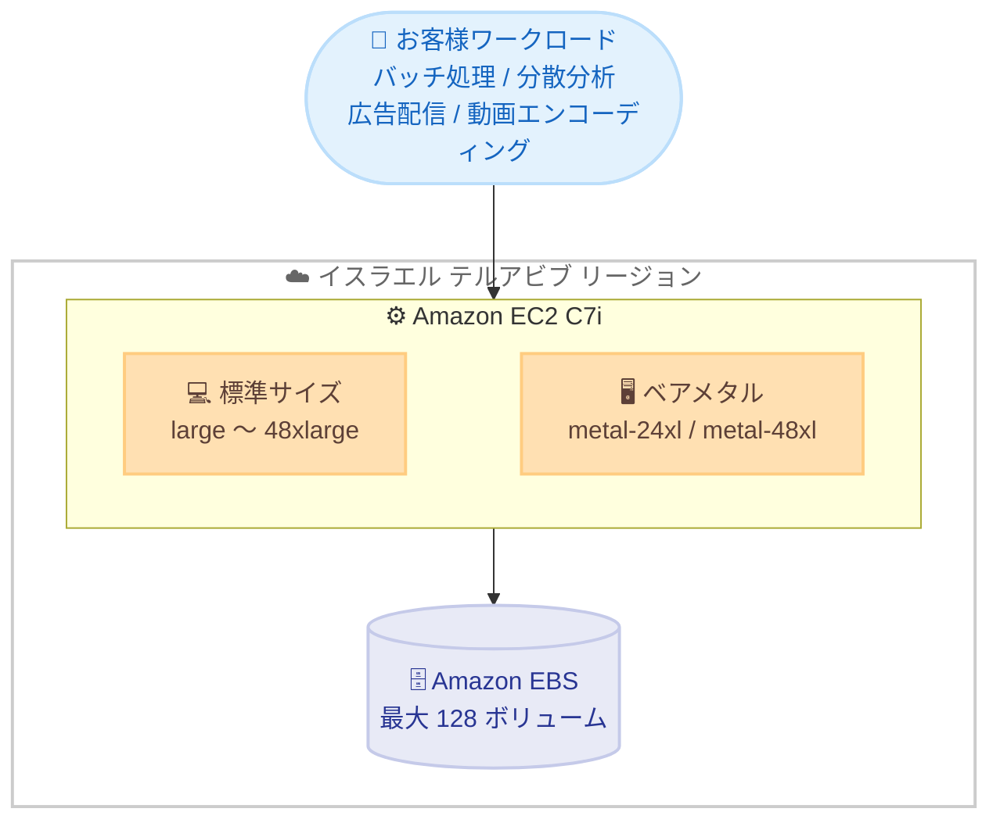

# Amazon EC2 - C7i インスタンス (イスラエル (テルアビブ) リージョン)

**リリース日**: 2026年6月15日
**サービス**: Amazon EC2
**機能**: コンピューティング最適化 C7i インスタンスのイスラエル (テルアビブ) リージョン提供開始

📊 [このアップデートのインフォグラフィックを見る](https://takech9203.github.io/aws-news-summary/20260615-amazon-ec2-c7i-instances-israel-tel-aviv-region.html)
<!-- INFOGRAPHIC_BASE_URL は環境変数から取得 -->

## 概要

Amazon EC2 C7i インスタンスがイスラエル (テルアビブ) リージョンで利用可能になりました。C7i は AWS のみで利用可能なカスタム第 4 世代 Intel Xeon スケーラブルプロセッサ (開発コード名 Sapphire Rapids) を搭載したコンピューティング最適化インスタンスです。同等の C6i インスタンスと比較して最大 15% 優れた価格性能を提供します。

C7i は、バッチ処理、分散分析、広告配信、動画エンコーディングといった、コンピューティング負荷の高いワークロードに適しています。最大 48xlarge までの大型サイズに加え、metal-24xl と metal-48xl の 2 つのベアメタルサイズを提供します。

これにより、イスラエル (テルアビブ) リージョンを利用するお客様は、データレジデンシー要件やレイテンシー要件を満たしながら、最新世代のコンピューティング最適化インスタンスを活用できるようになりました。

**アップデート前の課題**

- 以前はイスラエル (テルアビブ) リージョンで C7i インスタンスを利用できなかった
- データレジデンシー要件のあるワークロードでは、最新世代のコンピューティング最適化インスタンスを現地リージョンで選択できなかった
- C6i 世代のインスタンスを利用する場合、価格性能や EBS ボリュームのアタッチ数に制約があった

**アップデート後の改善**

- イスラエル (テルアビブ) リージョンで C7i インスタンスを利用できるようになった
- C6i 比で最大 15% 優れた価格性能を現地リージョンで活用できるようになった
- インスタンスあたり最大 128 個の EBS ボリュームをアタッチできるようになった (C6i は最大 28 個)

## アーキテクチャ図

イスラエル (テルアビブ) リージョンで提供される C7i インスタンスのサイズ構成と、コンピューティング負荷の高いワークロードからの利用イメージを示しています。

## サービスアップデートの詳細

### 主要機能

1. **カスタム第 4 世代 Intel Xeon スケーラブルプロセッサ**
   - 開発コード名 Sapphire Rapids のプロセッサを搭載
   - AWS のみで利用可能なカスタムプロセッサ
   - C6i 比で最大 15% 優れた価格性能を実現

2. **大型サイズとベアメタルオプション**
   - 最大 48xlarge までの大型サイズを提供
   - metal-24xl と metal-48xl の 2 つのベアメタルサイズを提供
   - ベアメタルサイズでは Intel の組み込みアクセラレータ (Data Streaming Accelerator、In-Memory Analytics Accelerator、QuickAssist Technology) を利用でき、データ処理の効率的なオフロードと高速化が可能

3. **Intel Advanced Matrix Extensions (AMX) のサポート**
   - 行列乗算を高速化する AMX をサポート
   - CPU ベースの機械学習などのワークロードを高速化

4. **EBS ボリュームアタッチ数の拡張**
   - インスタンスあたり最大 128 個の EBS ボリュームをアタッチ可能
   - C6i (最大 28 個) と比較して大幅に拡張

## 技術仕様

### C7i と C6i の比較

| 項目 | C7i | C6i |
|------|------|------|
| プロセッサ | カスタム第 4 世代 Intel Xeon (Sapphire Rapids) | 第 3 世代 Intel Xeon (Ice Lake) |
| 価格性能 | C6i 比で最大 15% 向上 | - |
| 最大サイズ | 48xlarge | 32xlarge |
| ベアメタル | metal-24xl、metal-48xl | metal |
| EBS ボリューム数 (最大) | 128 | 28 |
| AMX サポート | あり | なし |

### API変更履歴

今回のアップデートはリージョンへのインスタンス提供拡大であり、API の追加・変更は確認されていません。

## メリット

### ビジネス面

- **価格性能の向上**: C6i 比で最大 15% 優れた価格性能により、同じワークロードをより低コストで実行できます
- **データレジデンシー対応**: イスラエル (テルアビブ) リージョンで最新世代インスタンスを利用でき、現地のデータレジデンシー要件に対応できます
- **低レイテンシー**: イスラエル国内のエンドユーザーに対してより低いレイテンシーでサービスを提供できます

### 技術面

- **高いコンピューティング性能**: バッチ処理や分散分析などコンピューティング集約型のワークロードに適しています
- **機械学習の高速化**: Intel AMX により CPU ベースの機械学習推論を高速化できます
- **ストレージ拡張性**: 最大 128 個の EBS ボリュームをアタッチでき、ストレージ集約型のアプリケーションに柔軟に対応できます

## デメリット・制約事項

### 制限事項

- 組み込み Intel アクセラレータ (DSA、IAA、QAT) はベアメタルサイズでのみ利用可能です
- 提供されるインスタンスサイズや在庫状況はリージョンやアベイラビリティーゾーンによって異なる場合があります

### 考慮すべき点

- ワークロードによっては、Graviton ベースのインスタンス (例: C7g、C8g) の方がコスト効率が高い場合があるため、要件に応じて比較検討することを推奨します
- 既存の C6i ワークロードから移行する際は、x86 アーキテクチャは共通であるものの、性能特性の差異を踏まえた検証を推奨します

## ユースケース

### ユースケース1: バッチ処理

**シナリオ**: 大量のデータを定期的に処理するバッチジョブを、イスラエル国内のリージョンで実行したい。

**効果**: C6i 比で最大 15% 優れた価格性能により、処理コストを抑えながらバッチ処理を完了できます。

### ユースケース2: 分散分析

**シナリオ**: 複数ノードでのデータ分析処理を、コンピューティング最適化インスタンス上で実行したい。

**効果**: 大型サイズと組み込みアクセラレータにより、分散分析ワークロードを効率的に処理できます。

### ユースケース3: 動画エンコーディング

**シナリオ**: 動画配信サービス向けに大量の動画をエンコードし、現地のユーザーに低レイテンシーで配信したい。

**効果**: コンピューティング集約型のエンコーディング処理を高い性能で実行しつつ、テルアビブリージョンから低レイテンシーで配信できます。

## 料金

C7i インスタンスはオンデマンド、Savings Plans、リザーブドインスタンス、スポットインスタンスなど、標準的な Amazon EC2 の料金モデルで利用できます。リージョンごとの正確な料金は Amazon EC2 オンデマンド料金ページを参照してください。

## 利用可能リージョン

イスラエル (テルアビブ) リージョン (il-central-1) で利用可能です。C7i は他の複数のリージョンでも提供されています。

## 関連サービス・機能

- **Amazon EBS**: C7i インスタンスにアタッチするブロックストレージ。最大 128 個のボリュームをアタッチ可能
- **AWS Savings Plans**: C7i インスタンスの利用コストを削減する柔軟な料金プラン
- **Amazon EC2 Auto Scaling**: C7i インスタンスを需要に応じて自動的にスケーリング

## 参考リンク

- 📊 [インフォグラフィック](https://takech9203.github.io/aws-news-summary/20260615-amazon-ec2-c7i-instances-israel-tel-aviv-region.html)
- [公式発表 (What's New)](https://aws.amazon.com/about-aws/whats-new/2026/06/amazon-ec2-c7i-instances-israel-tel-aviv-region/)
- [Amazon EC2 C7i インスタンス製品ページ](https://aws.amazon.com/ec2/instance-types/c7i/)
- [Amazon EC2 オンデマンド料金](https://aws.amazon.com/ec2/pricing/on-demand/)

## まとめ

Amazon EC2 C7i インスタンスのイスラエル (テルアビブ) リージョンでの提供開始により、現地のデータレジデンシー要件やレイテンシー要件を満たしながら、最新世代のコンピューティング最適化インスタンスを活用できるようになりました。バッチ処理や分散分析などのコンピューティング集約型ワークロードを運用しているお客様は、C6i からの移行による価格性能の向上を検討することを推奨します。
