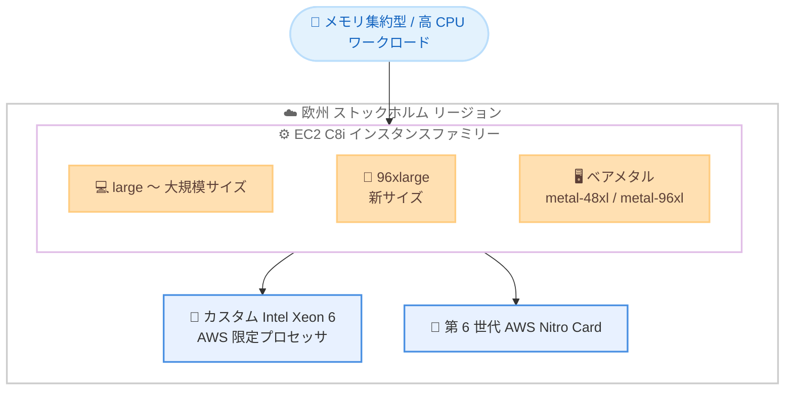

# Amazon EC2 C8i - 欧州 (ストックホルム) リージョンでの提供開始

**リリース日**: 2026 年 6 月 15 日
**サービス**: Amazon EC2
**機能**: C8i インスタンス

📊 [このアップデートのインフォグラフィックを見る](https://takech9203.github.io/aws-news-summary/20260615-amazon-ec2-c8i-instances-europe-stockholm-region.html)
<!-- INFOGRAPHIC_BASE_URL は環境変数から取得 -->

## 概要

Amazon EC2 C8i インスタンスが欧州 (ストックホルム) リージョンで利用可能になりました。C8i インスタンスは、AWS でのみ利用可能なカスタム Intel Xeon 6 プロセッサを搭載しており、クラウド上の同等の Intel プロセッサの中で最高レベルのパフォーマンスと最速のメモリ帯域幅を実現します。

C8i インスタンスは、前世代の Intel ベースインスタンスと比較して、最大 15% 優れた価格性能比と 2.5 倍のメモリ帯域幅を提供します。また、C7i インスタンスと比較して最大 20% 高いパフォーマンスを発揮し、特定のワークロードではさらに大きな性能向上が得られます。具体的には、C7i および C7i-flex と比較して、NGINX ウェブアプリケーションで最大 60% 高速、AI ディープラーニングレコメンデーションモデルで最大 40% 高速、Memcached ストアで 35% 高速です。

C8i インスタンスは、すべてのメモリ集約型ワークロード、特に最大規模のインスタンスサイズや継続的に高い CPU 使用率を必要とするワークロードに最適です。今回のリージョン拡大により、欧州 (ストックホルム) リージョンを利用するお客様も、最新世代のコンピューティング最適化インスタンスの恩恵を受けられるようになりました。

**アップデート前の課題**

- 欧州 (ストックホルム) リージョンでは C8i インスタンスを利用できず、最新の Intel Xeon 6 プロセッサによる性能を享受できなかった
- メモリ集約型かつ大規模なインスタンスサイズを必要とするワークロードで、前世代インスタンスのメモリ帯域幅が制約となっていた
- 96xlarge サイズが利用できず、単一インスタンスでのスケールアップに上限があった

**アップデート後の改善**

- 欧州 (ストックホルム) リージョンで C8i インスタンスを利用できるようになった
- 前世代と比較して最大 15% 優れた価格性能比と 2.5 倍のメモリ帯域幅が利用可能になった
- 新しい 96xlarge サイズと 2 つのベアメタルサイズを含む 13 のサイズから選択できるようになった

## アーキテクチャ図

メモリ集約型または継続的な高 CPU ワークロードを、カスタム Intel Xeon 6 プロセッサと第 6 世代 Nitro Card を搭載した C8i インスタンスファミリーで実行する構成を示しています。

## サービスアップデートの詳細

### 主要機能

1. **カスタム Intel Xeon 6 プロセッサ**
   - AWS でのみ利用可能なカスタム Intel Xeon 6 プロセッサを搭載
   - 全コア持続ターボ周波数 3.9 GHz を実現
   - クラウド上の同等の Intel プロセッサの中で最高レベルのパフォーマンスと最速のメモリ帯域幅を提供

2. **大幅なパフォーマンス向上**
   - 前世代 Intel ベースインスタンスと比較して最大 15% 優れた価格性能比
   - 前世代と比較して 2.5 倍のメモリ帯域幅
   - C7i と比較して最大 20% 高いパフォーマンス

3. **ワークロード別の性能向上**
   - NGINX ウェブアプリケーションで最大 60% 高速 (C7i / C7i-flex 比)
   - AI ディープラーニングレコメンデーションモデルで最大 40% 高速 (C7i / C7i-flex 比)
   - Memcached ストアで 35% 高速 (C7i / C7i-flex 比)

4. **豊富なインスタンスサイズ**
   - 2 つのベアメタルサイズを含む 13 のサイズを提供
   - 最大規模のアプリケーション向けの新しい 96xlarge サイズを追加
   - vCPU に対するメモリ比率は 2:1

## 技術仕様

### C8i インスタンスの主要スペック

| 項目 | 詳細 |
|------|------|
| プロセッサ | カスタム Intel Xeon 6 (AWS 限定)、全コア持続ターボ 3.9 GHz |
| メモリ比率 | vCPU に対して 2:1 |
| インスタンスサイズ | large 〜 96xlarge を含む 13 サイズ |
| ベアメタル | metal-48xl、metal-96xl の 2 サイズ |
| 最大ネットワーク帯域幅 | 100 Gbps |
| 最大 EBS 帯域幅 | 80 Gbps |
| Nitro Card | 第 6 世代 AWS Nitro Card |
| 価格性能比 | 前世代 Intel 比で最大 15% 向上 |
| メモリ帯域幅 | 前世代 Intel 比で 2.5 倍 |

### 購入オプション

| 項目 | 詳細 |
|------|------|
| Savings Plans | 1 年または 3 年の利用コミットで割引価格を利用可能 |
| オンデマンド | 長期コミットなしで利用した分だけ支払い |
| スポットインスタンス | 中断を許容できるワークロード向けに大幅な割引価格を利用可能 |

### API変更履歴

今回のアップデートはリージョンへのインスタンスタイプ拡大であり、新規 API メソッドの追加はありません。

## メリット

### ビジネス面

- **価格性能比の向上**: 前世代 Intel ベースインスタンスと比較して最大 15% 優れた価格性能比により、同じコストでより高い処理能力を確保できます
- **欧州ワークロードへの対応**: 欧州 (ストックホルム) リージョンでデータレジデンシー要件を満たしながら最新世代インスタンスを利用できます
- **柔軟な購入オプション**: Savings Plans、オンデマンド、スポットインスタンスから、ワークロードの特性に応じたコスト最適な選択が可能です

### 技術面

- **高いメモリ帯域幅**: 前世代比 2.5 倍のメモリ帯域幅により、メモリ集約型ワークロードのボトルネックを解消します
- **大規模スケールアップ**: 新しい 96xlarge サイズにより、単一インスタンスでより大規模なアプリケーションを実行できます
- **ネットワーク / ストレージ性能**: 第 6 世代 AWS Nitro Card により、最大 100 Gbps のネットワーク帯域幅と最大 80 Gbps の EBS 帯域幅を実現します

## デメリット・制約事項

### 制限事項

- 本アップデートは欧州 (ストックホルム) リージョンでの提供開始であり、すべてのリージョンで利用できるわけではありません
- ベアメタルサイズや 96xlarge サイズなど、大規模サイズは需要に対する供給状況に注意が必要です

### 考慮すべき点

- 既存の C7i / C7i-flex から移行する場合は、ワークロードでの実性能とコストを検証することを推奨します
- 中断を許容できないワークロードでスポットインスタンスを利用する場合は、中断時のフォールバック設計が必要です
- 軽量で断続的な CPU バーストが中心のワークロードでは、低コストな C8i-flex も選択肢として検討してください

## ユースケース

### ユースケース1: 高トラフィックなウェブサーバー

**シナリオ**: 欧州向けに高トラフィックの NGINX ウェブサーバーを運用し、ピーク時のレスポンス性能を改善したい。

**効果**: C7i / C7i-flex と比較して最大 60% 高速な NGINX 処理により、同じインスタンス数でより多くのリクエストを処理でき、インフラコストの削減につながります。

### ユースケース2: インメモリキャッシュ層

**シナリオ**: Memcached を用いたインメモリキャッシュ層で、レイテンシ低減とスループット向上を図りたい。

**効果**: Memcached ストアで 35% 高速化し、2.5 倍のメモリ帯域幅により、メモリ集約型のキャッシュワークロードの処理能力が向上します。

### ユースケース3: AI レコメンデーションの推論

**シナリオ**: CPU ベースで AI ディープラーニングレコメンデーションモデルの推論を実行している。

**効果**: 該当ワークロードで最大 40% 高速化し、価格性能比の改善とあわせて、推論基盤の全体コストを最適化できます。

## 料金

C8i インスタンスは、Savings Plans、オンデマンドインスタンス、スポットインスタンスを通じて購入できます。料金はインスタンスサイズおよびリージョンによって異なります。最新かつ正確な料金は、Amazon EC2 のオンデマンド料金ページで確認してください。

## 利用可能リージョン

今回のアップデートにより、C8i インスタンスは欧州 (ストックホルム) リージョンで利用可能になりました。なお、C8i インスタンスは米国東部 (バージニア北部)、米国東部 (オハイオ)、米国西部 (オレゴン)、欧州 (スペイン) などのリージョンでも提供されています。最新の対応リージョンは AWS の公式情報を確認してください。

## 関連サービス・機能

- **Amazon EC2 C8i-flex**: バースト的な CPU 利用が中心のワークロード向けに、より低コストで提供されるバリアント
- **AWS Savings Plans**: コンピューティング使用量へのコミットメントにより、C8i の利用コストを最適化
- **Amazon EBS**: 第 6 世代 Nitro Card により最大 80 Gbps の EBS 帯域幅を活用可能

## 参考リンク

- 📊 [インフォグラフィック](https://takech9203.github.io/aws-news-summary/20260615-amazon-ec2-c8i-instances-europe-stockholm-region.html)
- [公式発表 (What's New)](https://aws.amazon.com/about-aws/whats-new/2026/06/amazon-ec2-c8i-instances-europe-stockholm-region/)
- [AWS Blog](https://aws.amazon.com/blogs/aws/introducing-new-compute-optimized-amazon-ec2-c8i-and-c8i-flex-instances/)
- [Amazon EC2 インスタンスタイプ](https://aws.amazon.com/ec2/instance-types/)
- [Amazon EC2 料金](https://aws.amazon.com/ec2/pricing/)

## まとめ

Amazon EC2 C8i インスタンスの欧州 (ストックホルム) リージョンでの提供開始により、当リージョンのお客様もカスタム Intel Xeon 6 プロセッサによる最大 15% の価格性能比向上と 2.5 倍のメモリ帯域幅を活用できるようになりました。メモリ集約型ワークロードや大規模なインスタンスサイズを必要とするお客様は、既存の C7i / C7i-flex からの移行を検証し、ワークロードごとの実性能とコストを評価することを推奨します。
