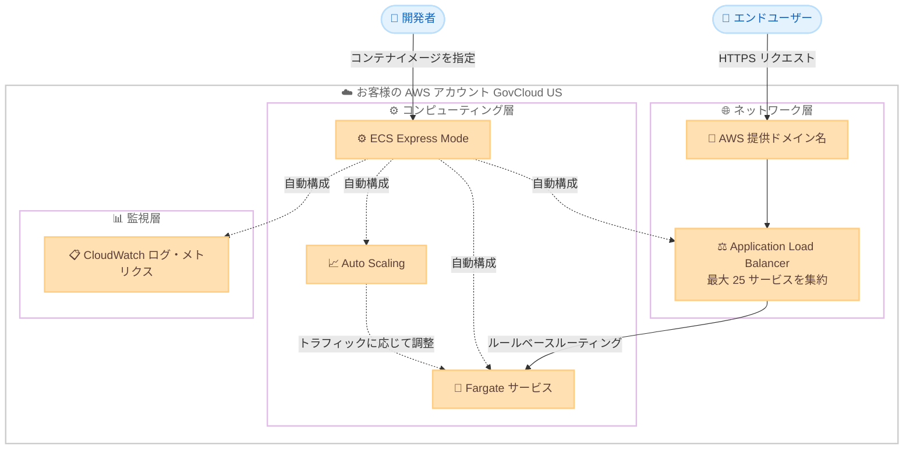

# Amazon ECS - Express Mode が AWS GovCloud (US) リージョンで利用可能に

**リリース日**: 2026年6月15日
**サービス**: Amazon Elastic Container Service (Amazon ECS)
**機能**: Amazon ECS Express Mode

📊 [このアップデートのインフォグラフィックを見る](https://takech9203.github.io/aws-news-summary/20260615-amazon-ecs-express-mode-govcloud.html)
<!-- INFOGRAPHIC_BASE_URL は環境変数から取得 -->

## 概要

Amazon Elastic Container Service (Amazon ECS) Express Mode が、AWS GovCloud (US-East) および AWS GovCloud (US-West) リージョンで利用可能になりました。ECS Express Mode は、Web アプリケーションや API などのコンテナ化されたアプリケーションを迅速に起動できる機能です。クラウドアーキテクチャのオーケストレーションと管理を容易にしながら、インフラストラクチャリソースに対する完全な制御を維持できます。

ECS Express Mode の各サービスには、AWS が提供するドメイン名が自動的に割り当てられます。これにより、追加の設定なしにアプリケーションへ即座にアクセスできます。アプリケーションには AWS の運用ベストプラクティスが組み込まれ、パブリックまたはプライベートの HTTPS リクエストを処理し、トラフィックパターンに応じてスケールします。コンテナイメージを指定するだけで、ECS Express Mode がアプリケーションをデプロイし、URL を自動生成します。

GovCloud (US) リージョンは、米国政府機関やその請負業者、規制対象のワークロードを扱う組織を対象とした AWS リージョンです。今回の対応により、これらの組織でも ECS Express Mode を活用し、規制要件を満たしながらコンテナアプリケーションを迅速にデプロイできるようになりました。

**アップデート前の課題**

ECS Express Mode は標準の商用リージョンで提供されていましたが、GovCloud (US) リージョンでは利用できませんでした。

- GovCloud (US) リージョンではコンテナアプリケーションのデプロイに ECS サービス、ロードバランサー、Auto Scaling、ネットワーキングなどを個別に設定する必要があった
- 規制対象のワークロードを扱う組織は、迅速なプロトタイピングやセルフサービスデプロイの仕組みを独自に構築する必要があった
- アプリケーションチームが独立してデプロイするには、AWS インフラストラクチャに関する深い知識が求められた

**アップデート後の改善**

今回のアップデートにより、GovCloud (US) リージョンでも ECS Express Mode を利用できるようになりました。

- コンテナイメージを指定するだけでアプリケーションのデプロイと URL 生成が自動化された
- AWS が提供するドメイン名が自動付与され、追加設定なしでアプリケーションにアクセスできるようになった
- 最大 25 サービスを単一の Application Load Balancer に集約し、コストを最適化できるようになった

## アーキテクチャ図



開発者がコンテナイメージを指定すると、ECS Express Mode が Fargate サービス、Application Load Balancer、Auto Scaling、監視、ネットワーキングを自動構成し、AWS 提供ドメイン名経由でアプリケーションを公開します。

## サービスアップデートの詳細

### 主要機能

1. **3 つの要素だけで開始**
   - 開始に必要なのはコンテナイメージ、タスク実行ロール、インフラストラクチャロールの 3 つのみ
   - 複数サービスにまたがる設定パラメータの管理が不要
   - ECS Express Mode が必要なインフラストラクチャを自動でオーケストレーションおよび構成

2. **AWS 提供ドメイン名と URL の自動生成**
   - 各 Express Mode サービスに AWS 提供ドメイン名が自動付与される
   - 追加設定なしでアプリケーションへ即座にアクセス可能
   - SSL/TLS を備えたロードバランサーが自動構成される

3. **Application Load Balancer の集約**
   - 同じネットワーキング構成を使用する最大 25 サービスを単一の Application Load Balancer に集約
   - インテリジェントなルールベースルーティングによりサービス間の分離を維持
   - ロードバランサーを共有することでコストを削減

4. **インフラストラクチャへの完全なアクセス**
   - 作成されたすべてのリソースはお客様のアカウント内に存在し、フルアクセス可能
   - AWS コンソールおよび API を通じて直接管理できる
   - 詳細な制御や高度な機能が必要な場合に既存リソースを変更可能

5. **自動スケーリングと運用ベストプラクティス**
   - 使用率またはトラフィックに応じて自動的にスケール
   - AWS の運用ベストプラクティスが組み込まれる
   - パブリックまたはプライベートの HTTPS アプリケーションに対応

## 技術仕様

### 自動構成されるリソース

| 項目 | 詳細 |
|------|------|
| コンピューティング | Fargate ベースの ECS サービス |
| ネットワーキング | SSL/TLS 付き Application Load Balancer、ネットワーキングコンポーネント |
| ドメイン | 一意でアクセス可能な AWS 提供 URL |
| スケーリング | Auto Scaling ポリシー |
| 監視 | CloudWatch ログおよびメトリクス |
| ALB 集約上限 | 単一 ALB あたり最大 25 サービス |

### 開始に必要な要素

| 項目 | 詳細 |
|------|------|
| コンテナイメージ | デプロイするアプリケーションのイメージ |
| タスク実行ロール | コンテナの起動とログ出力に使用する IAM ロール |
| インフラストラクチャロール | Express Mode がインフラを構成するための IAM ロール |

## 設定方法

### 前提条件

1. デプロイ対象のコンテナイメージが用意されていること (Amazon ECR など)
2. タスク実行ロールが作成されていること
3. インフラストラクチャロールが作成されていること
4. GovCloud (US-East) または GovCloud (US-West) リージョンで ECS および Fargate が利用可能であること

### 手順

#### ステップ1: コンテナイメージの準備

```bash
# Amazon ECR にコンテナイメージをプッシュ
aws ecr get-login-password --region us-gov-east-1 | docker login --username AWS --password-stdin <account-id>.dkr.ecr.us-gov-east-1.amazonaws.com
docker push <account-id>.dkr.ecr.us-gov-east-1.amazonaws.com/my-app:latest
```

アプリケーションのコンテナイメージを Amazon ECR にプッシュします。ECS Express Mode はこのイメージを参照してデプロイを行います。

#### ステップ2: Express Mode サービスのデプロイ

ECS コンソール、AWS CLI、SDK、CloudFormation、CDK、Terraform のいずれかを使用して Express Mode サービスをデプロイします。コンテナイメージと 2 つの IAM ロールを指定すると、ECS Express Mode が Fargate サービス、ロードバランサー、Auto Scaling、監視、ネットワーキングを自動構成します。

#### ステップ3: 生成された URL でのアクセス確認

デプロイが完了すると、AWS 提供ドメイン名に基づく URL が自動生成されます。この URL を使用してアプリケーションへ HTTPS でアクセスし、動作を確認します。必要に応じて、作成された各リソースをコンソールや API から個別に管理できます。

## メリット

### ビジネス面

- **市場投入までの時間短縮**: コンテナイメージを指定するだけでアプリケーションをデプロイでき、迅速なプロトタイピングと検証が可能
- **規制対象ワークロードへの対応**: GovCloud (US) リージョンで利用でき、米国政府機関や規制要件を持つ組織のコンプライアンス要件を満たしながら利用できる
- **追加料金なし**: ECS Express Mode 自体の追加料金は発生せず、作成された AWS リソースの料金のみを支払う

### 技術面

- **運用負荷の削減**: AWS の運用ベストプラクティスが組み込まれ、インフラ構成の手間が大幅に削減される
- **コスト最適化**: 最大 25 サービスを単一の ALB に集約し、ロードバランサーの共有によりコストを削減
- **柔軟な制御**: 作成されたリソースはお客様のアカウントに残り、必要に応じて直接管理や高度なカスタマイズが可能

## デメリット・制約事項

### 制限事項

- 単一の Application Load Balancer に集約できるのは最大 25 サービスまで
- ALB を共有できるのは同じネットワーキング構成を使用するサービスに限られる
- ステートレスな HTTP/HTTPS アプリケーション (Web アプリケーションや API) を主な対象とする

### 考慮すべき点

- ステートフルなワークロードや特殊な要件を持つアプリケーションでは、Express Mode の自動構成が適さない場合がある
- Fargate コンピューティング、ALB、CloudWatch、データ転送などの基盤リソースに対する料金は別途発生する
- GovCloud (US) リージョンでは利用可能なサービスや機能が商用リージョンと異なる場合があるため、事前に確認が必要

## ユースケース

### ユースケース1: 政府機関向け Web アプリケーションの迅速なデプロイ

**シナリオ**: 規制要件を持つ政府機関が、内部向けの Web アプリケーションを GovCloud (US) リージョンに短期間でデプロイしたい。

**実装例**:
```
コンテナイメージ + タスク実行ロール + インフラストラクチャロール
→ ECS Express Mode が自動構成 → プライベート HTTPS で公開
```

**効果**: インフラ設計の負荷なく、コンプライアンス要件を満たす環境にアプリケーションを迅速にデプロイできる。

### ユースケース2: 複数 API のコスト効率的な運用

**シナリオ**: 複数のマイクロサービス API を運用しているが、サービスごとにロードバランサーを用意するとコストが高くなる。

**実装例**:
```
同じネットワーキング構成の API 群 (最大 25)
→ 単一 Application Load Balancer に集約
→ ルールベースルーティングで分離
```

**効果**: ロードバランサーを共有することでコストを抑えつつ、サービス間の分離を維持できる。

### ユースケース3: アプリケーションチームのセルフサービスデプロイ

**シナリオ**: プラットフォームチームが、AWS の深い知識を持たないアプリケーションチームに自律的なデプロイ環境を提供したい。

**実装例**:
```
プラットフォームチーム: IAM ロールと標準テンプレートを準備
アプリケーションチーム: コンテナイメージを指定してデプロイ
```

**効果**: メンテナンス負荷を軽減しながら、各チームが独立してアプリケーションをデプロイできる。

## 料金

ECS Express Mode の利用に追加料金は発生しません。アプリケーションを実行するために作成された以下の基盤 AWS リソースの料金のみを支払います。

- Fargate コンピューティングリソース
- Application Load Balancer
- CloudWatch ログおよびメトリクス
- データ転送料金

### 料金例

| 使用量 | 月額料金 (概算) |
|--------|------------------|
| 利用するリソース構成により変動 | 作成された Fargate、ALB、CloudWatch、データ転送の合計 |

正確な料金は構成や使用量によって異なります。詳細は各サービスの料金ページを参照してください。

## 利用可能リージョン

今回のアップデートにより、ECS Express Mode は以下の AWS GovCloud (US) リージョンで利用可能になりました。

- AWS GovCloud (US-East)
- AWS GovCloud (US-West)

なお、ECS Express Mode は Amazon ECS および Fargate がサポートされているすべての AWS リージョンで利用できます。

## 関連サービス・機能

- **AWS Fargate**: Express Mode サービスのコンピューティング基盤となるサーバーレスコンテナ実行環境
- **Elastic Load Balancing (Application Load Balancer)**: 最大 25 サービスを集約し、ルールベースルーティングで分離を維持
- **Amazon CloudWatch**: Express Mode サービスのログとメトリクスを収集し、監視を提供
- **AWS CloudFormation / CDK / Terraform**: Express Mode サービスを Infrastructure as Code でデプロイ・管理する手段

## 参考リンク

- 📊 [インフォグラフィック](https://takech9203.github.io/aws-news-summary/20260615-amazon-ecs-express-mode-govcloud.html)
- [公式発表 (What's New)](https://aws.amazon.com/about-aws/whats-new/2026/06/amazon-ecs-express-mode-govcloud/)
- [AWS Blog](https://aws.amazon.com/blogs/aws/build-production-ready-applications-without-infrastructure-complexity-using-amazon-ecs-express-mode/)
- [ドキュメント](https://docs.aws.amazon.com/AmazonECS/latest/developerguide/express-service-overview.html)
- [Amazon ECS 料金ページ](https://aws.amazon.com/ecs/pricing/)

## まとめ

Amazon ECS Express Mode の GovCloud (US) 対応により、規制対象のワークロードを扱う組織でも、インフラの複雑さを意識せずにコンテナアプリケーションを迅速にデプロイできるようになりました。コンテナイメージを指定するだけで本番運用に適したデフォルト構成が自動適用され、追加料金もかかりません。GovCloud (US) でコンテナアプリケーションを運用する場合は、まず小規模な Web アプリケーションや API で Express Mode を試し、自動構成されるリソースと ALB 集約によるコスト効果を確認することを推奨します。
