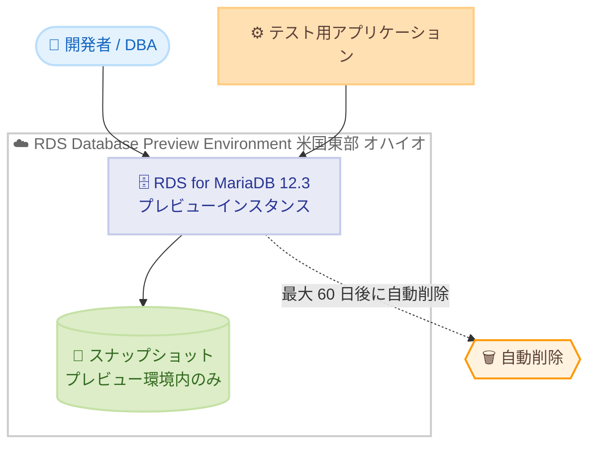

# Amazon RDS for MariaDB - MariaDB 12.3 のプレビュー環境サポート

**リリース日**: 2026年6月15日
**サービス**: Amazon RDS for MariaDB
**機能**: Amazon RDS Database Preview Environment での MariaDB 12.3 サポート

📊 [このアップデートのインフォグラフィックを見る](https://takech9203.github.io/aws-news-summary/20260615-amazon-rds-maria-db-innovation-release-12-3-rds-database-preview-environment.html)
<!-- INFOGRAPHIC_BASE_URL は環境変数から取得 -->

## 概要

Amazon RDS for MariaDB が、Amazon RDS Database Preview Environment において MariaDB 12.3 をサポートしました。これにより、お客様は最新の長期サポート (Long-Term Support: LTS) リリースである MariaDB 12.3 を、一般提供 (GA) 開始前に Amazon RDS for MariaDB 上で評価できるようになりました。

このプレビュー環境は、アプリケーションのテストや新機能の検証を安全に行うためのサンドボックスを提供します。お客様は本番環境に影響を与えることなく、MariaDB 12.3 の新しい機能を試したり、既存のアプリケーションとの互換性を確認したりできます。MariaDB 12.3 では、Oracle の `TO_DATE()` 関数互換性、ネイティブ JSON 検証のための SQL 標準 IS JSON 述語、基本的な XML データ型などが追加されています。

このアップデートは、データベース管理者、アプリケーション開発者、新バージョンへの移行を計画しているお客様を対象としています。GA を待たずに早期検証を進めることで、移行リスクの低減と計画の前倒しが可能になります。

**アップデート前の課題**

- 以前は、MariaDB の新しいメジャーバージョンの機能を Amazon RDS 上で GA 前に評価する手段がなかった
- 新バージョンへの移行検証を行うには、GA 開始まで待つか、自己管理の環境を別途構築する必要があった
- アプリケーションの互換性確認やパフォーマンス検証を、本番リリース直前に短期間で行うリスクがあった

**アップデート後の改善**

- 今回のアップデートにより、MariaDB 12.3 を Amazon RDS のプレビュー環境で GA 前に評価できるようになった
- マネージドなサンドボックス環境を利用できるため、自己管理環境の構築が不要になった
- 新機能の検証やアプリケーション互換性テストを、本番環境とは隔離された環境で前倒しして実施できるようになった

## アーキテクチャ図



プレビュー環境では、米国東部 (オハイオ) リージョンで MariaDB 12.3 のインスタンスを起動し、テスト用アプリケーションから接続して検証できます。作成したインスタンスは最大 60 日間保持され、保持期間後に自動削除されます。

## サービスアップデートの詳細

### 主要機能

1. **Oracle TO_DATE() 関数互換性**
   - Oracle の `TO_DATE()` 関数と互換性のある関数が追加された
   - Oracle からの移行や、Oracle と MariaDB を併用する環境での日付文字列変換が容易になる

2. **SQL 標準 IS JSON 述語**
   - ネイティブな JSON 検証を行うための SQL 標準 IS JSON 述語をサポート
   - カラムや式の値が有効な JSON かどうかを標準構文で検証できる

3. **基本的な XML データ型**
   - 基本的な XML データ型が追加された
   - XML データの格納と取り扱いがサポートされる

4. **プリペアドステートメントでのカーソルサポート**
   - プリペアドステートメント上でカーソルを利用できるようになった

5. **CTE からの読み取りを伴う UPDATE/DELETE**
   - UPDATE/DELETE 操作で共通テーブル式 (Common Table Expressions: CTE) からの読み取りが可能になった
   - 複雑な更新・削除ロジックをより簡潔に記述できる

6. **クエリオプティマイザの改善**
   - 並べ替え可能な LEFT JOIN ステートメントをより効率的に処理
   - RANGE パーティションに対する順序付きスキャンの効率が向上

## 技術仕様

### プレビュー環境の特性

| 項目 | 詳細 |
|------|------|
| 対象バージョン | MariaDB 12.3 (長期サポートリリース) |
| 環境 | Amazon RDS Database Preview Environment |
| インスタンス保持期間 | 最大 60 日間 (期間経過後に自動削除) |
| スナップショットの制約 | プレビュー環境内のインスタンスの作成・復元にのみ使用可能 |
| 利用可能リージョン | 米国東部 (オハイオ) リージョン |

### API 変更履歴

今回のアップデートは既存のプレビュー環境での新バージョンサポートであり、専用の API 変更は確認されていません。

## 設定方法

### 前提条件

1. AWS アカウントを保有していること
2. Amazon RDS Database Preview Environment へのアクセス権を持つ IAM 権限が付与されていること
3. プレビュー環境が提供される米国東部 (オハイオ) リージョンを利用できること

### 手順

#### ステップ 1: プレビュー環境のコンソールにアクセス

Amazon RDS Database Preview Environment 専用のコンソール URL からアクセスします。プレビュー環境は通常の RDS コンソールとは別のエンドポイントで提供されます。

#### ステップ 2: MariaDB 12.3 インスタンスの作成

```bash
aws rds create-db-instance \
    --db-instance-identifier mariadb-12-3-preview \
    --db-instance-class db.r6g.large \
    --engine mariadb \
    --engine-version 12.3 \
    --allocated-storage 20 \
    --master-username admin \
    --master-user-password <password> \
    --region us-east-2
```

エンジンバージョンに 12.3 を指定して、プレビュー環境内に MariaDB インスタンスを作成します。リージョンはプレビュー環境が提供される米国東部 (オハイオ) を指定します。実際のエンドポイントやパラメータはプレビュー環境のドキュメントに従ってください。

#### ステップ 3: アプリケーションの検証

作成したインスタンスにテスト用アプリケーションから接続し、MariaDB 12.3 の新機能や既存機能の互換性を検証します。検証完了後、必要に応じてスナップショットを作成して結果を保全します。ただしスナップショットはプレビュー環境内でのみ利用できる点に注意してください。

## メリット

### ビジネス面

- **移行リスクの低減**: GA 前に新バージョンを検証することで、本番移行時の予期せぬ問題を事前に把握できる
- **計画の前倒し**: 新機能の評価を早期に開始でき、移行ロードマップを前倒しで策定できる
- **コスト効率**: マネージドなサンドボックスを利用するため、検証用環境の自己構築・運用コストが不要になる

### 技術面

- **隔離された検証環境**: 本番環境に影響を与えることなく新機能をテストできる
- **新機能の早期評価**: Oracle 互換関数、IS JSON 述語、XML データ型などを GA 前に実際に試せる
- **オプティマイザ改善の確認**: LEFT JOIN や RANGE パーティションのクエリ性能改善を自社ワークロードで検証できる

## デメリット・制約事項

### 制限事項

- インスタンスは最大 60 日間しか保持されず、期間経過後に自動削除される
- プレビュー環境で作成したスナップショットは、プレビュー環境内のインスタンスの作成・復元にのみ使用できる
- プレビュー環境は米国東部 (オハイオ) リージョンでのみ提供される

### 考慮すべき点

- プレビュー環境は評価・テスト用であり、本番ワークロードや重要なデータの保存には使用しない
- プレビュー版のため、GA 版とは機能や動作が異なる可能性がある
- 60 日の自動削除を前提に、検証結果や設定は別途記録しておくことが望ましい

## ユースケース

### ユースケース 1: Oracle からの移行検証

**シナリオ**: Oracle データベースから MariaDB への移行を計画している企業が、`TO_DATE()` などの Oracle 互換関数の挙動を事前に確認したい。

**実装例**:
```sql
SELECT TO_DATE('2026-06-15', 'YYYY-MM-DD');
```

**効果**: 移行先で Oracle 互換関数が期待どおりに動作することを GA 前に確認でき、移行作業の手戻りを削減できる。

### ユースケース 2: JSON データの検証強化

**シナリオ**: JSON データを扱うアプリケーションで、格納される値が有効な JSON であることを SQL 標準の構文で検証したい。

**実装例**:
```sql
SELECT * FROM orders WHERE payload IS JSON;
```

**効果**: ネイティブな JSON 検証を標準述語で記述でき、アプリケーション側の検証ロジックを簡素化できる。

### ユースケース 3: クエリ性能改善の評価

**シナリオ**: LEFT JOIN を多用する分析クエリや RANGE パーティションテーブルを持つワークロードで、12.3 のオプティマイザ改善による性能向上を測定したい。

**実装例**:
```sql
SELECT a.id, b.value
FROM orders a
LEFT JOIN order_items b ON a.id = b.order_id
ORDER BY a.created_at;
```

**効果**: 自社の代表的なクエリで性能を比較検証し、バージョンアップによる効果を定量的に把握できる。

## 料金

Amazon RDS Database Preview Environment で起動したインスタンスには、通常の Amazon RDS for MariaDB と同様にインスタンス、ストレージ、その他リソースの利用に応じた料金が発生します。詳細な料金は Amazon RDS for MariaDB の料金ページを参照してください。

## 利用可能リージョン

Amazon RDS Database Preview Environment は、米国東部 (オハイオ) リージョンで提供されます。

## 関連サービス・機能

- **Amazon RDS for MariaDB**: 本アップデートの対象となるマネージド MariaDB データベースサービス
- **Amazon RDS Database Preview Environment**: GA 前の新エンジンバージョンを評価するためのサンドボックス環境
- **Amazon RDS スナップショット**: プレビュー環境内でのインスタンス作成・復元に利用できるバックアップ機能

## 参考リンク

- 📊 [インフォグラフィック](https://takech9203.github.io/aws-news-summary/20260615-amazon-rds-maria-db-innovation-release-12-3-rds-database-preview-environment.html)
- [公式発表 (What's New)](https://aws.amazon.com/about-aws/whats-new/2026/05/amazon-rds-maria-db-innovation-release-12-3-rds-database-preview-environment/)
- [Amazon RDS Database Preview Environment ドキュメント](https://docs.aws.amazon.com/AmazonRDS/latest/UserGuide/CHAP_Previewenvironment.html)
- [MariaDB 12.3 リリースノート](https://mariadb.com/docs/release-notes/community-server/12.3/12.3.1)

## まとめ

Amazon RDS for MariaDB が MariaDB 12.3 をプレビュー環境でサポートしたことで、お客様は最新の長期サポートリリースを GA 前にマネージドなサンドボックスで評価できるようになりました。Oracle 互換関数、IS JSON 述語、XML データ型、CTE を伴う更新・削除、オプティマイザ改善など多くの新機能が含まれています。MariaDB の新バージョンへの移行を検討しているお客様は、米国東部 (オハイオ) リージョンのプレビュー環境でアプリケーション互換性と性能を早期に検証することを推奨します。
