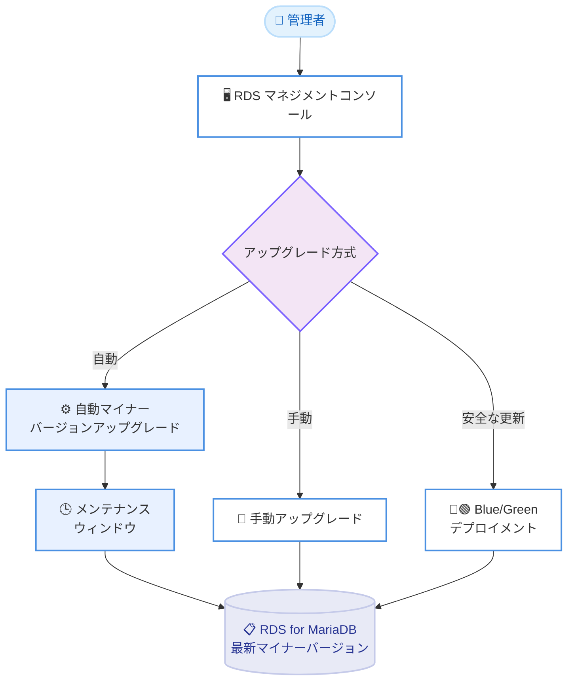

# Amazon RDS for MariaDB - コミュニティマイナーバージョン 10.6.27、10.11.18、11.4.12、11.8.8 サポート

**リリース日**: 2026年6月15日
**サービス**: Amazon RDS for MariaDB
**機能**: MariaDB マイナーバージョン 10.6.27、10.11.18、11.4.12、11.8.8 のサポート

📊 [このアップデートのインフォグラフィックを見る](https://takech9203.github.io/aws-news-summary/20260615-amazon-rds-mariadb-community-versions.html)

## 概要

Amazon Relational Database Service (Amazon RDS) for MariaDB がコミュニティ MariaDB マイナーバージョン 10.6.27、10.11.18、11.4.12、11.8.8 をサポートしました。これらの最新マイナーバージョンには、セキュリティ脆弱性の修正、バグ修正、パフォーマンス改善、MariaDB コミュニティによって追加された新機能が含まれています。

AWS は、以前のバージョンに存在する既知のセキュリティ脆弱性への対応と、コミュニティが提供するバグ修正やパフォーマンス改善の恩恵を受けるために、最新のマイナーバージョンへのアップグレードを推奨しています。アップグレードには、スケジュールされたメンテナンスウィンドウ中に自動更新を行う自動マイナーバージョンアップグレード機能、または安全かつシンプルで迅速な更新を実現する Amazon RDS マネージド Blue/Green デプロイメントを利用できます。

対象は、Amazon RDS for MariaDB を運用しているすべてのユーザーであり、データベースの作成や変更は Amazon RDS マネジメントコンソールから実施できます。

**アップデート前の課題**

- 以前のマイナーバージョンには既知のセキュリティ脆弱性が存在していた
- 最新のバグ修正やパフォーマンス改善が適用されていない状態だった
- コミュニティが追加した新機能を利用できなかった

**アップデート後の改善**

- 4 つの MariaDB メジャーバージョン系列 (10.6、10.11、11.4、11.8) の最新マイナーバージョンが利用可能になった
- 自動マイナーバージョンアップグレード機能により計画的なアップグレードが可能になった
- Amazon RDS マネージド Blue/Green デプロイメントによる安全なアップグレードパスを利用できるようになった

## アーキテクチャ図



3 つのアップグレード方式 (自動、手動、Blue/Green) から選択し、最新の MariaDB マイナーバージョンへ更新する流れを示しています。

## サービスアップデートの詳細

### 主要機能

1. **4 系列のマイナーバージョンサポート**
   - MariaDB 10.6.27: 長期サポート (LTS) 系列の最新版
   - MariaDB 10.11.18: LTS 系列の最新版
   - MariaDB 11.4.12: 長期サポート (LTS) 系列の最新版
   - MariaDB 11.8.8: 最新リリース系列の最新版

2. **自動マイナーバージョンアップグレード**
   - スケジュールされたメンテナンスウィンドウ中に自動アップグレードが可能
   - 運用負荷を最小限に抑えながら最新のセキュリティパッチを適用

3. **Amazon RDS マネージド Blue/Green デプロイメント対応**
   - 安全でシンプル、かつ迅速なアップグレードを実現
   - 本番環境とは別にステージング環境を構築し、検証後に切り替えることでダウンタイムを最小化

## 技術仕様

### サポートバージョン一覧

| MariaDB 系列 | 最新マイナーバージョン | 系列の特徴 |
|------|------|------|
| 10.6 | 10.6.27 | 長期サポート (LTS) |
| 10.11 | 10.11.18 | 長期サポート (LTS) |
| 11.4 | 11.4.12 | 長期サポート (LTS) |
| 11.8 | 11.8.8 | 最新リリース系列 |

## 設定方法

### 前提条件

1. Amazon RDS for MariaDB インスタンスが稼働中であること
2. データベースの変更に必要な IAM 権限を保有していること
3. アップグレード対象バージョンとの互換性を確認していること

### 手順

#### ステップ 1: 自動マイナーバージョンアップグレードの有効化

```bash
aws rds modify-db-instance \
  --db-instance-identifier my-mariadb-instance \
  --auto-minor-version-upgrade \
  --apply-immediately
```

自動マイナーバージョンアップグレードを有効化し、次のメンテナンスウィンドウで最新のマイナーバージョンに自動更新されるように設定します。

#### ステップ 2: 手動アップグレード (即時適用)

```bash
aws rds modify-db-instance \
  --db-instance-identifier my-mariadb-instance \
  --engine-version 11.4.12 \
  --apply-immediately
```

特定のマイナーバージョンに即時アップグレードする場合は、`--engine-version` でターゲットバージョンを指定します。

#### ステップ 3: Blue/Green デプロイメントによるアップグレード

```bash
aws rds create-blue-green-deployment \
  --blue-green-deployment-name my-bg-deployment \
  --source "arn:aws:rds:ap-northeast-1:123456789012:db:my-mariadb-instance" \
  --target-engine-version 11.4.12
```

Blue/Green デプロイメントを使用することで、本番環境への影響を抑えながら安全にバージョンアップグレードを実施します。検証後に Green 環境へ切り替えることで、ダウンタイムを最小限に抑えられます。

## メリット

### ビジネス面

- **セキュリティリスクの低減**: 既知の脆弱性に対するパッチが適用される
- **安定性の向上**: コミュニティによるバグ修正が含まれる
- **運用負荷の軽減**: 自動アップグレードにより手動対応の手間を削減

### 技術面

- **複数のアップグレードパス**: 自動アップグレード、手動アップグレード、Blue/Green デプロイメントから選択可能
- **パフォーマンス改善**: コミュニティが追加したパフォーマンス最適化の恩恵
- **新機能の活用**: MariaDB コミュニティが追加した新機能を利用可能

## デメリット・制約事項

### 制限事項

- メジャーバージョンアップグレードは別途対応が必要 (本アップデートはマイナーバージョンのみが対象)
- 自動マイナーバージョンアップグレードはメンテナンスウィンドウ中に実施されるため、短時間のダウンタイムが発生する場合がある

### 考慮すべき点

- アップグレード前にステージング環境でのテストを推奨
- カスタムパラメータグループを使用している場合、互換性の確認が必要

## ユースケース

### ユースケース 1: セキュリティパッチの計画的適用

**シナリオ**: 複数の本番 MariaDB インスタンスを運用しており、既知の脆弱性に対して計画的にパッチを適用したい。

**実装例**:
```
自動マイナーバージョンアップグレードを有効化し、
影響の少ない時間帯にメンテナンスウィンドウを設定する。
```

**効果**: メンテナンスウィンドウ中に最新のセキュリティパッチが自動適用され、運用負荷を抑えながらセキュリティリスクを低減できます。

### ユースケース 2: ダウンタイムを抑えた本番アップグレード

**シナリオ**: 可用性要件が厳しい本番データベースを、サービス影響を最小限にしてアップグレードしたい。

**実装例**:
```
Amazon RDS マネージド Blue/Green デプロイメントで
Green 環境を作成し、検証後に切り替える。
```

**効果**: 本番環境 (Blue) とは独立した Green 環境で検証できるため、安全かつ短時間で切り替えが可能になります。

### ユースケース 3: 大規模環境での段階的アップグレード

**シナリオ**: 多数の MariaDB インスタンスを抱える環境で、段階的にバージョンを統一したい。

**実装例**:
```
重要度の低いインスタンスから手動で --engine-version を指定して
アップグレードし、検証後に本番環境へ展開する。
```

**効果**: 影響範囲を限定しながら段階的にアップグレードを進め、リスクを管理できます。

## 料金

マイナーバージョンアップグレード自体に追加料金は発生しません。Amazon RDS for MariaDB の標準料金が適用されます。詳細な料金体系と利用可能リージョンについては、Amazon RDS for MariaDB の料金ページを参照してください。

## 利用可能リージョン

Amazon RDS for MariaDB が提供されているすべての AWS リージョンで利用可能です。最新の提供状況については、Amazon RDS for MariaDB のページを参照してください。

## 関連サービス・機能

- **Amazon RDS マネージド Blue/Green デプロイメント**: ダウンタイムを最小限に抑えたデータベースアップグレードを実現
- **自動マイナーバージョンアップグレード**: メンテナンスウィンドウ中の計画的な自動更新
- **Amazon RDS for MariaDB アップグレードガイド**: アップグレード手順とベストプラクティスを提供

## 参考リンク

- 📊 [インフォグラフィック](https://takech9203.github.io/aws-news-summary/20260615-amazon-rds-mariadb-community-versions.html)
- [公式発表 (What's New)](https://aws.amazon.com/about-aws/whats-new/2026/05/amazon-rds-mariadb-community-versions/)
- [Amazon RDS マネージド Blue/Green デプロイメント ドキュメント](https://docs.aws.amazon.com/AmazonRDS/latest/UserGuide/blue-green-deployments.html)
- [Amazon RDS for MariaDB アップグレードガイド](https://docs.aws.amazon.com/AmazonRDS/latest/UserGuide/USER_UpgradeDBInstance.MariaDB.html)
- [Amazon RDS for MariaDB (料金・リージョン)](https://aws.amazon.com/rds/mariadb/)

## まとめ

Amazon RDS for MariaDB の最新マイナーバージョン (10.6.27、10.11.18、11.4.12、11.8.8) のサポートにより、セキュリティ脆弱性の修正とパフォーマンス改善が適用可能になりました。既知の脆弱性への対応のため、自動マイナーバージョンアップグレードの有効化、または Amazon RDS マネージド Blue/Green デプロイメントを活用した計画的なアップグレードを推奨します。
