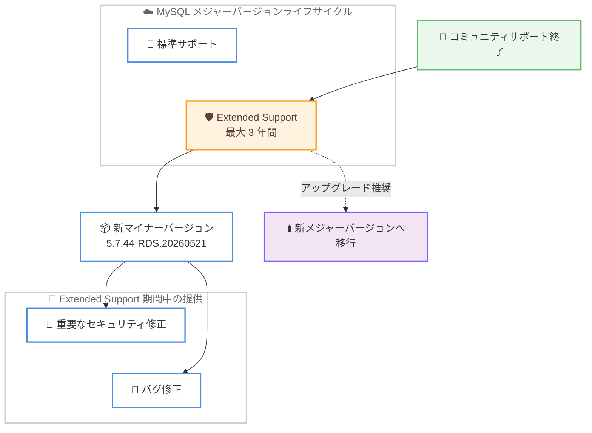

# Amazon RDS for MySQL - Extended Support マイナーバージョン 5.7.44-RDS.20260521

**リリース日**: 2026 年 6 月 15 日
**サービス**: Amazon Relational Database Service (Amazon RDS) for MySQL
**機能**: Amazon RDS Extended Support マイナーバージョン 5.7.44-RDS.20260521

📊 [このアップデートのインフォグラフィックを見る](https://takech9203.github.io/aws-news-summary/20260615-amazon-rds-mysql-extended-support-minor-5744-rds.html)

## 概要

Amazon RDS for MySQL は、新しい Amazon RDS Extended Support マイナーバージョン 5.7.44-RDS.20260521 のサポートを開始しました。このバージョンは、以前のバージョンの MySQL に存在する既知のセキュリティ脆弱性とバグを修正するものであり、AWS はこのバージョンへのアップグレードを推奨しています。

Amazon RDS Extended Support は、MySQL のメジャーバージョンがコミュニティでの標準サポート終了を迎えた後も、最大 3 年間にわたって新しいメジャーバージョンへのアップグレード猶予を提供する仕組みです。Extended Support 期間中、AWS は Aurora および RDS 上の MySQL データベースに対して重要なセキュリティ修正とバグ修正を継続的に提供します。これにより、お客様はメジャーバージョンの標準サポート終了日を超えても、ビジネス要件に合わせて計画的にアップグレードを進めることができます。

今回のマイナーバージョンは、MySQL 5.7 系を Extended Support のもとで運用しているお客様を対象としています。セキュリティと安定性を維持しながらメジャーバージョンアップグレードの準備期間を確保したいお客様にとって、適用が推奨されるアップデートです。

**アップデート前の課題**

Extended Support 対象のメジャーバージョンを利用しているお客様には、以下のような課題がありました。

- 以前のマイナーバージョンには既知のセキュリティ脆弱性やバグが残存していた
- 標準サポート終了後のバージョンでは、修正が適用されないままになるリスクがあった
- セキュリティ修正を適用するには、より新しいマイナーバージョンの提供を待つ必要があった

**アップデート後の改善**

今回のアップデートにより、以下が可能になりました。

- マイナーバージョン 5.7.44-RDS.20260521 へのアップグレードにより、既知のセキュリティ脆弱性とバグが修正される
- 標準サポート終了後の MySQL 5.7 でも、重要なセキュリティ修正とバグ修正を受けられる
- 最大 3 年間の Extended Support 期間を活用し、メジャーバージョンアップグレードを計画的に進められる

## アーキテクチャ図



コミュニティサポート終了後の MySQL メジャーバージョンに対して、Extended Support が最大 3 年間のセキュリティ修正とバグ修正を提供し、新マイナーバージョン 5.7.44-RDS.20260521 がその一環として配信される流れを示しています。

## サービスアップデートの詳細

### 主要機能

1. **新しい Extended Support マイナーバージョンの提供**
   - マイナーバージョン 5.7.44-RDS.20260521 が利用可能になった
   - 以前のバージョンの MySQL に存在する既知のセキュリティ脆弱性とバグを修正
   - Amazon RDS for MySQL のお客様にアップグレードが推奨される

2. **Extended Support によるサポート期間の延長**
   - メジャーバージョンの標準サポート終了後も最大 3 年間サポートを継続
   - Aurora および RDS の MySQL データベースが対象
   - 重要なセキュリティ修正とバグ修正を継続的に提供

3. **計画的なメジャーバージョン移行の支援**
   - 標準サポート終了日を超えても運用を継続しながら移行を準備できる
   - ビジネス要件に合わせたアップグレード計画の立案が可能

## 技術仕様

### バージョン情報

| 項目 | 詳細 |
|------|------|
| サービス | Amazon RDS for MySQL |
| 新マイナーバージョン | 5.7.44-RDS.20260521 |
| 対象メジャーバージョン系列 | MySQL 5.7 |
| サポートプログラム | Amazon RDS Extended Support |
| Extended Support 期間 | メジャーバージョン標準サポート終了後、最大 3 年間 |
| 対象エンジン | Amazon RDS、Amazon Aurora |

### 設定や権限など

Extended Support のマイナーバージョンを指定してインスタンスをアップグレードする場合、AWS CLI では `modify-db-instance` の `--engine-version` パラメータに対象バージョンを指定します。

```bash
aws rds modify-db-instance \
    --db-instance-identifier my-mysql-instance \
    --engine-version 5.7.44-RDS.20260521 \
    --apply-immediately
```

## 設定方法

### 前提条件

1. Amazon RDS for MySQL のデータベースインスタンスを運用していること
2. アップグレード対象が MySQL 5.7 系の Extended Support バージョンであること
3. アップグレード前にスナップショットを取得し、メンテナンスウィンドウを確認していること

### 手順

#### ステップ1: 現在のエンジンバージョンを確認

```bash
aws rds describe-db-instances \
    --db-instance-identifier my-mysql-instance \
    --query "DBInstances[0].EngineVersion"
```

対象インスタンスの現在のエンジンバージョンを確認し、アップグレードが必要かどうかを判断します。

#### ステップ2: スナップショットを取得

```bash
aws rds create-db-snapshot \
    --db-instance-identifier my-mysql-instance \
    --db-snapshot-identifier my-mysql-instance-before-5744-rds
```

アップグレード前にバックアップを取得し、問題が発生した場合に復旧できるようにします。

#### ステップ3: マイナーバージョンへアップグレード

```bash
aws rds modify-db-instance \
    --db-instance-identifier my-mysql-instance \
    --engine-version 5.7.44-RDS.20260521 \
    --apply-immediately
```

エンジンバージョンを 5.7.44-RDS.20260521 に変更します。`--apply-immediately` を指定すると即時適用され、省略した場合は次回メンテナンスウィンドウで適用されます。本番環境ではメンテナンスウィンドウでの適用を検討してください。Amazon RDS マネジメントコンソールからも同様の操作が可能です。

## メリット

### ビジネス面

- **移行猶予の確保**: メジャーバージョン標準サポート終了後も最大 3 年間の猶予を得られ、ビジネス要件に合わせて移行計画を立てられる
- **ダウンタイムリスクの低減**: 急いだメジャーバージョンアップグレードを避け、十分なテスト期間を確保できる
- **コンプライアンス維持**: セキュリティ修正の継続適用により、セキュリティ要件やコンプライアンス基準を満たしやすくなる

### 技術面

- **セキュリティ脆弱性の修正**: 既知のセキュリティ脆弱性が修正され、データベースの安全性が向上する
- **バグ修正の適用**: 以前のバージョンに存在するバグが修正され、安定性が向上する
- **マネージドな提供**: AWS がマネージドサービスとして修正バージョンを提供するため、お客様による独自パッチ管理が不要

## デメリット・制約事項

### 制限事項

- Extended Support は標準サポートと比べて追加料金が発生する
- Extended Support 期間はメジャーバージョン標準サポート終了後、最大 3 年間に限られる
- マイナーバージョンアップグレードであっても、適用時に短時間のダウンタイムが発生する可能性がある

### 考慮すべき点

- Extended Support のコストを継続的に負担するよりも、計画的なメジャーバージョン移行を進めることが望ましい
- アップグレード適用前に、検証環境での動作確認とスナップショット取得を実施する
- アプリケーションの互換性を確認したうえでアップグレードを実施する

## ユースケース

### ユースケース1: セキュリティ脆弱性への対応

**シナリオ**: MySQL 5.7 を Extended Support のもとで運用しており、既知のセキュリティ脆弱性に早期対応する必要がある。

**実装例**:
```bash
aws rds modify-db-instance \
    --db-instance-identifier prod-mysql \
    --engine-version 5.7.44-RDS.20260521 \
    --apply-immediately
```

**効果**: 既知のセキュリティ脆弱性が修正され、セキュリティリスクを低減できます。

### ユースケース2: メジャーバージョン移行までの安定運用

**シナリオ**: MySQL 8.0 などの新メジャーバージョンへの移行を計画しているが、アプリケーション改修に時間が必要で、その間も安定運用を維持したい。

**実装例**:
```
1. 最新の Extended Support マイナーバージョンを適用してセキュリティと安定性を維持
2. 検証環境で MySQL 8.0 への移行テストを並行して実施
3. 移行準備が整い次第、メジャーバージョンアップグレードを実施
```

**効果**: 最大 3 年間の猶予期間を活用しつつ、安全な状態で計画的な移行を進められます。

### ユースケース3: コンプライアンス要件への準拠

**シナリオ**: 規制業界において、データベースに最新のセキュリティ修正が適用されていることを求められている。

**実装例**:
```
1. 提供された最新の Extended Support マイナーバージョンを定期的に適用
2. アップグレード履歴を監査ログとして記録
3. パッチ適用状況をコンプライアンスレポートに反映
```

**効果**: 継続的なセキュリティ修正の適用により、コンプライアンス要件を満たしやすくなります。

## 料金

Amazon RDS Extended Support は、標準サポートに加えて追加料金が発生します。料金は vCPU あたりの時間単位で課金され、Extended Support の年数に応じて段階的に設定されています。具体的な料金や課金体系については、Amazon RDS for MySQL の料金ページおよび料金 FAQ を参照してください。

なお、最新の Extended Support マイナーバージョンへのアップグレード自体に追加料金は発生しません。Extended Support の利用料金はメジャーバージョンの標準サポート終了後に適用されます。

## 利用可能リージョン

今回の発表では特定のリージョンは明記されていません。Amazon RDS Extended Support の対象リージョンおよびマイナーバージョンの提供状況については、Amazon RDS for MySQL の料金ページおよびドキュメントを参照してください。

## 関連サービス・機能

- **Amazon Aurora MySQL 互換エディション**: Aurora 上の MySQL データベースも Extended Support の対象であり、同様に重要なセキュリティ修正とバグ修正が提供される
- **Amazon RDS Blue/Green Deployments**: メジャーバージョンアップグレードや大規模な変更を、ダウンタイムを最小化しながら安全に実施できる
- **Amazon RDS マネジメントコンソール**: マイナーバージョンアップグレードをコンソールから簡単に実施できる

## 参考リンク

- 📊 [インフォグラフィック](https://takech9203.github.io/aws-news-summary/20260615-amazon-rds-mysql-extended-support-minor-5744-rds.html)
- [公式発表 (What's New)](https://aws.amazon.com/about-aws/whats-new/2026/06/amazon-rds-mysql-extended-support-minor-5744-rds/)
- [ドキュメント: DB インスタンスのアップグレード (MySQL)](https://docs.aws.amazon.com/AmazonRDS/latest/UserGuide/USER_UpgradeDBInstance.MySQL.html)
- [ドキュメント: Extended Support の概念とバージョン管理](https://docs.aws.amazon.com/AmazonRDS/latest/UserGuide/MySQL.Concepts.VersionMgmt.html)
- [料金ページ](https://aws.amazon.com/rds/mysql/pricing/)

## まとめ

Amazon RDS for MySQL の新しい Extended Support マイナーバージョン 5.7.44-RDS.20260521 は、既知のセキュリティ脆弱性とバグを修正する重要なアップデートです。MySQL 5.7 を Extended Support のもとで運用しているお客様は、検証環境での動作確認とスナップショット取得を行ったうえで、本バージョンへのアップグレードを検討してください。あわせて、最大 3 年間の猶予期間を活用し、新メジャーバージョンへの計画的な移行を進めることが推奨されます。
