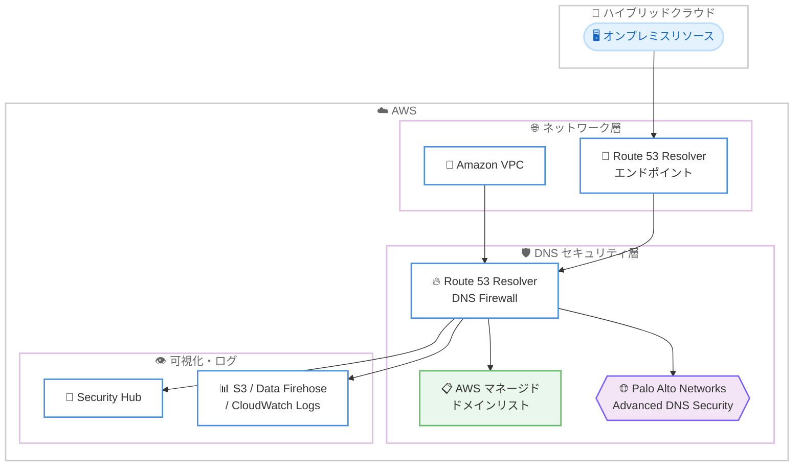

# Amazon Route 53 Resolver DNS Firewall - Palo Alto Networks Advanced DNS Security 対応

**リリース日**: 2026年6月15日
**サービス**: Amazon Route 53 Resolver DNS Firewall
**機能**: Palo Alto Networks (PANW) Advanced DNS Security 連携 (プレビュー)

📊 [このアップデートのインフォグラフィックを見る](https://takech9203.github.io/aws-news-summary/20260615-amazon-route-53-resolver-dns.html)
<!-- INFOGRAPHIC_BASE_URL は環境変数から取得 -->

## 概要

AWS は、Amazon Route 53 Resolver DNS Firewall において Palo Alto Networks (PANW) Advanced DNS Security をプレビュー提供開始しました。これにより、セキュリティ管理者は Palo Alto Networks の DNS 脅威防御を Route 53 DNS Firewall のルールに直接適用できます。

従来、サードパーティの高度な DNS セキュリティを利用するには、別途ファイアウォールを展開したり、VPC 構成を変更したりする必要がありました。今回のアップデートでは、DNS Firewall コンソールに組み込まれた AWS Marketplace ウィジェットから PANW をサブスクライブするだけで、追加のインフラ展開や VPC 設定の変更なしに脅威防御を有効化できます。

コマンドアンドコントロール (C2)、マルウェア、フィッシング、新規登録ドメインなどのセキュリティカテゴリを、DNS Firewall のルール作成ワークフロー内で直接デプロイできます。保護対象は Amazon VPC からの DNS クエリトラフィックに加え、Route 53 Resolver エンドポイント経由で転送されるハイブリッドクラウド環境のトラフィックも含まれます。AWS マネージドドメインリストを PANW の脅威インテリジェンスで補完し、より高度な検出を実現します。

**アップデート前の課題**

- 高度なサードパーティ DNS セキュリティを導入するには、別途ファイアウォールアプライアンスの展開が必要だった
- VPC 構成やネットワークルーティングの変更が必要で、運用負荷が高かった
- AWS マネージドドメインリストだけでは、fast-flux や DNS トンネリングなどの高度な脅威検出が難しかった

**アップデート後の改善**

- DNS Firewall コンソールの組み込み Marketplace ウィジェットから PANW をサブスクライブするだけで利用できるようになった
- 別途ファイアウォールの展開や VPC 構成の変更が不要になった
- PANW の脅威インテリジェンスにより、fast-flux 防御、DNS トンネリング検出、DNS リバインディング防御、DGA 検出などが可能になった

## アーキテクチャ図



VPC 内およびハイブリッドクラウド経由の DNS クエリが Route 53 Resolver DNS Firewall を通過し、AWS マネージドドメインリストと PANW Advanced DNS Security の両方で検査される流れを示しています。

## サービスアップデートの詳細

### 主要機能

1. **DNS Firewall コンソールからの簡易サブスクリプション**
   - DNS Firewall コンソールに組み込まれた AWS Marketplace ウィジェットから PANW をサブスクライブ
   - 別途ファイアウォールの展開や VPC 構成の変更が不要
   - DNS Firewall ルール作成ワークフロー内で直接設定可能

2. **PANW セキュリティカテゴリの適用**
   - コマンドアンドコントロール (C2)
   - マルウェア
   - フィッシング
   - 新規登録ドメイン (Newly Registered Domains) など
   - 既存のルールグループに PANW ルールを追加可能

3. **高度な脅威インテリジェンスによる保護**
   - fast-flux 防御
   - DNS トンネリング検出
   - DNS リバインディング防御
   - DGA (Domain Generation Algorithm) 検出
   - AWS マネージドドメインリストを PANW の脅威インテリジェンスで補完

4. **マルチアカウント管理と一元的な可視化**
   - AWS Resource Access Manager (RAM)、Route 53 Profiles、AWS Firewall Manager によるマルチアカウント管理に対応
   - AWS Security Hub の検出結果による一元的な可視化
   - クエリログを Amazon S3、Amazon Data Firehose、Amazon CloudWatch Logs に出力可能

## 技術仕様

### 保護対象トラフィック

| 項目 | 詳細 |
|------|------|
| VPC トラフィック | Amazon VPC 内から発生する DNS クエリトラフィック |
| ハイブリッドクラウド | Route 53 Resolver エンドポイント経由で転送される DNS クエリトラフィック |
| 補完対象 | AWS マネージドドメインリストを PANW 脅威インテリジェンスで補完 |

### マルチアカウント管理オプション

| サービス | 役割 |
|----------|------|
| AWS Resource Access Manager (RAM) | ルールグループの複数アカウント間共有 |
| Route 53 Profiles | DNS 設定の集中管理と複数 VPC への適用 |
| AWS Firewall Manager | 組織全体での DNS Firewall ポリシーの一元適用 |

## 設定方法

### 前提条件

1. Amazon Route 53 Resolver DNS Firewall を利用していること
2. PANW ルールを追加料金なしで利用するには DNS Firewall Advanced を契約していること
3. 対応リージョンで利用すること

### 手順

#### ステップ1: PANW Advanced DNS Security のサブスクライブ

DNS Firewall コンソールに組み込まれた AWS Marketplace ウィジェットから Palo Alto Networks Advanced DNS Security をサブスクライブします。プレビュー期間中、Marketplace サブスクリプションは無料です。

#### ステップ2: DNS Firewall ルールへの PANW カテゴリ適用

DNS Firewall のルール作成ワークフロー内で、コマンドアンドコントロール、マルウェア、フィッシング、新規登録ドメインなどの PANW セキュリティカテゴリを選択し、ルールグループに追加します。

#### ステップ3: 可視化とログ出力の設定

AWS Security Hub と連携して検出結果を一元的に確認できるようにし、クエリログを Amazon S3、Amazon Data Firehose、または Amazon CloudWatch Logs に出力するよう設定します。

## メリット

### ビジネス面

- **導入コストの削減**: 別途ファイアウォールアプライアンスの調達・運用が不要になり、導入の障壁が下がります
- **運用負荷の軽減**: VPC 構成の変更が不要で、既存の DNS Firewall ワークフロー内で完結します
- **プレビュー期間の無償提供**: PANW Marketplace サブスクリプションがプレビュー期間中は無料です

### 技術面

- **高度な脅威検出**: fast-flux、DNS トンネリング、DNS リバインディング、DGA など、マネージドリストだけでは難しい検出が可能になります
- **ハイブリッド環境への対応**: Route 53 Resolver エンドポイント経由でオンプレミスからの DNS クエリも保護できます
- **一元的なガバナンス**: AWS RAM、Route 53 Profiles、AWS Firewall Manager によるマルチアカウント管理に対応します

## デメリット・制約事項

### 制限事項

- 現時点ではプレビュー提供であり、本番ワークロードでの利用には注意が必要です
- 対応リージョンが限定されています (8 リージョン)
- PANW ルールを追加料金なしで利用するには DNS Firewall Advanced の契約が必要です

### 考慮すべき点

- プレビュー終了後の PANW Marketplace サブスクリプション料金体系を事前に確認することを推奨します
- 既存の DNS Firewall ルールとの優先順位や評価順序を設計時に考慮する必要があります

## ユースケース

### ユースケース1: マルウェア・C2 通信の遮断

**シナリオ**: 社内ネットワークから外部のコマンドアンドコントロール (C2) サーバーへの通信を未然に防ぎたいセキュリティチーム。

**実装例**:
```
DNS Firewall ルールグループに PANW の「Command and Control」
および「Malware」カテゴリを追加し、該当する DNS クエリをブロック
```

**効果**: マルウェア感染端末による外部 C2 サーバーとの通信を DNS レベルで遮断し、被害拡大を防止します。

### ユースケース2: フィッシング・新規登録ドメイン対策

**シナリオ**: 従業員がフィッシングサイトや悪用されやすい新規登録ドメインにアクセスするリスクを低減したい組織。

**実装例**:
```
DNS Firewall ルールに PANW の「Phishing」および
「Newly Registered Domains」カテゴリを適用
```

**効果**: フィッシング詐欺や悪意ある新規ドメインへのアクセスを DNS 解決時にブロックします。

### ユースケース3: ハイブリッド環境の DNS 脅威防御の一元化

**シナリオ**: オンプレミスと複数の AWS アカウントを運用し、DNS セキュリティポリシーを組織全体で統一したい企業。

**実装例**:
```
Route 53 Resolver エンドポイントでオンプレミス DNS クエリを転送し、
AWS Firewall Manager と Route 53 Profiles で PANW ルールを
全アカウントへ一元適用
```

**効果**: ハイブリッド環境全体に一貫した DNS 脅威防御を適用し、Security Hub で検出結果を集中監視できます。

## 料金

DNS Firewall Advanced を契約しているお客様は、既存のルールグループに PANW ルールを追加しても、追加の DNS Firewall 料金は発生しません。また、PANW の AWS Marketplace サブスクリプションはプレビュー期間中は無料です。

### 料金例

| 使用量 | 月額料金 (概算) |
|--------|------------------|
| DNS Firewall Advanced 契約済みでの PANW ルール追加 | 追加の DNS Firewall 料金なし |
| PANW Marketplace サブスクリプション (プレビュー期間中) | 無料 |

正式な料金は AWS の公式料金ページで確認してください。

## 利用可能リージョン

プレビューは以下の 8 リージョンで利用可能です。

- 米国東部 (オハイオ)
- 米国西部 (北カリフォルニア)
- 欧州 (ロンドン)
- 欧州 (フランクフルト)
- アジアパシフィック (東京)
- アジアパシフィック (ムンバイ)
- アジアパシフィック (シンガポール)
- アフリカ (ケープタウン)

## 関連サービス・機能

- **Amazon Route 53 Resolver エンドポイント**: ハイブリッドクラウド環境からの DNS クエリ転送を担い、PANW 保護の対象範囲を拡張します
- **AWS Firewall Manager**: 組織全体への DNS Firewall ポリシーの一元適用を実現します
- **Route 53 Profiles**: 複数 VPC への DNS 設定の集中管理を可能にします
- **AWS Resource Access Manager (RAM)**: ルールグループをアカウント間で共有します
- **AWS Security Hub**: PANW による検出結果を一元的に可視化します
- **Amazon S3 / Amazon Data Firehose / Amazon CloudWatch Logs**: DNS クエリログの保存・分析先として利用します

## 参考リンク

- 📊 [インフォグラフィック](https://takech9203.github.io/aws-news-summary/20260615-amazon-route-53-resolver-dns.html)
- [公式発表 (What's New)](https://aws.amazon.com/about-aws/whats-new/2026/06/amazon-route-53-resolver-dns/)
- [Amazon Route 53 ドキュメント](https://docs.aws.amazon.com/Route53/latest/DeveloperGuide/resolver-dns-firewall.html)
- [Amazon Route 53 料金ページ](https://aws.amazon.com/route53/pricing/)

## まとめ

このアップデートにより、Palo Alto Networks の高度な DNS 脅威防御を、追加のインフラ展開や VPC 構成変更なしに Route 53 Resolver DNS Firewall で利用できるようになりました。fast-flux や DNS トンネリングなどマネージドリストだけでは対応が難しい脅威への防御を強化できるため、DNS セキュリティの高度化を検討している組織は、対応リージョンでプレビューを試して効果を評価することを推奨します。
