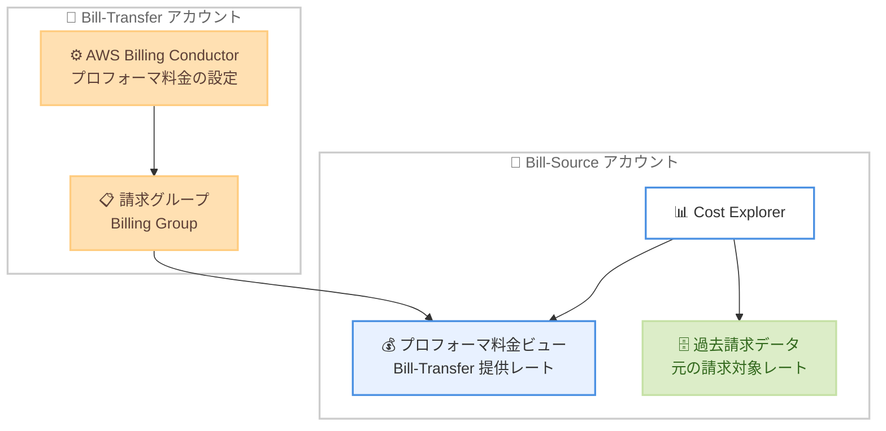

# AWS Cost Explorer - 請求グループ内アカウントの過去データ保持

**リリース日**: 2026 年 6 月 15 日
**サービス**: AWS Cost Explorer (AWS Billing and Cost Management)
**機能**: 請求グループ (Billing Group) に含まれるアカウントの過去請求データ保持

📊 [このアップデートのインフォグラフィックを見る](https://takech9203.github.io/aws-news-summary/20260615-aws-cost-explorer.html)
<!-- INFOGRAPHIC_BASE_URL は環境変数から取得 -->

## 概要

AWS は、請求グループ (Billing Group) に含まれるアカウントが、AWS Cost Explorer 上で過去の請求データへのアクセスを保持できる機能を発表しました。お客様は AWS Billing Conductor と Billing Transfer を使用してアカウントを請求グループにマッピングし、支払いアカウント (Payer account) または Bill-Transfer アカウントが提供するプロフォーマ料金 (pro forma rates) で請求データを表示できます。

これまで、請求グループの構成では、請求グループにマッピングされたアカウントの過去請求データ (AWS の請求対象料金で算出されたデータ) へのアクセスが制限されていました。今回のアップデートにより、請求グループに含まれるアカウントは、Cost Explorer 上で元の請求対象料金 (billable rates) による過去の請求データへのアクセスを保持できるようになります。

すでに Billing Conductor および Billing Transfer をオンボーディング済みのアカウントは、追加の操作なしで過去データへアクセスできるようになります。これにより、レポート作成の継続性 (reporting continuity) が確保されます。

**アップデート前の課題**

- 請求グループにアカウントをマッピングすると、そのアカウントの過去請求データ (AWS 請求対象料金で算出されたもの) へのアクセスが制限されていた
- Billing Transfer への移行後、AWS Cost Explorer、AWS Budgets、AWS Cost Anomaly Detection などで過去のコストデータが参照できなくなり、レポート作成の継続性が損なわれていた
- 過去データを保持するためには、移行前に手動でコストデータをダウンロードするなどの対応が必要だった

**アップデート後の改善**

- 請求グループに含まれるアカウントが、元の請求対象料金による過去請求データへのアクセスを Cost Explorer 上で保持できるようになった
- すでに Billing Conductor および Billing Transfer をオンボーディング済みのアカウントは、追加の操作なしで過去データにアクセスできるようになった
- レポート作成の継続性が確保され、移行前後でコスト分析を中断なく実施できるようになった

## アーキテクチャ図

Bill-Source アカウントは Cost Explorer で、Bill-Transfer アカウントが提供するプロフォーマ料金ビューに加えて、元の請求対象レートによる過去請求データへもアクセスできるようになりました。

## サービスアップデートの詳細

### 主要機能

1. **過去請求データへのアクセス保持**
   - 請求グループに含まれるアカウントが、元の請求対象料金 (billable rates) による過去請求データへのアクセスを保持
   - Cost Explorer 上で移行前後のコスト分析を継続して実施可能
   - レポート作成の継続性を確保

2. **既存アカウントへの自動適用**
   - すでに Billing Conductor および Billing Transfer をオンボーディング済みのアカウントは追加操作不要
   - 自動的に過去データへのアクセスを取得

3. **プロフォーマ料金と請求対象料金の併存**
   - Bill-Transfer アカウントが提供するプロフォーマ料金で請求データを表示しつつ
   - 元の請求対象レートによる過去データも参照可能

## 技術仕様

### Billing Transfer の主要な役割と概念

| 項目 | 詳細 |
|------|------|
| Payer account (支払いアカウント) | 連結請求書を生成、管理、支払うアカウント |
| Bill-Transfer アカウント | 別の管理アカウントの連結請求書を管理、支払うよう指定された管理アカウント |
| Bill-Source アカウント | 連結請求書を生成し、その請求を外部の管理アカウントへ移管するアカウント |
| プロフォーマ料金 (pro forma rates) | Bill-Transfer アカウントが Billing Conductor で設定する、Bill-Source アカウントに表示されるレート |
| 請求対象料金 (billable rates) | AWS が算出する元の請求レート |
| 請求グループ (Billing Group) | Billing Conductor で構成される、コストをグループ化する単位 |

### API変更履歴

今回のアップデートに直接関連する新規 API メソッドの追加は確認されていません。Billing Transfer の構成は AWS Billing Conductor および Billing Transfer の既存 API で実施します。

## 設定方法

### 前提条件

1. AWS Organizations の管理アカウントを保有していること
2. Bill-Transfer アカウントと Bill-Source アカウント間で Billing Transfer の招待を承諾済みであること
3. プロフォーマ料金を表示するために AWS Billing Conductor を構成していること (コンソールでの構成には Billing Conductor の利用が必要)

### 手順

#### ステップ1: Billing Transfer のセットアップ

Bill-Transfer アカウント (管理アカウント) から Bill-Source アカウント (管理アカウント) へ Billing Transfer の招待を送信します。招待には Bill-Transfer アカウントが連結請求書の管理と支払いを開始する開始日を含めます。招待は移管開始日の 24 時間前 (UTC) までに承諾する必要があります。

#### ステップ2: Billing Conductor によるプロフォーマ料金の構成

Bill-Transfer アカウントは、Bill-Source アカウントに表示されるプロフォーマ料金を AWS Billing Conductor で構成します。Billing Conductor のベース料金または既存のカスタム料金のいずれかの料金構成を選択できます。

#### ステップ3: Cost Explorer での過去データ確認

今回のアップデートにより、Bill-Source アカウントは Cost Explorer 上で、プロフォーマ料金ビューに加えて元の請求対象レートによる過去請求データを参照できます。既存のオンボーディング済みアカウントは追加操作なしでアクセス可能です。

## メリット

### ビジネス面

- **レポート作成の継続性**: 移行前後でコスト分析を中断なく実施でき、過去のコスト傾向との比較が可能
- **手動対応の削減**: 過去データを保持するために移行前に手動でコストデータをダウンロードする必要がなくなる
- **既存ユーザーへの即時適用**: すでにオンボーディング済みのアカウントは追加操作なしで恩恵を受けられる

### 技術面

- **データの一貫性**: 元の請求対象レートとプロフォーマ料金の両方を Cost Explorer 上で参照可能
- **運用負荷の軽減**: Billing Transfer 移行時の過去データ消失への対処が不要
- **既存構成との互換性**: 既存の Billing Conductor および Billing Transfer 構成をそのまま活用

## デメリット・制約事項

### 制限事項

- Billing Transfer は GovCloud、China (Beijing)、China (Ningxia) の各リージョンでは利用不可
- コンソールでの Billing Transfer 構成には AWS Billing Conductor の利用が必要であり、Billing Conductor の利用料金が発生する
- プロフォーマ請求データは、サポートプラン料金、AWS クレジット、AWS 無料利用枠 (クレジットベースのもの) など一部の料金要素を反映しない場合がある

### 考慮すべき点

- Cost Anomaly Detection (CAD) は Bill-Source アカウントではサポートされない
- Cost Explorer でプロフォーマデータを参照する場合、粒度は日次または月次のみで、時間単位の粒度は利用できない (時間単位の分析には AWS Cost and Usage Report を使用)
- リザーブドインスタンスや Savings Plans の推奨はパブリック料金に基づくため、予測される節約額が実際より高く表示される場合がある

## ユースケース

### ユースケース1: AWS パートナーによるリセール時のコスト継続性確保

**シナリオ**: AWS パートナーがエンドカスタマーの請求を Bill-Transfer アカウントへ移管した後も、エンドカスタマー (Bill-Source アカウント) が過去のコスト傾向を Cost Explorer で参照したい。

**効果**: Bill-Source アカウントが元の請求対象レートによる過去データを保持できるため、移行後もレポート作成と分析を継続できます。

### ユースケース2: 企業の組織再編に伴う請求集約

**シナリオ**: 複数の AWS Organizations の連結請求を単一の Bill-Transfer アカウントへ集約しつつ、各組織が過去のコストデータを継続して分析したい。

**効果**: 各 Bill-Source アカウントが過去データを保持するため、組織再編後も一貫したコスト管理が可能になります。

### ユースケース3: ショーバック/チャージバック運用

**シナリオ**: Bill-Transfer アカウントが Billing Conductor でプロフォーマ料金を構成し、各部門 (Bill-Source アカウント) にチャージバックを実施しつつ、過去の実コストとの差分を確認したい。

**効果**: プロフォーマ料金ビューと元の請求対象レートによる過去データの両方を Cost Explorer で参照でき、より正確なコスト配賦と分析が可能になります。

## 料金

今回の過去データ保持機能自体に関する追加料金についての記載はありません。ただし、コンソールでの Billing Transfer 構成には AWS Billing Conductor の利用が必要であり、Billing Conductor の利用料金が発生します。詳細は AWS Billing Conductor の料金ページを参照してください。

## 利用可能リージョン

Billing Transfer は、GovCloud、China (Beijing)、China (Ningxia) の各リージョンを除く、すべての AWS リージョンで本日より利用可能です。

## 関連サービス・機能

- **AWS Billing Conductor**: プロフォーマ料金の構成と請求グループの作成に使用するカスタム請求サービス
- **AWS Billing Transfer**: 管理アカウントの連結請求を外部の管理アカウントへ移管する仕組み
- **AWS Cost Explorer**: コストと使用状況を可視化、分析するツール。今回の機能で過去データの参照性が向上
- **AWS Cost and Usage Report (CUR)**: 時間単位の粒度でのコスト分析が必要な場合に使用

## 参考リンク

- 📊 [インフォグラフィック](https://takech9203.github.io/aws-news-summary/20260615-aws-cost-explorer.html)
- [公式発表 (What's New)](https://aws.amazon.com/about-aws/whats-new/2026/06/aws-cost-explorer/)
- [AWS Billing Transfer 製品ページ](https://aws.amazon.com/aws-cost-management/aws-billing-transfer/)
- [ドキュメント (Transfer billing management to external accounts)](https://docs.aws.amazon.com/awsaccountbilling/latest/aboutv2/orgs_transfer_billing.html)
- [AWS Billing Conductor 料金ページ](https://aws.amazon.com/aws-cost-management/aws-billing-conductor/pricing/)

## まとめ

今回のアップデートにより、Billing Transfer や Billing Conductor を利用して請求グループにマッピングされたアカウントが、Cost Explorer 上で元の請求対象レートによる過去請求データへのアクセスを保持できるようになりました。これによりレポート作成の継続性が確保され、移行に伴う過去データ消失への懸念が解消されます。すでにオンボーディング済みのアカウントは追加操作なしで恩恵を受けられるため、Billing Transfer を利用中のお客様は Cost Explorer での過去データ参照状況を確認することをお勧めします。
