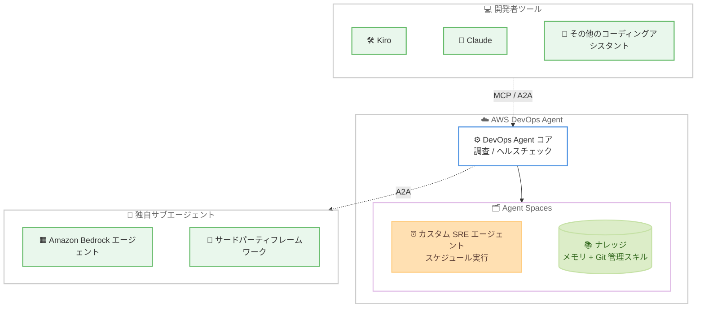

# AWS DevOps Agent - カスタム SRE エージェントと MCP/A2A プロトコル対応

**リリース日**: 2026 年 6 月 15 日
**サービス**: AWS DevOps Agent
**機能**: カスタム SRE エージェント、独自サブエージェント連携、MCP/A2A プロトコルによるヘッドレスアクセス

📊 [このアップデートのインフォグラフィックを見る](https://takech9203.github.io/aws-news-summary/20260615-aws-devops-agent-custom-agents.html)
<!-- INFOGRAPHIC_BASE_URL は環境変数から取得 -->

## 概要

AWS DevOps Agent が大幅に機能拡張され、カスタム SRE エージェント、独自サブエージェントの持ち込み (bring-your-own sub-agents)、そして MCP (Model Context Protocol) および A2A (Agent-to-Agent) プロトコルによるヘッドレスアクセスに対応しました。これにより、チームは繰り返し発生する SRE ワークフローを自動化し、DevOps Agent を他のエージェントと連携させて拡張し、Kiro や Claude をはじめとする既存のコーディングアシスタントから DevOps Agent の機能を利用できるようになります。

カスタム SRE エージェントを使うと、チームは Agent Spaces 内でエージェントを作成し、一定の周期で実行するようスケジュール設定できます。たとえば、スロークエリやチューニングが必要なパラメータをチェックする日次のデータベースヘルスレポートを作成したり、過去 24 時間のログを確認して異常を検出するエージェントを構築したりできます。ヘッドレスモードでは、開発者は A2A または MCP プロトコル経由で、すでに利用しているツールやエージェントから DevOps Agent を呼び出せます。

このアップデートでは、チャット機能の強化、顧客定義ルールに基づくインシデントスキップのサポート、メモリと Git 管理スキルによるナレッジ強化、タスク品質追跡のための人手によるラベリングと顧客作成ダッシュボード、そして 5 つの新しいリージョンでの提供も導入されました。SRE 業務の自動化を進めたいチームや、既存の開発ツールチェーンに DevOps Agent を組み込みたい開発者が主な対象です。

**アップデート前の課題**

- 以前は DevOps Agent の機能を AWS マネジメントコンソール上の Agent Spaces 内でしか利用できず、IDE や他のコーディングアシスタントからは呼び出せませんでした
- 以前は繰り返し発生する SRE 作業 (日次のヘルスチェックやログ監視など) を DevOps Agent に定期実行させる仕組みがありませんでした
- 以前は独自に構築したエージェントや外部フレームワークのサブエージェントと DevOps Agent を連携させる標準的な方法がありませんでした

**アップデート後の改善**

- 今回のアップデートにより、MCP や A2A 経由で Kiro、Claude などの既存ツールから DevOps Agent をヘッドレスで呼び出せるようになりました
- 今回のアップデートにより、Agent Spaces 内でカスタム SRE エージェントをスケジュール実行し、定型的な SRE ワークフローを自動化できるようになりました
- 今回のアップデートにより、Amazon Bedrock やサードパーティフレームワークで構築した独自サブエージェントを A2A 経由で接続できるようになりました

## アーキテクチャ図



開発者ツールは MCP/A2A 経由で DevOps Agent コアを呼び出し、DevOps Agent はカスタム SRE エージェントや独自サブエージェントと連携して SRE ワークフローを自動化します。

## サービスアップデートの詳細

### 主要機能

1. **カスタム SRE エージェント (Custom SRE agents)**
   - Agent Spaces 内でエージェントを作成し、一定のカデンス (周期) で実行するようスケジュール設定できます
   - スロークエリやチューニングが必要なパラメータをチェックする日次のデータベースヘルスレポートを自動生成できます
   - 過去 24 時間のログをレビューして異常を検出するエージェントを構築できます

2. **ヘッドレスアクセス (MCP / A2A プロトコル)**
   - 開発者は A2A または MCP プロトコル経由で、すでに利用しているツールやエージェントから DevOps Agent を呼び出せます
   - Kiro power for AWS DevOps Agent により、開発者は IDE を離れることなく本番環境のヘルス確認や問題調査を実行できます
   - Claude などのコーディングアシスタントからも DevOps Agent の機能を利用できます

3. **独自サブエージェント連携 (Bring-your-own sub-agents)**
   - Amazon Bedrock またはサードパーティフレームワークで構築した独自のサブエージェントを A2A 経由で接続できます
   - DevOps Agent を起点として、組織固有のエージェントを組み合わせた拡張ワークフローを構築できます

4. **その他の機能強化**
   - チャット機能の強化
   - 顧客定義ルールに基づくインシデントスキップのサポート
   - メモリ (memories) と Git 管理スキルによるナレッジの強化
   - タスク品質追跡のための人手によるラベリングと顧客作成ダッシュボード
   - 5 つの新しいリージョンでの提供開始

## 技術仕様

### 連携プロトコル

| 項目 | 詳細 |
|------|------|
| MCP (Model Context Protocol) | コーディングアシスタント等から DevOps Agent をツールとして呼び出すためのプロトコル |
| A2A (Agent-to-Agent) | 独自サブエージェントや外部エージェントと DevOps Agent を相互接続するプロトコル |
| カスタム SRE エージェント実行場所 | Agent Spaces 内 |
| サブエージェント構築フレームワーク | Amazon Bedrock、サードパーティフレームワーク |

### ナレッジ関連の最近の改善

| 日付 | 改善内容 |
|------|----------|
| 2026/06/11 | スキル、指示 (AGENTS.md)、メモリが単一の Knowledge ページ (3 タブ) に統合。サイドバーのラベルが「Skills」から「Knowledge」に変更 |
| 2026/06/03 | チャット中に追加したツールが再起動なしで約 30 秒以内に利用可能に |
| 2026/05/28 | アクティブな Agent Space でトポロジー理解が自動的に定期更新されるように |

### API変更履歴

今回のアップデートに対応する awsapichanges.com 上の公開 API 変更情報は確認できませんでした。AWS DevOps Agent のサービスエンドポイントは `aidevops.{region}.amazonaws.com` 形式で提供されています。

## 設定方法

### 前提条件

1. AWS DevOps Agent がサポートされているリージョンで Agent Space を作成済みであること
2. カスタム SRE エージェントが監視・調査する対象の AWS アカウントが Agent Space に関連付けられていること
3. ヘッドレスアクセスを利用する場合、Kiro や Claude など MCP/A2A に対応したクライアントツールを準備すること

### 手順

#### ステップ1: カスタム SRE エージェントの作成とスケジュール設定

Agent Spaces のコンソールでエージェントを作成し、実行カデンス (例: 日次) を指定します。たとえば、データベースのスロークエリとチューニング対象パラメータを点検する日次ヘルスレポートを定義します。

#### ステップ2: ヘッドレスアクセスの構成

利用中の IDE やコーディングアシスタントから MCP または A2A 経由で DevOps Agent に接続します。Kiro の場合は Kiro power for AWS DevOps Agent を有効化し、IDE 内から本番ヘルス確認や問題調査を実行します。

#### ステップ3: 独自サブエージェントの接続

Amazon Bedrock やサードパーティフレームワークで構築したサブエージェントを A2A 経由で DevOps Agent に接続し、組織固有の調査・自動化ワークフローを拡張します。

なお、サードパーティ連携 (GitHub、GitLab などの CI/CD、Dynatrace、Datadog、New Relic、Splunk などの可観測性ツール、MCP サーバー) は Agent Space 単位で構成し、リージョンに依存しません。

## メリット

### ビジネス面

- **運用工数の削減**: 繰り返し発生する SRE 業務を自動化し、エンジニアがより付加価値の高い作業に集中できます
- **ツールチェーンの統合**: 既存の IDE やコーディングアシスタントから DevOps Agent を利用でき、ツール切り替えのコンテキストスイッチを削減できます
- **品質の可視化**: 人手によるラベリングと顧客作成ダッシュボードにより、タスク品質を継続的に追跡できます

### 技術面

- **標準プロトコル採用**: MCP と A2A という標準プロトコルにより、幅広いツールやエージェントと相互運用できます
- **拡張性**: Amazon Bedrock やサードパーティフレームワークの独自サブエージェントを組み込み、ワークフローを柔軟に拡張できます
- **クロスリージョン監視**: Agent Space を作成したリージョンに関わらず、関連付けた AWS アカウント内の全リージョンのリソースを監視できます

## デメリット・制約事項

### 制限事項

- 現時点でサポートされるリージョンは 11 リージョンに限られます
- Agent Space とそのデータ (調査、トポロジー、推奨事項) は作成したリージョンに保存されるため、データレジデンシー要件を考慮してリージョンを選択する必要があります
- 公式発表ページに料金の詳細は明記されていません

### 考慮すべき点

- カスタム SRE エージェントのスケジュール実行は、対象リソースや実行頻度に応じてコストや負荷に影響する可能性があるため設計時に考慮が必要です
- 独自サブエージェントを A2A で接続する場合、サブエージェント側の権限管理やセキュリティ設計を適切に行う必要があります

## ユースケース

### ユースケース1: 日次データベースヘルスレポートの自動化

**シナリオ**: 運用チームが毎朝、本番データベースのスロークエリやチューニングが必要なパラメータを手動で確認している。

**実装例**:
```
Agent Spaces でカスタム SRE エージェントを作成し、日次カデンスでスケジュール。
スロークエリとパラメータチューニング候補をチェックするヘルスレポートを自動生成。
```

**効果**: 毎朝の手動点検が不要になり、データベースの問題を早期に検出できます。

### ユースケース2: IDE 内からの本番障害調査

**シナリオ**: 開発者が本番環境の異常に気づいたが、調査のために別ツールへ切り替える必要がある。

**実装例**:
```
Kiro の IDE 内から Kiro power for AWS DevOps Agent を利用し、
MCP 経由で本番ヘルス確認と問題調査を実行。
```

**効果**: IDE を離れずに障害調査ができ、コンテキストスイッチを削減して対応を高速化できます。

### ユースケース3: 独自サブエージェントによる調査ワークフローの拡張

**シナリオ**: 組織固有のランブックを Amazon Bedrock で構築したエージェントとして保有しており、DevOps Agent の調査と組み合わせたい。

**実装例**:
```
Amazon Bedrock で構築したサブエージェントを A2A 経由で DevOps Agent に接続し、
DevOps Agent の調査結果を起点に組織固有の対応フローを連携実行。
```

**効果**: 既存資産を活かしながら、AWS の調査能力と組織固有の自動化を統合できます。

## 料金

公式発表ページに料金の詳細は明記されていません。最新の料金体系については AWS DevOps Agent の公式ドキュメントおよび料金ページをご確認ください。

## 利用可能リージョン

今回のアップデートにより 5 つの新しいリージョンが追加され、AWS DevOps Agent は以下の 11 リージョンで利用可能です。

| リージョン名 | リージョンコード |
|------|------|
| 米国東部 (バージニア北部) | us-east-1 |
| 米国西部 (オレゴン) | us-west-2 |
| カナダ (中部) | ca-central-1 |
| 南米 (サンパウロ) | sa-east-1 |
| アジアパシフィック (ムンバイ) | ap-south-1 |
| アジアパシフィック (シンガポール) | ap-southeast-1 |
| アジアパシフィック (シドニー) | ap-southeast-2 |
| アジアパシフィック (東京) | ap-northeast-1 |
| 欧州 (フランクフルト) | eu-central-1 |
| 欧州 (アイルランド) | eu-west-1 |
| 欧州 (ロンドン) | eu-west-2 |

東京リージョン (ap-northeast-1) も対応しています。Agent Space を作成したリージョンに関わらず、関連付けた AWS アカウント内の全リージョンのリソースをクロスリージョンで監視できます。

## 関連サービス・機能

- **Kiro**: AWS が提供する AI 搭載 IDE。Kiro power for AWS DevOps Agent により IDE 内から DevOps Agent を利用できます
- **Amazon Bedrock**: 独自サブエージェントの構築基盤として利用し、A2A 経由で DevOps Agent と連携できます
- **MCP (Model Context Protocol) / A2A (Agent-to-Agent)**: DevOps Agent を外部ツールやエージェントと連携させる標準プロトコル
- **Amazon CloudWatch Logs**: DevOps Agent がログ調査や異常検出に利用する可観測性サービス

## 参考リンク

- 📊 [インフォグラフィック](https://takech9203.github.io/aws-news-summary/20260615-aws-devops-agent-custom-agents.html)
- [公式発表 (What's New)](https://aws.amazon.com/about-aws/whats-new/2026/06/aws-devops-agent-custom-agents/)
- [最近の修正と改善](https://docs.aws.amazon.com/devopsagent/latest/userguide/recent-fixes-and-improvements.html)
- [サポートされているリージョン](https://docs.aws.amazon.com/devopsagent/latest/userguide/about-aws-devops-agent-supported-regions.html)

## まとめ

今回のアップデートにより、AWS DevOps Agent はカスタム SRE エージェントのスケジュール実行、MCP/A2A によるヘッドレスアクセス、独自サブエージェント連携を獲得し、定型的な SRE 業務の自動化と既存ツールチェーンへの統合が大きく前進しました。SRE 運用の効率化を目指すチームは、まず日次ヘルスチェックなどのカスタムエージェントを試作し、Kiro や Claude からのヘッドレス利用を検証することを推奨します。東京リージョンを含む 11 リージョンで利用できるため、自社のデータレジデンシー要件に合わせたリージョン選択も検討してください。
