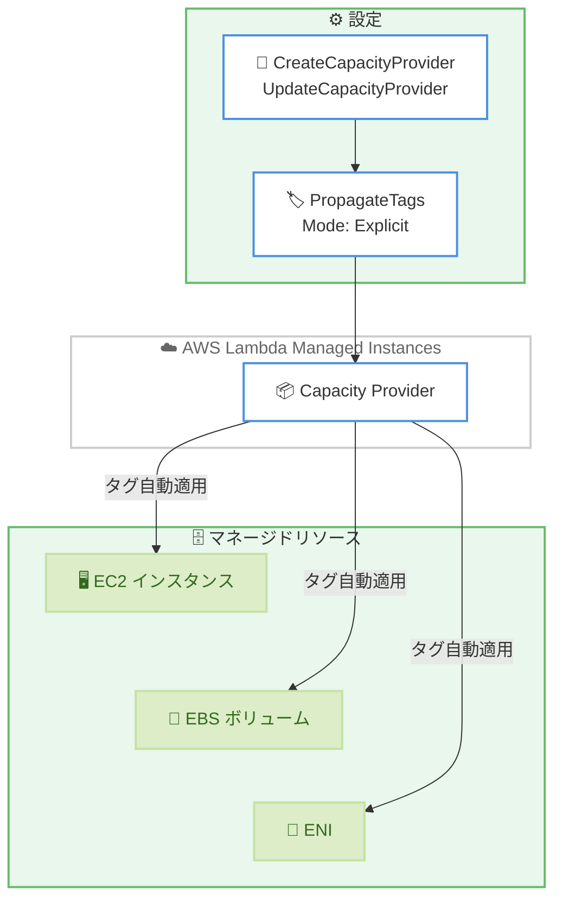

# AWS Lambda Managed Instances - マネージドリソースへのタグ伝播

**リリース日**: 2026 年 6 月 15 日
**サービス**: AWS Lambda
**機能**: AWS Lambda Managed Instances (LMI) Tag Propagation

📊 [このアップデートのインフォグラフィックを見る](https://takech9203.github.io/aws-news-summary/20260615-aws-lambda-managed-instances-tag-propagation.html)
<!-- INFOGRAPHIC_BASE_URL は環境変数から取得 -->

## 概要

AWS Lambda Managed Instances (LMI) がタグ伝播 (Tag Propagation) に対応しました。これにより、LMI がプロビジョニングするマネージドリソース (Amazon EC2 インスタンス、Amazon EBS ボリューム、Amazon ENI) に対して、タグを自動的に適用できるようになりました。キャパシティプロバイダーの設定で指定したタグが、LMI が作成するすべてのマネージドリソースに自動で付与されます。

LMI は、マネージド型の EC2 インスタンス上で Lambda 関数を実行できる機能です。組み込みのルーティング、ロードバランシング、オートスケーリングを備え、最新世代のプロセッサや高帯域幅ネットワークなどの特化型コンピューティング構成を、運用負荷なしで利用できます。これまで LMI が裏側で作成するリソースにはタグを伝播する手段がなく、コスト配分やガバナンスの観点で課題がありました。

今回のタグ伝播機能により、コスト配分タグの強制、サービスコントロールポリシー (SCP) による制御、コンプライアンス要件の遵守を、キャパシティプロバイダーが作成するすべてのリソースに対して一貫して適用できます。タグ管理を自動化したい運用チームやガバナンスチームにとって有用なアップデートです。

**アップデート前の課題**

- LMI が作成するマネージドリソース (EC2 インスタンス、EBS ボリューム、ENI) にタグを伝播する手段がなかった
- タグに依存したコスト配分やコスト可視化が、マネージドリソースに対して機能しなかった
- タグ条件を用いた SCP やコンプライアンス制御を、マネージドリソースに一貫して適用できなかった

**アップデート後の改善**

- キャパシティプロバイダーに指定したタグが、作成されるすべてのマネージドリソースに自動的に適用される
- コスト配分、SCP、コンプライアンス要件をマネージドリソース全体に一貫して適用できる
- タグ付けの手動作業が不要になり、運用負荷を低減できる

## アーキテクチャ図



キャパシティプロバイダーに設定したタグが、LMI によって作成される EC2 インスタンス、EBS ボリューム、ENI に自動的に伝播される流れを示しています。

## サービスアップデートの詳細

### 主要機能

1. **マネージドリソースへのタグ自動伝播**
   - キャパシティプロバイダー設定で指定したタグを、LMI が作成するすべてのマネージドリソースに自動適用
   - 対象リソースは Amazon EC2 インスタンス、Amazon EBS ボリューム、Amazon ENI
   - タグ付けの手動作業が不要

2. **PropagateTags 設定による制御**
   - `PropagateTags` の `Mode` を `Explicit` に設定し、伝播するタグをキーバリューペアで明示的に指定
   - `Mode` には `None` (伝播しない) と `Explicit` (明示的に指定したタグを伝播する) を選択可能

3. **ガバナンスとコスト管理の強化**
   - コスト配分タグの強制によるコスト可視化と配賦の精度向上
   - タグ条件を用いた SCP の適用やコンプライアンス要件の遵守を、マネージドリソース全体に一貫適用

## 技術仕様

### PropagateTags の構成要素

| 項目 | 詳細 |
|------|------|
| `Mode` | `None` または `Explicit`。`Explicit` を指定すると明示的に指定したタグを伝播 |
| `ExplicitTags` | 伝播するタグをキーバリューペア (`{'string': 'string'}`) で指定 |
| 対象リソース | Amazon EC2 インスタンス、Amazon EBS ボリューム、Amazon ENI |
| 設定対象 API | `CreateCapacityProvider`、`UpdateCapacityProvider` |

### API変更履歴

| 日付 | サービス | 変更内容 |
|------|----------|----------|
| 2026/06/02 | [AWS Lambda](https://awsapichanges.com/archive/changes/250cdc-lambda.html) | 5 updated api methods - キャパシティプロバイダーへの `PropagateTags` (タグ伝播設定) の追加 |

タグ伝播の追加に伴い、キャパシティプロバイダー関連の以下の 5 つの API に `PropagateTags` フィールドが追加されました。

- `CreateCapacityProvider`: リクエストおよびレスポンスに `PropagateTags` を追加
- `UpdateCapacityProvider`: リクエストおよびレスポンスに `PropagateTags` を追加
- `GetCapacityProvider`: レスポンスに `PropagateTags` を追加
- `ListCapacityProviders`: レスポンスに `PropagateTags` を追加
- `DeleteCapacityProvider`: レスポンスに `PropagateTags` を追加

### PropagateTags の設定例

```json
{
  "PropagateTags": {
    "Mode": "Explicit",
    "ExplicitTags": {
      "CostCenter": "1234",
      "Environment": "Production",
      "Team": "Platform"
    }
  }
}
```

## 設定方法

### 前提条件

1. AWS Lambda Managed Instances (LMI) が利用可能なリージョンであること
2. キャパシティプロバイダーを作成または更新する権限を持つ IAM 権限があること
3. 伝播するタグのキーバリューペアを事前に定義していること

### 手順

#### ステップ1: 新規キャパシティプロバイダー作成時にタグ伝播を設定する

```bash
aws lambda create-capacity-provider \
    --capacity-provider-name my-capacity-provider \
    --propagate-tags '{"Mode":"Explicit","ExplicitTags":{"CostCenter":"1234","Environment":"Production"}}'
```

このコマンドは、新規キャパシティプロバイダーを作成し、`Mode` を `Explicit` に設定して `CostCenter` と `Environment` のタグを、作成されるマネージドリソースに伝播するよう構成しています。

#### ステップ2: 既存キャパシティプロバイダーにタグ伝播を追加する

```bash
aws lambda update-capacity-provider \
    --capacity-provider-name my-capacity-provider \
    --propagate-tags '{"Mode":"Explicit","ExplicitTags":{"CostCenter":"1234","Team":"Platform"}}'
```

このコマンドは、既存のキャパシティプロバイダーに対してタグ伝播設定を更新しています。設定適用後に作成されるマネージドリソースにタグが伝播されます。

#### ステップ3: 設定内容を確認する

```bash
aws lambda get-capacity-provider \
    --capacity-provider-name my-capacity-provider
```

このコマンドは、キャパシティプロバイダーの設定を取得し、レスポンスに含まれる `PropagateTags` フィールドで伝播設定が正しく構成されているかを確認します。AWS Management Console、AWS CloudFormation、AWS CDK、AWS SAM からも同様に設定できます。

## メリット

### ビジネス面

- **コスト配分の精度向上**: マネージドリソースにコスト配分タグが付与され、チームやプロジェクト単位のコスト可視化と配賦が可能になる
- **ガバナンス強化**: タグ条件を用いた SCP やコンプライアンス制御を一貫して適用でき、組織のガバナンス要件を満たしやすくなる
- **運用負荷の低減**: タグ付けが自動化され、手動作業や付け漏れのリスクを削減できる

### 技術面

- **一貫したタグ付け**: EC2 インスタンス、EBS ボリューム、ENI に対して統一されたタグが自動付与される
- **IaC との統合**: AWS CloudFormation、AWS CDK、AWS SAM を通じて宣言的にタグ伝播を管理できる
- **API 経由の柔軟な制御**: `CreateCapacityProvider`、`UpdateCapacityProvider` で `Explicit` モードと任意のタグを指定可能

## デメリット・制約事項

### 制限事項

- タグ伝播は、設定適用後に新規にプロビジョニングされるマネージドリソースに適用されるため、既存リソースへ遡及的にタグを付与するものではない
- 現時点のモードは `None` と `Explicit` の 2 種類
- 対象は AWS の商用リージョンのうち、LMI が一般提供されているリージョンに限られる

### 考慮すべき点

- 既存のマネージドリソースにタグを反映するには、リソースの再プロビジョニングが必要になる可能性がある
- SCP やコスト配分タグの運用ポリシーと整合するタグ設計をあらかじめ検討する必要がある

## ユースケース

### ユースケース1: コスト配分タグの強制

**シナリオ**: 複数チームが LMI を利用しており、チーム単位でコストを按分したい

**実装例**:
```json
{
  "PropagateTags": {
    "Mode": "Explicit",
    "ExplicitTags": { "CostCenter": "marketing-001", "Team": "marketing" }
  }
}
```

**効果**: マネージドリソースにコスト配分タグが付与され、Cost Explorer や請求レポートでチーム単位のコストを正確に把握できる

### ユースケース2: SCP によるガバナンス適用

**シナリオ**: 特定のタグを持つリソースのみ操作を許可する SCP を組織で運用している

**実装例**:
```json
{
  "PropagateTags": {
    "Mode": "Explicit",
    "ExplicitTags": { "Compliance": "pci-dss", "DataClassification": "confidential" }
  }
}
```

**効果**: マネージドリソースにコンプライアンスタグが伝播され、タグ条件を用いた SCP やポリシー制御が一貫して機能する

### ユースケース3: 環境別のリソース管理

**シナリオ**: 本番環境と検証環境のリソースをタグで区別して管理したい

**実装例**:
```json
{
  "PropagateTags": {
    "Mode": "Explicit",
    "ExplicitTags": { "Environment": "Production", "Application": "order-service" }
  }
}
```

**効果**: 環境やアプリケーション単位でマネージドリソースを識別でき、運用やモニタリングの効率が向上する

## 料金

タグ伝播機能は LMI の標準機能として提供され、機能自体に追加料金は発生しません。LMI の利用料金 (マネージド EC2 インスタンスの利用に伴う料金) が適用されます。詳細は AWS Lambda の料金ページを参照してください。

## 利用可能リージョン

AWS Lambda Managed Instances (LMI) が一般提供されているすべての AWS 商用リージョンで利用可能です。

## 関連サービス・機能

- **Amazon EC2**: LMI がマネージドリソースとしてプロビジョニングするコンピューティング基盤。タグ伝播の対象
- **Amazon EBS**: マネージドインスタンスにアタッチされるストレージボリューム。タグ伝播の対象
- **AWS Organizations (SCP)**: タグ条件を用いたサービスコントロールポリシーで、伝播されたタグを活用したガバナンスを実現
- **AWS Cost Explorer / コスト配分タグ**: 伝播されたコスト配分タグによるコスト可視化と配賦

## 参考リンク

- 📊 [インフォグラフィック](https://takech9203.github.io/aws-news-summary/20260615-aws-lambda-managed-instances-tag-propagation.html)
- [公式発表 (What's New)](https://aws.amazon.com/about-aws/whats-new/2026/06/aws-lambda-managed-instances-tag-propagation/)
- [AWS Lambda Managed Instances (製品ページ)](https://aws.amazon.com/lambda/lambda-managed-instances/)
- [ドキュメント](https://docs.aws.amazon.com/lambda/latest/dg/lambda-managed-instances.html)
- [AWS Lambda 料金ページ](https://aws.amazon.com/lambda/pricing/)

## まとめ

AWS Lambda Managed Instances のタグ伝播機能により、LMI が作成する EC2 インスタンス、EBS ボリューム、ENI へタグを自動適用でき、コスト配分・SCP・コンプライアンス要件をマネージドリソース全体に一貫して適用できるようになりました。LMI を利用している組織は、`PropagateTags` を `Explicit` モードで設定し、ガバナンスとコスト管理の自動化を検討することを推奨します。
