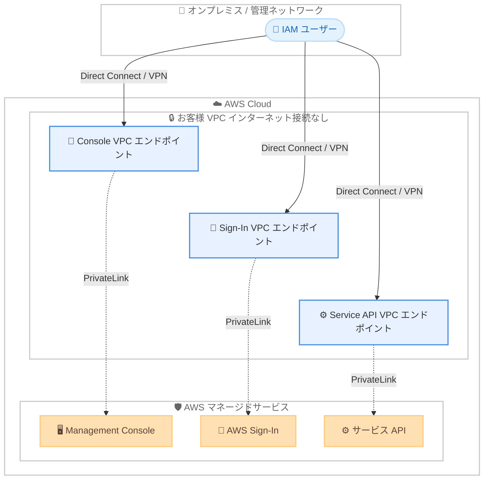

# AWS Management Console - Private Access (インターネット接続不要)

**リリース日**: 2026 年 6 月 15 日
**サービス**: AWS Management Console
**機能**: AWS Management Console Private Access (インターネット接続なしでの利用)

📊 [このアップデートのインフォグラフィックを見る](https://takech9203.github.io/aws-news-summary/20260615-aws-management-console-private.html)
<!-- INFOGRAPHIC_BASE_URL は環境変数から取得 -->

## 概要

AWS は、AWS Management Console Private Access が、インターネット接続を持たない VPC からでも AWS Management Console にアクセスできるようになったことを発表しました。これにより、企業は厳格なネットワーク制御を維持したまま、エアギャップ環境からでもコンソールを通じて AWS インフラストラクチャを管理できます。

AWS Management Console Private Access は、AWS PrivateLink を使用してお客様の VPC とコンソールの間に安全なネットワーク経路を確立します。これまでも Private Access は、コンソールへのアクセスを許可されたアカウントや企業ネットワークに制限できましたが、依然としてインターネット接続が必要でした。今回のアップデートにより、サポート対象サービスのコンソールへのトラフィックを VPC エンドポイント経由で流せるようになり、インターネットアクセスへの依存が完全になくなりました。

この機能は、金融サービス、政府や防衛、ヘルスケアといった規制業界や、機密データを管理された環境に留める必要がある組織、機密ネットワークや非接続ネットワークで運用する組織にとって特に有用です。

**アップデート前の課題**

- 以前の Private Access では、アクセスを許可されたアカウントや企業ネットワークに制限できたものの、依然としてインターネット接続が必要だった
- エアギャップ環境や機密ネットワークでは、コンソールを利用できなかった
- 規制業界では、コンソール利用のためにネットワーク分離の要件を緩める必要があった

**アップデート後の改善**

- インターネット接続を持たない VPC からでも AWS Management Console を利用できるようになった
- ブラウザトラフィックの 100% を VPC エンドポイント経由で制御できるようになった
- ネットワーク分離の要件を維持したまま、コンソールから AWS インフラストラクチャを管理できるようになった

## アーキテクチャ図

IAM ユーザーは Direct Connect や Site-to-Site VPN 経由で VPC エンドポイントに到達し、すべてのコンソールトラフィックが AWS PrivateLink を通じてプライベートに処理されます。インターネットゲートウェイは不要です。

## サービスアップデートの詳細

### 主要機能

1. **インターネット接続なしでのコンソールアクセス**
   - インターネット接続を持たない VPC からコンソールを利用できる
   - サポート対象サービスコンソールへのトラフィックを VPC エンドポイント経由で処理する
   - ブラウザトラフィックの 100% を VPC エンドポイント経由で制御する

2. **AWS PrivateLink によるプライベート接続**
   - お客様の VPC とコンソールの間に安全なネットワーク経路を確立する
   - インターネットゲートウェイや NAT ゲートウェイを介さずにアクセスできる
   - VPC エンドポイントにルーティングできる任意のネットワークからアクセス可能 (Direct Connect や Site-to-Site VPN を含む)

3. **多層的なアクセス制御**
   - VPC エンドポイントポリシーにより、特定のアカウントや組織にアクセスを制限できる
   - IAM ポリシー、サービスコントロールポリシー (SCP)、リソースコントロールポリシー (RCP) を組み合わせて、許可されたネットワークからのみリソースにアクセスできるようにする
   - 個人アカウントや組織外の AWS アカウントでのサインインを防止できる

## 技術仕様

### Private Access が満たすセキュリティ要件

| 項目 | 詳細 |
|------|------|
| 信頼できる ID (Trusted identities) | 明示的に許可された ID のみがネットワーク内からコンソールにアクセスできる |
| 信頼できるリソース (Trusted resources) | 許可された IAM ID は、想定されたアカウントや組織のリソースのみにアクセスできる |
| 想定されたネットワーク (Expected networks) | 許可された IAM ID は、想定されたネットワーク内からのみコンソールと AWS リソースを利用できる |
| ネットワーク分離 (Network isolation) | コンソールはパブリックインターネットへのアクセスなしで VPC 内で動作できる |

### 必要な VPC エンドポイント

AWS Management Console Private Access は、以下に対する VPC エンドポイントを作成して実装します。

- AWS Management Console
- AWS Management Console 専用 API
- AWS Sign-In
- 各サービス API

適切な DNS 解決を構成すると、VPC からのコンソールトラフィックがこれらのプライベートエンドポイント経由で流れます。

## 設定方法

### 前提条件

1. AWS Management Console Private Access を構成する VPC が存在すること
2. オンプレミスや管理ネットワークから VPC エンドポイントへのルーティング経路 (Direct Connect や Site-to-Site VPN) があること
3. VPC エンドポイントに対する DNS 解決を構成できること

### 手順

#### ステップ 1: VPC エンドポイントの作成

AWS Management Console、Console 専用 API、AWS Sign-In、および利用するサービス API に対する VPC エンドポイントを作成します。これにより、コンソールトラフィックを AWS PrivateLink 経由でプライベートに処理できます。

#### ステップ 2: DNS の構成

作成した VPC エンドポイントに対して適切な DNS 解決を構成します。これにより、VPC からのコンソールトラフィックがパブリックインターネットを経由せず、プライベートエンドポイント経由で流れるようになります。

#### ステップ 3: アクセス制御の適用

VPC エンドポイントポリシーで許可するアカウントや組織を指定し、IAM ポリシー、SCP、RCP を組み合わせてアクセス制御を適用します。許可された ID が想定されたネットワークから想定されたリソースのみにアクセスできるよう構成します。

## メリット

### ビジネス面

- **規制要件への対応**: 金融サービス、政府や防衛、ヘルスケアなど、厳格なネットワーク分離が求められる業界の要件を満たしながらコンソールを利用できる
- **データの管理された環境への保持**: 機密データを管理された環境に留めたまま、AWS インフラストラクチャを管理できる
- **運用性の向上**: エアギャップ環境や非接続ネットワークでも、コマンドラインだけでなくコンソールを利用できる

### 技術面

- **完全なネットワーク分離**: ブラウザトラフィックの 100% を VPC エンドポイント経由で制御し、インターネットアクセスへの依存をなくせる
- **多層防御**: VPC エンドポイントポリシーと IAM、SCP、RCP を組み合わせて、信頼できる ID、リソース、ネットワークを強制できる
- **既存の接続の活用**: Direct Connect や Site-to-Site VPN など、VPC エンドポイントにルーティングできる既存のネットワーク経路を利用できる

## デメリット・制約事項

### 制限事項

- サポート対象のサービスコンソールおよび機能は、ドキュメントに記載された範囲に限られる
- 利用するサービスごとに、対応するサービス API の VPC エンドポイントを作成する必要がある
- VPC エンドポイントと DNS の構成が必要であり、初期セットアップに設計と検証を要する

### 考慮すべき点

- VPC エンドポイントの利用とデータ処理に対して料金が発生する
- サポート対象のサービスコンソール、機能、リージョンを事前にドキュメントで確認する必要がある

## ユースケース

### ユースケース 1: 規制業界でのコンソール運用

**シナリオ**: 金融機関が、インターネット接続を持たない VPC 内で AWS リソースを運用しており、監査要件からコンソール利用時もネットワーク分離を維持する必要がある。

**効果**: PrivateLink 経由でコンソールにアクセスすることで、ネットワーク分離を維持したまま運用担当者がコンソールから管理作業を行える。

### ユースケース 2: エアギャップ環境での管理

**シナリオ**: 政府や防衛分野の組織が、機密ネットワークや非接続ネットワーク内で AWS を運用しており、パブリックインターネットへの経路を排除している。

**効果**: VPC エンドポイントと Direct Connect 経由でコンソールを利用でき、インターネットゲートウェイなしで GUI による管理が可能になる。

### ユースケース 3: 信頼できるアカウントとネットワークの強制

**シナリオ**: 企業が、従業員が組織内の許可されたアカウントにのみ、許可されたネットワークからアクセスすることを強制したい。

**効果**: VPC エンドポイントポリシーと IAM、SCP、RCP を組み合わせることで、組織外アカウントでのサインインや不正なネットワークからのアクセスを防止できる。

## 料金

AWS Management Console Private Access 自体に追加料金はありません。利用に関連する AWS PrivateLink VPC エンドポイントの利用料金とデータ処理料金のみが発生します。詳細は Amazon VPC の料金ページを参照してください。

## 利用可能リージョン

すべての AWS 商用リージョンで利用できます。サポート対象のサービスコンソールおよび機能の詳細は、Management Console Private Access のドキュメントを参照してください。

## 関連サービス・機能

- **AWS PrivateLink**: VPC とコンソールの間にプライベートな接続を確立する基盤となるサービス
- **Amazon VPC エンドポイント**: コンソール、Sign-In、サービス API へのトラフィックをプライベートに処理する
- **AWS IAM / SCP / RCP**: アクセス制御を多層的に適用し、信頼できる ID、リソース、ネットワークを強制する
- **AWS Direct Connect / Site-to-Site VPN**: オンプレミスや管理ネットワークから VPC エンドポイントへの接続経路を提供する

## 参考リンク

- 📊 [インフォグラフィック](https://takech9203.github.io/aws-news-summary/20260615-aws-management-console-private.html)
- [公式発表 (What's New)](https://aws.amazon.com/about-aws/whats-new/2026/06/aws-management-console-private/)
- [ドキュメント (AWS Management Console Private Access)](https://docs.aws.amazon.com/awsconsolehelpdocs/latest/gsg/console-private-access.html)
- [料金ページ (Amazon VPC pricing)](https://aws.amazon.com/vpc/pricing/)

## まとめ

このアップデートにより、AWS Management Console Private Access はインターネット接続を完全に排除した環境でも利用可能になり、規制業界やエアギャップ環境での GUI による運用管理が現実的になりました。厳格なネットワーク分離を求める組織は、必要な VPC エンドポイントとアクセス制御の構成を確認し、サポート対象のサービスコンソールやリージョンをドキュメントで検証した上で導入を検討することを推奨します。
