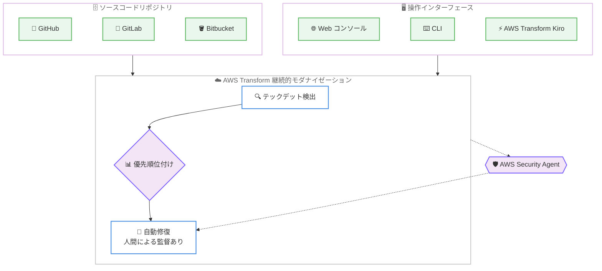

# AWS Transform - 継続的モダナイゼーション機能

**リリース日**: 2026 年 6 月 15 日
**サービス**: AWS Transform
**機能**: 継続的モダナイゼーション (Continuous Modernization) 機能

📊 [このアップデートのインフォグラフィックを見る](https://takech9203.github.io/aws-news-summary/20260615-aws-transform-continuous-modernization.html)
<!-- INFOGRAPHIC_BASE_URL は環境変数から取得 -->

## 概要

AWS は 2026 年 6 月 15 日、AWS Transform に継続的モダナイゼーション (Continuous Modernization) 機能を追加したことを発表しました。本機能は現在プレビューとして提供されており、エンタープライズのソフトウェアポートフォリオ全体にわたって技術的負債 (テックデット) を自律的に検出、優先順位付け、修復します。これにより、お客様は手作業によるメンテナンスから脱却し、コードベースを継続的に最新の状態に保つことが可能になります。

AWS Transform はこれまで、データセンターからの脱却、メインフレームや Windows アプリケーションのモダナイゼーション、バージョンアップグレード、ランタイムや API の移行、言語変換、Lambda のアップグレードといったコードベースの更新シナリオをサポートしてきました。今回の継続的モダナイゼーション機能は、これらの個別のモダナイゼーション作業を一過性のプロジェクトから、継続的かつ自律的な運用プロセスへと進化させるものです。

本機能は、数千に及ぶリポジトリを対象としたコードベースの状態を可視化し、人間による監督のもとでスケジュールに沿った自動修復を実行します。さらに、AI エージェントがコードベースを扱えるよう準備するためのアセスメントや、AWS Security Agent との連携によるソースコードレベルでのセキュリティ脆弱性の検出と修復にも対応しています。大規模なソフトウェア資産を抱えるエンタープライズの開発組織やプラットフォームチームが主な対象です。

**アップデート前の課題**

- 技術的負債の検出や修復は手作業に依存しており、大規模なリポジトリ群を継続的に最新状態へ保つことが困難でした。
- モダナイゼーション作業が一過性のプロジェクトとして実施されるため、時間の経過とともに再びテックデットが蓄積する傾向がありました。
- 数千規模のリポジトリにわたってコードベースの状態を横断的に把握する手段が限られていました。

**アップデート後の改善**

- 技術的負債を自律的に検出、優先順位付け、修復することで、コードベースを継続的に最新の状態へ保てるようになりました。
- 人間による監督のもとで、スケジュールに沿った自動修復を実行できるようになりました。
- AWS Security Agent との連携により、ソースコードレベルでセキュリティ脆弱性を検出し修復できるようになりました。

## アーキテクチャ図

ソースコードリポジトリを接続し、Web コンソールや CLI、AWS Transform Kiro などのインターフェースから、テックデットの検出、優先順位付け、自動修復を継続的に実行する流れを示しています。

## サービスアップデートの詳細

### 主要機能

1. **コードベース状態の可視化**
   - 数千に及ぶリポジトリにわたってコードベースの状態を横断的に把握できます。
   - エンタープライズのソフトウェアポートフォリオ全体のテックデット状況を一元的に確認できます。

2. **優先順位付けとスケジュールに沿った自動修復**
   - 検出した問題を優先順位付けし、スケジュールに基づいて自動的に修復します。
   - 修復は人間による監督 (human oversight) のもとで実行されます。

3. **AI エージェント向けの準備アセスメント**
   - コードベースを AI エージェントが扱えるよう準備するためのアセスメントと修復を提供します。
   - エージェント対応準備状況 (agentic readiness) とモダナイゼーション準備状況 (modernization readiness) を分析します。

4. **AWS Security Agent との連携**
   - AWS Security Agent と連携し、ソースコードレベルでセキュリティ脆弱性を検出し修復します。

## 技術仕様

### 対応するソースとインターフェース

| 項目 | 詳細 |
|------|------|
| 接続可能なソース | GitHub、GitLab、Bitbucket などのソースコードリポジトリ |
| 操作インターフェース | Web コンソール、CLI、AWS Transform Kiro power、他のコーディングエージェント内の AWS Transform スキル |
| 状態の共有 | ジョブの状態とコンテキストが各インターフェース間で共有される |
| 進捗の追跡 | IDE で分析を実行し、AWS Transform Web コンソールで進捗を追跡 |

### API 変更履歴

今回のアップデートに関連する awsapichanges.com 上の API 変更は確認されませんでした。

## 設定方法

### 前提条件

1. AWS Transform を利用可能な AWS アカウントを保有していること
2. GitHub、GitLab、Bitbucket などのソースコードリポジトリへのアクセス権を保有していること
3. 対応リージョン (米国東部 (バージニア北部) またはヨーロッパ (フランクフルト)) で利用すること

### 手順

#### ステップ 1: 開始インターフェースの選択

Web コンソール、CLI、AWS Transform Kiro power、または他のコーディングエージェント内の AWS Transform スキルのいずれかから継続的モダナイゼーションを開始します。利用環境やワークフローに合わせて開始方法を選択できます。

#### ステップ 2: ソースコードの接続

GitHub、GitLab、Bitbucket などのソースからソースコードを接続します。接続後、対象となるリポジトリ群のコードベースが分析対象となります。

#### ステップ 3: 分析の実行と進捗の追跡

IDE で分析を実行し、AWS Transform Web コンソールで進捗を追跡します。ジョブの状態とコンテキストは各インターフェース間で共有されるため、開始した環境と異なる場所からでも作業状況を確認できます。

## メリット

### ビジネス面

- **テックデットの継続的な抑制**: 自律的な検出と修復により、技術的負債の蓄積を継続的に抑制し、コードベースを最新の状態に保てます。
- **大規模ポートフォリオへの対応**: 数千に及ぶリポジトリを対象にスケールするため、エンタープライズ規模のソフトウェア資産を効率的に管理できます。
- **運用負荷の軽減**: 手作業によるメンテナンスから脱却し、スケジュールに沿った自動修復に移行できます。

### 技術面

- **AI エージェント対応への準備**: コードベースのエージェント対応準備状況とモダナイゼーション準備状況を分析し、AI エージェントが扱える状態へ準備できます。
- **セキュリティの強化**: AWS Security Agent との連携により、ソースコードレベルでセキュリティ脆弱性を検出し修復できます。
- **一貫したワークフロー**: 複数のインターフェース間でジョブの状態とコンテキストが共有され、シームレスに作業を継続できます。

## デメリット・制約事項

### 制限事項

- 本機能はプレビューとして提供されています。
- 利用可能リージョンは米国東部 (バージニア北部) とヨーロッパ (フランクフルト) に限定されています。
- 自動修復には人間による監督が前提となります。

### 考慮すべき点

- 自律的な修復を本番コードベースへ適用する前に、レビューや検証のプロセスを整備することが推奨されます。
- 数千規模のリポジトリを対象とする場合、接続するソースやアクセス権限の管理を計画的に行う必要があります。

## ユースケース

### ユースケース 1: 大規模リポジトリ群のテックデット継続管理

**シナリオ**: 数千のリポジトリを抱えるエンタープライズが、各リポジトリに蓄積した技術的負債を継続的に管理したい場合。

**効果**: テックデットを自律的に検出、優先順位付け、修復し、ポートフォリオ全体のコードベースを継続的に最新の状態へ保てます。

### ユースケース 2: AI エージェント導入に向けたコードベースの準備

**シナリオ**: AI コーディングエージェントの活用を進めるにあたり、既存のコードベースをエージェントが扱える状態に準備したい場合。

**効果**: エージェント対応準備状況とモダナイゼーション準備状況の分析と修復により、AI エージェントが扱えるコードベースへと整備できます。

### ユースケース 3: ソースコードレベルでのセキュリティ脆弱性対応

**シナリオ**: ソフトウェアポートフォリオ全体でセキュリティ脆弱性を継続的に検出し、ソースコードレベルで修復したい場合。

**効果**: AWS Security Agent との連携により、ソースコードレベルで脆弱性を検出し修復できます。

## 料金

料金の詳細については、AWS Transform の料金ページを参照してください。本発表のページには具体的な料金は記載されていません。

## 利用可能リージョン

本機能はプレビューとして、米国東部 (バージニア北部) とヨーロッパ (フランクフルト) のリージョンで利用可能です。

## 関連サービス・機能

- **AWS Transform**: 本機能の提供基盤となるサービスで、データセンターからの脱却、メインフレームや Windows アプリのモダナイゼーション、コードベースの更新をサポートします。
- **AWS Security Agent**: ソースコードレベルでのセキュリティ脆弱性の検出と修復のために連携します。
- **AWS Transform Kiro**: 継続的モダナイゼーションを開始できるインターフェースの 1 つです。

## 参考リンク

- 📊 [インフォグラフィック](https://takech9203.github.io/aws-news-summary/20260615-aws-transform-continuous-modernization.html)
- [公式発表 (What's New)](https://aws.amazon.com/about-aws/whats-new/2026/06/aws-transform-continuous-modernization/)
- [AWS Transform 料金ページ](https://aws.amazon.com/transform/pricing/)

## まとめ

AWS Transform の継続的モダナイゼーション機能は、技術的負債への対応を一過性のプロジェクトから、自律的かつ継続的な運用プロセスへと進化させる重要なアップデートです。大規模なソフトウェアポートフォリオを抱える組織は、まずプレビュー提供リージョンで対象リポジトリを接続し、テックデットの可視化と優先順位付けから着手することをおすすめします。
