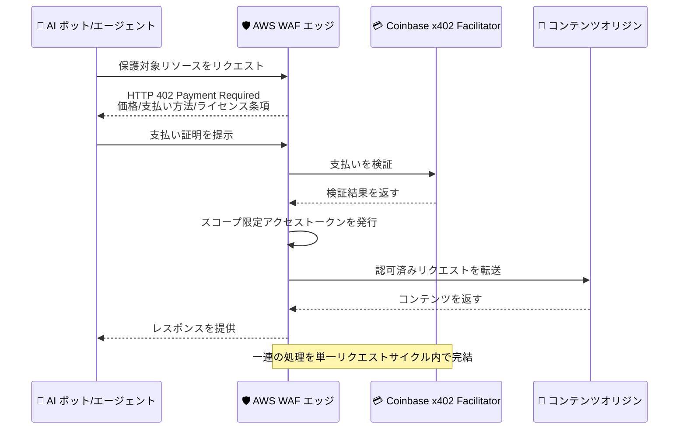

# AWS WAF - AI トラフィックマネタイゼーション

**リリース日**: 2026 年 6 月 15 日
**サービス**: AWS WAF
**機能**: AI traffic monetization (AI トラフィックマネタイゼーション)

📊 [このアップデートのインフォグラフィックを見る](https://takech9203.github.io/aws-news-summary/20260615-aws-waf-ai-traffic-monetization.html)
<!-- INFOGRAPHIC_BASE_URL は環境変数から取得 -->

## 概要

AWS WAF は、AI ボットやエージェントによるコンテンツや API へのアクセスに対して、価格設定、計測、支払いの収集を可能にする新しい Bot Control 機能「AI traffic monetization (AI トラフィックマネタイゼーション)」を発表しました。AI エージェントが消費するコンテンツや API について自律的な支払いをサポートするケースが増えるなか、コンテンツ所有者やパブリッシャーは、そのアクセスに対する価格を設定し、サードパーティプロバイダーを通じて支払いを受け取り、スコープを限定したアクセスをエッジで直接付与できるようになります。

AI ボットやエージェントが、記事、データフィード、ライセンス管理されたアーカイブなどの保護対象リソースをリクエストすると、AWS WAF はマシン間 (machine-to-machine) 支払い向けのオープンプロトコルである x402 を使用し、機械可読な HTTP 402 Payment Required レスポンスを返します。このレスポンスには、コンテンツへのアクセス価格、受け入れ可能な支払い方法、ライセンス条項が含まれます。エージェントが支払い証明を提示すると、AWS WAF はエッジでそれを検証し、スコープを限定したアクセストークンを発行して、単一のリクエストサイクル内でレスポンスを提供します。

この機能は、コンテンツ所有者やパブリッシャーが、AI トラフィックを単に許可またはブロックするだけでなく、新たな収益源へと転換できる点に主要な価値があります。対象ユーザーは、AI クローラーやエージェントによるアクセスが増加しているメディア企業、データ提供者、API プロバイダーなどです。

**アップデート前の課題**

- 以前は AI ボットやエージェントによるアクセスに対して、許可するかブロックするかの二者択一しか選べず、コンテンツの価値に応じた課金ができなかった
- 以前はコンテンツへのアクセスに対して支払いを受け取るには、独自の認証・課金・決済の仕組みをアプリケーション側で構築する必要があった
- 以前は支払い検証やアクセス制御をオリジンまで到達させてから行う必要があり、エッジでの即時処理ができなかった

**アップデート後の改善**

- 今回のアップデートにより、保護対象リソースに対して価格を設定し、AI ボットやエージェントから支払いを収集できるようになった
- 今回のアップデートにより、x402 プロトコルに基づく HTTP 402 レスポンスをエッジで返し、支払い証明の検証とアクセストークンの発行を単一のリクエストサイクル内で完結できるようになった
- 今回のアップデートにより、エージェントの ID や意図に基づく差別化された価格設定と、AWS WAF コンソール上での収益分析が可能になった

## アーキテクチャ図



上図は、AI エージェントが保護対象リソースをリクエストしてから、エッジでの支払い検証を経てコンテンツを受け取るまでの一連の処理フローを示しています。

## サービスアップデートの詳細

### 主要機能

1. **x402 プロトコルによる支払いフロー**
   - 保護対象リソースへのリクエストに対し、機械可読な HTTP 402 Payment Required レスポンスを返す
   - レスポンスには価格、受け入れ可能な支払い方法、ライセンス条項が含まれる
   - エージェントが支払い証明を提示すると、エッジで検証し、スコープ限定のアクセストークンを発行する

2. **コンソールでの価格設定とポリシー定義**
   - AWS WAF コンソールから価格を設定できる
   - 検証ステータス (Web Bot Auth 署名を含む) に基づいて AI ボットやエージェントのポリシーを定義できる
   - エージェントの ID や意図に基づいて差別化された価格設定を適用できる

3. **決済プロバイダーとの連携と収益分析**
   - 支払いの決済と検証は Coinbase の x402 Facilitator が提供する
   - ステーブルコインで希望するウォレットに支払いを受け取れる
   - 収益分析を AWS WAF コンソールで直接確認できる

## 技術仕様

### 機能概要

| 項目 | 詳細 |
|------|------|
| 機能種別 | AWS WAF Bot Control の新機能 |
| 使用プロトコル | x402 (マシン間支払い向けオープンプロトコル) |
| HTTP レスポンス | 402 Payment Required (機械可読) |
| 検証場所 | エッジ (単一リクエストサイクル内で完結) |
| 決済プロバイダー | Coinbase x402 Facilitator |
| 受け取り通貨 | ステーブルコイン (希望するウォレット) |
| ボット検証方式 | Web Bot Auth 署名を含む検証ステータス |
| 近日対応予定 | Stripe (直接アカウント支払い)、Machine Payments Protocol (MPP) |

### 支払いフローの構成要素

```text
1. AI エージェント: 保護対象リソースをリクエスト
2. AWS WAF: HTTP 402 (価格・支払い方法・ライセンス条項) を返す
3. AI エージェント: 支払い証明を提示
4. AWS WAF: エッジで検証 → スコープ限定アクセストークンを発行
5. AWS WAF: レスポンスを提供 (単一リクエストサイクル内)
```

## 設定方法

### 前提条件

1. AWS WAF の Web ACL が Amazon CloudFront ディストリビューションに関連付けられていること
2. AWS WAF Bot Control が有効化されていること
3. 支払いを受け取るためのウォレット (ステーブルコイン対応) を準備していること

### 手順

#### ステップ1: 価格設定の構成

AWS WAF コンソールで、保護対象とするコンテンツや API に対する価格を設定します。記事、データフィード、ライセンス管理されたアーカイブなど、対象リソースごとにアクセス価格を定義します。

#### ステップ2: ボット/エージェントポリシーの定義

検証ステータス (Web Bot Auth 署名を含む) に基づいて、AI ボットやエージェントのポリシーを定義します。エージェントの ID や意図に応じて差別化された価格設定を適用できます。

#### ステップ3: 決済連携と収益確認

Coinbase の x402 Facilitator を通じて支払いの決済と検証を行い、ステーブルコインで希望するウォレットに支払いを受け取ります。収益分析は AWS WAF コンソールで直接確認できます。

## メリット

### ビジネス面

- **新たな収益源の創出**: AI ボットやエージェントのアクセスを単なるトラフィックではなく収益機会に転換できる
- **柔軟な価格戦略**: エージェントの ID や意図に基づいて差別化された価格を設定できる
- **収益の可視化**: AWS WAF コンソールで収益分析を直接確認でき、戦略の意思決定に活用できる

### 技術面

- **エッジでの即時処理**: 支払い検証からアクセストークン発行までを単一のリクエストサイクル内で完結できる
- **オープンプロトコルの採用**: x402 を使用するため、対応するエージェントとの相互運用性が高い
- **追加開発の削減**: 独自の課金・決済基盤を構築せずに、AWS WAF の機能として課金を実現できる

## デメリット・制約事項

### 制限事項

- Amazon CloudFront ディストリビューションに関連付けられた AWS WAF Web ACL があるエッジロケーションでのみ利用可能
- 現時点での決済連携は Coinbase の x402 Facilitator が提供 (Stripe や MPP は近日対応予定)
- 支払いの受け取りはステーブルコインに対応したウォレットが前提となる

### 考慮すべき点

- AI エージェント側が x402 プロトコルおよび HTTP 402 レスポンスに対応している必要がある
- ステーブルコインによる受け取りに関する会計・税務・規制上の取り扱いを事前に確認する必要がある
- 価格設定やポリシーが正規のクローラー (検索エンジンなど) のアクセスに与える影響を考慮する必要がある

## ユースケース

### ユースケース1: メディアパブリッシャーによる記事課金

**シナリオ**: ニュースメディアが、AI エージェントによる記事へのアクセスに対して課金したい。

**実装例**:
```text
記事 URL を保護対象に設定し、1 リクエストあたりの価格を定義。
学習目的の未検証クローラーには高めの価格、検証済み検索クローラーには別価格を適用。
```

**効果**: コンテンツの価値に応じた収益を AI トラフィックから得られる。

### ユースケース2: データプロバイダーによる API 課金

**シナリオ**: データフィードを提供する企業が、AI エージェントによる API 利用を従量課金したい。

**実装例**:
```text
API エンドポイントを保護対象に設定し、x402 レスポンスでアクセス価格とライセンス条項を提示。
エージェントが支払い証明を提示後、スコープ限定トークンでアクセスを許可。
```

**効果**: 独自の課金基盤を構築せず、エッジで API アクセスをマネタイズできる。

### ユースケース3: ライセンスアーカイブへのスコープ付きアクセス

**シナリオ**: ライセンス管理されたアーカイブを保有する事業者が、エージェントの意図に応じてアクセス条件を変えたい。

**実装例**:
```text
エージェント ID と意図に基づいて差別化された価格を設定。
Web Bot Auth 署名による検証ステータスでポリシーを分岐。
```

**効果**: エージェントの属性に応じた柔軟なアクセス制御と収益化を両立できる。

## 料金

AI traffic monetization は、AWS WAF のお客様に追加料金なしで提供されます。標準の AWS WAF 料金が適用されます。

なお、支払いの決済・検証はサードパーティの決済プロバイダー (Coinbase x402 Facilitator) を通じて行われるため、決済に関する手数料はプロバイダーの条件に従います。

## 利用可能リージョン

AWS WAF の Web ACL が Amazon CloudFront ディストリビューションに関連付けられているすべてのエッジロケーションで利用可能です。

## 関連サービス・機能

- **AWS WAF Bot Control**: 本機能は Bot Control の新機能として提供され、ボットの検出・管理基盤を活用する
- **Amazon CloudFront**: Web ACL を CloudFront ディストリビューションに関連付けることで、エッジでの支払い処理を実現する
- **Web Bot Auth**: ボット/エージェントの検証ステータスに基づくポリシー定義に利用される

## 参考リンク

- 📊 [インフォグラフィック](https://takech9203.github.io/aws-news-summary/20260615-aws-waf-ai-traffic-monetization.html)
- [公式発表 (What's New)](https://aws.amazon.com/about-aws/whats-new/2026/06/aws-waf-ai-traffic-monetization/)
- [ドキュメント](https://docs.aws.amazon.com/waf/latest/developerguide/waf-ai-traffic-monetization.html)
- [AWS WAF 料金ページ](https://aws.amazon.com/waf/pricing/)

## まとめ

AWS WAF の AI traffic monetization は、増加する AI ボットやエージェントのトラフィックを、許可かブロックかの二択から「課金して収益化する」という第三の選択肢へと拡張する重要なアップデートです。x402 プロトコルと HTTP 402 レスポンスにより、支払い検証からアクセストークン発行までをエッジで完結できます。CloudFront と AWS WAF を利用しているコンテンツ所有者やパブリッシャーは、まずはコンソールで価格設定とポリシー定義を試し、収益分析を確認しながら本番導入を検討することを推奨します。
