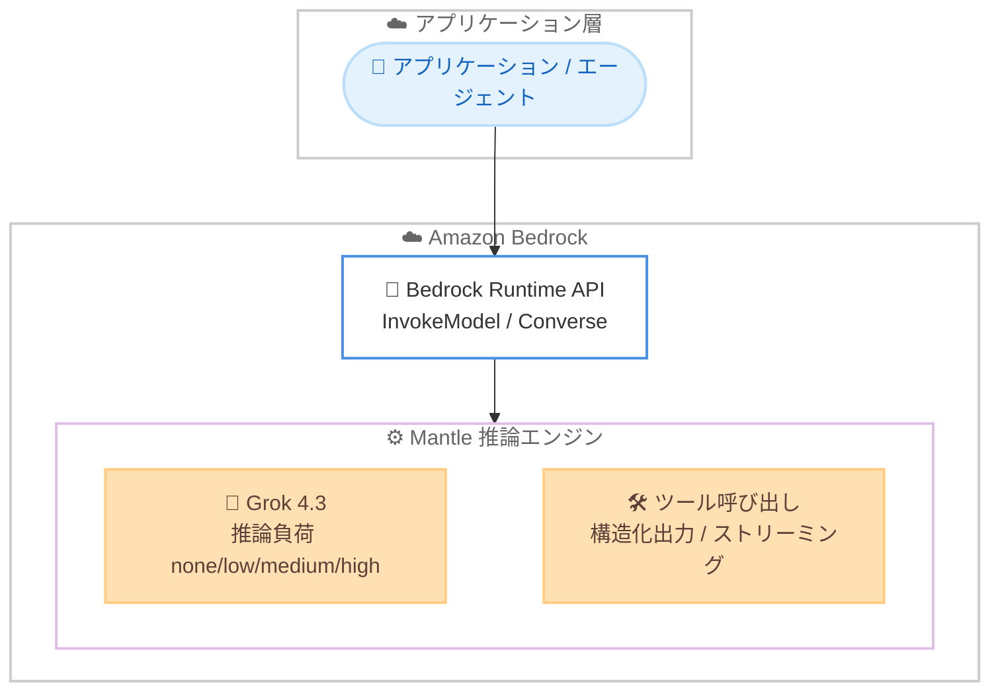

# Amazon Bedrock - xAI 製 Grok 4.3 モデルの提供開始

**リリース日**: 2026 年 6 月 15 日
**サービス**: Amazon Bedrock
**機能**: xAI 製 Grok 4.3 モデルの提供

📊 [このアップデートのインフォグラフィックを見る](https://takech9203.github.io/aws-news-summary/20260615-grok-amazon-bedrock.html)
<!-- INFOGRAPHIC_BASE_URL は環境変数から取得 -->

## 概要

AWS は、xAI が開発する Grok 4.3 モデルを Amazon Bedrock で利用可能にしたことを発表しました。これにより、xAI が Amazon Bedrock 上のモデルプロバイダーとして初めて加わりました。Grok 4.3 を使用することで、エンタープライズ向けの幅広い生成 AI ワークロードを、フルマネージドな Amazon Bedrock の環境で構築できます。

Grok 4.3 は推論を中心に設計されたモデルであり、推論の負荷を none、low、medium、high の 4 段階で設定できます。強力なツール利用と指示追従の能力を備え、信頼性の高いエージェントの構築を支援します。また、トークン効率が高く、大量のリクエストを処理する推論でもコスト効率を維持しやすくなっています。

Grok 4.3 は、Amazon Bedrock 上の新しい推論エンジン Mantle で動作します。Mantle は価格性能を重視して設計されており、ツール呼び出し、構造化出力、レスポンスストリーミングをサポートします。カスタマーサポート、Web 開発、判例調査、財務文書の Q&A、会話型 AI、検索、チャット、マルチターンのワークフローといったエンタープライズユースケースに適しています。

**アップデート前の課題**

このアップデート以前は、Amazon Bedrock 上で xAI 製のモデルを利用することができませんでした。

- 以前は Amazon Bedrock のモデルプロバイダーに xAI が含まれておらず、Grok モデルを Bedrock 上で利用できなかった
- 以前は推論の負荷を段階的に調整できる Grok 系モデルを、Bedrock のフルマネージド環境で利用できなかった
- 以前は xAI 製モデルを利用するために Bedrock 以外の経路を検討する必要があった

**アップデート後の改善**

今回のアップデートにより、xAI 製の Grok 4.3 を Amazon Bedrock のフルマネージド環境で利用できるようになりました。

- 今回のアップデートにより、Amazon Bedrock 上で Grok 4.3 を利用できるようになった
- 今回のアップデートにより、推論の負荷を 4 段階で調整しながら、コストと品質のバランスを取れるようになった
- 今回のアップデートにより、ツール呼び出し、構造化出力、レスポンスストリーミングを活用したエージェントワークフローを Bedrock 上で構築できるようになった

## アーキテクチャ図



アプリケーションやエージェントは、Amazon Bedrock の Runtime API を通じて、Mantle 推論エンジン上で動作する Grok 4.3 を呼び出します。

## サービスアップデートの詳細

### 主要機能

1. **推論中心の設計と調整可能な推論負荷**
   - 推論を中心に設計されたモデル
   - 推論の負荷を none、low、medium、high の 4 段階で設定可能
   - ワークロードに応じてコストと回答品質のバランスを調整できる

2. **強力なツール利用と指示追従**
   - 強力なツール利用 (tool use) の能力を備える
   - 指示追従 (instruction-following) に優れる
   - 信頼性の高いエージェントの構築を支援

3. **トークン効率**
   - トークン効率が高く設計されている
   - 大量のリクエストを処理する推論でもコスト効率を維持しやすい

4. **Mantle 推論エンジン上での動作**
   - Amazon Bedrock の新しい推論エンジン Mantle で動作
   - Mantle は価格性能を重視して設計されている
   - ツール呼び出し、構造化出力、レスポンスストリーミングをサポート

## 技術仕様

### モデルの概要

| 項目 | 詳細 |
|------|------|
| モデルプロバイダー | xAI |
| モデル | Grok 4.3 |
| 推論エンジン | Mantle (Amazon Bedrock の新しい推論エンジン) |
| 推論負荷の設定 | none / low / medium / high の 4 段階 |
| サポート機能 | ツール呼び出し、構造化出力、レスポンスストリーミング |

<!-- What's New ページでは、コンテキストウィンドウのサイズ、入力モダリティ、具体的な料金、提供リージョンの一覧は明記されていません。これらは Grok 4.3 のモデル詳細ページおよびリージョン対応ドキュメントで確認してください -->

### API 呼び出し例

```python
import boto3

# Amazon Bedrock Runtime クライアントを作成する
client = boto3.client("bedrock-runtime", region_name="us-east-1")

# Converse API を使用して Grok 4.3 を呼び出す
response = client.converse(
    modelId="xai.grok-4-3",  # 実際のモデル ID はモデル詳細ページで確認する
    messages=[
        {
            "role": "user",
            "content": [{"text": "Amazon Bedrock の特徴を 3 点で説明してください。"}],
        }
    ],
    inferenceConfig={"maxTokens": 1024, "temperature": 0.7},
)

print(response["output"]["message"]["content"][0]["text"])
```

上記は Amazon Bedrock の Converse API を使用して Grok 4.3 にプロンプトを送信し、レスポンスを取得する例です。モデル ID は AWS のモデル詳細ページで正確な値を確認してください。

## 設定方法

### 前提条件

1. Grok 4.3 が利用可能なリージョンで Amazon Bedrock を有効化していること
2. Grok 4.3 へのアクセスを Amazon Bedrock コンソールのモデルアクセスからリクエストして有効化していること
3. Bedrock の InvokeModel / Converse を呼び出すための IAM 権限を持つこと

### 手順

#### ステップ1: 提供リージョンの確認

Grok 4.3 の提供リージョンを、リージョン対応ドキュメントで確認します。利用するリージョンで Amazon Bedrock が有効化されていることを確認します。

#### ステップ2: モデルアクセスの有効化

Amazon Bedrock コンソールの「モデルアクセス」画面で Grok 4.3 へのアクセスを有効化します。これにより、API からモデルを呼び出せるようになります。

#### ステップ3: 推論負荷の選定とアプリケーションへの組み込み

```text
高速・低コスト重視      -> 推論負荷 none / low
品質と推論深度のバランス  -> 推論負荷 medium
複雑な推論タスク重視     -> 推論負荷 high
```

ワークロードの特性に応じて推論負荷を選定します。InvokeModel または Converse API を通じてアプリケーションにモデルを組み込み、エージェントワークフローではツール呼び出しと構造化出力を活用します。

## メリット

### ビジネス面

- **モデル選択肢の拡大**: Amazon Bedrock 上で xAI 製の Grok 4.3 を利用でき、ユースケースに応じたモデル選択の幅が広がる
- **コスト最適化**: 推論負荷を調整し、トークン効率の高いモデルを利用することで、大量リクエストを処理する推論のコストを抑えられる
- **幅広いエンタープライズ用途**: カスタマーサポート、Web 開発、判例調査、財務文書の Q&A など、幅広い業務での活用が見込める

### 技術面

- **調整可能な推論負荷**: none/low/medium/high の 4 段階で推論の深さを制御し、レイテンシーと品質のトレードオフを管理できる
- **エージェント構築**: 強力なツール利用と指示追従、構造化出力により、信頼性の高いエージェントワークフローを構築しやすい
- **フルマネージド運用**: Amazon Bedrock のフルマネージド環境で、インフラ管理なしに Grok 4.3 を利用できる

## デメリット・制約事項

### 制限事項

- 提供リージョンは What's New ページに明記されていないため、リージョン対応ドキュメントで確認する必要がある
- コンテキストウィンドウのサイズや入力モダリティは公式発表で明記されておらず、モデル詳細ページで確認する必要がある
- 具体的な料金は公式発表に記載されていないため、料金ページで確認する必要がある

### 考慮すべき点

- モデル ID や正確な仕様、料金は AWS のモデル詳細ページおよび料金ページで確認すること
- 推論負荷を高く設定すると回答品質が向上する一方、レイテンシーやコストが増える可能性があるため、ワークロードに応じて選定すること

## ユースケース

### ユースケース1: カスタマーサポートの自動応答

**シナリオ**: 大量の問い合わせを処理するカスタマーサポートを、コストを抑えつつ自動化したい。

**実装例**:
```text
Grok 4.3 を推論負荷 low / medium で利用し、ツール呼び出しで社内システムと連携した応答を生成する
```

**効果**: トークン効率の高い推論により、大量の問い合わせをコスト効率よく処理できる。

### ユースケース2: 財務文書の Q&A

**シナリオ**: 財務報告書や契約書に対する質問応答を行う社内アプリケーションを構築したい。

**実装例**:
```text
Grok 4.3 を推論負荷 high で利用し、複雑な文書理解を要する質問に対して構造化出力で回答する
```

**効果**: 推論負荷を高めることで、複雑な財務文書に対する精度の高い回答を得られる。

### ユースケース3: 信頼性の高いエージェントワークフロー

**シナリオ**: 複数のツールを呼び出しながらタスクを遂行するエージェントを構築したい。

**実装例**:
```text
Grok 4.3 のツール呼び出しと構造化出力、レスポンスストリーミングを組み合わせてエージェントを実装する
```

**効果**: 強力なツール利用と指示追従により、信頼性の高いエージェントワークフローを実現できる。

## 料金

Grok 4.3 が動作する Mantle 推論エンジンは価格性能を重視して設計されています。具体的な料金は、利用するリージョンおよび入力・出力トークン数に基づきます。正確な料金は Amazon Bedrock の料金ページで確認してください。

## 利用可能リージョン

提供リージョンは What's New ページに一覧として明記されていません。利用可能なリージョンは、Amazon Bedrock のリージョン対応ドキュメントで確認してください。

## 関連サービス・機能

- **Amazon Bedrock**: Grok 4.3 を含む各種基盤モデルをフルマネージドで提供する基盤
- **Amazon Bedrock Agents**: ツール呼び出しと構造化出力を活用したエージェントワークフローの構築に関連
- **Amazon Bedrock の他のモデルプロバイダー**: Anthropic、Google DeepMind、OpenAI など、Bedrock 上で選択できる他のプロバイダー

## 参考リンク

- 📊 [インフォグラフィック](https://takech9203.github.io/aws-news-summary/20260615-grok-amazon-bedrock.html)
- [公式発表 (What's New)](https://aws.amazon.com/about-aws/whats-new/2026/06/grok-amazon-bedrock/)
- [Amazon Bedrock 対応モデル一覧](https://docs.aws.amazon.com/bedrock/latest/userguide/models-supported.html)
- [Amazon Bedrock 料金ページ](https://aws.amazon.com/bedrock/pricing/)

## まとめ

今回のアップデートにより、xAI 製の Grok 4.3 が Amazon Bedrock で利用可能になり、xAI がモデルプロバイダーとして初めて加わりました。推論負荷を 4 段階で調整できる推論中心のモデルであり、Mantle 推論エンジン上でツール呼び出し、構造化出力、レスポンスストリーミングをサポートします。エージェントやエンタープライズ向けの生成 AI アプリケーションを Bedrock 上で構築している場合は、対象リージョンでモデルアクセスを有効化し、自社のユースケースに合わせて Grok 4.3 を検証することを推奨します。
