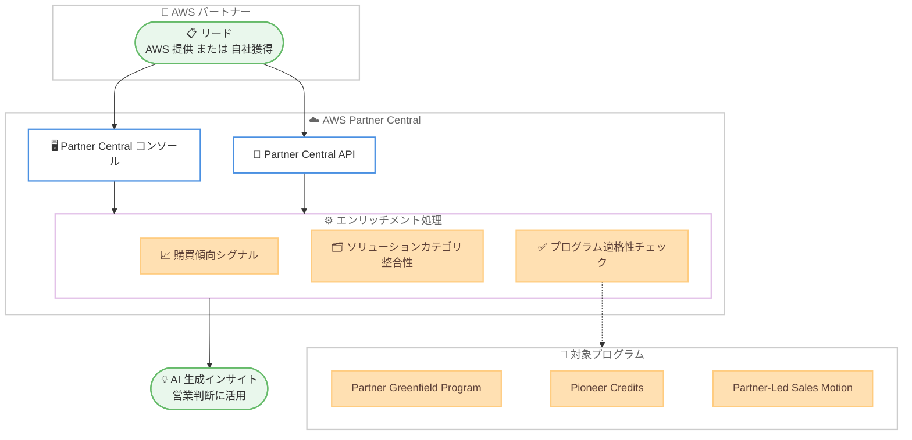

# AWS Partner Central - リードエンリッチメントとプロスペクティング

**リリース日**: 2026 年 6 月 15 日
**サービス**: AWS Partner Central
**機能**: Lead Enrichment and Prospecting (リードエンリッチメントとプロスペクティング)

📊 [このアップデートのインフォグラフィックを見る](https://takech9203.github.io/aws-news-summary/20260615-lead-enrichment-and-prospecting.html)
<!-- INFOGRAPHIC_BASE_URL は環境変数から取得 -->

## 概要

AWS は、AWS Partner Central にリードエンリッチメント (lead enrichment) とプロスペクティング (prospecting) の機能を追加しました。この機能により、AWS パートナーは AWS から提供されたリード、またはパートナー自身が獲得したリードに対して、AWS が生成するインサイトと適格性レコメンデーションを付加できるようになります。

提出された各リードについて、パートナーは購買傾向 (propensity-to-buy) のシグナル、ソリューションカテゴリの整合性に関するインサイト、そして 3 つのプログラムに対するアカウント適格性チェックを受け取ることができます。これにより、データに基づいて見込み顧客の優先順位付けと評価を行い、より精度の高い営業判断を下せるようになります。

この機能は、すべての APN Customer Engagements (ACE) 対象 AWS パートナーが利用できます。リードの提出は AWS Partner Central コンソール、または AWS Partner Central API を通じてプログラムから行えます。

**アップデート前の課題**

これまでパートナーは、リードの質や成約可能性を判断する際に、データに基づく客観的な指標を AWS から直接得る手段が限られていました。

- 以前は、リードの購買傾向や AWS Marketplace 経由での購入可能性を、AWS が生成するシグナルとして取得できなかった
- 以前は、対象顧客がどの AWS パートナープログラムや資金提供プログラムの対象となるかを、リード単位で自動的に確認する手段がなかった
- 以前は、リードのソリューションカテゴリへの整合性をシステム的に評価できず、見込み顧客の優先順位付けが経験や手作業に依存していた

**アップデート後の改善**

今回のアップデートにより、リードに対する AI 生成インサイトを活用した評価が可能になりました。

- 今回のアップデートにより、リードごとに購買傾向のシグナル (AWS Marketplace 経由での購入可能性を含む) を取得できるようになった
- 今回のアップデートにより、Partner Greenfield Program (PGP)、Pioneer Credits、Partner-Led Sales Motion の 3 つのプログラムに対するアカウント適格性を確認できるようになった
- 今回のアップデートにより、コンソールと API の両方からリードを提出し、データドリブンに見込み顧客を優先順位付けできるようになった

## アーキテクチャ図



パートナーがコンソールまたは API を通じて提出したリードが、Partner Central のエンリッチメント処理を経て、購買傾向シグナル、カテゴリ整合性、プログラム適格性という AI 生成インサイトとして返される流れを示しています。

## サービスアップデートの詳細

### 主要機能

1. **購買傾向シグナル (Propensity-to-buy signals)**
   - 提出された各リードについて、顧客が購入に至る可能性を示すシグナルを提供
   - AWS Marketplace 経由で購入する可能性を含む
   - データに基づいて見込み顧客の確度を評価できる

2. **ソリューションカテゴリ整合性 (Solution category alignment)**
   - リードがどのソリューションカテゴリに整合するかに関するインサイトを提供
   - パートナーが提供するソリューションと見込み顧客のニーズの適合度を把握できる

3. **アカウント適格性チェック (Account eligibility checks)**
   - 以下の 3 つのプログラムに対する対象アカウントの適格性を確認
   - Partner Greenfield Program (PGP)
   - Pioneer Credits
   - Partner-Led Sales Motion

4. **コンソールと API による提出**
   - AWS Partner Central コンソールからの手動提出に対応
   - AWS Partner Central API によるプログラムからの提出に対応し、既存の営業ワークフローへの統合が可能

## 技術仕様

### 機能概要

| 項目 | 詳細 |
|------|------|
| 対象パートナー | すべての APN Customer Engagements (ACE) 対象 AWS パートナー |
| リード提出方法 | Partner Central コンソール、Partner Central API |
| 適格性チェック対象 | PGP、Pioneer Credits、Partner-Led Sales Motion |
| API 提供リージョン | 米国東部 (バージニア北部) us-east-1 |

### API 変更履歴

| 日付 | サービス | 変更内容 |
|------|----------|----------|
| 2026/06/16 | [partnercentral-selling](https://awsapichanges.com/archive/changes/e078c6-partnercentral-selling.html) | 3 new 7 updated api methods - エンゲージメントを AI エンリッチされたリードに変換する Prospecting API を追加。Engagement API に ProspectingResult と Lead のコンテキストを拡張。GetAwsOpportunitySummary に CoSell スコアリング (品質スコア、トレンド、エージェント主導のレコメンデーション、エンゲージメント分類) を追加 |

### リードの操作 (API リファレンス)

```text
# Partner Central Selling API のリード関連操作
# 詳細は API リファレンスの "Working with your leads" を参照
docs.aws.amazon.com/partner-central/latest/APIReference/working-with-your-leads.html
```

API では、エンゲージメントをリードに変換し、スコアリングインサイトを取得する Prospecting API が利用できます。

## 設定方法

### 前提条件

1. APN Customer Engagements (ACE) 対象の AWS パートナーであること
2. AWS Partner Central へのアクセス権を持つこと
3. API を利用する場合、Partner Central Selling API への適切な IAM 権限を構成していること

### 手順

#### ステップ 1: リードの準備

AWS から提供されたリード、またはパートナー自身が獲得したリードを準備します。コンソールから操作する場合は、AWS Partner Central にサインインします。

#### ステップ 2: リードの提出

```text
# Partner Central コンソールからリードを提出
# または Partner Central Selling API を使用してプログラムから提出
```

コンソールではフォームからリードを提出します。API を利用する場合は、Prospecting API を呼び出してエンゲージメントをリードに変換し、提出します。

#### ステップ 3: インサイトの確認と活用

提出後に返される購買傾向シグナル、ソリューションカテゴリ整合性、プログラム適格性の各インサイトを確認します。これらのインサイトをもとに、見込み顧客の優先順位付けと営業判断を行います。

## メリット

### ビジネス面

- **営業の優先順位付けの高度化**: 購買傾向シグナルにより、成約確度の高い見込み顧客にリソースを集中できる
- **資金プログラム活用の最大化**: PGP、Pioneer Credits、Partner-Led Sales Motion の適格性を事前に把握し、利用可能なプログラムを逃さずに活用できる
- **AWS Marketplace 経由の販売促進**: Marketplace 経由での購入可能性を把握し、Marketplace を活用した取引を後押しできる

### 技術面

- **API による自動化**: Partner Central API を通じてリード提出とインサイト取得を自動化し、既存の CRM や営業ツールに統合できる
- **データドリブンな評価**: 経験や手作業ではなく、AWS が生成するデータに基づいてリードを評価できる
- **コンソールと API の選択肢**: 規模や用途に応じてコンソールとプログラムによる操作を使い分けられる

## デメリット・制約事項

### 制限事項

- API は現時点で米国東部 (バージニア北部) リージョンでのみ提供
- 利用できるのは APN Customer Engagements (ACE) 対象 AWS パートナーに限られる
- 適格性チェックの対象は PGP、Pioneer Credits、Partner-Led Sales Motion の 3 プログラム

### 考慮すべき点

- 提供されるインサイトはあくまで判断を支援するシグナルであり、最終的な営業判断はパートナー側で行う必要がある
- API を活用する場合は、適切な IAM 権限の設計とワークフローへの統合が必要

## ユースケース

### ユースケース 1: 見込み顧客の優先順位付け

**シナリオ**: 多数のリードを抱えるパートナーが、限られた営業リソースをどの顧客に充てるべきか判断したい。

**効果**: 購買傾向シグナルを参照することで、成約確度の高いリードを優先的にフォローし、営業効率を高められます。

### ユースケース 2: 資金プログラムの適格性確認

**シナリオ**: パートナーが、対象顧客に対してどの AWS パートナープログラムや資金提供を活用できるか把握したい。

**効果**: PGP、Pioneer Credits、Partner-Led Sales Motion の適格性チェック結果をもとに、活用可能なプログラムを早期に特定し、提案に組み込めます。

### ユースケース 3: 営業ワークフローへの統合

**シナリオ**: 自社の CRM や営業システムとリード管理を連携させ、リード評価を自動化したい。

**効果**: Partner Central API を利用してリード提出とインサイト取得を自動化し、既存システムにデータドリブンな評価を組み込めます。

## 料金

公式発表では、この機能に関する追加料金の情報は提供されていません。料金の詳細については AWS Partner Central のページおよび最新の料金情報を確認してください。

## 利用可能リージョン

API は米国東部 (バージニア北部) us-east-1 リージョンで提供されます。

## 関連サービス・機能

- **AWS Partner Central**: 本機能が提供される AWS パートナー向けの中核プラットフォーム
- **AWS Marketplace**: 購買傾向シグナルが評価対象とする販売チャネル
- **APN Customer Engagements (ACE)**: 本機能の利用対象を規定するパートナーエンゲージメントプログラム

## 参考リンク

- 📊 [インフォグラフィック](https://takech9203.github.io/aws-news-summary/20260615-lead-enrichment-and-prospecting.html)
- [公式発表 (What's New)](https://aws.amazon.com/about-aws/whats-new/2026/06/lead-enrichment-and-prospecting)
- [AWS Blog: Sell Smarter with AWS](https://aws.amazon.com/blogs/apn/sell-smarter-with-aws/)
- [API リファレンス: Working with your leads](https://docs.aws.amazon.com/partner-central/latest/APIReference/working-with-your-leads.html)
- [AWS Partner Central](https://aws.amazon.com/partners/partner-central/)

## まとめ

このアップデートは、AWS パートナーがリードの質と成約可能性をデータに基づいて評価し、営業判断を高度化できる点で重要です。購買傾向シグナルとプログラム適格性チェックを活用することで、見込み顧客の優先順位付けと資金プログラムの活用を最適化できます。ACE 対象パートナーは、コンソールまたは API を通じてリードを提出し、AI 生成インサイトを営業プロセスに組み込むことを検討してください。
