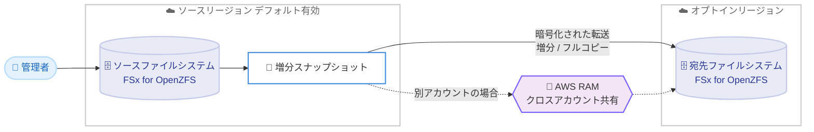

# Amazon FSx for OpenZFS - オプトインリージョンへのオンデマンドデータレプリケーション

**リリース日**: 2026 年 6 月 15 日
**サービス**: Amazon FSx for OpenZFS
**機能**: オプトインリージョンをまたいだオンデマンドデータレプリケーション (On-Demand Data Replication across Opt-In Regions)

📊 [このアップデートのインフォグラフィックを見る](https://takech9203.github.io/aws-news-summary/20260615-on-demand-cross-region-replication.html)
<!-- INFOGRAPHIC_BASE_URL は環境変数から取得 -->

## 概要

AWS は、Amazon FSx for OpenZFS のオンデマンドデータレプリケーションが、デフォルトで無効化されている AWS オプトインリージョンに対応したことを発表しました。これにより、ボリュームの増分ポイントインタイムスナップショットを、オプトインリージョンとの間で双方向に転送できるようになりました。

Amazon FSx for OpenZFS は、人気の高い OpenZFS ファイルシステムを基盤とする、フルマネージドでコスト効率に優れた共有ファイルストレージです。スナップショット、データクローン、圧縮、サブミリ秒のレイテンシー、最大 10 GB/s のスループットといった機能を提供します。オンデマンドデータレプリケーションは、リージョンやアカウントをまたいでスナップショットを転送する機能で、災害対策 (DR)、本番データの別リージョンや別アカウントへの複製、開発 / テスト環境へのデータ配布、リードレプリカの構築などに利用できます。

オプトインリージョンとは、デフォルトで有効化されている標準リージョンとは異なり、アカウントごとに明示的に有効化する必要があるリージョンです。従来、オンデマンドデータレプリケーションはデフォルトで有効化されたリージョン間でのみ動作していました。今回のアップデートにより、オプトインリージョンとの間でもスナップショットを複製できるようになり、クロスリージョンの災害対策やデータ配布を構築できる範囲が広がりました。

**アップデート前の課題**

- オンデマンドデータレプリケーションはデフォルトで有効化されたリージョン間でのみ利用可能で、オプトインリージョンを対象にできませんでした
- オプトインリージョンをデータの保管先や災害対策サイトとして活用する場合、FSx for OpenZFS のネイティブなレプリケーション機能を使えませんでした
- 規制やデータ所在地の要件からオプトインリージョンを利用する組織では、別の手段でデータを転送する必要がありました

**アップデート後の改善**

- オプトインリージョンとの間で双方向に増分スナップショットを複製できるようになりました
- オプトインリージョンを災害対策サイトやデータ配布先として、FSx for OpenZFS のマネージドレプリケーションで活用できるようになりました
- Amazon FSx for OpenZFS が提供されるすべてのリージョン (対応するオプトインリージョンを含む) で、クロスリージョンのデータ保護を構築できるようになりました

## アーキテクチャ図



ソースリージョンのファイルシステムから取得した増分スナップショットを、オプトインリージョンの宛先ファイルシステムへ転送する構成を示しています。別アカウントへ複製する場合は AWS RAM を介してボリュームを共有します。

## サービスアップデートの詳細

### 主要機能

1. **オプトインリージョンとの双方向レプリケーション**
   - デフォルトで無効化されているオプトインリージョンに対して、増分ポイントインタイムスナップショットを複製できます
   - オプトインリージョンへの複製 (to) と、オプトインリージョンからの複製 (from) の両方向に対応します
   - Amazon FSx for OpenZFS が提供されるすべてのリージョン (対応するオプトインリージョンを含む) で利用できます

2. **マネージドな転送と暗号化**
   - Amazon FSx がファイルシステム間のネットワーク接続を自動的に確立 / 維持し、中断時には再開して転送を継続します
   - 転送中 (in transit) と保管時 (at rest) の両方でデータが暗号化されます
   - 増分コピー (Incremental copy) では、ソースと宛先で共有する最新の共通スナップショットを基準に、差分データのみを転送します。フルコピー (Full copy) では、宛先のクローンやスナップショット、中間データを削除してすべてのデータを転送します

3. **クロスアカウントレプリケーションと AWS RAM 連携**
   - AWS Resource Access Manager (RAM) と統合し、異なる AWS アカウント間でボリュームを共有してレプリケーションを認可します
   - ソースアカウントがボリュームを共有すると、宛先アカウントは共有リソースの招待を受け取り、承認後にスナップショットを宛先ボリュームへ複製できます

## 技術仕様

### コピー戦略の比較

| コピー戦略 | 転送内容 | 宛先ボリュームの状態 |
|------|------|----------------------|
| 増分コピー (INCREMENTAL_COPY) | 最新の共通祖先スナップショットからの差分のみ | 読み取り専用 (read-only) |
| フルコピー (FULL_COPY) | ソースボリュームの全データ (宛先の既存データは削除) | アンマウント後、転送完了時に自動的に再マウント |

### 制限とクォータ

| 項目 | 詳細 |
|------|------|
| 同時実行タスク | 1 つのファイルシステムは、同時にソースまたは宛先として 1 つのタスクのみ実行可能 |
| アカウントあたりの同時ジョブ数 | リージョンごと、アカウントごとに最大 20 のクロスファイルシステムレプリケーションジョブ |
| 子ボリューム | 指定したスナップショットのデータのみ転送され、子ボリュームのデータは含まれない (別途ジョブが必要) |

### スループットおよび IOPS の前提条件

| デプロイタイプ | スループットキャパシティ | 推奨 SSD IOPS |
|------|------|------|
| シングル AZ 1 (非 HA / HA) | 256 MBps 以上 | 6,000 以上 |
| シングル AZ 2 (非 HA / HA) およびマルチ AZ (HA) | 160 MBps 以上 | 6,000 以上 |

### CLI による更新コマンド例

```bash
aws fsx copy-snapshot-and-update-volume \
     --volume-id fsvol-1234567890abcdef0 \
     --source-snapshot-arn arn:aws:fsx:555555555555:snapshot/fsvol-1234567890abcdef0/fsvolsnap-021345abcdef6789 \
     --options DELETE_INTERMEDIATE_SNAPSHOTS DELETE_CLONED_VOLUMES DELETE_INTERMEDIATE_DATA \
     --copy-strategy INCREMENTAL_COPY
```

`copy-snapshot-and-update-volume` コマンドは、指定したソーススナップショット (`--source-snapshot-arn`) を宛先ボリューム (`--volume-id`) へ複製します。`--copy-strategy` で増分コピーまたはフルコピーを選択し、`--options` で中間スナップショットやクローンボリューム、中間データの削除を指定します。

## 設定方法

### 前提条件

1. ファイルシステムが、デプロイタイプに応じた最低スループットキャパシティ (シングル AZ 1 は 256 MBps 以上、シングル AZ 2 / マルチ AZ は 160 MBps 以上) を満たしていること
2. ユーザーまたはロールが `CreateVolume` および `CopySnapshotAndUpdateVolume` アクションを実行する IAM 権限を持っていること
3. クロスアカウントで複製する場合、ソースアカウントが `fsx:PutResourcePolicy`、`fsx:GetResourcePolicy`、`fsx:DeleteResourcePolicy` および AWS RAM での共有権限を持ち、宛先アカウントが `AWSResourceAccessManagerResourceShareParticipantAccess` を持っていること

### 手順

#### ステップ 1: オプトインリージョンの有効化

宛先またはソースとして利用するオプトインリージョンを、アカウントで有効化します。これにより、当該リージョンに FSx for OpenZFS ファイルシステムを作成し、レプリケーションの対象にできます。

#### ステップ 2: ボリュームの共有 (クロスアカウントの場合)

AWS RAM コンソールで、ソースアカウントのオーナーがリソース共有を有効化し、ソースの FSx for OpenZFS ボリュームを宛先アカウントへ共有します。宛先アカウントは共有リソースの招待を承認することで、ソースボリュームに関連するスナップショットを参照できるようになります。

#### ステップ 3: スナップショットによるボリュームの更新

Amazon FSx コンソール、API、または CLI を使用して、宛先ボリュームをソーススナップショットで更新します。コンソールでは、対象ボリュームの [アクション] から [スナップショットでボリュームを更新] を選択し、ソースリージョン、スナップショット、コピー戦略 (増分 / フル) を指定します。進捗は [ボリュームの詳細] ページ、または `describe-volumes` の `AdministrativeActions` (`VOLUME_UPDATE_WITH_SNAPSHOT`) の `ProgressPercent` で確認できます。

## メリット

### ビジネス面

- **災害対策範囲の拡大**: オプトインリージョンをパッシブスタンバイの災害対策サイトとして活用でき、地理的な冗長性を高められます
- **データ所在地要件への対応**: 規制やデータ所在地の要件からオプトインリージョンを利用する組織でも、マネージドレプリケーションでデータを保護できます
- **追加料金なしのレプリケーション機能**: レプリケーション機能自体に追加料金は発生しません (リージョン / アカウント間の標準データ転送料金は別途発生)

### 技術面

- **増分転送による効率化**: 増分コピーでは差分データのみを転送するため、転送量と時間を削減できます
- **マネージドな接続管理と暗号化**: ネットワーク接続の確立 / 維持 / 再開を Amazon FSx が自動的に処理し、転送中 / 保管時の暗号化も提供します
- **AWS RAM 連携によるクロスアカウント制御**: AWS RAM を通じてアカウント間のボリューム共有を安全に認可できます

## デメリット・制約事項

### 制限事項

- 1 つのファイルシステムは、同時にソースまたは宛先として 1 つのレプリケーションタスクのみ実行できます
- アカウントあたり、リージョンごとに最大 20 の同時クロスファイルシステムレプリケーションジョブという上限があります
- 指定したスナップショットのデータのみが転送され、子ボリュームのデータは含まれません。子ボリュームを転送するには追加のジョブが必要です
- 増分コピー中、宛先ボリュームは読み取り専用になります。フルコピー中はアンマウントされます

### 考慮すべき点

- オンデマンドデータレプリケーションはプロビジョニング済みスループットを他のクライアントと共有するため、ワークロードへの影響を避けるには通常必要なスループットの 2 倍をプロビジョニングすることが推奨されます
- リージョンやアカウントをまたぐ複製では標準の AWS データ転送料金が発生するため、転送量とコストを見積もる必要があります
- CloudWatch メトリクスでファイルシステムのパフォーマンス使用率を監視し、必要に応じてスケールアップすることが推奨されます

## ユースケース

### ユースケース 1: オプトインリージョンを利用した災害対策

**シナリオ**: データ所在地要件からオプトインリージョンを利用する企業が、本番ファイルシステムのデータをオプトインリージョンへ複製し、災害対策サイトを構築したい。

**効果**: 増分スナップショットを定期的にオプトインリージョンの宛先ファイルシステムへ複製することで、パッシブスタンバイの災害対策環境を維持し、リージョン障害時の復旧に備えられます。

### ユースケース 2: クロスアカウントでのデータ配布

**シナリオ**: 本番アカウントの FSx for OpenZFS データを、別アカウントの開発 / テスト環境やオプトインリージョンへ配布したい。

**実装例**:
```
AWS RAM でソースボリュームを宛先アカウントへ共有 → 宛先アカウントで招待を承認 →
copy-snapshot-and-update-volume で増分コピーを実行
```

**効果**: AWS RAM による安全な共有を通じて、アカウントやリージョンをまたいで最新のデータを配布できます。

### ユースケース 3: スケールアウト用リードレプリカの構築

**シナリオ**: 読み取り負荷の高いワークロードで、別リージョンにリードレプリカを構築し、読み取りパフォーマンスをスケールアウトしたい。

**効果**: ソーススナップショットから宛先ボリュームを作成し、後続のスナップショットで継続的に更新することで、読み取り専用のリードレプリカを維持できます。

## 料金

オンデマンドデータレプリケーション機能自体に追加料金は発生しません。ただし、AWS リージョンまたはアカウントをまたいで複製する場合は、標準の AWS データ転送料金が適用されます。詳細は Amazon FSx for OpenZFS の料金ページを参照してください。

## 利用可能リージョン

Amazon FSx for OpenZFS が提供されるすべての AWS リージョンで利用可能です。今回のアップデートにより、対応するオプトインリージョンが新たに対象に加わりました。

## 関連サービス・機能

- **AWS Resource Access Manager (RAM)**: 異なる AWS アカウント間でボリュームを共有し、クロスアカウントレプリケーションを認可するために利用します
- **Amazon CloudWatch**: ファイルシステムのパフォーマンス使用率を監視し、レプリケーション時のスループットを適切にスケールするために利用します
- **AWS Identity and Access Management (IAM)**: `CreateVolume` や `CopySnapshotAndUpdateVolume` などのレプリケーション操作の権限を制御します

## 参考リンク

- 📊 [インフォグラフィック](https://takech9203.github.io/aws-news-summary/20260615-on-demand-cross-region-replication.html)
- [公式発表 (What's New)](https://aws.amazon.com/about-aws/whats-new/2026/06/on-demand-cross-region-replication/)
- [ドキュメント (オンデマンドデータレプリケーション)](https://docs.aws.amazon.com/fsx/latest/OpenZFSGuide/on-demand-replication.html)
- [CopySnapshotAndUpdateVolume API リファレンス](https://docs.aws.amazon.com/fsx/latest/APIReference/API_CopySnapshotAndUpdateVolume.html)
- [料金ページ](https://aws.amazon.com/fsx/openzfs/pricing/)

## まとめ

今回のアップデートにより、Amazon FSx for OpenZFS のオンデマンドデータレプリケーションがオプトインリージョンに対応し、クロスリージョンの災害対策やデータ配布を構築できる範囲が大きく広がりました。データ所在地要件からオプトインリージョンを利用する組織や、より広い地理的冗長性を求めるワークロードでは、増分レプリケーションによる効率的なデータ保護を検討する価値があります。まずは対象ボリュームと宛先リージョンを絞り、スループットと転送コストを見積もったうえで導入することを推奨します。
