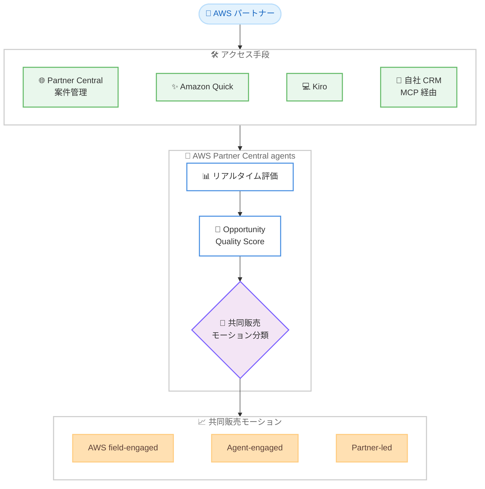

# AWS Partner Central - 共同販売を加速するエージェント機能

**リリース日**: 2026 年 6 月 16 日
**サービス**: AWS Partner Central
**機能**: AWS Partner Central agents による共同販売 (Co-Selling) の加速

📊 [このアップデートのインフォグラフィックを見る](https://takech9203.github.io/aws-news-summary/20260616-accelerate-co-selling-with-agents.html)
<!-- INFOGRAPHIC_BASE_URL は環境変数から取得 -->

## 概要

AWS は、AWS Partner Central agents を強化し、すべての共同販売 (Co-Selling) 案件をリアルタイムで評価して、案件を前進させるためのアクションを推奨する機能を発表しました。AWS Partner Central agents は 2026 年 3 月 16 日に Amazon Bedrock AgentCore 上に構築されたエージェント体験として提供が開始されており、今回のアップデートはその機能をさらに拡張するものです。

このエージェントは、パートナーとの対話を通じてパートナーの代わりに動作し、案件の詳細情報を補強します。従来は手動レビューを待つ必要があった処理を不要にすることで、パートナーはパイプラインをより早く構築し、案件をより迅速に前進させることができます。各案件には共同販売の準備状況を測定する Opportunity Quality Score (案件品質スコア) が付与され、AWS がどのように関与するかに直接影響します。

本機能は、AWS Partner Central で案件管理 (opportunity management) を利用しているすべての AWS パートナーが対象です。すべての商用 AWS リージョンのパートナーに提供されています。

**アップデート前の課題**

- 共同販売案件の評価や品質改善には AWS 側の手動レビューを待つ必要があり、案件の前進に時間がかかっていた
- 案件がどの共同販売モーション (AWS の関与形態) に該当するのかを把握しにくく、AWS のリソースを効果的に活用できなかった
- 案件の共同販売準備状況を客観的に測る指標がなく、改善すべきポイントが不明確だった

**アップデート後の改善**

- エージェントがすべての共同販売案件をリアルタイムで評価し、案件を前進させる推奨アクションを即座に提示するようになった
- 各案件が 3 つの共同販売モーションのいずれかに自動的に分類され、AWS の関与形態が明確になった
- Opportunity Quality Score により共同販売準備状況が数値化され、スコアとモーションが案件の改善に応じてリアルタイムで再計算されるようになった

## アーキテクチャ図

パートナーは Partner Central、Amazon Quick、Kiro、または MCP 経由の自社 CRM からエージェントにアクセスし、エージェントが案件をリアルタイムで評価してスコアとモーションを算出します。

## サービスアップデートの詳細

### 主要機能

1. **共同販売モーションのマッチング**
   - 各案件が 3 つの共同販売モーションのいずれかに自動的に分類される
   - **AWS field-engaged**: AWS の営業チームがパートナーと直接連携する
   - **Agent-engaged**: エージェントが案件の提出内容を強化し、AWS の関与を高める
   - **Partner-led**: パートナーがエージェントの支援を受けながら主導的に案件を進める

2. **Opportunity Quality Score (案件品質スコア)**
   - 共同販売の準備状況 (co-sell readiness) を測定するスコア
   - AWS がどのように案件に関与するかに直接影響する
   - エージェントが改善点を推奨し、改善に応じてスコアとモーションがリアルタイムで再計算される

3. **リアルタイムでの案件評価と推奨**
   - すべての共同販売案件をリアルタイムで評価する
   - すべてのモーションにわたって顧客インサイト、推奨アクション、セールスプレイ (sales plays) を提供する
   - パートナーとの対話を通じて、パートナーの代わりに案件の詳細情報を補強する

## 技術仕様

### アクセス手段

| 項目 | 詳細 |
|------|------|
| Partner Central | AWS Partner Central にログインし、案件管理 (opportunity management) からアクセス |
| ネイティブ AI ツール | Amazon Quick および Kiro 内で利用可能 |
| 自社 CRM | Partner Central agents MCP サーバーを通じて、Model Context Protocol (MCP) で自社 CRM に統合 |
| 基盤技術 | Amazon Bedrock AgentCore 上に構築 |

### MCP による統合

AWS Partner Central agents は Model Context Protocol (MCP) に対応しており、パートナーは既存のツールや自社 CRM からエージェント機能を利用できます。MCP サーバーの利用方法は公式ドキュメントで確認できます。

## 設定方法

### 前提条件

1. AWS パートナーであり、新しい AWS Partner Central 体験に移行済みであること
2. AWS Partner Central で案件管理 (opportunity management) を利用していること
3. 商用 AWS リージョンを利用していること

### 手順

#### ステップ 1: Partner Central にログイン

AWS Partner Central にログインし、案件管理 (opportunity management) の画面にアクセスします。エージェント機能はこの画面から利用できます。

#### ステップ 2: エージェントとの対話で案件を評価

エージェントとの対話を通じて、対象の共同販売案件を評価します。エージェントが案件を 3 つのモーションのいずれかに分類し、Opportunity Quality Score を算出します。

#### ステップ 3: 推奨アクションの実行とスコアの改善

エージェントが提示する推奨アクションやセールスプレイに従って案件の詳細情報を補強します。改善に応じてスコアとモーションがリアルタイムで再計算され、AWS の関与形態が最適化されます。必要に応じて、Amazon Quick、Kiro、または MCP 経由の自社 CRM からも同じ機能を利用できます。

## メリット

### ビジネス面

- **案件前進の高速化**: 手動レビューの待機が不要になり、パイプライン構築と案件の前進が速くなる
- **AWS リソースの効果的な活用**: 案件が適切な共同販売モーションに分類され、AWS の関与形態が明確になる
- **案件品質の可視化**: Opportunity Quality Score により共同販売準備状況が数値化され、改善ポイントが明確になる

### 技術面

- **対話型インターフェース**: パートナーとの対話を通じてエージェントが案件情報を補強する
- **リアルタイム再計算**: 案件の改善に応じてスコアとモーションが即座に更新される
- **柔軟なアクセス手段**: Partner Central、Amazon Quick、Kiro、MCP 経由の自社 CRM から利用できる

## デメリット・制約事項

### 制限事項

- 新しい AWS Partner Central 体験に移行済みのパートナーが対象
- AWS Partner Central の案件管理を利用している必要がある
- 提供範囲は商用 AWS リージョンに限られる

### 考慮すべき点

- Opportunity Quality Score とモーション分類は AWS の関与形態に直接影響するため、スコアの意味と改善方法を理解しておくことが重要
- 自社 CRM から利用する場合は、MCP サーバーの設定が必要

## ユースケース

### ユースケース 1: 共同販売案件の迅速な品質改善

**シナリオ**: パートナーが多数の共同販売案件を抱えており、どの案件に注力すべきか、また AWS の支援を得るために何を改善すべきかを判断したい。

**効果**: エージェントが各案件をリアルタイムで評価し、Opportunity Quality Score と推奨アクションを提示するため、優先順位付けと品質改善を素早く行える。

### ユースケース 2: 自社 CRM からの共同販売管理

**シナリオ**: パートナーが普段使用している CRM から離れずに、共同販売案件の評価や推奨アクションの確認を行いたい。

**効果**: Partner Central agents MCP サーバーを通じて自社 CRM にエージェント機能を統合することで、慣れたツール上で共同販売を管理できる。

### ユースケース 3: AWS との連携形態の最適化

**シナリオ**: パートナーが案件に対して AWS 営業チームの直接的な支援を得たいが、どのような連携形態が適切か分からない。

**効果**: エージェントが案件を AWS field-engaged、Agent-engaged、Partner-led のいずれかのモーションに分類するため、適切な AWS との連携形態を把握し、必要なアクションを実行できる。

## 料金

公式発表では本機能の料金に関する情報は提供されていません。詳細は AWS Partner Central および AWS の公式情報をご確認ください。

## 利用可能リージョン

すべての商用 AWS リージョンの AWS パートナーに提供されています。

## 関連サービス・機能

- **Amazon Bedrock AgentCore**: AWS Partner Central agents の基盤として利用されている技術
- **Amazon Quick**: エージェント機能を利用できるネイティブ AI ツールの 1 つ
- **Kiro**: エージェント機能を利用できる AWS の AI 搭載開発ツール
- **Model Context Protocol (MCP)**: 自社 CRM などの既存ツールとエージェントを統合するためのプロトコル

## 参考リンク

- 📊 [インフォグラフィック](https://takech9203.github.io/aws-news-summary/20260616-accelerate-co-selling-with-agents.html)
- [公式発表 (What's New)](https://aws.amazon.com/about-aws/whats-new/2026/06/accelerate-co-selling-with-agents/)
- [AWS Blog: Introducing AWS Partner Central agents](https://aws.amazon.com/blogs/apn/introducing-aws-partner-central-agents/)
- [ドキュメント: Partner Central agents MCP server](https://docs.aws.amazon.com/partner-central/latest/APIReference/partner-central-mcp-server.html)

## まとめ

今回のアップデートにより、AWS Partner Central agents はすべての共同販売案件をリアルタイムで評価し、Opportunity Quality Score と 3 つの共同販売モーションに基づいて案件を前進させる推奨アクションを提示できるようになりました。手動レビューの待機が不要になることで、パートナーはパイプライン構築と案件の前進を大幅に加速できます。AWS パートナーは、Partner Central、Amazon Quick、Kiro、または MCP 経由の自社 CRM からこの機能を活用し、共同販売の効率化を検討することをお勧めします。
