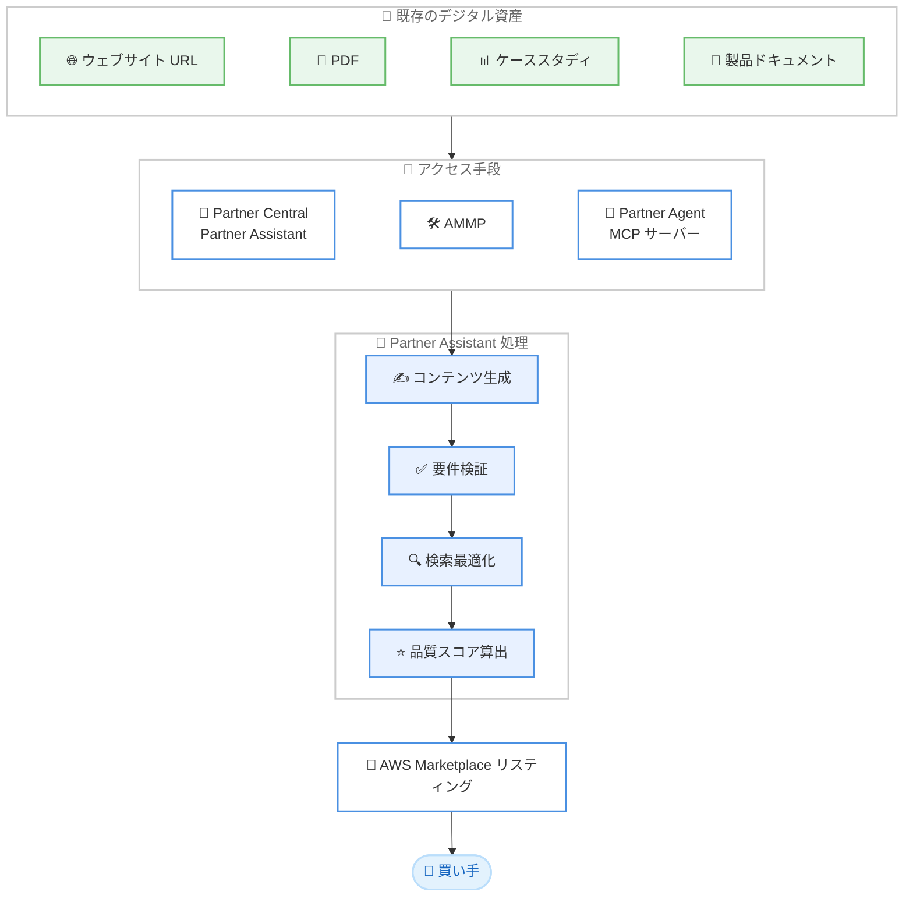

# AWS Marketplace - AI 支援による製品リスティング

**リリース日**: 2026 年 6 月 16 日
**サービス**: AWS Marketplace
**機能**: AI-assisted product listing (AI 支援による製品リスティング)

📊 [このアップデートのインフォグラフィックを見る](https://takech9203.github.io/aws-news-summary/20260616-ai-assisted-product-listing.html)
<!-- INFOGRAPHIC_BASE_URL は環境変数から取得 -->

## 概要

AWS Marketplace は、Partner Assistant チャット内で AI 支援による製品リスティング機能を提供開始しました。この機能は、独立系ソフトウェアベンダー (ISV) およびコンサルティングパートナーが、既存のデジタル資産から AWS Marketplace のリスティングを作成することを支援します。

Partner Assistant は、ウェブサイト URL、PDF、ケーススタディ、製品ドキュメントなどの既存のアセットから情報を取得し、リスティングコンテンツを自動的に生成して検証します。生成されたコンテンツは、すべての必須製品情報フィールドにわたって作成され、AWS Marketplace のサイズおよびフォーマット要件に照らして検証され、検索向けに最適化されます。これにより、買い手が容易に見つけられるリスティングを、手作業のデータ入力や要件充足への不安なく作成できます。

この機能は、AWS Partner Central の Partner Assistant チャット、AWS Marketplace Management Portal (AMMP)、および Partner Agent MCP サーバー経由のプログラムアクセスから利用できます。対象は、AWS Marketplace に製品を出品する ISV とコンサルティングパートナーです。

**アップデート前の課題**

このアップデート以前、パートナーが AWS Marketplace のリスティングを作成する際には次のような課題がありました。

- すべての必須フィールドにコンテンツを手作業で入力する必要があった
- 入力内容が AWS Marketplace のサイズやフォーマット要件を満たしているか不確実だった
- 検索での発見性を高めるための最適化に専門知識と試行錯誤が必要だった

**アップデート後の改善**

今回のアップデートにより、次のことが可能になりました。

- 既存のウェブサイト URL、PDF、ケーススタディ、製品ドキュメントからリスティングコンテンツを自動生成できるようになった
- 生成されたコンテンツが要件に照らして自動的に検証され、手作業の確認が不要になった
- 検索向けの最適化、フィールドごとの推奨事項、品質スコアにより、リスティングの品質が向上した

## アーキテクチャ図

既存のデジタル資産を入力として、3 つのアクセス手段から Partner Assistant が起動し、コンテンツ生成、検証、最適化、品質スコア算出を経て AWS Marketplace のリスティングが作成される流れを示しています。

## サービスアップデートの詳細

### 主要機能

1. **既存資産からのコンテンツ自動生成**
   - ウェブサイト URL、PDF、ケーススタディ、製品ドキュメントから情報を取得する
   - すべての必須製品情報フィールドにわたってコンテンツを作成する
   - 手作業によるデータ入力の負担を軽減する

2. **要件に基づく自動検証**
   - 生成されたコンテンツを AWS Marketplace のサイズおよびフォーマット要件に照らして検証する
   - 要件を満たしているかどうかの不確実性を解消する

3. **検索最適化とフィールドごとの推奨**
   - リスティングを検索および発見性向上のために最適化する
   - ベストプラクティスに基づき、フィールドごとの推奨事項を提供する

4. **品質スコア**
   - 買い手のエンゲージメントを促進する標準に対して、リスティングがどの位置にあるかを示す品質スコアを提供する

## 技術仕様

### アクセス手段

| 項目 | 詳細 |
|------|------|
| Partner Central | Partner Assistant チャットから対話的に利用 |
| AWS Marketplace Management Portal (AMMP) | 出品管理ポータルから利用 |
| Partner Agent MCP サーバー | プログラムによるアクセスに対応 |

### API 変更履歴

今回のアップデートに直接対応する awsapichanges.com の API 変更エントリは確認できませんでした。プログラムアクセスは Partner Agent MCP サーバーを通じて提供されます。

## 設定方法

### 前提条件

1. AWS Partner Central または AWS Marketplace の出品者 (ISV またはコンサルティングパートナー) として登録されていること
2. リスティング作成に利用するデジタル資産 (ウェブサイト URL、PDF、ケーススタディ、製品ドキュメントなど) が準備されていること
3. 利用するリージョンが AWS GovCloud (US) または中国リージョン以外であること

### 手順

#### ステップ 1: Partner Assistant にアクセスする

AWS Partner Central の Partner Assistant チャット、または AWS Marketplace Management Portal (AMMP) を開きます。プログラムによるアクセスを行う場合は、Partner Agent MCP サーバーを利用します。

#### ステップ 2: 既存資産を提供する

リスティングの基となるウェブサイト URL や製品ドキュメントなどを Partner Assistant に提供します。Partner Assistant がこれらの資産から情報を抽出し、必須フィールドのコンテンツを生成します。

#### ステップ 3: 検証結果と推奨事項を確認する

生成されたコンテンツの検証結果、フィールドごとの推奨事項、および品質スコアを確認します。推奨事項を反映してリスティングを仕上げます。

## メリット

### ビジネス面

- **市場投入までの時間短縮**: 既存資産からリスティングを自動生成することで、出品準備にかかる時間を短縮できます
- **発見性の向上**: 検索最適化により、買い手がリスティングを見つけやすくなります
- **品質の可視化**: 品質スコアにより、リスティングの完成度を客観的に把握できます

### 技術面

- **手作業の削減**: 必須フィールドへの手入力作業を大幅に削減できます
- **要件適合の確実性**: サイズおよびフォーマット要件への自動検証により、不適合のリスクを低減できます
- **自動化との統合**: Partner Agent MCP サーバーを通じてプログラムからリスティング作成を組み込めます

## デメリット・制約事項

### 制限事項

- AWS GovCloud (US) リージョンでは利用できません
- 中国リージョンでは利用できません
- 公式発表では料金に関する記載がなく、課金条件は別途確認が必要です

### 考慮すべき点

- 生成されたコンテンツは、提供する既存資産の品質に依存します
- 自動生成された内容は、公開前に出品者自身が正確性を確認することが推奨されます

## ユースケース

### ユースケース 1: 新規製品の初回リスティング作成

**シナリオ**: ISV が新しい SaaS 製品を AWS Marketplace に初めて出品する際、製品ウェブサイトと製品ドキュメントを基にリスティングを作成したい。

**効果**: 既存資産から必須フィールドのコンテンツが自動生成され、初回出品の準備時間を短縮できます。

### ユースケース 2: 既存リスティングの品質改善

**シナリオ**: コンサルティングパートナーが、検索での発見性が低いと感じる既存リスティングを改善したい。

**効果**: 検索最適化とフィールドごとの推奨事項、品質スコアを参照し、買い手のエンゲージメントを高めるリスティングへ改善できます。

### ユースケース 3: 複数製品リスティングの自動化

**シナリオ**: 多数の製品を扱う ISV が、リスティング作成を自社のワークフローに組み込んで効率化したい。

**効果**: Partner Agent MCP サーバーを通じてプログラムからリスティング作成を呼び出し、複数製品の出品作業を自動化できます。

## 料金

公式発表では料金に関する情報は提供されていません。利用にあたっての課金条件は、AWS Marketplace および AWS Partner Central の公式ドキュメントで確認してください。

## 利用可能リージョン

この機能は AWS GovCloud (US) リージョンおよび中国リージョンでは利用できません。それ以外のリージョンで利用可能です。

## 関連サービス・機能

- **AWS Partner Central**: Partner Assistant チャットを通じて本機能にアクセスする主要なポータルです
- **AWS Marketplace Management Portal (AMMP)**: 出品管理を行うポータルで、本機能を利用できます
- **Partner Agent MCP サーバー**: プログラムによるアクセスを提供し、リスティング作成の自動化に利用できます

## 参考リンク

- 📊 [インフォグラフィック](https://takech9203.github.io/aws-news-summary/20260616-ai-assisted-product-listing.html)
- [公式発表 (What's New)](https://aws.amazon.com/about-aws/whats-new/2026/06/ai-assisted-product-listing/)
- [AI 支援による製品リスティング (ドキュメント)](https://docs.aws.amazon.com/marketplace/latest/userguide/ai-assisted-product-listing.html)
- [Partner Agent MCP サーバー (API リファレンス)](https://docs.aws.amazon.com/partner-central/latest/APIReference/partner-central-mcp-server.html)
- [AWS Partner Central](https://partnercentral.awspartner.com)
- [AWS Marketplace Management Portal](https://aws.amazon.com/marketplace/management/products)

## まとめ

AWS Marketplace の AI 支援による製品リスティングは、ISV とコンサルティングパートナーが既存のデジタル資産から要件適合済みで検索最適化されたリスティングを迅速に作成できるようにする機能です。手作業の削減と品質の可視化により、出品準備の効率と発見性が向上します。AWS Marketplace への出品を予定しているパートナーは、Partner Central または AMMP から本機能を試し、Partner Agent MCP サーバーによる自動化の活用も検討することを推奨します。
