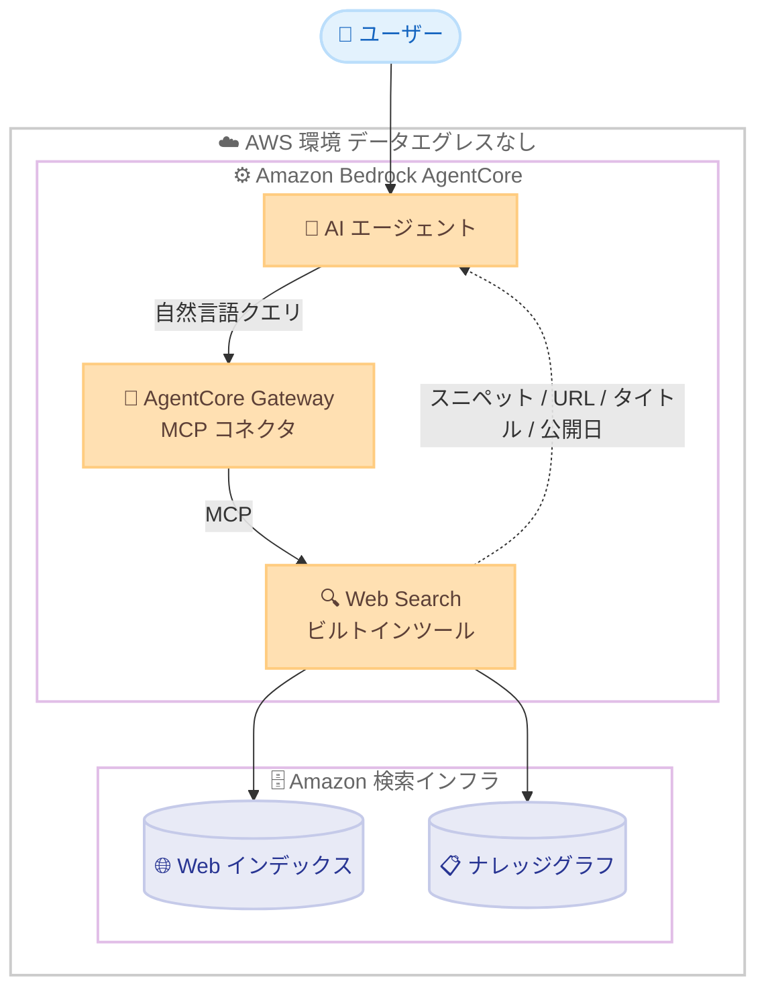

# Amazon Bedrock AgentCore - Web Search

**リリース日**: 2026 年 6 月 16 日
**サービス**: Amazon Bedrock AgentCore
**機能**: Web Search (エージェントによる Web 検索)

📊 [このアップデートのインフォグラフィックを見る](https://takech9203.github.io/aws-news-summary/20260616-amazon-bedrock-agentcore-web-search.html)
<!-- INFOGRAPHIC_BASE_URL は環境変数から取得 -->

## 概要

AWS は、Amazon Bedrock AgentCore の Web Search を一般提供 (GA) として発表しました。Web Search は、AI エージェントが最新かつ正確な Web 上の知識に基づいて回答を生成できるようにする、フルマネージドのツールです。検索処理は利用者の AWS 環境内で完結し、データのエグレス (外部送信) が発生しないため、データレジデンシー要件を満たしながら Web 検索機能をエージェントに追加できます。

Web Search は、Alexa+、Amazon Q Business、Kiro などの検索を支える Amazon の検索インフラストラクチャ上に構築されています。Amazon が運用する Web インデックスに加え、構造化されたナレッジグラフのデータを組み合わせることで、標準的な Web 検索結果を超えたエンティティデータや検証済みの事実をエージェントに提供します。検索結果はエージェントによる取得 (agentic retrieval) に最適化されており、トークンあたりの情報価値が高い抜粋を返します。

この機能は、AgentCore Gateway 上のビルトインコネクタターゲットとして、Model Context Protocol (MCP) 経由で公開されます。エージェントは自然言語のクエリを送信するだけで、スニペット、ソース URL、タイトル、公開日を含むランク付けされた結果を受け取り、モデルがその情報を推論に活用できます。

**アップデート前の課題**

Web Search の登場以前、AgentCore で構築するエージェントに Web 検索機能を追加するには、開発者側で多くの作業が必要でした。

- 外部の検索プロバイダーを個別に統合する必要があった
- 検索結果をエージェントに渡すためのカスタムオーケストレーションを自前で構築する必要があった
- 検索プロバイダーごとの認証や課金を管理する必要があった
- 複数のサービスにまたがるセキュリティとコンプライアンスの調整が必要だった

**アップデート後の改善**

今回のアップデートにより、これらのオーバーヘッドが解消されます。

- フルマネージドのツールとして Web 検索を利用でき、外部プロバイダーの統合や独自オーケストレーションの構築が不要になった
- AgentCore Gateway のビルトインコネクタとして MCP 経由で利用でき、認証や課金の個別管理が不要になった
- 検索処理が AWS 環境内で完結し、データエグレスが発生しないため、データレジデンシーとコンプライアンスの要件を満たしやすくなった
- Web インデックスとナレッジグラフを組み合わせた多元的なグラウンディングにより、回答の正確性が向上した

## アーキテクチャ図



エージェントは AgentCore Gateway を介して MCP 経由で Web Search を呼び出し、Amazon の Web インデックスとナレッジグラフから取得したランク付け済みの結果を受け取ります。一連の処理は AWS 環境内で完結します。

## サービスアップデートの詳細

### 主要機能

1. **フルマネージドな Web 検索ツール**
   - エージェントが最新かつ正確な Web 知識に基づいて回答を生成できる
   - 外部プロバイダーの統合、認証、課金の個別管理が不要
   - 開発者はエージェントのロジック構築に集中できる

2. **多元的なグラウンディング**
   - Amazon が運用する Web インデックスを利用
   - 構造化されたナレッジグラフのデータを組み合わせ、エンティティデータや検証済みの事実を提供
   - 標準的な Web 検索結果を超えた情報をエージェントが活用できる

3. **エージェント取得に最適化された結果**
   - トークンあたりの情報価値が高い抜粋 (high-value excerpts) を返却
   - スニペット、ソース URL、タイトル、公開日を含むランク付けされた結果を提供
   - モデルが結果を推論に活用しやすい形式で返す

4. **MCP によるシームレスな統合**
   - AgentCore Gateway 上のビルトインコネクタターゲットとして公開
   - Model Context Protocol (MCP) 経由で標準的に呼び出し可能
   - エージェントは自然言語クエリを送信するだけで結果を取得できる

5. **データレジデンシーの維持**
   - 検索処理が利用者の AWS 環境内で完結
   - データエグレスが発生しないため、コンプライアンス要件を満たしやすい

## 技術仕様

### 機能の概要

| 項目 | 詳細 |
|------|------|
| 提供形態 | フルマネージドツール (一般提供) |
| 統合方式 | AgentCore Gateway のビルトインコネクタ (MCP 経由) |
| 入力 | 自然言語のクエリ |
| 出力 | ランク付けされた結果 (スニペット、ソース URL、タイトル、公開日) |
| データソース | Amazon の Web インデックス + ナレッジグラフ |
| データエグレス | なし (AWS 環境内で完結) |
| 基盤インフラ | Alexa+、Amazon Q Business、Kiro を支える Amazon 検索インフラ |

### API 変更履歴

| 日付 | サービス | 変更内容 |
|------|----------|----------|
| 2026/06/17 | [Amazon Bedrock AgentCore Control](https://awsapichanges.com/archive/changes/ecddc1-bedrock-agentcore-control.html) | 6 new 34 updated api methods - AgentCore Gateway やコネクタを含む AgentCore の機能拡張 |
| 2026/06/17 | [Amazon Bedrock AgentCore](https://awsapichanges.com/archive/changes/ecddc1-bedrock-agentcore.html) | 3 updated api methods - AgentCore ランタイムの更新 |

## 設定方法

### 前提条件

1. Web Search が利用可能なリージョン (米国東部 (バージニア北部)) で AgentCore を利用していること
2. AgentCore Gateway が設定されていること
3. エージェントが MCP 経由でツールを呼び出せるように構成されていること

### 手順

#### ステップ1: AgentCore Gateway でビルトインコネクタを有効化

AgentCore Gateway 上で Web Search をビルトインコネクタターゲットとして構成します。Gateway は MCP に準拠したツールとして Web Search を公開するため、エージェントから標準的なツール呼び出しとしてアクセスできるようになります。

#### ステップ2: エージェントから Web Search を呼び出す

エージェントは自然言語のクエリを Web Search ツールに送信します。ツールはクエリに対して Amazon の Web インデックスとナレッジグラフを検索し、結果を返します。

```text
クエリ例: "2026 年第 1 四半期の AWS の主要なサービス発表は何ですか?"

レスポンス (概念例):
- タイトル: ...
- スニペット: ...
- ソース URL: https://...
- 公開日: 2026-...
```

検索結果にはソース URL と公開日が含まれるため、モデルは情報の出典と鮮度を考慮して推論できます。

#### ステップ3: エージェントの回答にグラウンディング結果を反映

エージェントは取得したランク付け済みの結果を推論コンテキストに取り込み、最新の Web 情報に基づいた回答を生成します。これにより、ハルシネーションのリスクを低減しながら、根拠を伴う応答を返せます。

## メリット

### ビジネス面

- **開発スピードの向上**: 外部検索プロバイダーの統合や独自オーケストレーションの構築が不要となり、エージェント開発を迅速化できる
- **運用コストの削減**: 認証や課金、セキュリティ対応を AWS が一括して管理するため、運用負荷とコストを抑えられる
- **コンプライアンス対応**: データエグレスが発生しないため、データレジデンシー要件のある業界でも採用しやすい

### 技術面

- **回答精度の向上**: Web インデックスとナレッジグラフを組み合わせた多元的なグラウンディングにより、正確で根拠のある回答を実現
- **トークン効率**: 情報価値の高い抜粋を返すことで、限られたコンテキストウィンドウを効率的に活用できる
- **標準化された統合**: MCP 経由のビルトインコネクタとして利用でき、独自実装を排して標準的な方法でツールを組み込める

## デメリット・制約事項

### 制限事項

- 一般提供時点では、利用可能リージョンが米国東部 (バージニア北部) に限定される
- 検索対象は Amazon が運用する Web インデックスとナレッジグラフに基づくため、特定の専門サイトや非公開情報は対象外となる場合がある

### 考慮すべき点

- AgentCore Gateway を経由する構成が前提となるため、Gateway の設定が必要
- 公式発表時点では料金に関する具体的な記載がないため、利用前に最新の料金体系を確認することが推奨される
- Web 検索結果は外部の公開情報に依存するため、結果の正確性や鮮度はソースに左右される点を考慮する

## ユースケース

### ユースケース1: 最新情報に基づくカスタマーサポートエージェント

**シナリオ**: 製品の最新仕様や価格、キャンペーン情報など、頻繁に更新される情報を顧客に案内するサポートエージェントを構築したい。

**実装例**:
```text
ユーザー: "現在実施中のキャンペーンを教えてください"
エージェント -> Web Search: 最新のキャンペーン情報を検索
エージェント: 取得した最新情報に基づいて回答
```

**効果**: 学習データのカットオフに依存せず、最新の公開情報に基づいた正確な回答を提供できる。

### ユースケース2: 市場調査・競合分析エージェント

**シナリオ**: 業界動向や競合の最新発表を継続的に収集し、レポートを生成するエージェントを構築したい。

**実装例**:
```text
ユーザー: "競合 A 社の今四半期の新製品発表をまとめて"
エージェント -> Web Search: 競合の最新発表を検索 (公開日付きで取得)
エージェント: ソース URL と公開日を引用しながら要約
```

**効果**: ソース URL と公開日が結果に含まれるため、出典を明示した信頼性の高い調査結果を生成できる。

### ユースケース3: 規制業界における社内ナレッジエージェント

**シナリオ**: データレジデンシー要件が厳しい金融や医療業界で、最新の公開情報を参照しつつデータを外部に出さないエージェントを運用したい。

**実装例**:
```text
エージェントの検索処理はすべて AWS 環境内で完結
データエグレスは発生しない
```

**効果**: コンプライアンス要件を満たしながら、最新の Web 知識を活用したエージェントを安全に運用できる。

## 料金

公式発表時点では、Web Search の具体的な料金体系は明示されていません。利用にあたっては、Amazon Bedrock AgentCore の料金ページで最新の情報を確認してください。

## 利用可能リージョン

一般提供開始時点では、以下のリージョンで利用可能です。

- 米国東部 (バージニア北部) (us-east-1)

## 関連サービス・機能

- **Amazon Bedrock AgentCore Gateway**: Web Search をビルトインコネクタターゲットとして MCP 経由で公開する基盤
- **Model Context Protocol (MCP)**: エージェントとツール間の標準的な連携プロトコル
- **Amazon Q Business / Alexa+ / Kiro**: Web Search の基盤となる Amazon 検索インフラを共有するサービス群
- **Amazon Bedrock Knowledge Bases**: 社内ドキュメントに基づくグラウンディングを行う機能。Web Search と組み合わせることで、社内情報と最新の Web 情報の双方を活用できる

## 参考リンク

- 📊 [インフォグラフィック](https://takech9203.github.io/aws-news-summary/20260616-amazon-bedrock-agentcore-web-search.html)
- [公式発表 (What's New)](https://aws.amazon.com/about-aws/whats-new/2026/06/amazon-bedrock-agentcore-web-search/)
- [AWS Blog](https://aws.amazon.com/blogs/aws/announcing-web-search-on-amazon-bedrock-agentcore-ground-your-ai-agents-in-current-accurate-web-knowledge/)
- [Amazon Bedrock AgentCore ドキュメント](https://docs.aws.amazon.com/bedrock-agentcore/)

## まとめ

Web Search on Amazon Bedrock AgentCore は、外部プロバイダーの統合や独自オーケストレーションを必要とせず、フルマネージドで Web 検索機能をエージェントに追加できる重要なアップデートです。データエグレスが発生しないため、コンプライアンス要件の厳しい環境でも安心して最新の Web 知識をエージェントに組み込めます。AgentCore でエージェントを構築している場合は、AgentCore Gateway のビルトインコネクタとして Web Search を有効化し、最新情報に基づくグラウンディングの効果を検証することをお勧めします。
