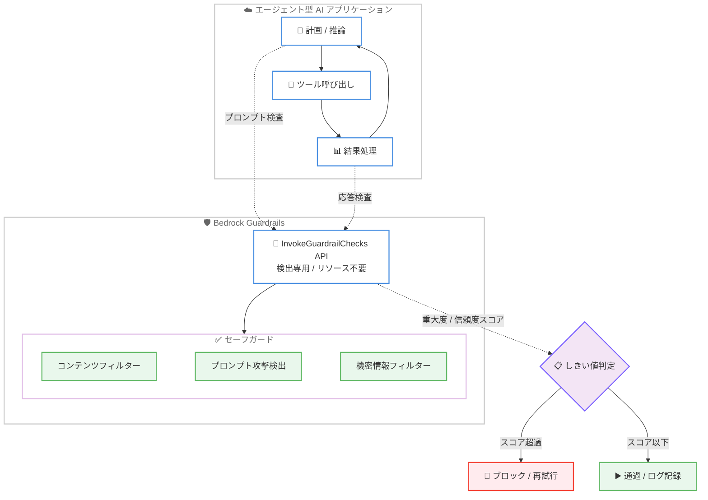

# Amazon Bedrock Guardrails - エージェント型 AI ワークフロー向けの新しい API

**リリース日**: 2026 年 6 月 16 日
**サービス**: Amazon Bedrock Guardrails
**機能**: InvokeGuardrailChecks API (リソース不要の検出専用 API)

📊 [このアップデートのインフォグラフィックを見る](https://takech9203.github.io/aws-news-summary/20260616-amazon-bedrock-guardrails-api-ai.html)
<!-- INFOGRAPHIC_BASE_URL は環境変数から取得 -->

## 概要

Amazon Bedrock Guardrails は、エージェント型 AI (Agentic AI) ワークフロー向けに設計された新しい API、InvokeGuardrailChecks を発表しました。この API は「リソース不要 (resourceless)」の検出専用 (detect-only) API であり、事前にガードレールリソースを作成することなく、エージェント型 AI アプリケーションの任意の箇所で個別のセーフガードを適用できます。

エージェント型 AI は、計画、ツールの呼び出し、結果の処理、そして再びこれを繰り返すというループで動作し、1 つのリクエストに対して多数のステップを実行することがよくあります。各ステップにはそれぞれ異なるリスクレベルがあるため、すべてに一律のガードレールを適用する方法ではスケールさせるのが困難でした。新しい API は、ガードレール ID の管理やバージョン管理を不要にし、リクエストごとに必要なセーフガードを直接指定できる「リクエスト単位のきめ細かな制御」を提供することで、この課題を解決します。

この API は数値の重大度スコア (severity score) と信頼度スコア (confidence score) を返すため、ユーザーは独自のしきい値を設定し、ブロック、通過、再試行、ログ記録といったアクションを自由に選択できます。これにより、開発者はアプリケーションのロジックに合わせた適応的な安全制御を構築できます。

**アップデート前の課題**

- 以前はセーフガードを適用するために、事前にガードレールリソースを作成し、ガードレール ID とバージョンを管理する必要があった
- 以前はガードレールが事前定義されたアクション (ブロックまたはマスク) を実行するため、リクエストごとに適応的なロジックを構築しにくかった
- 以前はステップごとにリスクレベルが異なるエージェント型ワークフローに対して、一律のガードレールを適用する方法ではスケールが困難だった

**アップデート後の改善**

- 今回のアップデートにより、ガードレールリソースを作成せずに、リクエスト単位でセーフガードを直接指定できるようになった
- 今回のアップデートにより、ガードレール ID やバージョンの管理が不要になった
- 今回のアップデートにより、数値スコアを基にブロック、通過、再試行、ログ記録などのアクションを開発者が柔軟に選択できるようになった

## アーキテクチャ図



エージェント型 AI のループ内の任意のステップから InvokeGuardrailChecks API を呼び出し、返却された数値スコアをもとにアプリケーション側でアクションを判断する流れを示しています。

## サービスアップデートの詳細

### 主要機能

1. **リソース不要の検出専用 API**
   - 事前にガードレールリソースを作成する必要がない
   - ガードレール ID やバージョンの追跡・管理が不要
   - リクエストごとに必要なセーフガードを直接指定できるため、ワークフローの変化に応じてチェックの追加・削除・変更が容易

2. **数値スコアによる適応的な制御**
   - コンテンツフィルターとプロンプト攻撃には重大度スコア (severityScore) を返す
   - 機密情報フィルターには信頼度スコア (confidenceScore) を返す
   - ユーザーが独自のしきい値を設定し、ブロック、通過、再試行、ログ記録といったアクションを選択できる

3. **サポートされるセーフガード**
   - **コンテンツフィルター**: ヘイト、暴力、性的表現、侮辱、不正行為などのカテゴリにわたる有害なコンテンツを検出
   - **プロンプト攻撃検出**: ジェイルブレイク、プロンプトインジェクション、プロンプトリーケージを独立した個別のチェックとして識別し、各攻撃ベクトルを個別に呼び出し可能
   - **機密情報フィルター**: サポートされる PII エンティティタイプ (氏名、メールアドレス、クレジットカード番号、AWS アクセスキーなど) を検出

## 技術仕様

### API 概要

| 項目 | 詳細 |
|------|------|
| API 名 | InvokeGuardrailChecks |
| 所属 | Amazon Bedrock Runtime |
| モード | 検出専用 (detect-only) |
| リソース | 不要 (resourceless) |
| 入力 | messages (role: user / assistant / system, content: text) |
| チェック種別 | contentFilter, promptAttack, sensitiveInformation |
| 出力 | カテゴリ別の severityScore / confidenceScore、usage (textUnits) |

### サポートされるチェックカテゴリ

| チェック | カテゴリ / エンティティ |
|----------|------------------------|
| contentFilter | VIOLENCE, HATE, SEXUAL, MISCONDUCT, INSULTS |
| promptAttack | JAILBREAK, PROMPT_INJECTION, PROMPT_LEAKAGE |
| sensitiveInformation | NAME, EMAIL, PHONE, ADDRESS, CREDIT_DEBIT_CARD_NUMBER, AWS_ACCESS_KEY, US_SOCIAL_SECURITY_NUMBER など多数の PII タイプ |

### API 変更履歴

| 日付 | サービス | 変更内容 |
|------|----------|----------|
| 2026/06/15 | [Amazon Bedrock Runtime](https://awsapichanges.com/archive/changes/c3a7b1-bedrock-runtime.html) | 1 new api method - InvokeGuardrailChecks: ガードレールリソースを作成せずにプロンプトと応答を安全性チェック (コンテンツフィルター、プロンプト攻撃、機密情報) に対して評価する検出専用 API。数値スコアを返し、適応的なロジックを構築可能 |

### リクエスト例 (構造)

```json
{
  "messages": [
    {
      "role": "user",
      "content": [
        { "text": "検査対象のテキスト" }
      ]
    }
  ],
  "checks": {
    "contentFilter": {
      "categories": [
        { "category": "VIOLENCE" },
        { "category": "HATE" }
      ]
    },
    "promptAttack": {
      "categories": [
        { "category": "JAILBREAK" },
        { "category": "PROMPT_INJECTION" }
      ]
    },
    "sensitiveInformation": {
      "entities": [
        { "type": "EMAIL" },
        { "type": "CREDIT_DEBIT_CARD_NUMBER" }
      ]
    }
  }
}
```

### レスポンス例 (構造)

```json
{
  "results": {
    "contentFilter": {
      "results": [
        { "category": "VIOLENCE", "severityScore": 0.85 }
      ]
    },
    "promptAttack": {
      "results": [
        { "category": "JAILBREAK", "severityScore": 0.92 }
      ]
    },
    "sensitiveInformation": {
      "results": [
        {
          "type": "EMAIL",
          "confidenceScore": 0.99,
          "beginOffset": 10,
          "endOffset": 28,
          "messageIndex": 0,
          "contentIndex": 0
        }
      ],
      "truncated": false
    }
  },
  "usage": {
    "contentFilter": { "textUnits": 1 },
    "promptAttack": { "textUnits": 1 },
    "sensitiveInformation": { "textUnits": 1 }
  }
}
```

## 設定方法

### 前提条件

1. Amazon Bedrock が利用可能な対応リージョンの AWS アカウント
2. InvokeGuardrailChecks API を呼び出す IAM 権限
3. AWS SDK または AWS CLI の実行環境

### 手順

#### ステップ1: チェック対象のメッセージとセーフガードを定義する

```python
checks = {
    "contentFilter": {
        "categories": [
            {"category": "VIOLENCE"},
            {"category": "HATE"},
        ]
    },
    "promptAttack": {
        "categories": [
            {"category": "PROMPT_INJECTION"},
        ]
    },
}
```

リクエストごとに必要なセーフガードのみを指定します。ステップに応じて、コンテンツフィルター、プロンプト攻撃検出、機密情報フィルターを個別に組み合わせられます。

#### ステップ2: InvokeGuardrailChecks API を呼び出す

```python
import boto3

client = boto3.client("bedrock-runtime")

response = client.invoke_guardrail_checks(
    messages=[
        {"role": "user", "content": [{"text": user_input}]}
    ],
    checks=checks,
)
```

エージェント型ワークフローのループ内の任意の箇所 (プロンプト送信前や応答受信後など) から呼び出します。ガードレールリソースの ID やバージョンを指定する必要はありません。

#### ステップ3: スコアに基づいてアクションを判断する

```python
content_results = response["results"].get("contentFilter", {}).get("results", [])
for r in content_results:
    if r["severityScore"] >= 0.8:
        # しきい値を超えたためブロックまたは再試行
        handle_violation(r["category"])
```

API はアクションを自動で実行しないため、返却された数値スコアをアプリケーション側で評価し、ブロック、通過、再試行、ログ記録などの処理を実装します。

## メリット

### ビジネス面

- **ガバナンスの強化**: エージェント型 AI の各ステップに適切なセーフガードを適用でき、コンプライアンスやリスク管理を強化できる
- **柔軟な制御**: リクエスト単位で安全制御を調整できるため、多様なユースケースに対応しやすい
- **運用負荷の軽減**: ガードレールリソースの作成・バージョン管理が不要となり、運用オーバーヘッドを削減できる

### 技術面

- **きめ細かな制御**: ステップごとに異なるリスクレベルに応じたセーフガードを個別に適用できる
- **適応的なロジック**: 数値スコアを返すため、しきい値を柔軟に設定し、独自の判断ロジックを構築できる
- **モジュール性**: コンテンツフィルター、プロンプト攻撃検出、機密情報フィルターを独立したチェックとして組み合わせられる

## デメリット・制約事項

### 制限事項

- 検出専用 API であるため、ブロックやマスクなどのアクションは自動実行されず、アプリケーション側での実装が必要
- 利用可能リージョンが限定されている (一部のリージョンのみ)
- テキストコンテンツの検査が対象 (content は text タイプ)

### 考慮すべき点

- 各チェックは textUnits 単位で使用量が計上されるため、呼び出し回数が増えるとコストに影響する可能性がある
- しきい値の設定はユーザーの責任となるため、適切な値の検証とチューニングが必要
- エージェント型ワークフローの各ステップで呼び出す場合、レイテンシーへの影響を考慮する

## ユースケース

### ユースケース1: ツール呼び出し前のプロンプトインジェクション検査

**シナリオ**: エージェントが外部から取得したデータをプロンプトに組み込んでツールを呼び出す前に、プロンプトインジェクションやジェイルブレイクが含まれていないか検査したい。

**実装例**:
```python
response = client.invoke_guardrail_checks(
    messages=[{"role": "user", "content": [{"text": retrieved_data}]}],
    checks={"promptAttack": {"categories": [
        {"category": "PROMPT_INJECTION"},
        {"category": "JAILBREAK"},
    ]}},
)
```

**効果**: 攻撃ベクトルごとに独立して検査することで、信頼できない入力による意図しない動作を防止できる。

### ユースケース2: 応答に含まれる機密情報の検出

**シナリオ**: モデルの応答をユーザーに返す前に、PII (氏名、メールアドレス、クレジットカード番号など) が含まれていないか確認したい。

**実装例**:
```python
response = client.invoke_guardrail_checks(
    messages=[{"role": "assistant", "content": [{"text": model_output}]}],
    checks={"sensitiveInformation": {"entities": [
        {"type": "EMAIL"},
        {"type": "CREDIT_DEBIT_CARD_NUMBER"},
        {"type": "US_SOCIAL_SECURITY_NUMBER"},
    ]}},
)
```

**効果**: 信頼度スコアとオフセット情報を活用し、機密情報の漏えいを検出してマスキングやブロックを実装できる。

### ユースケース3: ステップごとに異なるセーフガードの適用

**シナリオ**: 計画ステップではプロンプト攻撃検出のみ、最終応答ステップではコンテンツフィルターと機密情報フィルターを適用するなど、ステップごとに異なる安全制御を行いたい。

**実装例**:
```python
# 計画ステップ
plan_checks = {"promptAttack": {"categories": [{"category": "JAILBREAK"}]}}

# 最終応答ステップ
final_checks = {
    "contentFilter": {"categories": [{"category": "HATE"}, {"category": "VIOLENCE"}]},
    "sensitiveInformation": {"entities": [{"type": "EMAIL"}]},
}
```

**効果**: 各ステップのリスクレベルに応じてセーフガードを最適化し、不要な検査を省くことで効率的かつ的確な制御を実現できる。

## 料金

公式発表時点では、本 API に関する具体的な料金情報は提供されていません。API レスポンスには各チェックの使用量が textUnits 単位で含まれるため、料金体系の詳細については Amazon Bedrock の料金ページを参照してください。

## 利用可能リージョン

本機能は以下のリージョンで利用可能です。

- 米国東部 (バージニア北部)
- 米国東部 (オハイオ)
- 米国西部 (オレゴン)
- 欧州 (ロンドン)
- 欧州 (ストックホルム)
- アジアパシフィック (東京)
- アジアパシフィック (シドニー)

## 関連サービス・機能

- **Amazon Bedrock Guardrails**: 従来のリソースベースのガードレール機能。本 API はこれを補完し、リソース不要・検出専用の選択肢を提供する
- **Amazon Bedrock Runtime**: InvokeGuardrailChecks API が属するランタイムサービス
- **Amazon Bedrock Agents**: エージェント型 AI ワークフローを構築する際に、本 API を組み合わせて安全制御を強化できる

## 参考リンク

- 📊 [インフォグラフィック](https://takech9203.github.io/aws-news-summary/20260616-amazon-bedrock-guardrails-api-ai.html)
- [公式発表 (What's New)](https://aws.amazon.com/about-aws/whats-new/2026/06/amazon-bedrock-guardrails-api-ai/)
- [ドキュメント (InvokeGuardrailChecks の使用)](https://docs.aws.amazon.com/bedrock/latest/userguide/guardrails-use-invoke-guardrail-checks.html)
- [Amazon Bedrock Guardrails](https://aws.amazon.com/bedrock/guardrails/)
- [API 変更履歴 (awsapichanges.com)](https://awsapichanges.com/archive/changes/c3a7b1-bedrock-runtime.html)

## まとめ

InvokeGuardrailChecks API は、リソース不要かつ検出専用という新しいアプローチで、エージェント型 AI ワークフローにきめ細かなリクエスト単位のセーフガードを提供します。数値スコアを返す設計により、開発者はアプリケーションのロジックに合わせた適応的な安全制御を構築できます。エージェント型アプリケーションを開発しているユーザーは、各ステップのリスクに応じたセーフガードの組み込みを検討することを推奨します。
