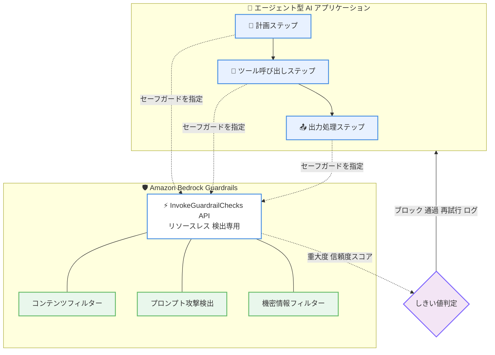

# Amazon Bedrock Guardrails - エージェント型 AI ワークフロー向け新 API

**リリース日**: 2026 年 6 月 16 日
**サービス**: Amazon Bedrock
**機能**: InvokeGuardrailChecks API (エージェント型 AI ワークフロー向け)

📊 [このアップデートのインフォグラフィックを見る](https://takech9203.github.io/aws-news-summary/20260616-amazon-bedrock-guardrails-api-ai.html)
<!-- INFOGRAPHIC_BASE_URL は環境変数から取得 -->

## 概要

Amazon Bedrock Guardrails は、エージェント型 AI アプリケーション向けに設計された新しい API である InvokeGuardrailChecks API を発表しました。この API は、ガードレールリソースを作成することなく、個別のセーフガードをエージェント型 AI アプリケーションの任意のポイントで適用できるリソースレスな API です。

エージェント型アプリケーションは、計画、ツールの呼び出し、出力の処理といった反復的なループを通じて動作し、1 つのリクエストで多数のステップを実行することがよくあります。各ステップはそれぞれ異なるリスクレベルを持つため、単一の画一的なガードレールでスケールさせることは困難でした。新しい API は検出専用モードで動作し、追跡すべきガードレール ID やバージョン管理が不要なため、開発者は各リクエストで適用するセーフガードを直接指定できます。

この API は数値の重大度スコアと信頼度スコアを返すため、チームはカスタムしきい値を設定し、ブロック、通過、再試行、ログ記録のいずれを行うかを自社のニーズに応じて判断できます。これにより、エージェントループの各ステップで実行するセーフガードをリクエスト単位できめ細かく制御できるようになります。

**アップデート前の課題**

このアップデート以前は、ガードレールを適用するためにガードレールリソースを事前に作成し管理する必要がありました。

- 以前はガードレールを利用する前に、ガードレールリソースを作成し、ガードレール ID とバージョンを管理する必要があった
- 以前は単一の画一的なガードレール設定では、リスクレベルが異なるエージェントループの各ステップに対して柔軟に対応することが難しかった
- 以前は特定のセーフガードのみを個別に適用するといった、リクエスト単位での細かい制御が困難だった

**アップデート後の改善**

今回のアップデートにより、リソースを作成せずにセーフガードを柔軟に適用できるようになりました。

- 今回のアップデートによりガードレールリソースの作成や ID、バージョンの管理が不要になった
- 今回のアップデートによりエージェントループの各ステップで適用するセーフガードをリクエスト単位で指定できるようになった
- 今回のアップデートにより数値の重大度スコアと信頼度スコアに基づいて、ブロック、通過、再試行、ログ記録の判断をカスタムしきい値で行えるようになった

## アーキテクチャ図



エージェントループの各ステップから InvokeGuardrailChecks API を呼び出し、必要なセーフガードのみをリクエスト単位で適用する流れを示しています。

## サービスアップデートの詳細

### 主要機能

1. **リソースレスな検出専用 API**
   - ガードレールリソースを事前に作成せずにセーフガードを適用できる
   - 追跡すべきガードレール ID やバージョン管理が不要
   - 検出専用モードで動作し、適用するセーフガードを各リクエストで直接指定する

2. **スコアベースのきめ細かい制御**
   - 数値の重大度スコアと信頼度スコアを返す
   - カスタムしきい値を設定して判断ロジックを構築できる
   - ブロック、通過、再試行、ログ記録のいずれを行うかを自社のニーズに応じて判断できる

3. **3 種類のセーフガードの個別適用**
   - コンテンツフィルター: ヘイト、暴力、性的表現、侮辱、不正行為などのカテゴリにわたる有害コンテンツを検出
   - プロンプト攻撃検出: ジェイルブレイク、プロンプトインジェクション、プロンプトリークを独立した個別チェックとして識別
   - 機密情報フィルター: サポートされている PII エンティティタイプを検出

## 技術仕様

### セーフガードの種類

| セーフガード | 検出対象 |
|------|------|
| コンテンツフィルター | ヘイト、暴力、性的表現、侮辱、不正行為などの有害コンテンツ |
| プロンプト攻撃検出 | ジェイルブレイク、プロンプトインジェクション、プロンプトリーク (各攻撃ベクトルを個別に呼び出し可能) |
| 機密情報フィルター | サポートされている PII エンティティタイプ |

プロンプト攻撃検出は独立したセーフガードとして提供されており、各攻撃ベクトルを個別に呼び出すことができます。

### API 変更履歴

| 日付 | サービス | 変更内容 |
|------|----------|----------|
| 2026/06/15 | [bedrock-runtime](https://awsapichanges.com/archive/changes/c3a7b1-bedrock-runtime.html) | 1 new api method - InvokeGuardrailChecks メソッドが追加 |

## メリット

### ビジネス面

- **責任ある AI の実現**: エージェント型アプリケーションの各ステップで適切なセーフガードを適用し、有害コンテンツやプロンプト攻撃、機密情報の漏えいリスクを低減できる
- **導入の容易さ**: ガードレールリソースの作成や管理が不要なため、既存のエージェントアプリケーションへ迅速に組み込める
- **柔軟な運用**: スコアベースの判断により、ユースケースに応じて厳格度を調整できる

### 技術面

- **運用負荷の軽減**: ガードレール ID やバージョンの管理が不要になり、設定管理の複雑さが減る
- **きめ細かい制御**: リクエスト単位で適用するセーフガードを指定でき、ステップごとのリスクレベルに応じた制御が可能
- **柔軟な判断ロジック**: 重大度スコアと信頼度スコアを利用して、ブロック、通過、再試行、ログ記録などの独自ロジックを実装できる

## デメリット・制約事項

### 制限事項

- 検出専用モードで動作するため、API 自体は検出結果を返すのみであり、ブロックなどの後続処理はアプリケーション側で実装する必要がある
- 現時点では利用可能なリージョンが限定されている

### 考慮すべき点

- 各ステップで API を呼び出すため、エージェントループ全体での呼び出し回数とそれに伴うレイテンシーやコストを考慮する必要がある
- 重大度スコアと信頼度スコアに対する適切なしきい値の設計が、検出精度と利便性のバランスに影響する

## ユースケース

### ユースケース1: エージェントループの各ステップでのリスク制御

**シナリオ**: 計画、ツール呼び出し、出力処理を繰り返すエージェント型アプリケーションで、ステップごとに異なるリスクに対応したい。

**実装例**:
```
各ステップで InvokeGuardrailChecks API を呼び出し、
そのステップに必要なセーフガード (例: ツール呼び出し前はプロンプト攻撃検出) のみを指定する
```

**効果**: ステップごとのリスクレベルに応じた最小限のセーフガード適用により、安全性と効率を両立できる

### ユースケース2: プロンプトインジェクション攻撃の独立した検出

**シナリオ**: 外部入力を扱うエージェントで、プロンプトインジェクションやジェイルブレイクの攻撃を入力処理段階で個別に検出したい。

**実装例**:
```
ユーザー入力の処理前に、プロンプト攻撃検出のセーフガードのみを指定して
InvokeGuardrailChecks API を呼び出す
```

**効果**: 攻撃ベクトルを独立して検出でき、攻撃と判定された場合は処理を中断するなどの対応が可能になる

### ユースケース3: 機密情報の漏えい防止

**シナリオ**: モデルの出力に PII が含まれていないかを確認してから、エンドユーザーへ応答を返したい。

**実装例**:
```
出力処理ステップで機密情報フィルターを指定して InvokeGuardrailChecks API を呼び出し、
重大度スコアに基づいて PII を含む応答をブロックまたはマスキングする
```

**効果**: 機密情報の意図しない漏えいを防ぎ、コンプライアンス要件への対応を強化できる

## 料金

本アップデートの発表には料金情報は含まれていませんでした。最新の料金については、Amazon Bedrock の公式料金ページを確認してください。

## 利用可能リージョン

本日より以下のリージョンで利用可能です。

- 米国東部 (バージニア北部)
- 米国東部 (オハイオ)
- 米国西部 (オレゴン)
- 欧州 (ロンドン)
- 欧州 (ストックホルム)
- アジアパシフィック (東京)
- アジアパシフィック (シドニー)

## 関連サービス・機能

- **Amazon Bedrock Guardrails**: 本 API のベースとなる、責任ある AI のためのセーフガード機能
- **Amazon Bedrock Agents**: エージェント型 AI アプリケーションを構築するためのサービスで、本 API と組み合わせて各ステップの安全性を強化できる
- **Amazon Bedrock Runtime**: InvokeGuardrailChecks API を含む、Bedrock の推論実行 API を提供するランタイム

## 参考リンク

- 📊 [インフォグラフィック](https://takech9203.github.io/aws-news-summary/20260616-amazon-bedrock-guardrails-api-ai.html)
- [公式発表 (What's New)](https://aws.amazon.com/about-aws/whats-new/2026/06/amazon-bedrock-guardrails-api-ai/)
- [ドキュメント](https://docs.aws.amazon.com/bedrock/latest/userguide/guardrails-use-invoke-guardrail-checks.html)
- [Amazon Bedrock Guardrails 製品ページ](https://aws.amazon.com/bedrock/guardrails/)

## まとめ

InvokeGuardrailChecks API は、ガードレールリソースの管理を不要にし、エージェント型 AI アプリケーションの各ステップにセーフガードをリクエスト単位で適用できるようにする重要なアップデートです。エージェント型ワークフローを構築している場合は、各ステップのリスクレベルを評価し、コンテンツフィルター、プロンプト攻撃検出、機密情報フィルターを適切に組み込むことで、責任ある AI の実現を強化することを推奨します。
