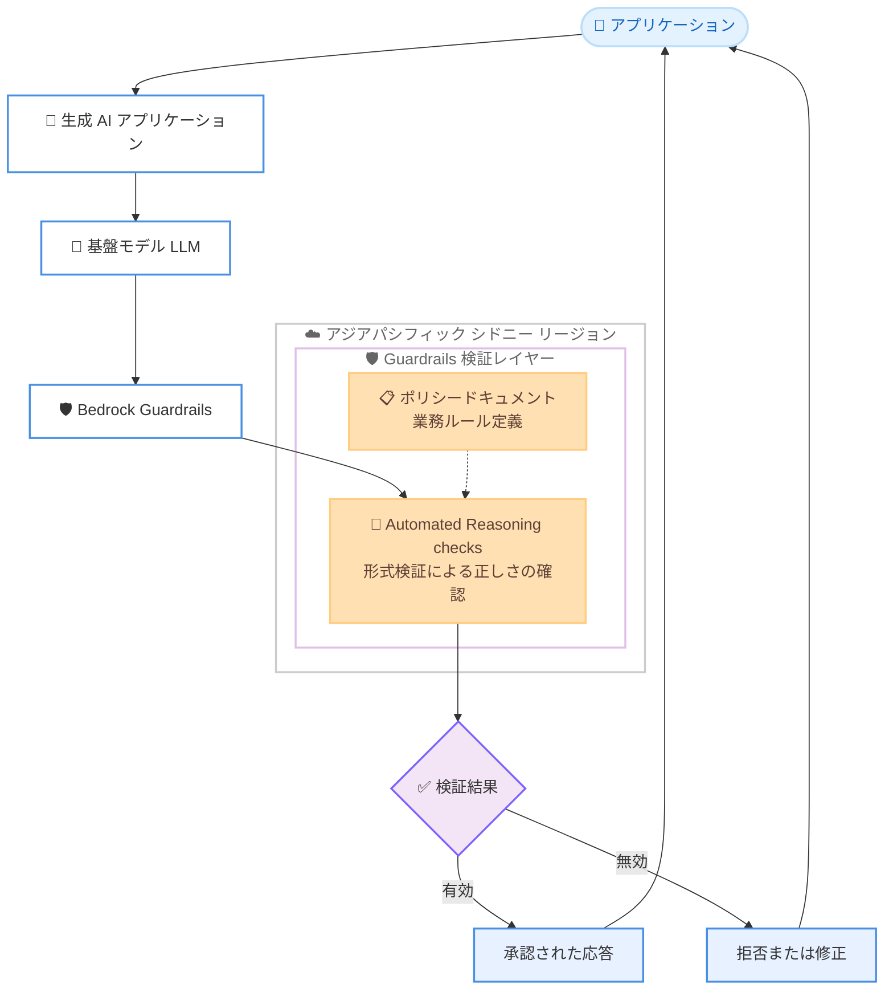

# Amazon Bedrock Guardrails - Automated Reasoning checks がシドニーリージョンに対応

**リリース日**: 2026 年 6 月 16 日
**サービス**: Amazon Bedrock
**機能**: Amazon Bedrock Guardrails - Automated Reasoning checks (自動推論チェック)

📊 [このアップデートのインフォグラフィックを見る](https://takech9203.github.io/aws-news-summary/20260616-amazon-bedrock-guardrails-sydney.html)
<!-- INFOGRAPHIC_BASE_URL は環境変数から取得 -->

## 概要

Amazon Bedrock Guardrails の Automated Reasoning checks (自動推論チェック) が、アジアパシフィック (シドニー) リージョンで利用可能になりました。これにより、オーストラリアおよび周辺地域のお客様も、低レイテンシーかつデータレジデンシー要件を満たした形で本機能を活用できます。

Automated Reasoning checks は、AI モデルの出力に対して形式検証 (formal verification) を適用し、数学的な確実性をもって応答の正しさを確認する機能です。従来のサンプリングベースのテストとは異なるアプローチを採用しており、ハルシネーション、コンプライアンス違反、不明瞭な応答といった、AI システムへの信頼を損なう問題への対処を目的としています。本機能は大規模言語モデル (LLM) からの正しい応答を最大 99% の精度で検出し、確率的なテストではなく数学的保証による検証可能な確証を提供します。

本機能は、金融、医療、法務などの規制が厳しい業界や、AI 出力の確定的な検証を必要とするあらゆる組織を対象としています。今回のシドニーリージョン対応により、対応リージョンはさらに拡大しました。

**アップデート前の課題**

- アジアパシフィック (シドニー) リージョンでは Automated Reasoning checks を利用できず、既存の対応リージョンを経由する必要があった
- データレジデンシー要件のあるオーストラリアの規制業界では、リージョン外での処理が制約となる場合があった
- 地理的に離れたリージョンを利用することで、追加のレイテンシーが発生する可能性があった

**アップデート後の改善**

- アジアパシフィック (シドニー) リージョンで Automated Reasoning checks を直接利用できるようになった
- オーストラリア国内でのデータ処理により、データレジデンシー要件への対応が容易になった
- 地理的に近いリージョンの利用により、レイテンシーの低減が期待できる

## アーキテクチャ図

生成 AI アプリケーションの出力が Bedrock Guardrails を経由し、シドニーリージョン内の Automated Reasoning checks で業務ルールに照らした形式検証を受ける流れを示しています。

## サービスアップデートの詳細

### 主要機能

1. **形式検証による出力の確認**
   - サンプリングベースのテストではなく、形式検証を用いて AI モデル出力の正しさを数学的な確実性で確認する
   - ハルシネーション、コンプライアンス違反、不明瞭な応答といった問題に対処する
   - LLM からの正しい応答を最大 99% の精度で検出する

2. **数学的保証による検証可能な確証**
   - 確率的なテストではなく、数学的保証 (mathematical guarantees) に基づく検証可能な確証を提供する
   - 規制が厳しい環境における本番投入前の検証に活用できる
   - 業務ルールへの準拠を強制し、重要な生成 AI ワークフローの品質保証を実現する

3. **アジアパシフィック (シドニー) リージョンでの提供**
   - 今回のアップデートでシドニーリージョンに対応した
   - Amazon Bedrock コンソールまたは Amazon Bedrock SDK からアクセスできる

## 技術仕様

### 機能概要

| 項目 | 詳細 |
|------|------|
| 検証方式 | 形式検証 (formal verification) |
| 検出精度 | 正しい応答を最大 99% の精度で検出 |
| 保証の種類 | 数学的保証による検証可能な確証 |
| アクセス手段 | Amazon Bedrock コンソール、Amazon Bedrock SDK |
| 主な対象業界 | 金融、医療、法務などの規制業界 |

### 利用形態

Automated Reasoning checks は Amazon Bedrock Guardrails の一機能として提供されます。業務ルールやポリシーをポリシードキュメントとして定義し、AI モデルの出力がそのルールに準拠しているかを形式検証によって確認します。本リリースは新機能の追加ではなく、既存機能のシドニーリージョンへの提供拡大です。

## 設定方法

### 前提条件

1. Amazon Bedrock が利用可能な AWS アカウントを保有していること
2. アジアパシフィック (シドニー) リージョンで Amazon Bedrock を利用できること
3. 検証対象とする業務ルールやポリシーが整理されていること

### 手順

#### ステップ 1: リージョンの選択

Amazon Bedrock コンソールにサインインし、リージョンとしてアジアパシフィック (シドニー) を選択します。これにより、シドニーリージョンで Automated Reasoning checks を構成できます。

#### ステップ 2: Guardrail の作成と Automated Reasoning ポリシーの設定

Amazon Bedrock コンソールの Guardrails 画面から Guardrail を作成し、Automated Reasoning checks を有効化します。業務ルールを記述したポリシードキュメントをもとに、検証ルールを定義します。

#### ステップ 3: アプリケーションへの組み込み

作成した Guardrail をアプリケーションに関連付けます。Amazon Bedrock SDK を利用する場合は、推論リクエスト時に対象の Guardrail を指定し、出力が検証されるように構成します。詳細な設定方法は公式ドキュメントを参照してください。

## メリット

### ビジネス面

- **規制業界での信頼性向上**: 金融、医療、法務などの分野で、AI 出力に対する確定的な検証を実現する
- **データレジデンシー対応**: オーストラリア国内での処理により、データの所在に関する要件への対応が容易になる
- **本番投入前の品質保証**: 重要な生成 AI ワークフローを本番環境に展開する前に、出力の正しさを検証できる

### 技術面

- **低レイテンシー**: 地理的に近いシドニーリージョンの利用により、レイテンシーの低減が期待できる
- **高精度な検出**: 正しい応答を最大 99% の精度で検出する
- **形式検証による確実性**: 確率的手法ではなく、数学的保証に基づく検証を行う

## デメリット・制約事項

### 制限事項

- 本アップデートはリージョン拡大であり、機能自体の仕様変更を含むものではない
- Automated Reasoning checks の利用には、業務ルールをポリシードキュメントとして適切に定義する必要がある
- すべての AWS リージョンで利用できるわけではない

### 考慮すべき点

- 検証の精度や効果は、定義したポリシードキュメントの品質に依存する
- 料金については本発表に明示がないため、最新の料金体系を公式の料金ページで確認する必要がある

## ユースケース

### ユースケース 1: 規制業界における本番投入前の検証

**シナリオ**: オーストラリアの金融機関が、顧客向け生成 AI アシスタントの応答が社内コンプライアンスルールに準拠しているかを本番展開前に確認したい。

**効果**: シドニーリージョン内で形式検証を実施し、データを国外に移動させることなく、規制要件に沿った出力検証を実現できる。

### ユースケース 2: 業務ルールへの準拠強制

**シナリオ**: 医療分野の事業者が、AI が生成する説明文が定められた医療ガイドラインに反していないことを保証したい。

**効果**: ポリシードキュメントに業務ルールを定義し、Automated Reasoning checks で出力がルールに準拠しているかを数学的保証に基づいて検証できる。

### ユースケース 3: 重要ワークフローの品質保証

**シナリオ**: 法務サービスを提供する企業が、契約文書の要約を生成する AI ワークフローの品質を継続的に確保したい。

**効果**: 形式検証によりハルシネーションや不明瞭な応答を高精度で検出し、重要なワークフローの信頼性を高められる。

## 料金

本発表では料金に関する情報は明示されていません。Automated Reasoning checks の料金については、Amazon Bedrock の公式料金ページで最新情報を確認してください。

## 利用可能リージョン

今回のアップデートにより、アジアパシフィック (シドニー) リージョンが新たに対応しました。

- **新規対応**: アジアパシフィック (シドニー)
- **既存の対応リージョン**: 米国東部 (バージニア北部)、米国東部 (オハイオ)、米国西部 (オレゴン)、欧州 (フランクフルト)、欧州 (アイルランド)、欧州 (パリ)

## 関連サービス・機能

- **Amazon Bedrock Guardrails**: Automated Reasoning checks を含む、生成 AI アプリケーションの安全性とコンプライアンスを確保する機能群
- **Amazon Bedrock**: 基盤モデルを利用したアプリケーション構築のためのフルマネージドサービス
- **Amazon Bedrock SDK**: アプリケーションから Guardrails を含む Bedrock 機能を呼び出すための開発キット

## 参考リンク

- 📊 [インフォグラフィック](https://takech9203.github.io/aws-news-summary/20260616-amazon-bedrock-guardrails-sydney.html)
- [公式発表 (What's New)](https://aws.amazon.com/about-aws/whats-new/2026/06/amazon-bedrock-guardrails-sydney/)
- [Amazon Bedrock Guardrails](https://aws.amazon.com/bedrock/guardrails/)

## まとめ

今回のアップデートにより、Amazon Bedrock Guardrails の Automated Reasoning checks がアジアパシフィック (シドニー) リージョンで利用可能になりました。形式検証による高精度な出力検証を、オーストラリア国内のデータレジデンシー要件に対応しつつ低レイテンシーで活用できます。規制業界で生成 AI を導入する組織は、シドニーリージョンでの本機能の利用を検討することをおすすめします。
