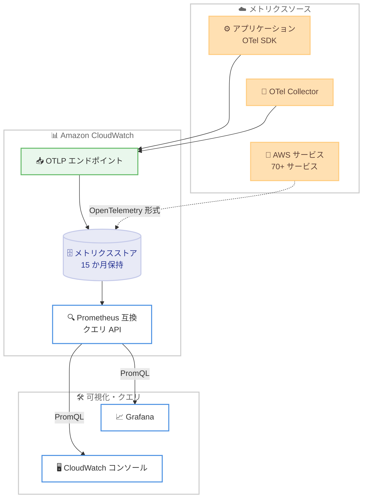

# Amazon CloudWatch - ネイティブ OpenTelemetry メトリクス対応

**リリース日**: 2026年6月16日
**サービス**: Amazon CloudWatch
**機能**: ネイティブ OpenTelemetry メトリクス (PromQL クエリと GB 単位課金)

📊 [このアップデートのインフォグラフィックを見る](https://takech9203.github.io/aws-news-summary/20260616-amazon-cloudwatch-otel-metrics.html)
<!-- INFOGRAPHIC_BASE_URL は環境変数から取得 -->

## 概要

Amazon CloudWatch が OpenTelemetry メトリクスのネイティブサポートを開始しました。これにより、OpenTelemetry プロトコル (OTLP) を通じてメトリクスデータを送信し、Prometheus Query Language (PromQL) を使用してクエリを実行できるようになりました。料金は取り込み量に応じた GB 単位の課金体系で、15 か月間のストレージが含まれます。

この機能の最大の特長は、アプリケーションのカスタムメトリクスと、70 を超える AWS サービスのメトリクスを単一のソリューションに統合し、PromQL で横断的にクエリできる点です。CloudWatch は Prometheus 互換のクエリ API を提供するため、既存の Prometheus や Grafana のツールチェーンを変更することなく、CloudWatch をメトリクスの保存先 (destination) として利用できます。

すでに OpenTelemetry、Prometheus、Grafana を活用している組織にとって、CloudWatch は既存のツールにシームレスに適合する保存先として採用できます。これにより、監視データを一元的に集約し、ベンダーニュートラルなオープンソース計装を維持したまま、AWS のマネージドな運用基盤を活用できます。

**アップデート前の課題**

- 従来の CloudWatch メトリクス (Classic) は PutMetricData API や EMF による取り込みが前提であり、OpenTelemetry や Prometheus を標準とする環境ではメトリクス形式の変換が必要だった
- CloudWatch のクエリ言語は CloudWatch Metrics Insights (SQL) であり、Prometheus エコシステムで広く使われる PromQL とは互換性がなかった
- メトリクスごとの月額課金 (per metric per month) であったため、高カーディナリティなメトリクスを多数扱うコンテナ環境ではコスト予測が難しかった
- ディメンションは 1 メトリクスあたり最大 30 個までという制約があった

**アップデート後の改善**

- OTLP エンドポイントを通じて、Prometheus や Grafana で利用する OpenTelemetry SDK およびコレクターをそのまま CloudWatch に接続できるようになった
- PromQL でカスタムメトリクスと AWS サービスメトリクスを横断的にクエリできるようになった
- 取り込み量に応じた GB 単位課金により、高カーディナリティなワークロードでもコスト構造が明確になった
- 1 データポイントあたり最大 150 個のラベルをサポートし、高カーディナリティな計装に対応できるようになった

## アーキテクチャ図



OTel SDK やコレクターから OTLP エンドポイント経由でメトリクスを取り込み、Prometheus 互換クエリ API を通じて PromQL で Grafana やコンソールから横断的にクエリする流れを示しています。

## サービスアップデートの詳細

### 主要機能

1. **OTLP によるネイティブメトリクス取り込み**
   - OpenTelemetry プロトコル (OTLP) のエンドポイントを通じてメトリクスを送信できる
   - Prometheus や Grafana などと連携する OpenTelemetry SDK およびコレクターが、追加の変換なしでそのまま利用できる
   - ベンダーニュートラルなオープンソース計装を維持したまま、CloudWatch をメトリクスの保存先として利用できる

2. **PromQL によるクエリ**
   - Prometheus Query Language (PromQL) を使用してメトリクスをクエリできる
   - アプリケーションのカスタムメトリクスと 70 を超える AWS サービスのメトリクスを単一のソリューション内で横断的にクエリできる
   - Prometheus 互換のクエリ API を提供するため、既存の Prometheus ベースのツールチェーンから接続できる

3. **GB 単位課金と長期保持**
   - 取り込み量に応じた GB 単位の課金体系を採用
   - 15 か月間のストレージが料金に含まれる
   - 1 データポイントあたり最大 150 個のラベルをサポートし、高カーディナリティなワークロードに適している

## 技術仕様

### 2 つのメトリクスモデルの比較

CloudWatch は OpenTelemetry メトリクスと従来の CloudWatch メトリクス (Classic) の 2 つのモデルをサポートします。いずれも完全にサポートされており、ニーズに応じて選択できます。

| 項目 | OpenTelemetry メトリクス (推奨) | CloudWatch メトリクス (Classic) |
|------|------|------|
| 取り込み | OTLP エンドポイント (OTel SDK、コレクター) | PutMetricData API、EMF |
| クエリ言語 | PromQL | CloudWatch Metrics Insights (SQL) |
| ラベル / ディメンション | 1 データポイントあたり最大 150 ラベル | 1 メトリクスあたり最大 30 ディメンション |
| 料金モデル | 取り込み GB 単位 | メトリクスごとの月額 |
| ストレージ | 最大 15 か月 | 最大 15 か月 |
| メトリクス名 | オープンソースネイティブ | 独自形式 (CloudWatch フォーマット) |
| 適したケース | 新規ワークロード、コンテナ、高カーディナリティ | 既存連携、低カーディナリティな AWS サービスメトリクス |

### 利用開始の指針

- CloudWatch メトリクスを初めて使う場合: OpenTelemetry メトリクス (推奨) から開始する
- すでに PutMetricData や EMF を使用している場合: CloudWatch メトリクス (Classic) を継続して利用できる
- AWS サービスメトリクスを PromQL で扱いたい場合: AWS ベンドメトリクスの OpenTelemetry 形式での取り込みを有効化する

## 設定方法

### 前提条件

1. メトリクスを送信するアプリケーションまたは環境に OpenTelemetry SDK もしくは OpenTelemetry Collector が導入されていること
2. CloudWatch へのメトリクス送信に必要な IAM 権限が付与されていること
3. 利用するリージョンが本機能のサポート対象であること

### 手順

#### ステップ 1: OpenTelemetry エクスポーターを CloudWatch の OTLP エンドポイントに向ける

OpenTelemetry Collector または SDK のエクスポーター設定で、メトリクスの送信先を CloudWatch の OTLP エンドポイントに設定します。既存の OTel SDK やコレクターをそのまま利用できるため、計装コードの変更は最小限で済みます。

#### ステップ 2: AWS サービスメトリクスを OpenTelemetry 形式で有効化する

AWS サービスのメトリクスを PromQL で横断的に扱いたい場合、AWS ベンドメトリクスの OpenTelemetry 形式での取り込みを有効化します。これにより、70 を超える AWS サービスのメトリクスとカスタムメトリクスを単一のクエリで扱えるようになります。

#### ステップ 3: PromQL でクエリを実行する

CloudWatch コンソールまたは Prometheus 互換のクエリ API、もしくは Grafana などの既存ツールから PromQL を使用してメトリクスをクエリします。詳細な設定手順は公式ドキュメントを参照してください。

## メリット

### ビジネス面

- **既存ツールチェーンの活用**: Prometheus や Grafana などの既存ツールを変更せずに CloudWatch を保存先として採用でき、移行コストを抑えられる
- **コスト構造の明確化**: 取り込み量に応じた GB 単位課金により、メトリクス数が増えやすいコンテナ環境でもコストを予測しやすい
- **監視データの一元化**: カスタムメトリクスと AWS サービスメトリクスを単一のソリューションに集約し、運用の分断を解消できる

### 技術面

- **オープンスタンダードへの準拠**: ベンダーニュートラルな OpenTelemetry を標準とすることで、特定ベンダーへのロックインを回避できる
- **高カーディナリティ対応**: 1 データポイントあたり最大 150 個のラベルをサポートし、詳細なディメンションを持つメトリクスを扱える
- **横断的なクエリ**: PromQL によりアプリケーションメトリクスと AWS サービスメトリクスを横断的に分析できる

## デメリット・制約事項

### 制限事項

- 一部のリージョン (中東 (UAE)、中東 (バーレーン)、イスラエル (テルアビブ)) では利用できない
- OpenTelemetry メトリクスモデルと CloudWatch メトリクス (Classic) ではクエリ言語が異なる (PromQL と CloudWatch Metrics Insights)

### 考慮すべき点

- 既存の PutMetricData や EMF ベースの計装は CloudWatch メトリクス (Classic) のままとなり、PromQL で扱うには OpenTelemetry 形式への移行や AWS ベンドメトリクスの有効化が必要
- 取り込み量に応じた課金のため、高頻度・高カーディナリティなメトリクスを送信する場合は取り込み GB 量を見積もる必要がある

## ユースケース

### ユースケース 1: コンテナワークロードの統合監視

**シナリオ**: Amazon EKS 上で稼働するマイクロサービス群を、Prometheus と Grafana で監視している組織が、運用基盤をマネージドサービスに集約したいと考えている。

**実装例**:
```
OTel Collector → CloudWatch OTLP エンドポイント → PromQL クエリ (Grafana)
```

**効果**: 既存の OTel Collector と Grafana ダッシュボードをそのまま利用しつつ、Prometheus サーバーの運用負荷を削減し、15 か月の長期保持を確保できる。

### ユースケース 2: カスタムメトリクスと AWS メトリクスの横断分析

**シナリオ**: アプリケーション固有のビジネスメトリクスと、ELB や RDS などの AWS サービスメトリクスを同一のクエリで相関分析したい。

**実装例**:
```
カスタムメトリクス (OTLP) + AWS ベンドメトリクス (OpenTelemetry 形式) → 単一の PromQL クエリ
```

**効果**: アプリケーション層とインフラ層のメトリクスを横断的に分析でき、障害の根本原因分析を効率化できる。

### ユースケース 3: ベンダーロックインを避けた監視基盤の構築

**シナリオ**: 将来的なマルチクラウドや他バックエンドへの移行可能性を考慮し、オープンスタンダードに準拠した計装を維持したい。

**実装例**:
```
OpenTelemetry SDK (ベンダーニュートラル) → CloudWatch を含む複数の保存先に送信可能
```

**効果**: 計装コードを変更せずに保存先を切り替えられるため、特定ベンダーへの依存を回避しながら CloudWatch のマネージド機能を活用できる。

## 料金

OpenTelemetry メトリクスは、取り込み量に応じた GB 単位の課金体系を採用します。15 か月間のストレージが料金に含まれます。従来の CloudWatch メトリクス (Classic) はメトリクスごとの月額課金であるのに対し、本機能は取り込みデータ量で課金される点が異なります。

正確な単価とリージョンごとの料金は、公式の料金ページを参照してください。

### 料金例

| 使用量 | 月額料金（概算） |
|--------|------------------|
| 取り込み量に応じた GB 単位課金 | 料金ページを参照 |
| 15 か月のストレージ | 料金に含まれる |

## 利用可能リージョン

すべての商用 AWS リージョンで利用可能です。ただし、以下のリージョンは対象外です。

- 中東 (UAE)
- 中東 (バーレーン)
- イスラエル (テルアビブ)

## 関連サービス・機能

- **Amazon Managed Service for Prometheus**: Prometheus 互換のメトリクス監視を提供するマネージドサービス。CloudWatch のネイティブ OpenTelemetry メトリクスは、Prometheus エコシステムとの統合をさらに広げる
- **Amazon Managed Grafana**: PromQL でクエリしたメトリクスの可視化先として利用できる
- **AWS Distro for OpenTelemetry (ADOT)**: AWS がサポートする OpenTelemetry ディストリビューション。CloudWatch への OTLP 送信に活用できる

## 参考リンク

- 📊 [インフォグラフィック](https://takech9203.github.io/aws-news-summary/20260616-amazon-cloudwatch-otel-metrics.html)
- [公式発表 (What's New)](https://aws.amazon.com/about-aws/whats-new/2026/06/amazon-cloudwatch-otel-metrics/)
- [ドキュメント (Metrics in Amazon CloudWatch)](https://docs.aws.amazon.com/AmazonCloudWatch/latest/monitoring/working_with_metrics.html)
- [料金ページ](https://aws.amazon.com/cloudwatch/pricing/)

## まとめ

Amazon CloudWatch のネイティブ OpenTelemetry メトリクス対応は、Prometheus や Grafana を中心とするオープンソース監視エコシステムと CloudWatch を直接つなぐ重要なアップデートです。OTLP による取り込み、PromQL でのクエリ、GB 単位課金という構成により、既存ツールを維持したまま AWS のマネージド基盤を活用できます。コンテナや高カーディナリティなワークロードを運用している組織は、OpenTelemetry メトリクスモデルへの移行を検討し、まずは小規模なワークロードで取り込み量とコストを評価することを推奨します。
