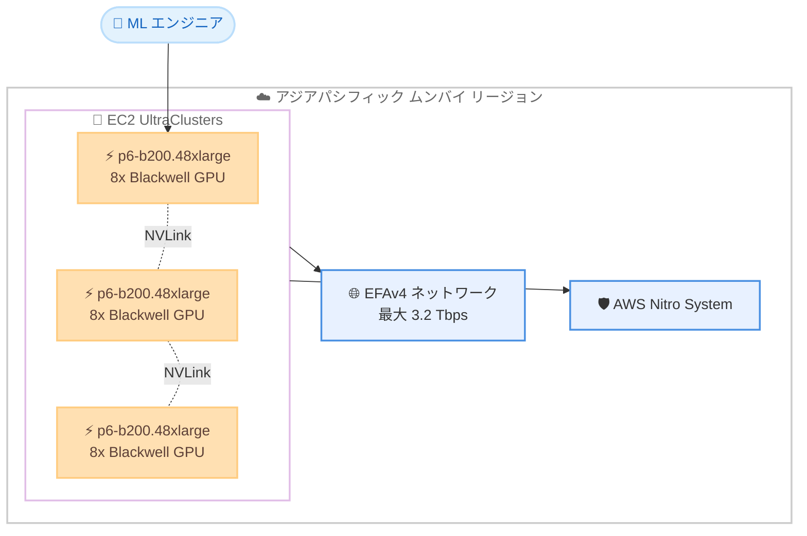

# Amazon EC2 - P6-B200 インスタンス (アジアパシフィック (ムンバイ) リージョン)

**リリース日**: 2026 年 6 月 16 日
**サービス**: Amazon Elastic Compute Cloud (Amazon EC2)
**機能**: Amazon EC2 P6-B200 インスタンス

📊 [このアップデートのインフォグラフィックを見る](https://takech9203.github.io/aws-news-summary/20260616-amazon-ec2-p6-b200-mumbai.html)
<!-- INFOGRAPHIC_BASE_URL は環境変数から取得 -->

## 概要

AWS は、NVIDIA Blackwell GPU を搭載した Amazon EC2 P6-B200 インスタンスをアジアパシフィック (ムンバイ) リージョンで利用可能にしました。P6-B200 インスタンスは、8 基の NVIDIA Blackwell GPU を搭載し、AI トレーニングおよび推論ワークロードにおいて P5en インスタンスと比較して最大 2 倍のパフォーマンスを提供します。

P6-B200 インスタンスは AWS Nitro System 上に構築されており、最大 3.2 Tbps の第 4 世代 Elastic Fabric Adapter (EFAv4) ネットワーキングを備えています。これにより、Amazon EC2 UltraClusters 内で数万基規模の GPU へと、信頼性とセキュリティを保ちながら AI ワークロードをスケールできます。大規模な基盤モデルのトレーニングや、本番環境でのリアルタイム推論を行うお客様が主な対象です。

今回のリリースにより、ムンバイリージョンを利用するお客様は、低レイテンシーかつデータ所在地の要件を満たしながら、最新世代の GPU アクセラレーションコンピューティングを活用できるようになりました。

**アップデート前の課題**

- アジアパシフィック (ムンバイ) リージョンでは、NVIDIA Blackwell 世代の GPU インスタンスを利用できなかった
- インドのデータ所在地要件を持つお客様が、最新の GPU を利用するには他リージョンを選択する必要があった
- 前世代の P5en インスタンスでは、最新の大規模 AI ワークロードに対するパフォーマンスやメモリ帯域幅に制約があった

**アップデート後の改善**

- ムンバイリージョンで P6-B200 インスタンスを起動できるようになった
- インド国内でデータを保持しながら、最新世代の GPU アクセラレーションを利用できるようになった
- P5en と比較して、AI トレーニングおよび推論で最大 2 倍のパフォーマンス、GPU メモリ帯域幅で 60% の向上を実現した

## アーキテクチャ図



複数の P6-B200 インスタンスが EFAv4 ネットワークと NVLink で相互接続され、EC2 UltraClusters として大規模な分散トレーニングを実現する構成を示しています。

## サービスアップデートの詳細

### 主要機能

1. **NVIDIA Blackwell GPU の搭載**
   - 1 インスタンスあたり 8 基の NVIDIA Blackwell GPU を搭載
   - 合計 1,440 GB の高帯域幅 GPU メモリ (HBM3e) を提供
   - P5en と比較して GPU メモリ帯域幅が 60% 向上

2. **高速なネットワーキング**
   - 最大 3.2 Tbps の第 4 世代 Elastic Fabric Adapter (EFAv4) を搭載
   - GPU 間は NVLink により高帯域幅で相互接続
   - EC2 UltraClusters により数万基規模の GPU へスケール可能

3. **AWS Nitro System による構築**
   - セキュリティとパフォーマンスを両立した Nitro System 上で稼働
   - 第 5 世代 Intel Xeon スケーラブルプロセッサ (Emerald Rapids) を採用
   - 大規模 AI ワークロードを信頼性とセキュリティを保ちながらスケール

## 技術仕様

### p6-b200.48xlarge のスペック

| 項目 | 詳細 |
|------|------|
| GPU | 8 基の NVIDIA Blackwell |
| GPU メモリ | 1,440 GB HBM3e |
| vCPU | 192 |
| システムメモリ | 2,048 GiB |
| ローカル NVMe SSD | 8 × 3.84 TB (合計約 30 TB) |
| ネットワーク帯域幅 | 最大 3.2 Tbps (EFAv4) |
| EBS 帯域幅 | 100 Gbps |
| プロセッサ | 第 5 世代 Intel Xeon (Emerald Rapids) |
| NVLink 帯域幅 | 最大 14.4 TB/s (双方向合計) |

### API 変更履歴

今回のアップデートは既存インスタンスタイプのリージョン拡大であり、新規 API メソッドの追加はありません。既存の EC2 API (`RunInstances`、`DescribeInstanceTypes` など) を使用してインスタンスを起動します。

## 設定方法

### 前提条件

1. アジアパシフィック (ムンバイ) リージョンが有効化された AWS アカウント
2. P6-B200 インスタンスタイプに対する vCPU クォータの確保
3. キャパシティ確保のための Capacity Blocks for ML の予約 (推奨)

### 手順

#### ステップ1: Capacity Blocks for ML でキャパシティを予約する

```bash
# 指定期間の GPU キャパシティを検索する
aws ec2 describe-capacity-block-offerings \
  --instance-type p6-b200.48xlarge \
  --instance-count 2 \
  --start-date-range 2026-06-20T00:00:00Z \
  --capacity-duration-hours 24 \
  --region ap-south-1
```

上記コマンドは、ムンバイリージョン (`ap-south-1`) で利用可能な P6-B200 のキャパシティブロックを検索します。GPU インスタンスは需要が高いため、Capacity Blocks for ML による事前予約が推奨されます。

#### ステップ2: インスタンスを起動する

```bash
# 予約したキャパシティブロックを指定してインスタンスを起動する
aws ec2 run-instances \
  --instance-type p6-b200.48xlarge \
  --capacity-reservation-specification \
    'CapacityReservationTarget={CapacityReservationId=cr-xxxxxxxxxxxxxxxxx}' \
  --image-id ami-xxxxxxxxxxxxxxxxx \
  --region ap-south-1
```

予約済みのキャパシティブロックを指定し、ディープラーニング用の AMI を使用して P6-B200 インスタンスを起動します。

#### ステップ3: 分散トレーニングのセットアップ

複数インスタンスで分散トレーニングを行う場合は、EFA と NCCL を有効化したクラスタープレイスメントグループを構成し、UltraClusters のネットワーク性能を最大限に活用します。

## メリット

### ビジネス面

- **データ所在地への対応**: インド国内でデータを保持しながら最新の GPU を利用できる
- **市場投入の高速化**: 最大 2 倍のパフォーマンスにより、モデル開発のサイクルを短縮できる
- **低レイテンシー**: インド国内のユーザーに対して低レイテンシーで推論サービスを提供できる

### 技術面

- **高いトレーニング性能**: P5en 比で最大 2 倍の AI トレーニング/推論パフォーマンス
- **大容量 GPU メモリ**: 1,440 GB の HBM3e により大規模モデルを効率的に扱える
- **大規模スケール**: EC2 UltraClusters により数万基規模の GPU へスケール可能

## デメリット・制約事項

### 制限事項

- p6-b200.48xlarge は UltraServers の構成には対応していない
- GPU インスタンスは需要が高く、Capacity Blocks for ML による事前予約が事実上必要となる場合がある
- インスタンスサイズは p6-b200.48xlarge の単一構成のみ

### 考慮すべき点

- 高性能インスタンスのためコストが高く、ワークロードに見合った利用計画が必要
- 分散トレーニングでは EFA や NCCL の適切な設定がパフォーマンスに影響する
- vCPU クォータの引き上げ申請が必要になる場合がある

## ユースケース

### ユースケース1: 大規模基盤モデルのトレーニング

**シナリオ**: 数兆パラメータ規模の Mixture of Experts (MoE) や推論モデルをトレーニングするケース

**効果**: 1,440 GB の GPU メモリと EFAv4 ネットワーキングにより、大規模な分散トレーニングを効率的に実行できる

### ユースケース2: 本番環境でのリアルタイム推論

**シナリオ**: 生成 AI やエージェント型 AI アプリケーション (コンテンツ生成、エンタープライズコパイロットなど) を本番環境で運用するケース

**効果**: 高い推論性能により、低レイテンシーで大量のリクエストを処理できる

### ユースケース3: データ所在地要件のある AI 開発

**シナリオ**: インド国内でデータを保持する必要がある金融や公共部門のお客様が AI モデルを開発するケース

**効果**: ムンバイリージョンで最新 GPU を利用でき、コンプライアンス要件を満たしながら開発できる

## 料金

P6-B200 インスタンスは、オンデマンド、Savings Plans、Capacity Blocks for ML などの購入オプションで利用できます。GPU インスタンスのキャパシティを確実に確保するには、Capacity Blocks for ML による予約が推奨されます。最新かつ正確な料金は、Amazon EC2 の料金ページでアジアパシフィック (ムンバイ) リージョンを選択して確認してください。

## 利用可能リージョン

P6-B200 インスタンスは、以下のリージョンで利用可能です。

- 米国西部 (オレゴン)
- 米国東部 (バージニア北部、オハイオ)
- AWS GovCloud (US-West、US-East)
- アジアパシフィック (ムンバイ) ← 今回追加

## 関連サービス・機能

- **Amazon EC2 UltraClusters**: 数万基規模の GPU へスケールするためのネットワーク構成
- **AWS Nitro System**: P6-B200 インスタンスの基盤となるセキュアな仮想化基盤
- **Elastic Fabric Adapter (EFA)**: 分散 ML トレーニング向けの高速ネットワーキング
- **Capacity Blocks for ML**: GPU キャパシティを事前予約するための購入オプション

## 参考リンク

- 📊 [インフォグラフィック](https://takech9203.github.io/aws-news-summary/20260616-amazon-ec2-p6-b200-mumbai.html)
- [公式発表 (What's New)](https://aws.amazon.com/about-aws/whats-new/2026/06/amazon-ec2-p6-b200-mumbai/)
- [Amazon EC2 P6 インスタンス](https://aws.amazon.com/ec2/instance-types/p6/)
- [Amazon EC2 料金](https://aws.amazon.com/ec2/pricing/)

## まとめ

Amazon EC2 P6-B200 インスタンスのアジアパシフィック (ムンバイ) リージョンへの追加により、インドのお客様はデータ所在地要件を満たしながら NVIDIA Blackwell 世代の最新 GPU を活用できるようになりました。大規模な基盤モデルのトレーニングや本番環境でのリアルタイム推論を計画しているお客様は、Capacity Blocks for ML による早期のキャパシティ予約を検討することを推奨します。
