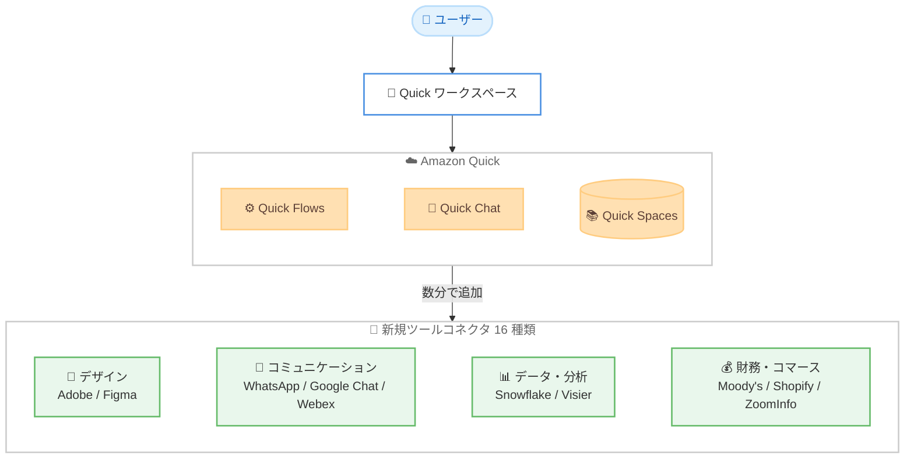

# Amazon Quick - Adobe、Figma、WhatsApp など 16 種類の新規コネクタ追加

**リリース日**: 2026 年 6 月 16 日
**サービス**: Amazon Quick
**機能**: 新しいツールコネクタによる統合の拡張 (Adobe、Figma、WhatsApp ほか)

📊 [このアップデートのインフォグラフィックを見る](https://takech9203.github.io/aws-news-summary/20260616-amazon-quick-adobe-figma-whatsapp.html)
<!-- INFOGRAPHIC_BASE_URL は環境変数から取得 -->

## 概要

Amazon Quick が 16 種類の新しいツールコネクタを追加し、統合の対象を大きく拡張しました。これにより、チームはデータ、分析、デザイン、コミュニケーションといった各種アプリから得たインサイトに対して、コンテキストを切り替えることなく行動を起こせるようになりました。

今回追加されたコネクタは、生産性、デザイン、分析、データ基盤、財務インテリジェンス、コマース、コミュニケーションなど幅広いカテゴリにまたがります。具体的には、Adobe、Cisco Video Messaging、Cisco Webex Meetings、Dun & Bradstreet、Figma、Google Chat、HG Insights、Microsoft OneNote、Moody's、Shopify、Smartsheet、Snowflake、Visier、WhatsApp、Zapier、ZoomInfo の 16 種類です。これらのコネクタにより、チームが日常的に利用しているツールどうしを 1 つの会話の中で連携させ、複数ツールにまたがるワークフローを構築できます。

これらの新しいコネクタは、既存の統合と並んで Quick Flows、Quick Chat、Quick Spaces で利用できます。ツールの追加は数分で完了し、追加後はすぐに会話型インターフェイスから各ツールを操作できます。たとえば、収益チームは Dun & Bradstreet からアカウントデータを取得し、それを Snowflake のデータセットと突き合わせ、Smartsheet でアウトリーチのタスクを管理するといった一連の作業を、1 つの会話の中で完結できます。

**アップデート前の課題**

- 以前はデータ、デザイン、コミュニケーションといった複数のアプリにまたがる作業を行う際に、ツール間でコンテキストを切り替える必要がありました
- 以前は Adobe、Figma、WhatsApp などのツールを Quick の会話型ワークフローに組み込む標準的な手段がありませんでした
- 以前は複数のツールを横断したワークフローを 1 つの会話の中で構築することが困難でした

**アップデート後の改善**

- 今回のアップデートにより、16 種類の新しいコネクタを通じて、コンテキストを切り替えずに各アプリのインサイトに対して行動を起こせるようになりました
- 今回のアップデートにより、生産性、デザイン、分析、財務、コマース、コミュニケーションなど幅広いカテゴリのツールを連携できるようになりました
- 今回のアップデートにより、複数ツールにまたがるワークフローを 1 つの会話の中で数分で構築できるようになりました

## アーキテクチャ図



複数カテゴリの新規コネクタが Quick の各機能 (Flows、Chat、Spaces) から利用でき、1 つの会話の中で複数ツールを横断したワークフローを構築できることを示しています。

## サービスアップデートの詳細

### 主要機能

1. **16 種類の新規ツールコネクタ**
   - Adobe、Cisco Video Messaging、Cisco Webex Meetings、Dun & Bradstreet、Figma、Google Chat、HG Insights、Microsoft OneNote、Moody's、Shopify、Smartsheet、Snowflake、Visier、WhatsApp、Zapier、ZoomInfo を追加
   - 生産性、デザイン、分析、データ基盤、財務インテリジェンス、コマース、コミュニケーションのカテゴリをカバー
   - チームが普段使っているツールに Quick から直接接続可能

2. **複数ツールを横断したワークフロー**
   - 1 つの会話の中で複数のツールを組み合わせて操作可能
   - 例: Dun & Bradstreet のアカウントデータを Snowflake のデータセットと突き合わせ、Smartsheet でアウトリーチタスクを管理
   - コンテキストの切り替えなしにインサイトから行動へ移行

3. **Quick の各機能との統合**
   - Quick Flows、Quick Chat、Quick Spaces で利用可能
   - 既存の統合と並んで動作
   - ツールの追加は数分で完了

## 技術仕様

### 新規コネクタのカテゴリ別整理

| カテゴリ | 主なコネクタ |
|----------|--------------|
| デザイン | Adobe、Figma |
| コミュニケーション | WhatsApp、Google Chat、Cisco Video Messaging、Cisco Webex Meetings |
| 生産性 | Microsoft OneNote、Smartsheet、Zapier |
| データ・分析 | Snowflake、Visier |
| 財務インテリジェンス | Dun & Bradstreet、Moody's、HG Insights、ZoomInfo |
| コマース | Shopify |

### API 変更履歴

今回のアップデートに関連する awsapichanges.com への API 変更の記録は確認できませんでした。コネクタの追加は Amazon Quick の統合機能として提供されています。

## 設定方法

### 前提条件

1. Amazon Quick が利用可能なリージョンでアカウントを保有していること
2. 接続したい各ツール (Adobe、Figma、WhatsApp など) の有効なアカウントと認証情報
3. Quick ワークスペースへのアクセス権限

### 手順

#### ステップ 1: Quick の統合設定を開く

Quick ワークスペースの統合 (Integrations) 設定画面を開き、追加したいコネクタを選択します。今回追加された 16 種類のコネクタが選択肢に表示されます。

#### ステップ 2: コネクタを認証して追加

選択したコネクタの認証フローに従ってアカウントを接続します。ツールの追加は数分で完了します。

#### ステップ 3: ワークフローで利用

接続が完了すると、Quick Flows、Quick Chat、Quick Spaces から該当ツールを呼び出せるようになります。複数のツールを組み合わせて、1 つの会話の中でワークフローを構築できます。

## メリット

### ビジネス面

- **コンテキスト切り替えの削減**: データ、分析、デザイン、コミュニケーションの各アプリを横断する作業を 1 つの会話で完結できます
- **迅速な導入**: ツールの追加は数分で完了し、すぐに業務に活用できます
- **チーム横断の連携強化**: 収益チームやデザインチームなど、異なるツールを使うチームの作業を統合できます

### 技術面

- **幅広いツールカバレッジ**: 生産性からコマースまで多様なカテゴリのツールに対応します
- **既存統合との共存**: 新規コネクタは既存の統合と並んで動作し、追加導入が容易です
- **会話型インターフェイスでの操作**: 各ツールを自然言語で操作できます

## デメリット・制約事項

### 制限事項

- 各コネクタを利用するには、対象ツール側の有効なアカウントと認証情報が必要です
- 利用できるのは Amazon Quick が提供されているリージョンに限られます

### 考慮すべき点

- 外部ツールとの連携にあたっては、各ツールへのアクセス権限とデータガバナンスのポリシーを確認することが推奨されます
- コネクタごとに利用可能な操作範囲は対象ツールの API 仕様に依存します

## ユースケース

### ユースケース 1: 収益チームのアカウント分析とアウトリーチ管理

**シナリオ**: 営業・収益チームがターゲットアカウントの情報を収集し、社内データと突き合わせたうえでアウトリーチ活動を管理します。

**実装例**:
```
1. Dun & Bradstreet からアカウントデータを取得
2. Snowflake のデータセットと突き合わせて分析
3. Smartsheet でアウトリーチタスクを作成・追跡
```

**効果**: 複数ツールにまたがる一連の作業を 1 つの会話で完結し、手作業によるツール間のデータ移動を削減できます。

### ユースケース 2: デザインチームのアセット連携

**シナリオ**: デザインチームが Adobe や Figma のデザインアセットに関する情報を Quick の会話から参照します。

**実装例**:
```
1. Figma からデザインファイルの情報を取得
2. Adobe のアセットと関連付けて確認
3. Quick Spaces の企業ナレッジと組み合わせて文脈を補完
```

**効果**: デザインツールを切り替えることなく、関連情報を会話形式で把握できます。

### ユースケース 3: コミュニケーションを含むワークフローの自動化

**シナリオ**: 業務プロセスの結果をチームメンバーや顧客に通知します。

**実装例**:
```
1. 分析結果を Quick Flows で生成
2. WhatsApp や Google Chat を通じて関係者へ通知
3. Cisco Webex Meetings でフォローアップを設定
```

**効果**: インサイトの取得から関係者への共有までを 1 つのワークフローで自動化できます。

## 料金

本アップデートに関する個別の料金は公表されていません。Amazon Quick の料金体系に準じます。Amazon Quick には無料トライアルが用意されており、詳細は Quick の公式サイトおよび統合 (Integrations) ページで確認できます。

## 利用可能リージョン

Amazon Quick が利用可能なすべての AWS リージョンで利用できます。

## 関連サービス・機能

- **Quick Flows**: 反復可能なワークフローのオーケストレーション機能で、新規コネクタを組み込めます
- **Quick Chat**: 会話型インターフェイスで各ツールを自然言語から操作できます
- **Quick Spaces**: 企業ナレッジを保存し、コネクタから取得した情報とあわせて文脈に沿った回答を生成します

## 参考リンク

- 📊 [インフォグラフィック](https://takech9203.github.io/aws-news-summary/20260616-amazon-quick-adobe-figma-whatsapp.html)
- [公式発表 (What's New)](https://aws.amazon.com/about-aws/whats-new/2026/06/amazon-quick-adobe-figma-whatsapp/)

## まとめ

Amazon Quick は 16 種類の新しいツールコネクタを追加し、デザイン、コミュニケーション、財務、コマースなど幅広いカテゴリのツールとの連携を実現しました。コンテキストを切り替えずに複数ツールを横断したワークフローを構築したいチームは、Quick の統合設定から必要なコネクタを数分で追加し、Quick Flows や Quick Chat での活用を検討することを推奨します。
