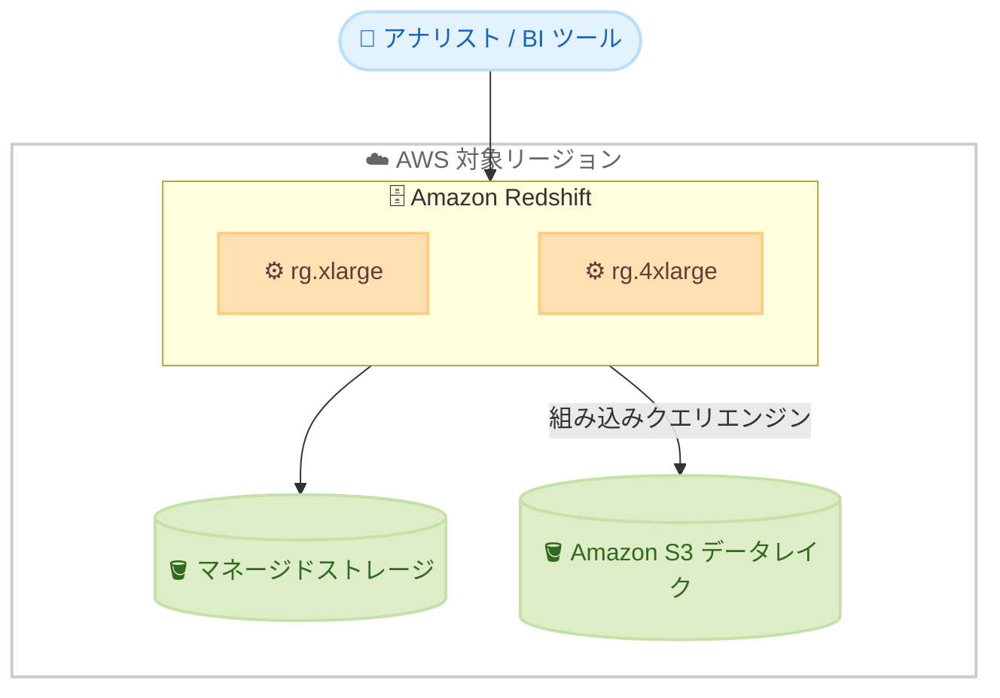

# Amazon Redshift - AWS Graviton 搭載 RG インスタンスの追加リージョン提供

**リリース日**: 2026 年 6 月 16 日
**サービス**: Amazon Redshift
**機能**: AWS Graviton 搭載 RG インスタンス

📊 [このアップデートのインフォグラフィックを見る](https://takech9203.github.io/aws-news-summary/20260616-amazon-redshift-rg-instances-3-additional-regions.html)
<!-- INFOGRAPHIC_BASE_URL は環境変数から取得 -->

## 概要

AWS は、AWS Graviton プロセッサを搭載した Amazon Redshift RG インスタンスを、新たに 3 つのリージョンで提供開始しました。RG インスタンスは、小規模な開発環境から本番環境の大規模ワークロードまで対応する、データウェアハウス向けのコンピュートノードです。

RG インスタンスは AWS の公表値で、他のデータウェアハウスと比較して最大 4.2 倍の価格性能比を実現し、前世代の RA3 インスタンスと比べて最大 2.4 倍高速に動作し、vCPU あたりのコストが 30% 低くなります。また、コンピュートとマネージドストレージを独立してスケールおよび課金できる点も特徴です。今回の提供により、これら 3 リージョンのお客様も、rg.xlarge および rg.4xlarge のノードタイプを利用できるようになりました。

このアップデートは、対象リージョンでデータウェアハウスを運用しているお客様や、既存の RA3 プロビジョンドインスタンスからの移行を検討しているお客様にとって、クエリ性能の向上とコンピュートコストの削減につながります。

**アップデート前の課題**

- 今回追加された 3 リージョンでは、Graviton 搭載の RG インスタンスを利用できなかった
- 対象リージョンのお客様は、RA3 インスタンスを利用する必要があり、最新世代の価格性能比を享受できなかった
- データレイクへのクエリに Redshift Spectrum のスキャン課金が発生していた

**アップデート後の改善**

- アフリカ、アジアパシフィック、メキシコの 3 リージョンで RG インスタンスが利用可能になった
- 既存の RA3 プロビジョンドインスタンスを RG インスタンスにアップグレードし、クエリ性能の向上とコンピュートコスト削減が可能になった
- RG インスタンスは組み込みのデータレイククエリエンジンを備え、Redshift Spectrum のスキャン課金が不要になった

## アーキテクチャ図



RG インスタンスは、コンピュートとマネージドストレージを独立してスケールしながら、組み込みのデータレイククエリエンジンにより Amazon S3 上のデータを Spectrum なしで直接クエリできます。

## サービスアップデートの詳細

### 主要機能

1. **AWS Graviton 搭載のコンピュートノード**
   - データウェアハウスワークロード向けに最適化された Graviton プロセッサを採用
   - 他のデータウェアハウスと比較して最大 4.2 倍の価格性能比 (AWS 公表値)
   - 前世代の RA3 インスタンスと比べて最大 2.4 倍高速、vCPU あたりのコストが 30% 削減

2. **コンピュートとストレージの独立したスケーリング**
   - RG ノードはマネージドストレージを備え、コンピュートとストレージを個別にスケールおよび課金が可能
   - 提供ノードタイプは rg.xlarge と rg.4xlarge

3. **組み込みデータレイククエリエンジン**
   - RG インスタンスはデータレイククエリエンジンを内蔵し、Redshift Spectrum を必要としない
   - Amazon S3 でスキャンしたデータに対する Spectrum のスキャン課金が発生しない

4. **増分手動スナップショットによるバックアップコスト最適化**
   - スナップショット全体のサイズではなく、一意のデータブロックに基づいてバックアップストレージを計測
   - バックアップストレージのコストを削減

## 技術仕様

### ノードタイプ

| 項目 | 詳細 |
|------|------|
| 提供ノードタイプ | rg.xlarge、rg.4xlarge |
| プロセッサ | AWS Graviton |
| ストレージ | マネージドストレージ (コンピュートと独立してスケール) |
| データレイククエリ | 組み込みエンジン (Redshift Spectrum 不要) |

### API 変更履歴

今回のアップデートはリージョン拡大が中心であり、API メソッドの追加・変更は確認されていません。

## 設定方法

### 前提条件

1. 対象リージョン (アフリカ (ケープタウン)、アジアパシフィック (バンコク)、メキシコ (中部)) のいずれかで Amazon Redshift を利用可能であること
2. RG インスタンスを作成または既存クラスターをアップグレードするための適切な IAM 権限
3. 既存の RA3 インスタンスからの移行を検討する場合、現行クラスターの構成把握

### 手順

#### ステップ 1: RG インスタンスでクラスターを新規作成する

Amazon Redshift コンソールまたは AWS CLI から、ノードタイプに `rg.xlarge` または `rg.4xlarge` を指定してクラスターを作成します。

```bash
aws redshift create-cluster \
  --cluster-identifier my-rg-cluster \
  --node-type rg.4xlarge \
  --number-of-nodes 4 \
  --master-username admin \
  --master-user-password <YourPassword> \
  --region ap-southeast-7
```

上記のコマンドは、アジアパシフィック (バンコク) リージョンに rg.4xlarge ノード 4 台で構成される Redshift クラスターを新規作成します。

#### ステップ 2: 既存の RA3 インスタンスを RG インスタンスにアップグレードする

既存の RA3 プロビジョンドインスタンスは、RG インスタンスへアップグレードすることで、クエリ性能の向上とコンピュートコストの削減が可能です。アップグレード手順については、Amazon Redshift のドキュメントを参照してください。

## メリット

### ビジネス面

- **コスト削減**: vCPU あたりのコストが前世代比 30% 低く、Redshift Spectrum のスキャン課金も不要になり、運用コストを抑制できる
- **価格性能比の向上**: 他のデータウェアハウスと比較して最大 4.2 倍の価格性能比により、同じ予算でより多くの分析処理を実行できる
- **対象リージョンでの選択肢拡大**: アフリカ、アジアパシフィック、メキシコのお客様も最新世代のインスタンスを採用できる

### 技術面

- **高速なクエリ処理**: 前世代の RA3 と比べて最大 2.4 倍高速に動作する
- **柔軟なスケーリング**: コンピュートとマネージドストレージを独立してスケールできる
- **データレイク統合の簡素化**: 組み込みクエリエンジンにより Spectrum を構成せずに Amazon S3 のデータを直接クエリできる

## デメリット・制約事項

### 制限事項

- 提供されるノードタイプは rg.xlarge と rg.4xlarge に限定される
- 本アップデートで追加されたのは 3 リージョンのみであり、全リージョンで利用できるわけではない

### 考慮すべき点

- 性能・コストに関する数値は AWS の公表値であり、実際のワークロードでの効果は事前検証が推奨される
- RA3 から RG へのアップグレードは、移行手順や互換性を事前に確認する必要がある

## ユースケース

### ユースケース 1: 対象リージョンでのデータウェアハウス新規構築

**シナリオ**: アジアパシフィック (バンコク) でデータ分析基盤を新規に立ち上げる際、最新世代のコンピュートノードを採用したい。

**効果**: RG インスタンスにより、高い価格性能比でデータウェアハウスを構築でき、コンピュートとストレージを独立してスケールできる。

### ユースケース 2: RA3 からの移行によるコスト最適化

**シナリオ**: 既存の RA3 クラスターを運用しているが、コンピュートコストの削減とクエリ性能の向上を図りたい。

**効果**: RG インスタンスへのアップグレードにより、vCPU あたりのコストを抑えつつ、最大 2.4 倍の高速化が期待できる。

### ユースケース 3: データレイクとの統合分析

**シナリオ**: Amazon S3 上のデータレイクと Redshift のデータを横断的に分析したいが、Spectrum のスキャン課金を抑えたい。

**効果**: 組み込みのデータレイククエリエンジンにより、Spectrum を構成せずに S3 のデータを直接クエリでき、スキャン課金が発生しない。

## 料金

RG インスタンスは、コンピュートとマネージドストレージを独立して課金できます。料金はリージョンやノードタイプによって異なります。また、増分手動スナップショットにより、スナップショット全体のサイズではなく一意のデータブロックに基づいてバックアップストレージが計測され、バックアップコストを削減できます。最新かつ正確な料金は、Amazon Redshift の料金ページを参照してください。

## 利用可能リージョン

今回のアップデートにより、以下の 3 リージョンで RG インスタンスが新たに利用可能になりました。

- アフリカ (ケープタウン) — af-south-1
- アジアパシフィック (バンコク) — ap-southeast-7
- メキシコ (中部) — mx-central-1

## 関連サービス・機能

- **Amazon S3**: 組み込みのデータレイククエリエンジンにより、S3 上のデータを直接クエリできる
- **AWS Graviton**: RG インスタンスのコンピュート基盤となるプロセッサで、高い価格性能比を実現する
- **Amazon Redshift RA3**: 前世代のインスタンスで、RG インスタンスへのアップグレード元となる

## 参考リンク

- 📊 [インフォグラフィック](https://takech9203.github.io/aws-news-summary/20260616-amazon-redshift-rg-instances-3-additional-regions.html)
- [公式発表 (What's New)](https://aws.amazon.com/about-aws/whats-new/2026/06/amazon-redshift-rg-instances-3-additional-regions/)
- [ドキュメント](https://docs.aws.amazon.com/redshift/latest/mgmt/working-with-clusters.html)
- [料金ページ](https://aws.amazon.com/redshift/pricing/)

## まとめ

今回のアップデートにより、アフリカ (ケープタウン)、アジアパシフィック (バンコク)、メキシコ (中部) の 3 リージョンで AWS Graviton 搭載の RG インスタンスが利用可能になりました。RG インスタンスは高い価格性能比と高速なクエリ処理を提供し、組み込みのデータレイククエリエンジンにより Spectrum の課金も不要です。対象リージョンでデータウェアハウスを運用するお客様は、新規構築や RA3 からのアップグレードを検討し、自身のワークロードでの性能とコスト効果を検証することを推奨します。
