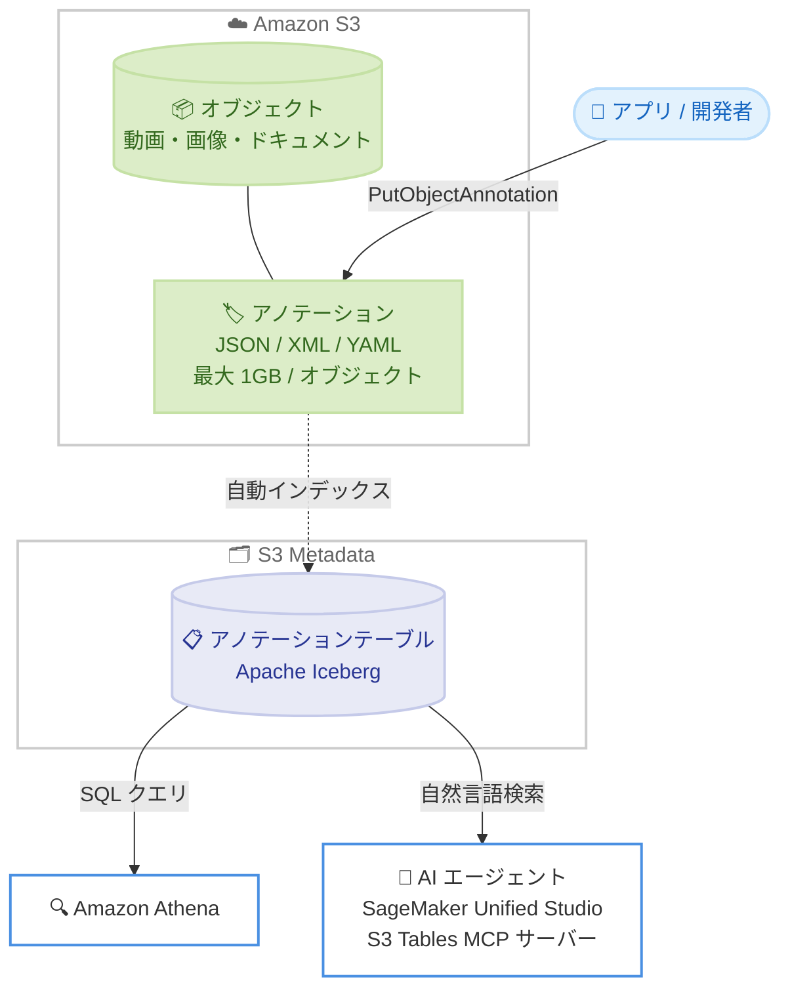

# Amazon S3 - アノテーション (Annotations)

**リリース日**: 2026年6月16日
**サービス**: Amazon S3
**機能**: S3 アノテーション (S3 Annotations)

📊 [このアップデートのインフォグラフィックを見る](https://takech9203.github.io/aws-news-summary/20260616-amazon-s3-annotations-business-context.html)
<!-- INFOGRAPHIC_BASE_URL は環境変数から取得 -->

## 概要

Amazon S3 は、オブジェクトに対して大規模かつ柔軟にカスタムメタデータを付与できる新機能「アノテーション (Annotations)」を発表しました。アノテーションは、ビジネスコンテキストをオブジェクトに直接埋め込むことを目的とした新しいメタデータ機能であり、AI エージェントや分析ツールがデータを発見し、理解し、活用するために必要なコンテキストを提供します。

従来、S3 のメタデータは、システム定義メタデータ、ユーザー定義メタデータ、オブジェクトタグといった選択肢に限られ、いずれもサイズや変更可能性に制約がありました。アノテーションは、これらの既存オプションを補完しつつ、1 オブジェクトあたり最大 1 GB という大規模なコンテキストを、いつでも追加・変更・削除できる形で保持できます。JSON、XML、YAML、プレーンテキストの形式に対応し、データの変化に合わせてコンテキストを常に最新の状態に保てます。

さらに、アノテーションは S3 Metadata と連携でき、フルマネージドの読み取り専用 Apache Iceberg テーブルとして公開されます。これにより、Amazon Athena や Iceberg 互換ツールでアノテーションを大規模にクエリしたり、Amazon SageMaker Unified Studio のエージェントや S3 Tables MCP サーバーを通じて自然言語でオブジェクトを検索したりできます。

**アップデート前の課題**

このアップデート以前は、オブジェクトに豊富なコンテキストを付与する手段が限られていました。

- 以前はオブジェクトタグが 10 個まで、キー/値が 128/256 文字までという制約があり、リッチなコンテキストを保持できなかった
- 以前はユーザー定義メタデータが 2 KB までかつアップロード時にしか設定できず、後から変更できなかった
- 以前はビジネスコンテキストを保持するために、S3 とは別のメタデータ管理システムを構築・運用する必要があった

**アップデート後の改善**

今回のアップデートにより、オブジェクトに直接、大規模で変更可能なコンテキストを付与できるようになりました。

- 今回のアップデートにより、1 オブジェクトあたり最大 1 GB (最大 1,000 個 × 各最大 1 MB) のコンテキストを付与できるようになった
- 今回のアップデートにより、別途メタデータ管理システムを維持する必要がなくなった
- 今回のアップデートにより、S3 Metadata 経由で Athena や AI エージェントからアノテーションを大規模にクエリ・自然言語検索できるようになった

## アーキテクチャ図



オブジェクトに付与したアノテーションは、S3 Metadata を有効化すると Apache Iceberg テーブルに自動でインデックスされ、Athena や AI エージェントからクエリ・自然言語検索できます。

## サービスアップデートの詳細

### 主要機能

1. **大規模で変更可能なコンテキストの付与**
   - 1 オブジェクトあたり最大 1,000 個の名前付きアノテーションを付与でき、各アノテーションは最大 1 MB、合計で最大 1 GB まで保持できる
   - JSON、XML、YAML、プレーンテキストの各形式に対応する
   - いつでも追加・変更・削除でき、オブジェクト本体を書き換えることなくコンテキストを最新に保てる
   - 新規オブジェクトと既存オブジェクトのどちらにも適用できる

2. **オブジェクトと同等の耐久性・整合性**
   - アノテーションはオブジェクトと同じ耐久性と整合性を備える
   - コピーやレプリケーション時にオブジェクトとともに移動し、オブジェクト削除時にあわせて削除される
   - 既存のメタデータ (システム定義メタデータ、オブジェクトタグ、ユーザー定義メタデータ) を補完しつつ、より大きな規模と柔軟性を提供する

3. **S3 Metadata 連携による大規模クエリと自然言語検索**
   - S3 Metadata のアノテーションテーブルを有効化すると、アノテーションが読み取り専用のフルマネージド Apache Iceberg テーブルとしてインデックスされる
   - Amazon Athena やその他の Iceberg 互換ツールから SQL で大規模にクエリできる
   - SageMaker Unified Studio のエージェントや S3 Tables MCP サーバーを利用する IDE から、自然言語でオブジェクトを検索できる

## 技術仕様

### メタデータオプションの比較

| メタデータの種類 | 最大サイズ | 変更可否 | 主な用途 |
|------|------|------|------|
| システム定義メタデータ | 固定 | 不可 | オブジェクトのプロパティ |
| ユーザー定義メタデータ | 2 KB | 不可 (アップロード時に設定) | 小さなキー/値ペア |
| オブジェクトタグ | 10 個、キー/値 128/256 文字 | 可 | アクセス制御、ライフサイクル、コスト配分 |
| アノテーション | 1 GB (最大 1,000 個 × 各 1 MB) | 可 | リッチなビジネスコンテキスト |

### 主な API アクション

| 項目 | 詳細 |
|------|------|
| PutObjectAnnotation | アノテーションの追加・更新 (同名で再実行すると更新) |
| GetObjectAnnotation | 特定のアノテーションの取得 |
| ListObjectAnnotations | オブジェクトに付与された全アノテーションの一覧取得 |
| DeleteObjectAnnotation | 特定のアノテーションの削除 |

### API変更履歴

| 日付 | サービス | 変更内容 |
|------|----------|----------|
| 2026/06/16 | Amazon S3 | 4 new api methods - PutObjectAnnotation, GetObjectAnnotation, ListObjectAnnotations, DeleteObjectAnnotation を追加 |

<!-- 注: awsapichanges.com のフィードには本機能の S3 API 変更がまだ反映されていないため、公式発表および AWS News Blog の記載に基づく -->

### 必要な IAM 権限

```json
{
  "Version": "2012-10-17",
  "Statement": [
    {
      "Effect": "Allow",
      "Action": [
        "s3:PutObjectAnnotation",
        "s3:GetObjectAnnotation"
      ],
      "Resource": "arn:aws:s3:::my-media-bucket/*"
    }
  ]
}
```

## 設定方法

### 前提条件

1. 対象の S3 バケットおよびオブジェクトが存在すること
2. `s3:PutObjectAnnotation` および `s3:GetObjectAnnotation` 権限を IAM ポリシーまたはバケットポリシーで付与していること
3. 大規模なクエリや自然言語検索を行う場合は、S3 Metadata のアノテーションテーブルを有効化していること

### 手順

#### ステップ1: アノテーションを追加する

```bash
aws s3api put-object-annotation \
  --bucket my-media-bucket \
  --key videos/documentary-2026.mp4 \
  --annotation-name mediainfo \
  --annotation-payload ./mediainfo.json
```

このコマンドは、指定したオブジェクトに `mediainfo` という名前のアノテーションを追加します。同じ名前で再実行すると、アノテーションの内容が更新されます。マルチパートアップロードの場合は、アップロード完了後にアノテーションを付与します。

#### ステップ2: アノテーションを取得・一覧表示する

```bash
aws s3api get-object-annotation \
  --bucket my-media-bucket \
  --key videos/documentary-2026.mp4 \
  --annotation-name mediainfo \
  ./mediainfo-output.json

aws s3api list-object-annotations \
  --bucket my-media-bucket \
  --key videos/documentary-2026.mp4
```

前者は特定のアノテーションをローカルファイルに取得し、後者はオブジェクトに付与された全アノテーションを一覧表示します。

#### ステップ3: S3 Metadata のアノテーションテーブルを有効化する

```bash
aws s3api update-bucket-metadata-annotation-table-configuration \
  --bucket my-media-bucket \
  --annotation-table-configuration \
  '{"ConfigurationState":"ENABLED","Role":"arn:aws:iam::123456789012:role/S3MetadataAnnotationRole"}'
```

このコマンドは、既存の S3 Metadata 設定に対してアノテーションテーブルを有効化します。新規にメタデータ設定を作成する場合は `CreateBucketMetadataConfiguration` を使用します。有効化すると、アノテーションが Apache Iceberg テーブルにインデックスされ、各アノテーションが 1 行として記録されます。内容は `text_value` 列に格納され、JSON/XML/YAML の構造に応じてスキーマが自動的に適応します。アノテーションテーブルは約 1 時間以内に更新され、ジャーナルテーブルはほぼリアルタイムで更新されます。既存のアノテーション付きオブジェクトに対して有効化すると、バックグラウンドでバックフィルが実行され、数時間から数日かかる場合があります。

## メリット

### ビジネス面

- **データ発見の効率化**: AI エージェントや分析ツールがオブジェクトのコンテキストを直接理解できるため、データの発見と活用が容易になる
- **運用コストの削減**: 別途メタデータ管理システムを構築・運用する必要がなくなり、運用負荷とコストを削減できる
- **データガバナンスの向上**: ビジネスコンテキストをオブジェクトに紐付けて一元管理でき、データの意味づけが明確になる

### 技術面

- **大規模なコンテキスト保持**: 1 オブジェクトあたり最大 1 GB のコンテキストを保持でき、従来のタグやメタデータの制約を大幅に超える
- **変更可能で常に最新**: オブジェクト本体を書き換えずにコンテキストを追加・変更・削除でき、データの変化に追従できる
- **既存ツールとの親和性**: Apache Iceberg テーブルとして公開されるため、Athena や Iceberg 互換エンジンといった既存の分析基盤からそのままクエリできる

## デメリット・制約事項

### 制限事項

- 1 オブジェクトあたりのアノテーションは最大 1,000 個、各アノテーションは最大 1 MB、合計で最大 1 GB まで
- マルチパートアップロードでは、アップロード完了後にしかアノテーションを付与できない
- アノテーションテーブルの更新には約 1 時間かかり、既存オブジェクトへのバックフィルは数時間から数日を要する場合がある
- S3 Metadata のアノテーションテーブルは読み取り専用である

### 考慮すべき点

- アノテーションのストレージは、親オブジェクトが Glacier などの他のストレージクラスにあっても、常に S3 標準料金で課金される
- アノテーションを大規模にクエリするには S3 Metadata の有効化が前提となるため、利用設計時に有効化を計画する必要がある
- アノテーションテーブル機能は S3 Metadata が利用可能なリージョンでのみ使用できる

## ユースケース

### ユースケース1: メディアアセットの大規模検索

**シナリオ**: 大量の動画ファイルを保管するメディア企業が、音声トラック数や字幕言語などのメタ情報をオブジェクトに付与し、特定条件のコンテンツを高速に抽出したい。

**実装例**:
```sql
SELECT DISTINCT bucket, object_key
FROM "s3tablescatalog/aws-s3"."b_my_media_bucket"."annotation"
WHERE name = 'mediainfo'
AND CAST(json_extract_scalar(text_value, '$.audio_tracks') AS INTEGER) > 8
```

**効果**: オブジェクトを取り出すことなく、Athena から条件に合致するメディアアセットを即座に発見できる。

### ユースケース2: AI エージェントによる自然言語検索

**シナリオ**: 開発者やビジネスユーザーが、SQL を書かずに自然言語でオブジェクトを検索したい。

**実装例**:
```
プロンプト例 (SageMaker Unified Studio のエージェント / S3 Tables MCP サーバー):
"2023 年公開のスペイン語字幕付き PG レーティング映画をすべて検索して"
```

**効果**: SageMaker Unified Studio のエージェントや S3 Tables MCP サーバーを通じて、自然言語の問い合わせから数秒で結果を取得できる。

### ユースケース3: 直近で更新されたデータの追跡

**シナリオ**: データパイプラインで、直近 24 時間以内にアノテーションが追加・削除されたオブジェクトを把握したい。

**実装例**:
```sql
SELECT bucket, key, version_id, record_timestamp, annotation.name
FROM "s3tablescatalog/aws-s3"."b_my_media_bucket"."journal"
WHERE record_timestamp >= (current_date - interval '1' day)
AND annotation.name IS NOT NULL
AND record_type IN ('CREATE_ANNOTATION', 'DELETE_ANNOTATION')
```

**効果**: ほぼリアルタイムで更新されるジャーナルテーブルを利用し、最近変更されたデータだけを効率的に処理できる。

## 料金

アノテーションのストレージ料金は、親オブジェクトのストレージクラスにかかわらず、常に S3 標準料金で課金されます。親オブジェクトが Glacier などの他のストレージクラスにある場合でも、アノテーション部分は S3 標準料金が適用されます。なお、アノテーションは任意のストレージクラスをまたいでクエリでき、オブジェクトの復元や取り出し料金は発生しません。詳細な料金は S3 の料金ページを参照してください。

## 利用可能リージョン

アノテーション機能は、AWS 中国リージョンを含むすべての AWS リージョンで利用できます。アノテーションテーブル (S3 Metadata 連携) は、S3 Metadata が利用可能なすべての AWS リージョンで利用できます。

## 関連サービス・機能

- **S3 Metadata**: アノテーションを読み取り専用の Apache Iceberg テーブルとしてインデックスし、大規模なクエリを可能にする
- **Amazon Athena**: アノテーションテーブルに対して SQL クエリを実行し、条件に合致するオブジェクトを発見できる
- **Amazon SageMaker Unified Studio / S3 Tables MCP サーバー**: AI エージェントを通じて自然言語によるオブジェクト検索を実現する

## 参考リンク

- 📊 [インフォグラフィック](https://takech9203.github.io/aws-news-summary/20260616-amazon-s3-annotations-business-context.html)
- [公式発表 (What's New)](https://aws.amazon.com/about-aws/whats-new/2026/06/amazon-s3-annotations-business-context)
- [AWS Blog](https://aws.amazon.com/blogs/aws/amazon-s3-annotations-attach-rich-queryable-context-directly-to-your-objects/)
- [Amazon S3 ドキュメント](https://docs.aws.amazon.com/s3/)
- [Amazon S3 料金ページ](https://aws.amazon.com/s3/pricing/)

## まとめ

Amazon S3 アノテーションは、オブジェクトに最大 1 GB の変更可能なコンテキストを直接付与し、AI エージェントや分析ツールによるデータ発見を大幅に強化する機能です。S3 Metadata と連携することで Athena や自然言語検索からの大規模なクエリが可能になるため、メディア管理やデータカタログ、AI ワークロードを扱うチームは、まず対象バケットでアノテーションテーブルを有効化し、既存ツールとの統合を検討することを推奨します。
