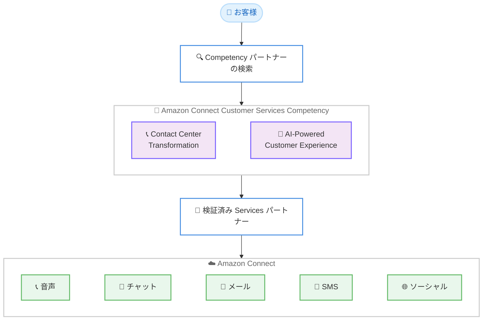

# Amazon Connect - Amazon Connect Customer Services Competency

**リリース日**: 2026年6月16日
**サービス**: Amazon Connect
**機能**: Amazon Connect Customer Services Competency

📊 [このアップデートのインフォグラフィックを見る](https://takech9203.github.io/aws-news-summary/20260616-aws-announces-amazon-connect-customer-services-competency.html)
<!-- INFOGRAPHIC_BASE_URL は環境変数から取得 -->

## 概要

AWS は、新しい AWS スペシャライゼーションとして Amazon Connect Customer Services Competency を発表しました。これは、Amazon Connect を活用してエンタープライズ全体のカスタマーエクスペリエンスを変革する能力を実証した Services パートナーを、お客様が見つけられるようにするためのプログラムです。AWS によると、これは AWS サービスに直接紐づく初めての AWS Competency です。

このプログラムは、AWS Services Path に参加するパートナーのうち、Validated または Differentiated メンバーであり、Amazon Connect でのカスタマーサクセスを実証したパートナーを対象としています。認定は「Contact Center Transformation」と「AI-Powered Customer Experience」という 2 つのカテゴリーで提供されます。検証済みパートナーは、レガシーコンタクトセンターの移行や、Amazon Connect 上での AI の大規模な運用化における技術的な深さと実績を示しています。

このアップデートにより、お客様は音声、チャット、メール、SMS、ソーシャルといった複数のチャネルにわたる AI ネイティブな変革を提供できるパートナーを、安心して選定できるようになります。なお、本 Competency は既存の Amazon Connect Service Delivery Program の指定を置き換えるものであり、Service Delivery Program は 2027年6月1日に廃止される予定です。

**アップデート前の課題**

- 以前は Amazon Connect に特化したパートナーの専門性を示す指定として Amazon Connect Service Delivery Program があり、AWS サービスに直接紐づく Competency は存在しませんでした
- 以前は、AI ネイティブな変革や大規模な AI 運用化の実績を持つパートナーかどうかを、お客様が体系的な基準で判断することが難しい状況でした
- 従来のコンタクトセンターはキュー、手動ルーティング、処理時間メトリクスに依存し、AI は最初から組み込まれたものではなく後付けのレイヤーとして追加される傾向がありました

**アップデート後の改善**

- 今回のアップデートにより、AWS サービスに直接紐づく初めての Competency として、Amazon Connect の専門性を持つパートナーを明確に識別できるようになりました
- 今回のアップデートにより、「Contact Center Transformation」と「AI-Powered Customer Experience」という 2 つのカテゴリーで、パートナーの専門領域を区別できるようになりました
- 今回のアップデートにより、音声、チャット、メール、SMS、ソーシャルにわたる AI ネイティブな変革を提供できるパートナーを、お客様が安心して選定できるようになりました

## アーキテクチャ図

お客様が Competency を通じて検証済みパートナーを見つけ、そのパートナーがマルチチャネルの Amazon Connect 環境で変革を支援する流れを示しています。

## サービスアップデートの詳細

### 主要機能

1. **AWS サービスに直接紐づく初めての Competency**
   - Amazon Connect Customer Services Competency は、AWS サービスに直接アラインした初めての AWS Competency です
   - 既存の Amazon Connect Service Delivery Program の指定を置き換えます
   - Amazon Connect に特化したパートナーの専門性を識別する基準を提供します

2. **2 つの認定カテゴリー**
   - Contact Center Transformation: レガシーコンタクトセンターの移行に関する専門性
   - AI-Powered Customer Experience: Amazon Connect 上での AI の大規模な運用化に関する専門性
   - 検証済みパートナーは、各領域で技術的な深さと実績を実証しています

3. **マルチチャネルの AI ネイティブな変革**
   - 音声、チャット、メール、SMS、ソーシャルといった複数のチャネルに対応します
   - AI を後付けのレイヤーとしてではなく、最初から組み込んだ変革を支援します
   - お客様が安心してパートナーを選定できる信頼性を提供します

## 技術仕様

### プログラム概要

| 項目 | 詳細 |
|------|------|
| プログラム種別 | AWS スペシャライゼーション (AWS Competency) |
| 対象パートナー | AWS Services Path の Validated または Differentiated メンバー |
| 認定カテゴリー | Contact Center Transformation、AI-Powered Customer Experience |
| 対象サービス | Amazon Connect |
| 置き換え対象 | Amazon Connect Service Delivery Program (2027年6月1日廃止予定) |

### API変更履歴

本アップデートはパートナープログラムに関する発表であり、API の追加・変更は含まれません。

## メリット

### ビジネス面

- **パートナー選定の信頼性向上**: お客様は、Amazon Connect での実績を実証した検証済みパートナーを明確な基準で選定できます
- **専門領域の可視化**: 「Contact Center Transformation」と「AI-Powered Customer Experience」の 2 カテゴリーにより、求める専門性を持つパートナーを特定しやすくなります
- **変革リスクの低減**: レガシーコンタクトセンターの移行や大規模な AI 運用化において、実績のあるパートナーと協業することでプロジェクトリスクを抑えられます

### 技術面

- **AI ネイティブな設計**: AI を後付けではなく最初から組み込んだコンタクトセンター変革を支援できるパートナーを識別できます
- **マルチチャネル対応**: 音声、チャット、メール、SMS、ソーシャルにわたる統合的なカスタマーエクスペリエンスを実現するパートナーを選定できます
- **大規模運用の実績**: Amazon Connect 上での AI の大規模な運用化を実証したパートナーにアクセスできます

## デメリット・制約事項

### 制限事項

- 本 Competency は AWS Services Path の Validated または Differentiated メンバーのみが対象です
- 既存の Amazon Connect Service Delivery Program の指定は 2027年6月1日に廃止される予定です
- 認定はパートナー側のステータスであり、お客様が直接取得するものではありません

### 考慮すべき点

- Service Delivery Program から本 Competency への移行スケジュールを、関連するパートナーは確認する必要があります
- パートナー選定時には、自社の要件 (移行中心か、AI 活用中心か) に応じて適切なカテゴリーのパートナーを検討することが推奨されます

## ユースケース

### ユースケース1: レガシーコンタクトセンターの移行

**シナリオ**: オンプレミスや旧来のコンタクトセンタープラットフォームを利用している企業が、Amazon Connect への移行を検討しています。

**効果**: Contact Center Transformation カテゴリーの検証済みパートナーを選定することで、移行実績のある専門家と協業でき、移行リスクを低減できます。

### ユースケース2: AI を活用したカスタマーエクスペリエンスの高度化

**シナリオ**: 既に Amazon Connect を利用している企業が、生成 AI などを活用して大規模に顧客対応を自動化・高度化したいと考えています。

**効果**: AI-Powered Customer Experience カテゴリーのパートナーを選定することで、AI を大規模に運用化した実績を持つ専門家の支援を受けられます。

### ユースケース3: マルチチャネルカスタマーサービスの統合

**シナリオ**: 音声中心の問い合わせ対応を、チャット、メール、SMS、ソーシャルを含むマルチチャネル体験へと拡張したい企業があります。

**効果**: 検証済みパートナーの支援により、AI ネイティブな設計で複数チャネルを統合したカスタマーエクスペリエンスを構築できます。

## 料金

本アップデートはパートナープログラムに関する発表であり、Competency 自体に料金は発生しません。Amazon Connect の利用料金は従量課金制であり、利用するチャネルや機能に応じて発生します。詳細は Amazon Connect の料金ページを参照してください。

## 利用可能リージョン

本アップデートは AWS パートナープログラムに関する発表です。Amazon Connect の利用可能リージョンについては、Amazon Connect の公式ドキュメントを参照してください。

## 関連サービス・機能

- **Amazon Connect**: 本 Competency が直接紐づく、AWS のクラウドコンタクトセンターサービスです
- **AWS Partner Network (Services Path)**: 本 Competency の対象となるパートナーが参加するプログラムです
- **Amazon Connect Service Delivery Program**: 本 Competency が置き換える既存のパートナー指定で、2027年6月1日に廃止予定です

## 参考リンク

- 📊 [インフォグラフィック](https://takech9203.github.io/aws-news-summary/20260616-aws-announces-amazon-connect-customer-services-competency.html)
- [公式発表 (What's New)](https://aws.amazon.com/about-aws/whats-new/2026/06/aws-announces-amazon-connect-customer-services-competency)
- [Amazon Connect Customer Competency パートナーページ](https://aws.amazon.com/products/connect/customer/partners/)

## まとめ

Amazon Connect Customer Services Competency は、AWS サービスに直接紐づく初めての Competency として、Amazon Connect の変革を支援する検証済みパートナーをお客様が安心して選定できるようにする重要なプログラムです。コンタクトセンターの移行や AI を活用したカスタマーエクスペリエンスの高度化を検討している場合は、目的に応じたカテゴリーの検証済みパートナーを確認することを推奨します。また、Amazon Connect Service Delivery Program は 2027年6月1日に廃止されるため、関連するパートナーは移行の準備を進める必要があります。
