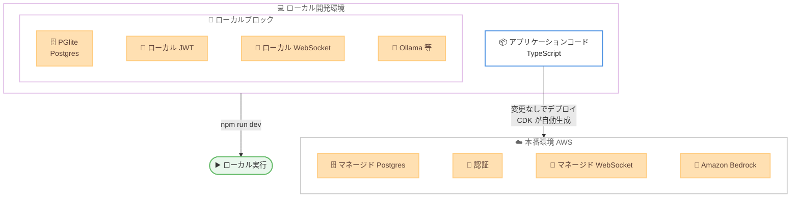

# AWS Blocks - アプリケーションバックエンドを構成するオープンソースフレームワーク (プレビュー)

**リリース日**: 2026年6月16日
**サービス**: AWS Blocks
**機能**: AWS 上でアプリケーションバックエンドを構成するオープンソースフレームワーク (プレビュー)

📊 [このアップデートのインフォグラフィックを見る](https://takech9203.github.io/aws-news-summary/20260616-aws-blocks-preview.html)

## 概要

AWS は、アプリケーション開発者が AWS 上でバックエンド機能を構築できるオープンソースの TypeScript フレームワーク「AWS Blocks」をプレビューとして発表しました。AWS Blocks は、インフラストラクチャツールを学習することなく、データベース、認証、リアルタイムメッセージング、AI エージェントなどのバックエンド機能を「ブロック」として組み合わせて利用できることを目指しています。

AWS Blocks は、Postgres、認証、リアルタイムメッセージングを備えたローカル開発環境を提供します。開発を始めるにあたって AWS アカウントは不要です。AWS によると、デプロイ時には「同じアプリケーションコードが変更なしで本番環境の AWS サービス上で動作する」とされています。また、開発者は必要に応じて任意のタイミングで AWS CDK に入り込み、リソースを直接構成できます。

このフレームワークは、インフラストラクチャの専門知識を持たないアプリケーション開発者を主な対象としています。20 以上の組み合わせ可能なブロックが提供され、各ブロックにはロジック、型安全な API、ローカルテスト設定、AI コーディングツール向けのステアリングファイルが含まれています。

**アップデート前の課題**

AWS Blocks 登場以前、アプリケーション開発者が AWS 上でバックエンドを構築する際には以下のような課題がありました。

- バックエンドを構築するために、AWS の各サービスやインフラストラクチャツール (IaC など) を個別に学習する必要があった
- ローカル開発環境と本番環境の差異により、エミュレータや Docker などを用いた環境構築が必要だった
- データスキーマからフロントエンドまでの型安全性を確保するには、コード生成ステップなどの追加作業が必要だった

**アップデート後の改善**

今回のアップデートにより、以下が可能になりました。

- インフラストラクチャツールを学習せずに、ブロックを組み合わせてバックエンド機能を構築できるようになった
- AWS アカウントなしでローカル開発を開始でき、同じコードを変更なしで本番環境にデプロイできるようになった
- データスキーマからフロントエンドまで、コード生成ステップなしでエンドツーエンドの型安全性が確保されるようになった

## アーキテクチャ図



同じアプリケーションコードが、ローカルではインプロセスの Postgres やローカルモックを使って動作し、デプロイ時には CDK が自動生成するマネージドな AWS サービス上で変更なしに動作します。

## サービスアップデートの詳細

### 主要機能

1. **ローカルファーストの開発体験**
   - Postgres、認証、リアルタイムメッセージングを備えたローカル開発環境を提供し、開発開始時に AWS アカウントは不要
   - PGlite により実際の Postgres エンジンをインプロセスで実行し、エミュレータや Docker、クラウドのクォータを必要とせず本番動作を再現
   - ローカルの JWT は本番環境と同じクレーム構造を持ち、ローカル WebSocket サーバーやローカルファイルシステムがクラウドのストレージ API を再現
   - サブ秒のフィードバックを実現するホットリロードに対応

2. **同一コードによる本番デプロイ**
   - 同じアプリケーションコードが変更なしで本番環境の AWS サービス上で動作
   - デプロイ時にアプリケーションコードからインフラストラクチャが自動生成され、データベースクエリ、認証チェック、ファイル操作が環境間で同一に保たれる
   - フレームワークが CDK のインフラストラクチャコードをアプリケーション内にカプセル化するため、IaC の知識は不要

3. **20 以上の組み合わせ可能なブロック**
   - Database (型安全な Postgres インターフェース)、Auth (メール / パスワード、ソーシャルログイン、エンタープライズ SSO、外部認証プロバイダー)、Realtime (pub/sub メッセージング)
   - FileBucket (ファイルのアップロード / ダウンロード)、AsyncJob / CronJob (バックグラウンド処理 / スケジュールタスク)
   - Agent (ツール呼び出しと会話の永続化を伴う AI エージェントオーケストレーション、本番では Amazon Bedrock にデプロイ)、KnowledgeBase (RAG 向けのセマンティック検索)
   - EmailClient (メール送信)、Logger / Metrics / Tracer / Dashboard (オブザーバビリティツール)

4. **エンドツーエンドの型安全性と AI ステアリング**
   - データスキーマからフロントエンドまで、コード生成ステップなしで型安全性が伝播
   - AI コーディングツール向けの組み込みガイダンスにより、カスタム設定なしで正しいアーキテクチャを支援

## 技術仕様

### ローカル環境と本番環境の対応

| ブロック | ローカル開発 | 本番環境 (AWS) |
|------|------|------|
| Database | PGlite (インプロセス Postgres) | マネージド Postgres |
| Auth | ローカル JWT (同一クレーム構造) | 認証 |
| Realtime | ローカル WebSocket サーバー | マネージド WebSocket |
| FileBucket | ローカルファイルシステム | マネージドストレージ |
| Agent / KnowledgeBase | Ollama または OpenAI 互換エンドポイント | Amazon Bedrock |
| Logger / Metrics / Tracer | ローカルツール | マネージドモニタリング |

### 対応フレームワーク

プレビュー時点でサポートされるフロントエンドフレームワークは以下のとおりです。

| 種別 | 対応フレームワーク |
|------|------|
| SPA | Vite + React など |
| SSR | Next.js、Nuxt、Astro |

## 設定方法

### 前提条件

1. Node.js および npm がインストールされた開発環境
2. 本番環境へデプロイする際の AWS アカウント (ローカル開発のみであれば不要)
3. TypeScript の基本的な知識

### 手順

#### ステップ1: プロジェクトの作成

```bash
npx @aws-blocks/create-blocks-app
```

create-blocks-app コマンドを実行して、AWS Blocks の新規プロジェクトを作成します。対話的にフロントエンドフレームワークなどを選択できます。

#### ステップ2: ローカル開発の開始

```bash
npm run dev
```

ローカル開発サーバーを起動します。Postgres、認証、リアルタイムメッセージングなどがローカルで動作し、AWS アカウントなしでアプリケーションの開発とテストを行えます。

#### ステップ3: 本番環境へのデプロイ

同じアプリケーションコードを AWS アカウントにデプロイします。デプロイ時にフレームワークが CDK のインフラストラクチャコードを自動生成し、マネージドな AWS サービス上でアプリケーションが変更なしに動作します。リソースを直接構成したい場合は、任意のタイミングで AWS CDK のレイヤーに入り込んで設定できます。

## メリット

### ビジネス面

- **学習コストの削減**: インフラストラクチャツールを学習することなくバックエンドを構築できるため、アプリケーション開発者の立ち上がりが速くなる
- **開発スピードの向上**: 1 つのセッション内でデータベーステーブル、ユーザー認証、AI エージェント、ファイルアップロード、バックグラウンドジョブを追加でき、アイデアの検証から本番化までを迅速に進められる
- **追加料金なし**: AWS Blocks 自体は追加料金なしで利用でき、利用するのは基盤となる AWS サービスの料金のみ

### 技術面

- **環境差異の最小化**: ローカル環境が本番動作を忠実に再現し、同じコードが変更なしで本番にデプロイされる
- **型安全性**: データスキーマからフロントエンドまでコード生成なしでエンドツーエンドの型安全性が確保される
- **段階的な詳細化**: 通常は CDK に触れる必要がないが、必要に応じて CDK レイヤーに降りて細かく制御でき、カスタムブロックの作成も可能

## デメリット・制約事項

### 制限事項

- プレビュー段階の機能であり、本番環境での利用にあたっては機能や仕様が変更される可能性がある
- フレームワークは TypeScript ベースであり、対応フロントエンドフレームワークはプレビュー時点で SPA (Vite + React など) および SSR (Next.js、Nuxt、Astro) に限られる

### 考慮すべき点

- 高度なインフラストラクチャ要件がある場合、CDK レイヤーでの直接構成やカスタムブロックの作成が必要になる可能性がある
- オープンソースフレームワークであるため、本番採用にあたっては GitHub リポジトリでのサポート状況やロードマップの確認が推奨される

## ユースケース

### ユースケース1: プロトタイプから本番までの一貫した開発

**シナリオ**: スタートアップが新しい Web アプリケーションのアイデアを検証し、迅速に本番化したい。

**実装例**:
```bash
npx @aws-blocks/create-blocks-app
npm run dev
# Database, Auth, FileBucket ブロックを組み合わせて開発
```

**効果**: AWS アカウントなしでローカルにプロトタイプを構築し、同じコードを変更なしで本番の AWS サービスにデプロイできるため、検証から本番化までの時間を短縮できます。

### ユースケース2: AI エージェントを組み込んだアプリケーション

**シナリオ**: 既存のアプリケーションに、ツール呼び出しと会話履歴の永続化を伴う AI エージェント機能を追加したい。

**実装例**:
```
Agent ブロック + KnowledgeBase ブロックを追加
ローカルでは Ollama でテスト
本番では Amazon Bedrock にデプロイ
```

**効果**: ローカルで Ollama や OpenAI 互換エンドポイントを使って AI エージェントや RAG を検証し、本番では Amazon Bedrock 上で動作させることで、インフラ構成を意識せずに AI 機能を組み込めます。

### ユースケース3: インフラ専任者のいないチームでのバックエンド構築

**シナリオ**: フロントエンド中心のチームが、インフラストラクチャの専門知識なしでバックエンドを持つアプリケーションを構築したい。

**実装例**:
```
Auth, Database, Realtime, AsyncJob ブロックを組み合わせ
型安全な API を通じてフロントエンドと接続
```

**効果**: フレームワークが CDK を自動生成するため、IaC の知識なしでフル機能のバックエンドを構築でき、エンドツーエンドの型安全性により実装ミスを抑えられます。

## 料金

AWS Blocks は追加料金なしで利用できます。料金が発生するのは、アプリケーションが利用する基盤となる AWS サービスの利用分のみです。

## 利用可能リージョン

AWS Blocks でデプロイしたアプリケーションは、すべての商用 AWS リージョンで動作します。

## 関連サービス・機能

- **AWS CDK**: AWS Blocks はアプリケーションコードから CDK のインフラストラクチャコードを自動生成し、必要に応じて CDK レイヤーで直接構成できる
- **Amazon Bedrock**: Agent ブロックの本番環境におけるデプロイ先として利用される
- **マネージド Postgres**: Database ブロックの本番環境における基盤として利用される

## 参考リンク

- 📊 [インフォグラフィック](https://takech9203.github.io/aws-news-summary/20260616-aws-blocks-preview.html)
- [公式発表 (What's New)](https://aws.amazon.com/about-aws/whats-new/2026/06/aws-blocks-preview)
- [製品ページ (AWS Blocks)](https://aws.amazon.com/products/developer-tools/blocks/)
- [ドキュメント (Getting Started Guide)](https://docs.aws.amazon.com/blocks/latest/devguide/getting-started.html)
- [GitHub リポジトリ](https://github.com/aws-devtools-labs/aws-blocks)

## まとめ

AWS Blocks は、インフラストラクチャの専門知識がなくても AWS 上でアプリケーションバックエンドを構築できるオープンソースの TypeScript フレームワークです。ローカルファーストの開発体験と、同じコードを変更なしで本番デプロイできる仕組みにより、アプリケーション開発者の生産性向上が期待できます。プレビュー段階のため、まずは `npx @aws-blocks/create-blocks-app` でプロジェクトを作成し、ローカル環境で各ブロックの動作を確認することをお勧めします。
