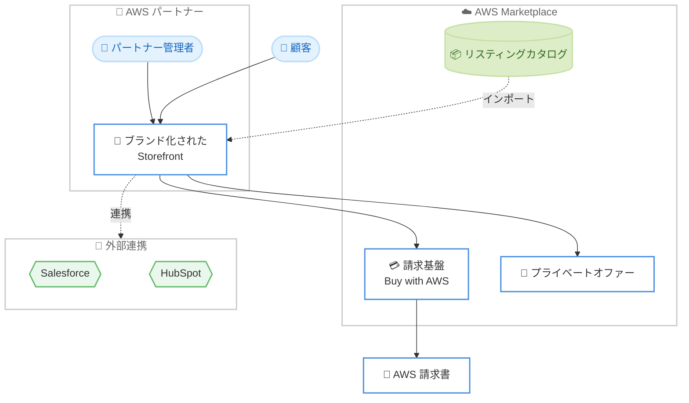

# AWS Marketplace - AWS Marketplace Storefront

**リリース日**: 2026年6月16日
**サービス**: AWS Marketplace
**機能**: AWS Marketplace Storefront

📊 [このアップデートのインフォグラフィックを見る](https://takech9203.github.io/aws-news-summary/20260616-aws-marketplace-storefront.html)
<!-- INFOGRAPHIC_BASE_URL は環境変数から取得 -->

## 概要

AWS は、AWS Marketplace Storefront の一般提供 (GA) を開始しました。AWS Marketplace Storefront は、AWS パートナーが自社のブランドを冠したソリューションおよびサービスのカタログを、自社の Web サイトやアプリケーション上に数時間で構築して公開できるノーコードツールです。チャネルパートナーや独立系ソフトウェアベンダー (ISV) が、クラウドマーケットプレイスの運用を効率化し、顧客が自社の製品をより簡単に見つけて購入できるようにすることを目的としています。

パートナーは、既存の AWS Marketplace のリスティングを自社ブランドのストアフロントにインポートし、ブランディングを適用してユーザーアクセスを設定するだけで、多くの場合その日のうちに公開できます。取引は AWS Marketplace の請求基盤を通じて処理され、顧客の AWS 請求書に自動的に反映されます。これにより、パートナーは独自の決済システムを構築する必要がなくなります。

対象となるのは、複数ベンダーの製品を再販するチャネルパートナーと、自社製品を販売する ISV です。AWS Marketplace Storefront は、Buy with AWS を活用したブランド化された調達体験を、初期構築の手間なく提供します。

**アップデート前の課題**

これまでパートナーが自社ブランドの調達ポータルやマーケットプレイスを提供しようとすると、以下のような課題がありました。

- 自社ブランドの調達ポータルを構築するには、数か月単位の開発期間と専門的な開発リソースが必要だった
- 取引のために独自の決済システムや請求基盤を別途構築・運用する必要があった
- プライベートオファーの作成や承認、CRM への連携などのディール業務を手作業で行う必要があった

**アップデート後の改善**

今回のアップデートにより、以下が可能になりました。

- ノーコードで自社ブランドのストアフロントを構築し、最短で当日中に公開できるようになった
- 取引が AWS Marketplace の請求基盤を通じて処理され、顧客の AWS 請求書に自動反映されるため、独自の決済システムが不要になった
- プライベートオファーテンプレート、承認の自動化、Salesforce や HubSpot などへのネイティブな CRM 連携により、ディール業務が効率化された

## アーキテクチャ図



パートナーは AWS Marketplace のカタログから製品をストアフロントにインポートし、取引は AWS Marketplace の請求基盤 (Buy with AWS) を経由して顧客の AWS 請求書に反映されます。

## サービスアップデートの詳細

### 主要機能

1. **ノーコードでのストアフロント構築**
   - 開発不要で、自社ブランドを冠したストアフロントを構築できる
   - AWS Marketplace のリスティングをインポートし、最短で当日中に公開できる
   - カタログのキュレーション、カテゴリ分け、注目製品の配置が可能

2. **統合された請求**
   - 取引が AWS Marketplace の請求基盤を通じて処理される
   - 顧客の AWS 請求書に自動的に反映されるため、独自の決済システムが不要
   - 請求とディスバースメント (支払い) は既存の AWS Marketplace の条件に従って処理される

3. **ディールの自動化と CRM 連携**
   - プライベートオファーテンプレートと承認の自動化を提供
   - Salesforce や HubSpot などの CRM ツールへのネイティブ連携をサポート
   - リスティングの自動化とカタログ管理ツールにより、業務拡大に対応

4. **チャネルパートナー向けのサポート**
   - リセラーは顧客ごとに承認済み製品の調整されたカタログを提示できる
   - 複数ベンダーの製品と AWS のリスティングを組み合わせたマルチカタログ連携に対応
   - チャネルパートナープライベートオファー (CPPO) の関係をサポート

## 技術仕様

### 主な特徴

| 項目 | 詳細 |
|------|------|
| 提供形態 | ノーコードツール |
| 公開までの時間 | 最短で当日 (従来は数か月) |
| 調達体験 | Buy with AWS を活用したブランド化された調達 |
| ドメイン | パートナー独自のカスタムドメインで運用 |
| 請求 | AWS Marketplace の請求基盤を利用し AWS 請求書に反映 |
| CRM 連携 | Salesforce、HubSpot |
| マルチベンダー | 非 AWS ベンダーの製品と AWS リスティングの混在に対応 |

### API変更履歴

今回のアップデートに伴う AWS API の変更は確認されていません。

## 設定方法

### 前提条件

1. AWS Marketplace の出品者 (Seller) アカウントを保有していること
2. AWS Marketplace に既存のリスティングがあること
3. 顧客は AWS Marketplace 製品の取引を完了するために AWS アカウントが必要 (AWS Marketplace から直接購入する場合と同じ)

### 手順

#### ステップ1: ストアフロントの作成とカタログのインポート

AWS Marketplace の管理画面から Storefront を作成し、既存の AWS Marketplace カタログから製品をインポートします。必要に応じて非 AWS ベンダーの製品を組み合わせてマルチカタログを構成します。

#### ステップ2: ブランディングとアクセス設定

自社ブランドのロゴやデザインを適用し、カスタムドメインを設定します。製品のカテゴリ分けや注目製品の配置を行い、ガイド付き購入ポリシーを設定して、顧客ごとの調整されたカタログを準備します。

#### ステップ3: ディール自動化の設定と公開

プライベートオファーテンプレートと承認の自動化を設定し、必要に応じて Salesforce や HubSpot などの CRM と連携します。設定が完了したらストアフロントを公開します。最短で当日中の公開が可能です。

## メリット

### ビジネス面

- **市場投入までの時間短縮**: 従来は数か月かかっていた調達ポータルの構築が、数時間で運用可能になる
- **顧客関係の維持**: 自社ブランド、自社ドメインでの調達体験により、顧客との関係とブランドを完全にコントロールできる
- **運用コストの削減**: 既存の AWS の請求基盤を活用するため、独自の決済システムの構築・運用が不要になる

### 技術面

- **ノーコードでの構築**: 専門的な開発リソースなしで、ブランド化されたストアフロントを構築できる
- **請求の統合**: 取引が顧客の AWS 請求書に自動反映されるため、請求処理の複雑さが軽減される
- **既存資産の活用**: 既存の AWS Marketplace リスティングをそのまま利用できる

## デメリット・制約事項

### 制限事項

- 顧客は AWS Marketplace 製品の取引を完了するために AWS アカウントが必要
- 請求とディスバースメントは既存の AWS Marketplace の条件に従うため、請求の仕組み自体は変更されない
- ストアフロント名は顧客に対しては表示されず、カスタムドメインでの運用が前提となる

### 考慮すべき点

- 有料プランは組織の規模に応じた料金体系のため、利用規模に応じたコストの検討が必要
- 30 日間の無料トライアル後は有料プランへの移行が必要

## ユースケース

### ユースケース1: チャネルパートナーによる再販

**シナリオ**: 複数ベンダーの製品を再販するチャネルパートナーが、顧客ごとに承認済み製品の調整されたカタログを提供したい。

**実装例**:
```
1. Storefront に複数ベンダーの製品と AWS リスティングをインポート
2. 顧客ごとにガイド付き購入ポリシーで承認済み製品を設定
3. CPPO 関係を活用してプライベートオファーを提供
```

**効果**: 業務拡大に合わせて、少ない運用リソースで顧客ごとのカタログを提供できる

### ユースケース2: ISV による自社ブランド調達ポータルの提供

**シナリオ**: ISV が自社の Web サイト上で、自社ブランドの調達体験を顧客に提供したい。

**実装例**:
```
1. AWS Marketplace の自社リスティングを Storefront にインポート
2. 自社ブランドとカスタムドメインを適用
3. AWS Marketplace の請求基盤を通じて顧客の AWS 請求書に反映
```

**効果**: 独自の決済システムを構築せずに、ブランド化された調達体験を提供できる

### ユースケース3: ディール業務の自動化

**シナリオ**: 多数のプライベートオファーを扱うパートナーが、ディール業務の手作業を削減したい。

**実装例**:
```
1. プライベートオファーテンプレートを作成
2. 承認の自動化フローを設定
3. Salesforce / HubSpot と連携してディール情報を一元管理
```

**効果**: ディールの作成から承認、CRM への記録までを自動化し、運用負荷を軽減できる

## 料金

AWS Marketplace Storefront は 30 日間の無料トライアルを提供しています。トライアル後は、組織の規模に応じた有料プランが用意されています。なお、取引の請求とディスバースメントは既存の AWS Marketplace の条件に従って処理されます。

詳細な料金は AWS Marketplace Storefront の製品ページを参照してください。

## 利用可能リージョン

AWS Marketplace が提供されているすべての AWS リージョンで利用可能です。

## 関連サービス・機能

- **Buy with AWS**: ストアフロントのブランド化された調達体験の基盤となる機能
- **AWS Marketplace**: リスティングのインポート元および請求基盤を提供する
- **チャネルパートナープライベートオファー (CPPO)**: チャネルパートナーによる再販を支える仕組み

## 参考リンク

- 📊 [インフォグラフィック](https://takech9203.github.io/aws-news-summary/20260616-aws-marketplace-storefront.html)
- [公式発表 (What's New)](https://aws.amazon.com/about-aws/whats-new/2026/06/aws-marketplace-storefront/)
- [AWS Marketplace Storefront 製品ページ](https://aws.amazon.com/marketplace/partners/storefront)

## まとめ

AWS Marketplace Storefront は、AWS パートナーがノーコードで自社ブランドの調達ストアフロントを数時間で構築し、AWS Marketplace の請求基盤を活用できるようにする機能です。チャネルパートナーや ISV にとって、市場投入までの時間短縮と運用コストの削減を実現する重要なアップデートです。クラウドマーケットプレイス事業の効率化を検討しているパートナーは、30 日間の無料トライアルから評価を始めることをお勧めします。
