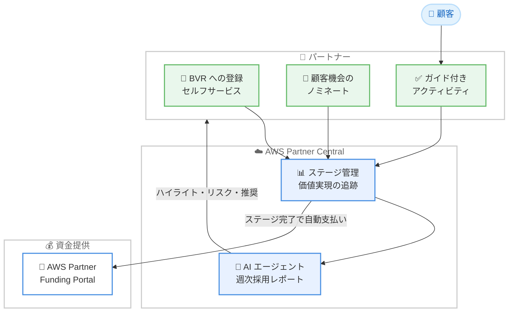

# AWS Partner Central - Business Value Realization 向けの新しい資金提供特典

**リリース日**: 2026 年 6 月 16 日
**サービス**: AWS Partner Central
**機能**: Business Value Realization (BVR) モーション

📊 [このアップデートのインフォグラフィックを見る](https://takech9203.github.io/aws-news-summary/20260616-aws-partner-business-value-realization.html)
<!-- INFOGRAPHIC_BASE_URL は環境変数から取得 -->

## 概要

AWS は、AWS Partner Central において Business Value Realization (BVR) をサポートする新しい資金提供特典を発表しました。BVR は、戦略的な AWS サービスの導入後に顧客の採用とビジネス成果を推進するパートナー向けの新しいエクスペリエンスおよび資金提供のモーションです。AWS サービス導入のジャーニーを定義済みのステージに構造化し、実証された価値に資金提供を紐付けます。

このモーションでは、資金提供が証明された価値の実現に連動します。パートナーがステージを完了すると、個別のリクエストを必要とせずに AWS Partner Funding Portal を通じて資金が自動的に支払われます。これにより、従来の納品マイルストーンベースの資金提供から、顧客の実際の成果に基づく資金提供へと移行します。

この特典は、advance または premier ティアのステータスを持ち、対象となるドメインコンピテンシーを保有するコンサルティング、システムインテグレーター、マネージドサービスのパートナーが利用できます。BVR は、2026 年の市場調査で「インタビューを受けた顧客の 80% が成果ベースの商用モデルへ移行している」という結果が示されたことを背景としています。

**アップデート前の課題**

- 資金提供が顧客の実際のビジネス成果ではなく、納品マイルストーンに紐付いていた
- パートナーが資金を受け取るために個別のリクエストを提出する必要があった
- 導入後の顧客の採用状況や価値実現の進捗を体系的に追跡する仕組みが不足していた

**アップデート後の改善**

- 資金提供が証明された価値の実現に連動し、成果ベースのモデルへ移行
- ステージ完了時に AWS Partner Funding Portal を通じて資金が自動的に支払われ、個別リクエストが不要
- AI エージェントが生成する週次の採用レポートにより、ハイライト、リスク、推奨事項を把握可能

## アーキテクチャ図

パートナーは AWS Partner Central で BVR に登録して顧客機会をノミネートし、ガイド付きアクティビティを通じて顧客の成果を支援します。ステージが完了すると資金が自動的に支払われ、AI エージェントが週次レポートを提供します。

## サービスアップデートの詳細

### 主要機能

1. **セルフサービスの登録フロー**
   - パートナーは AWS Partner Central のセルフサービス登録フローを通じて BVR に登録できる
   - 戦略的な AWS サービスの導入後の顧客採用を推進するパートナーが対象
   - AWS サービス導入のジャーニーを定義済みのステージに構造化

2. **成果連動型の自動資金提供**
   - 資金提供が証明された価値の実現に連動
   - パートナーがステージを完了すると、AWS Partner Funding Portal を通じて資金が自動的に支払われる
   - 個別の資金リクエストの提出が不要

3. **顧客機会のノミネートと進捗追跡**
   - パートナーは顧客機会をノミネートし、価値実現に向けた進捗を追跡できる
   - 顧客が望む成果を達成できるよう支援するガイド付きアクティビティを利用可能

4. **AI エージェントによる週次採用レポート**
   - AI エージェントが週次の採用レポートを生成
   - ハイライト、リスク、推奨事項を可視化
   - ユーザーの離脱やツール採用の傾向を特定するのに役立つ

## 技術仕様

### 利用条件

| 項目 | 詳細 |
|------|------|
| 対象パートナータイプ | コンサルティング、システムインテグレーター、マネージドサービスパートナー |
| 必要なティア | advance または premier ティアのステータス |
| 必要なコンピテンシー | 対象となるドメインコンピテンシー |
| 登録方法 | AWS Partner Central のセルフサービス登録フロー |
| 資金支払い | AWS Partner Funding Portal を通じた自動支払い |

### 関連プログラムの特典

APN ブログによると、BVR コンピテンシーパートナーは、2026 年および 2027 年の Marketing Development Funds (MDF) として 50,000 ドルを受け取ることができます。資金提供は、納品マイルストーンだけでなく顧客の成果に紐付けられます。

## メリット

### ビジネス面

- **成果ベースの資金提供への移行**: 顧客の実際のビジネス成果に基づく資金提供により、成果ベースの商用モデルへの市場の移行に対応
- **資金支払いの効率化**: ステージ完了時に資金が自動的に支払われ、個別リクエストが不要になることで管理負荷を軽減
- **顧客成功への注力**: 導入後の顧客採用と価値実現に焦点を当てることで、長期的な顧客関係を強化

### 技術面

- **構造化されたジャーニー**: AWS サービス導入のジャーニーを定義済みのステージに構造化し、進捗を明確に追跡
- **AI による可視化**: AI エージェントが週次レポートでハイライト、リスク、推奨事項を提供し、データに基づく意思決定を支援
- **離脱検知**: ユーザーの離脱やツール採用の傾向を特定し、早期の対応を可能にする

## デメリット・制約事項

### 制限事項

- advance または premier ティアのステータスが必要なため、すべてのパートナーが利用できるわけではない
- 対象となるドメインコンピテンシーの保有が条件となる
- 利用対象がコンサルティング、システムインテグレーター、マネージドサービスのパートナーに限定される

### 考慮すべき点

- 公式発表では利用可能リージョンに関する記載がないため、最新の対象範囲は AWS Partner Central で確認が必要
- 資金提供の具体的な金額や条件はコンピテンシーやプログラムガイドに依存するため、詳細はプログラムガイドの確認が必要

## ユースケース

### ユースケース1: 戦略的サービス導入後の採用推進

**シナリオ**: マネージドサービスパートナーが、顧客に戦略的な AWS サービスを導入した後、継続的な採用と価値実現を支援する場合。

**効果**: ガイド付きアクティビティと週次の採用レポートを活用して顧客の採用状況を追跡し、ステージ完了に応じて自動的に資金を受け取ることができます。

### ユースケース2: 成果ベースの顧客エンゲージメント

**シナリオ**: コンサルティングパートナーが、成果ベースの商用モデルを求める顧客に対して、ビジネス成果に連動した支援を提供する場合。

**効果**: 資金提供が証明された価値の実現に連動するため、顧客の成果とパートナーのインセンティブを整合させたエンゲージメントを構築できます。

### ユースケース3: AI レポートによるリスクの早期検知

**シナリオ**: システムインテグレーターが、複数の顧客機会の進捗とリスクを効率的に管理したい場合。

**効果**: AI エージェントが生成する週次レポートでリスクやユーザーの離脱傾向を把握し、推奨事項に基づいて早期に対応できます。

## 料金

公式発表では、この特典自体に関する料金の記載はありません。BVR は AWS Partner Central のパートナー向け資金提供モーションであり、パートナーは条件を満たすことで資金提供などの特典を受け取ります。APN ブログによると、BVR コンピテンシーパートナーは 2026 年および 2027 年の Marketing Development Funds (MDF) として 50,000 ドルを受け取ることができます。詳細はプログラムガイドおよび AWS Partner Central で確認してください。

## 利用可能リージョン

公式発表では、利用可能リージョンに関する具体的な記載はありません。AWS Partner Central を通じて提供されるパートナー向けのプログラムであり、対象範囲の詳細は AWS Partner Central で確認してください。

## 関連サービス・機能

- **AWS Partner Central**: BVR への登録、顧客機会のノミネート、進捗追跡を行う中心的なプラットフォーム
- **AWS Partner Funding Portal**: ステージ完了時に資金が自動的に支払われるポータル
- **AWS Partner Network (APN)**: パートナーのティアおよびコンピテンシーを管理するパートナープログラムの基盤

## 参考リンク

- 📊 [インフォグラフィック](https://takech9203.github.io/aws-news-summary/20260616-aws-partner-business-value-realization.html)
- [公式発表 (What's New)](https://aws.amazon.com/about-aws/whats-new/2026/06/aws-partner-business-value-realization/)
- [AWS Blog (APN): Accelerate customer outcomes with the AWS Business Value Realization motion](https://aws.amazon.com/blogs/apn/accelerate-customer-outcomes-with-the-aws-business-value-realization-motion/)
- [ドキュメント: BVR overview](https://docs.aws.amazon.com/partner-central/latest/getting-started/bvr-overview.html)

## まとめ

AWS Partner Central の Business Value Realization は、納品マイルストーンから顧客の実際の成果へと資金提供の基準を移行する重要なアップデートです。成果ベースの商用モデルへの市場の移行に対応し、自動資金支払いと AI による週次レポートでパートナーの顧客成功活動を支援します。対象となるパートナーは、プログラムガイドと AWS Partner Central で詳細を確認し、BVR への登録を検討することが推奨されます。
