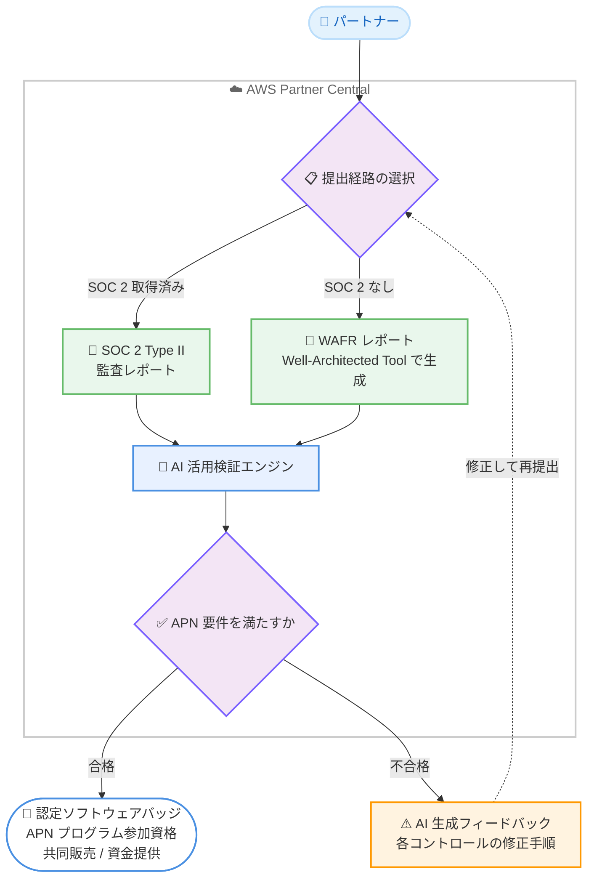

# AWS Partner Central - Foundational Technical Review の数分での検証

**リリース日**: 2026年6月16日
**サービス**: AWS Partner Central
**機能**: Foundational Technical Review (FTR) の AI 活用検証

📊 [このアップデートのインフォグラフィックを見る](https://takech9203.github.io/aws-news-summary/20260616-aws-partner-central-foundational-technical-review.html)
<!-- INFOGRAPHIC_BASE_URL は環境変数から取得 -->

## 概要

AWS は、AWS Partner Central において Foundational Technical Review (FTR) を数分で完了できる新しい検証プロセスを発表しました。パートナーは、SOC 2 Type II 監査レポート、または AWS Well-Architected Framework Review (WAFR) レポートのいずれかを提出することで、FTR プロセスを迅速に完了できるようになりました。

このプロセスは AI を活用した検証によって実現されており、パートナーが提出したソリューションが AWS Partner Network (APN) の要件を満たしているかどうかについて、即座にフィードバックを得られます。承認または実行可能なフィードバックが数分以内に返されるため、検証を加速し、認定ソフトウェアバッジ、APN プログラムへの参加資格、共同販売 (co-selling) や資金提供 (funding) へのアクセスといったメリットを早期に獲得できます。

このアップデートにより、パートナーの検証プロセスが、エンタープライズのお客様が一般的に認識し要求するコンプライアンス標準と整合するようになりました。これは、パートナーが市場投入までの時間を短縮し、AWS との協業を加速する上で重要な改善です。

**アップデート前の課題**

このアップデート以前、FTR プロセスには以下のような課題が存在していました。

- 検証プロセスに時間がかかり、承認までのリードタイムが長かった
- 既存のコンプライアンス資産 (SOC 2 監査レポートなど) を FTR の検証に直接活用しづらかった
- 検証で問題が見つかった場合、どの項目をどのように修正すべきか具体的な指針を得にくかった

**アップデート後の改善**

今回のアップデートにより、以下が可能になりました。

- SOC 2 Type II 監査レポートまたは WAFR レポートの提出により、FTR を数分で完了できるようになった
- AI 活用検証により、要件を満たしているかどうかの即時フィードバックを得られるようになった
- 問題が検出された場合、不合格となった各コントロールに対する具体的な修正手順 (remediation steps) を含む AI 生成のフィードバックを受け取り、即座に修正・再提出できるようになった

## アーキテクチャ図

このフローは、パートナーが SOC 2 または WAFR のいずれかのレポートを提出し、AI 活用検証エンジンが APN 要件への適合性を即座に判定する流れを示しています。不合格の場合は具体的な修正手順が返され、修正して再提出できます。

## サービスアップデートの詳細

### 主要機能

1. **2 つの検証経路 (SOC 2 / WAFR)**
   - SOC 2 認証を取得済みのパートナーは、第三者による SOC 2 Type II 監査レポートを AWS Partner Central で提出することで FTR 要件を満たせます
   - SOC 2 を取得していないパートナーは、AWS Well-Architected Tool で生成した WAFR レポートを代替手段として提出できます
   - いずれの経路でも、エンタープライズのお客様が一般的に要求するコンプライアンス標準とパートナー検証が整合します

2. **AI 活用検証による即時フィードバック**
   - 提出されたレポートを AI が検証し、ソリューションが APN 要件を満たしているかどうかを数分以内に判定します
   - 承認または実行可能なフィードバックが即座に返されます

3. **修正手順を含む AI 生成フィードバック**
   - 問題が検出された場合、不合格となった各コントロールに対する具体的な修正手順を含む AI 生成のフィードバックを受け取れます
   - パートナーは指摘内容を即座に修正し、再提出して反復できます

## 技術仕様

### 検証経路の比較

| 項目 | SOC 2 経路 | WAFR 経路 |
|------|-----------|-----------|
| 対象パートナー | SOC 2 Type II を取得済み | SOC 2 を取得していない |
| 提出物 | 第三者による SOC 2 Type II 監査レポート | AWS Well-Architected Tool で生成した WAFR レポート |
| 提出先 | AWS Partner Central | AWS Partner Central |
| 検証方式 | AI 活用検証 | AI 活用検証 |
| フィードバック | 数分以内に承認または修正手順を提示 | 数分以内に承認または修正手順を提示 |

### FTR の対象範囲

| 項目 | 詳細 |
|------|------|
| 対象パートナー | すべてのパートナーが利用可能 |
| 対象ソリューション | AWS 上にデプロイされたソフトウェアソリューション |
| 前提条件 | AWS Partner Revenue Measurement (APRM) が有効であること |

## 設定方法

### 前提条件

1. AWS Partner Central のアカウントを保有していること
2. 対象ソリューションが AWS 上にデプロイされ、AWS Partner Revenue Measurement (APRM) が有効であること
3. SOC 2 Type II 監査レポート、または AWS Well-Architected Tool で生成した WAFR レポートを準備していること

### 手順

#### ステップ1: 提出するレポートの準備

SOC 2 認証を取得済みの場合は、第三者による SOC 2 Type II 監査レポートを用意します。取得していない場合は、AWS Well-Architected Tool でレビューを実施し、WAFR レポートを生成します。

#### ステップ2: AWS Partner Central への提出

AWS Partner Central の FTR プロセスから、準備したレポートをアップロードして提出します。AI 活用検証により、APN 要件への適合性が数分以内に判定されます。

#### ステップ3: フィードバックの確認と再提出

問題が検出された場合は、各コントロールに対する修正手順を含む AI 生成フィードバックを確認します。指摘内容を修正したうえで、即座に再提出して検証を完了させます。

## メリット

### ビジネス面

- **市場投入までの時間短縮**: FTR を数分で完了でき、認定ソフトウェアバッジや APN プログラム参加資格を早期に獲得できます
- **既存資産の活用**: SOC 2 監査レポートなど既に保有しているコンプライアンス資産を FTR 検証に直接活用できます
- **協業機会の拡大**: 共同販売や資金提供へのアクセスを早期に確保でき、AWS との協業を加速できます

### 技術面

- **エンタープライズ標準との整合**: SOC 2 や Well-Architected といった、お客様が一般的に要求するコンプライアンス標準とパートナー検証が整合します
- **明確な改善指針**: 不合格となったコントロールごとに具体的な修正手順が提示されるため、何をどう直すべきかが明確です
- **迅速な反復**: 修正後に即座に再提出でき、検証の反復サイクルを高速化できます

## デメリット・制約事項

### 制限事項

- 対象は AWS 上にデプロイされ、AWS Partner Revenue Measurement が有効なソフトウェアソリューションに限られます
- SOC 2 Type II 監査レポートまたは WAFR レポートのいずれかが必要です
- 公式発表時点で、料金や利用可能リージョンに関する詳細は明示されていません

### 考慮すべき点

- WAFR 経路を選択する場合、事前に AWS Well-Architected Tool でレビューを実施しておく必要があります
- AI による検証結果や修正手順は、最終的に APN の要件に照らして確認することが推奨されます

## ユースケース

### ユースケース1: SOC 2 取得済みパートナーの迅速な FTR 完了

**シナリオ**: SOC 2 Type II 認証を保有する SaaS パートナーが、AWS Marketplace への出品に向けて FTR を完了させたい。

**効果**: 既存の SOC 2 監査レポートを提出するだけで FTR を数分で完了でき、認定ソフトウェアバッジの取得や共同販売の開始までの時間を大幅に短縮できます。

### ユースケース2: SOC 2 未取得パートナーの代替経路活用

**シナリオ**: SOC 2 を取得していないスタートアップパートナーが、できるだけ早く APN プログラムへの参加資格を得たい。

**効果**: AWS Well-Architected Tool で WAFR レポートを生成して提出することで、SOC 2 を取得しなくても FTR 要件を満たせ、検証のハードルを下げられます。

### ユースケース3: 不合格項目の迅速な修正と再提出

**シナリオ**: 提出したレポートで一部のコントロールが要件を満たさず不合格となったパートナーが、早期に再提出したい。

**効果**: 各不合格コントロールに対する AI 生成の修正手順に従って対応し、即座に再提出することで、検証完了までの反復を高速化できます。

## 料金

公式発表時点で、本機能に関する具体的な料金情報は示されていません。FTR はすべてのパートナーが利用可能とされています。最新の情報は AWS Partner Central および公式発表を参照してください。

## 利用可能リージョン

公式発表時点で、利用可能リージョンに関する具体的な情報は示されていません。詳細は AWS Partner Central のドキュメントを参照してください。

## 関連サービス・機能

- **AWS Well-Architected Tool**: WAFR レポートを生成するためのツールで、SOC 2 を取得していないパートナーの代替経路として利用します
- **AWS Partner Network (APN)**: FTR は APN の要件を満たすための検証プロセスであり、合格により各種プログラムへの参加資格を得られます
- **AWS Partner Revenue Measurement (APRM)**: FTR の対象となるソリューションの前提条件として有効化が必要です

## 参考リンク

- 📊 [インフォグラフィック](https://takech9203.github.io/aws-news-summary/20260616-aws-partner-central-foundational-technical-review.html)
- [公式発表 (What's New)](https://aws.amazon.com/about-aws/whats-new/2026/06/aws-partner-central-foundational-technical-review/)
- [AWS Blog: New agentic capabilities to take you from registered to ready-to-sell in days](https://aws.amazon.com/blogs/apn/get-ready-to-sell/)
- [AWS Blog: Sell smarter with AWS: New agentic capabilities accelerate time to revenue](https://aws.amazon.com/blogs/apn/sell-smarter-with-aws/)

## まとめ

今回のアップデートにより、AWS Partner Central の Foundational Technical Review は、SOC 2 監査レポートまたは WAFR レポートを活用した AI 検証で数分で完了できるようになりました。これにより、パートナーは既存のコンプライアンス資産を活かしながら、市場投入や AWS との協業を加速できます。SOC 2 取得状況に応じた最適な検証経路を選び、認定バッジや共同販売などのメリットの早期獲得を目指すことをお勧めします。
