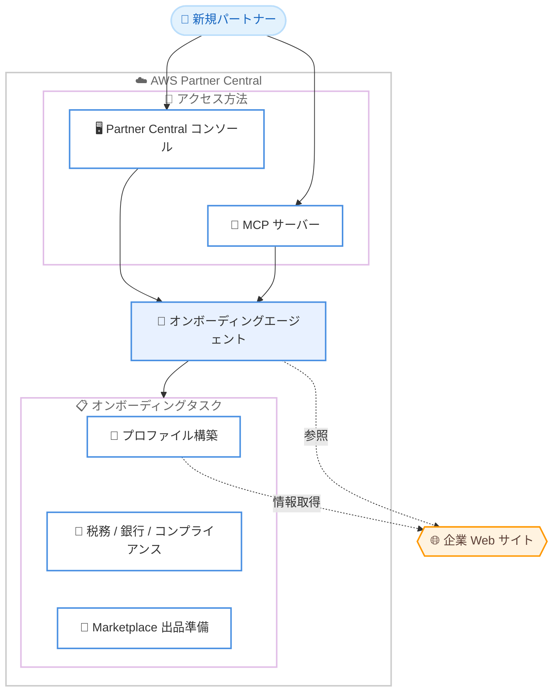

# AWS Partner Central - オンボーディングエージェント

**リリース日**: 2026 年 6 月 16 日
**サービス**: AWS Partner Central
**機能**: AWS Partner Central agents (オンボーディング機能)

📊 [このアップデートのインフォグラフィックを見る](https://takech9203.github.io/aws-news-summary/20260616-aws-partner-central.html)
<!-- INFOGRAPHIC_BASE_URL は環境変数から取得 -->

## 概要

AWS は 2026 年 6 月 16 日に、AWS Partner Central agents のオンボーディング機能の一般提供 (GA) を発表しました。この機能は、新規 AWS パートナーが登録から販売準備完了 (ready-to-sell) までの各ステップを進める際に、常時利用可能なアドバイザーとして案内する AI エージェントです。

従来、新規パートナーは AWS での販売を開始するまでに、複数のドキュメントを調査し、プロファイル設定、税務、銀行口座、コンプライアンスなどの要件を個別に把握する必要がありました。AWS Partner Central agents は、これらのプロセスをガイド付きの対話型体験として提供し、パートナーが何を行うべきか、なぜそれが必要なのかを明確に示します。

エージェントはパートナーの企業 Web サイトから情報を取得してパートナープロファイルを自動的に構築し、販売準備完了に向けた次のステップを特定します。パートナーは AWS Partner Central コンソールから直接利用できるほか、Model Context Protocol (MCP) を介してプログラムからも利用できます。この機能は、すべての商用 AWS リージョンで本日から利用可能です。

**アップデート前の課題**

- 新規パートナーは販売準備を完了するために、複数のドキュメントを個別に調査する必要があった
- プロファイル情報 (対応業界、提供ソリューション、主要な能力) を手動で入力する必要があった
- 税務、銀行口座、コンプライアンスなどの要件を、自力で順序立てて把握する必要があった

**アップデート後の改善**

- エージェントが企業 Web サイトから情報を取得し、パートナープロファイルを自動的に構築する
- 販売準備完了に向けた次のステップと、その理由をエージェントが特定して説明する
- 税務、銀行口座、コンプライアンス要件についてステップバイステップのガイダンスを提供する
- オンデマンドでパーソナライズされたロードマップを取得でき、複数のドキュメント調査が不要になった

## アーキテクチャ図

新規パートナーはコンソールまたは MCP サーバー経由でオンボーディングエージェントにアクセスし、エージェントが企業 Web サイトを参照しながらプロファイル構築やコンプライアンス対応などのタスクをガイドします。

## サービスアップデートの詳細

### 主要機能

1. **パートナープロファイルの自動構築**
   - パートナーの企業 Web サイトから事実情報を取得し、プロファイルを自動的に作成する
   - 対応業界、提供ソリューション、主要な能力を自動的に入力する
   - 手動でのプロファイル入力作業を削減する

2. **販売準備完了に向けた次のステップの特定**
   - パートナーが販売可能になるために必要な次のステップを特定する
   - 各ステップが必要な理由をエージェントが説明する
   - オンデマンドでパーソナライズされたロードマップを提供する

3. **税務・銀行・コンプライアンス要件のガイダンス**
   - 各種検証、税務、支払い設定を含む要件をステップバイステップで案内する
   - パートナーが要件を順序立てて完了できるよう支援する

4. **AWS Marketplace 出品の準備**
   - パートナーが AWS Marketplace への出品を作成できるよう準備を整える

5. **2 つのアクセス方法**
   - AWS Partner Central コンソールから直接利用 (ダッシュボードのデフォルトプロンプト経由)
   - Model Context Protocol (MCP) を介したプログラムからの利用

## 技術仕様

### アクセス方法の比較

| 項目 | 詳細 |
|------|------|
| コンソール | AWS Partner Central コンソールのダッシュボードに表示されるデフォルトプロンプトから対話的に利用 |
| MCP サーバー | Model Context Protocol を介して、エージェント機能をプログラムから呼び出して利用 |
| 情報ソース | パートナーの企業 Web サイトから事実情報を取得してプロファイルを構築 |
| 対象タスク | プロファイル構築、次のステップ特定、税務 / 銀行 / コンプライアンス、Marketplace 出品準備 |

## 設定方法

### 前提条件

1. AWS Partner Central のアカウント (パートナー登録) を保有していること
2. パートナープロファイル構築のために、企業情報を掲載した Web サイトがあること
3. MCP 経由で利用する場合は、MCP に対応したクライアント環境

### 手順

#### ステップ 1: AWS Partner Central コンソールにアクセス

`partnercentral.awspartner.com` にサインインし、ダッシュボードを開きます。ダッシュボードに表示されるデフォルトプロンプトから、オンボーディングエージェントとの対話を開始します。

#### ステップ 2: エージェントの案内に従ってオンボーディングを進める

エージェントがパートナープロファイルを自動構築し、販売準備完了に向けた次のステップを提示します。税務、銀行口座、コンプライアンス要件についてのガイダンスに従って各タスクを完了します。

#### ステップ 3: MCP 経由での利用 (任意)

プログラムからエージェント機能を利用する場合は、Partner Central agents MCP サーバーを設定します。設定方法は公式の MCP サーバーガイドを参照してください。

## メリット

### ビジネス面

- **販売開始までの時間短縮**: 登録から販売準備完了までのプロセスをガイドし、数日でのオンボーディングを支援する
- **調査負荷の軽減**: 複数のドキュメントを個別に調査する必要がなくなり、パーソナライズされたロードマップで進められる
- **新規パートナー体験の向上**: 何を、なぜ行うべきかが明確になり、初めての AWS パートナーでも迷わず進められる

### 技術面

- **自動プロファイル構築**: 企業 Web サイトの情報を活用して、手動入力を削減する
- **プログラムによる統合**: MCP を介して既存のワークフローやツールにオンボーディング機能を組み込める
- **常時利用可能**: 時間帯を問わずアドバイザーとして利用できる

## デメリット・制約事項

### 制限事項

- プロファイルの自動構築は企業 Web サイトの情報に依存するため、Web サイトの情報が不足している場合は精度が低下する可能性がある
- AWS Partner Central のパートナー向け機能であり、一般の AWS アカウントユーザーは対象外

### 考慮すべき点

- 自動構築されたプロファイル情報は、内容が正確かどうかをパートナー自身で確認することが望ましい
- 税務やコンプライアンスに関する最終的な判断は、各組織の要件に応じて行う必要がある

## ユースケース

### ユースケース 1: 初めて AWS パートナーになる企業の迅速なオンボーディング

**シナリオ**: AWS パートナーとして新規登録した企業が、販売を開始するまでに何をすべきか分からない状況

**効果**: エージェントが次のステップとその理由を提示し、税務・銀行・コンプライアンス要件をガイドすることで、登録から販売準備完了までを迅速に進められる

### ユースケース 2: プロファイル作成の効率化

**シナリオ**: パートナーが対応業界や提供ソリューションなどのプロファイル情報を一から入力する必要がある状況

**効果**: 企業 Web サイトから情報を自動取得してプロファイルを構築するため、手動入力の手間を削減できる

### ユースケース 3: MCP を活用したオンボーディングの自動化

**シナリオ**: 自社のツールやワークフローからパートナーオンボーディングの状況を管理したい状況

**効果**: MCP サーバーを介してエージェント機能をプログラムから呼び出し、既存のシステムに統合できる

## 料金

公式発表では、本機能に関する追加料金についての記載はありません。詳細は AWS Partner Central のドキュメントを参照してください。

## 利用可能リージョン

すべての商用 AWS リージョンで本日 (2026 年 6 月 16 日) から利用可能です。

## 関連サービス・機能

- **AWS Marketplace**: オンボーディングエージェントは、パートナーが AWS Marketplace に出品を作成する準備を支援する
- **Model Context Protocol (MCP)**: エージェント機能をプログラムから利用するためのインターフェースとして使用する
- **AWS Partner Central agents**: 共同販売 (co-selling) など他のエージェント機能と連携し、パートナー体験全体を支援する

## 参考リンク

- 📊 [インフォグラフィック](https://takech9203.github.io/aws-news-summary/20260616-aws-partner-central.html)
- [公式発表 (What's New)](https://aws.amazon.com/about-aws/whats-new/2026/06/aws-partner-central/)
- [AWS Blog: New agentic capabilities to take you from registered to ready-to-sell in days](https://aws.amazon.com/blogs/apn/get-ready-to-sell/)
- [ドキュメント: Partner onboarding agent](https://docs.aws.amazon.com/partner-central/latest/getting-started/partner-onboarding-agent.html)
- [ドキュメント: Partner Central agents MCP server](https://docs.aws.amazon.com/partner-central/latest/APIReference/partner-central-mcp-server.html)

## まとめ

AWS Partner Central agents のオンボーディング機能は、新規パートナーが登録から販売準備完了に至るまでのプロセスを、AI エージェントによるガイド付き体験へと変えるアップデートです。プロファイルの自動構築や税務・コンプライアンス要件のガイダンスにより、パートナーは複数のドキュメント調査から解放され、より短期間で販売を開始できます。AWS パートナーは、Partner Central コンソールまたは MCP からエージェントを試し、自社のオンボーディング体験の効率化を検討することを推奨します。
