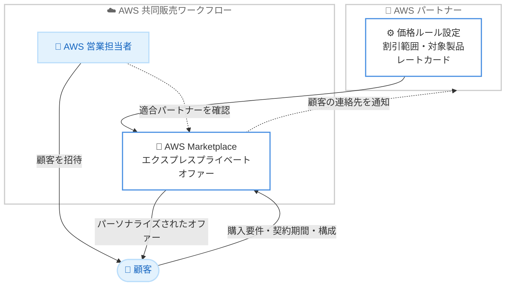

# AWS Marketplace - エクスプレスプライベートオファーによる共同販売の加速

**リリース日**: 2026 年 6 月 16 日
**サービス**: AWS Marketplace
**機能**: Express Private Offers (エクスプレスプライベートオファー)

📊 [このアップデートのインフォグラフィックを見る](https://takech9203.github.io/aws-news-summary/20260616-aws-partners-express-private-offers.html)
<!-- INFOGRAPHIC_BASE_URL は環境変数から取得 -->

## 概要

AWS は、AWS と共同販売 (co-sell) を行う AWS パートナーが、エクスプレスプライベートオファー (express private offers) を活用して取引を加速できるようになったことを発表しました。この機能により、パートナーは共同販売ワークフローの中で価格設定を自動化できます。パートナーは価格ルールを一度設定しておくだけで、AWS の営業担当者が適合する案件を見つけた際に、迅速に取引を成立させることができます。

従来、共同販売における取引の成立には、数週間にわたる手動の価格交渉が必要でした。エクスプレスプライベートオファーを使用すると、パートナーは価格ルール、割引の範囲、対象製品を事前に一度設定するだけで、商談 (opportunity) からプライベートオファーの提示までを数週間ではなく数分で完了できます。

エクスプレスプライベートオファーは、AWS Marketplace の機能として、SaaS Contract および SaaS Contract with Consumption Pricing の製品に対するプライベートオファー生成を自動化します。事前定義された価格と適格性基準を持つレートカードを設定することで、標準的な取引については購入者が自動生成されたプライベートオファーを受け取れる一方、よりカスタムな要求はパートナーの営業チームへ自動的に振り分けられます。本機能は、AWS 主導の販売活動 (sales motion) におけるパートナーの可視性を高め、購入意欲を示した顧客とより迅速に関わることを目的としています。

**アップデート前の課題**

- 共同販売の取引成立には、数週間にわたる手動の価格交渉が必要だった
- 標準的な取引であっても、案件ごとにプライベートオファーを個別に作成する必要があり、営業チームの手作業負担が大きかった
- AWS の営業担当者は、どのパートナーが迅速にカスタム価格を提供できるかを把握しづらく、共同販売を進める確度が低かった

**アップデート後の改善**

- 価格ルール、割引の範囲、対象製品を一度設定するだけで、商談からプライベートオファー提示までを数分で完了できるようになった
- 標準的な取引のプライベートオファー作成を自動化し、営業チームは戦略的で価値の高い案件に集中できるようになった
- AWS の営業担当者が、エクスプレスプライベートオファーを有効化済みのパートナーを確認し、顧客にパーソナライズされた価格を案内できるようになった

## アーキテクチャ図

パートナーが事前に設定した価格ルールをもとに、AWS 営業担当者が適合パートナーを確認して顧客を招待し、顧客の要件に応じたパーソナライズされたオファーが自動生成される流れを示しています。

## サービスアップデートの詳細

### 主要機能

1. **価格ルールの事前設定**
   - パートナーは価格ルール、割引の範囲、対象製品を一度だけ設定する
   - 事前定義された価格と適格性基準を持つレートカードを構成する
   - 標準的な取引は自動でオファー生成し、カスタム要求は営業チームへ自動振り分けする

2. **AWS 共同販売ワークフローとの統合**
   - AWS の営業担当者は共同販売ツール上で、エクスプレスプライベートオファーを有効化済みのパートナーを確認できる
   - 適合する案件を見つけた営業担当者が、顧客にパーソナライズされた価格の取得を案内する
   - 適合するパートナーが遅延なくカスタム価格を提供できることを、AWS 営業担当者が確信できる

3. **顧客主導のオファー取得とフォローアップ**
   - 顧客は購入要件、契約期間、構成のニーズを入力し、パートナーの事前設定ルールに基づいたオファーを受け取る
   - パートナーは顧客の連絡先情報を受け取り、オファー受諾の支援や補足情報の提供のためにフォローアップできる

## 技術仕様

### 対象製品とオファーの仕組み

| 項目 | 詳細 |
|------|------|
| 対象製品タイプ | SaaS Contract、SaaS Contract with Consumption Pricing |
| 設定単位 | レートカード (事前定義された価格と適格性基準) |
| 自動化対象 | 標準的な取引のプライベートオファー生成 |
| 手動対応への振り分け | 適格性基準を満たさないカスタム要求は営業チームへ自動ルーティング |
| 提供プラットフォーム | AWS Marketplace |

## 設定方法

### 前提条件

1. AWS Marketplace の出品者 (Seller) として登録済みであること
2. SaaS Contract または SaaS Contract with Consumption Pricing 形式の製品を出品していること
3. AWS との共同販売 (co-sell) プログラムに参加していること

### 手順

#### ステップ 1: 対象製品の確認

エクスプレスプライベートオファーの対象となる SaaS Contract または SaaS Contract with Consumption Pricing の製品を AWS Marketplace 上で確認します。対象製品でなければレートカードの設定対象になりません。

#### ステップ 2: レートカードの設定

AWS Marketplace Seller Guide の手順に従い、価格ルール、割引の範囲、対象製品、適格性基準を含むレートカードを構成します。この設定により、標準的な取引については自動でプライベートオファーが生成され、基準を満たさない要求は営業チームへ振り分けられます。

#### ステップ 3: 共同販売ワークフローでの活用

設定が完了すると、AWS の営業担当者は共同販売ツール上でエクスプレスプライベートオファーが有効なパートナーとして認識します。営業担当者が適合案件を特定すると、顧客が要件を入力してパーソナライズされたオファーを受け取り、パートナーは通知された連絡先をもとにフォローアップを行います。

## メリット

### ビジネス面

- **取引成立の高速化**: 商談からプライベートオファー提示までを、数週間の手動交渉から数分へ短縮できる
- **AWS 営業活動での可視性向上**: AWS 主導の販売活動においてパートナーの存在感が高まり、購入意欲を示した顧客とより早く関われる
- **スケーラビリティ**: 取引処理を自動化することで、営業リソースを比例して増やさずにより多くの顧客にリーチできる

### 技術面

- **営業リソースの最適化**: 標準取引の処理を自動化し、営業チームは戦略的で価値の高い案件に集中できる
- **価格の柔軟性**: 公開せずに柔軟な価格を提示でき、競争上の優位性を維持できる
- **一度の設定による再利用**: 価格ルールを一度設定すれば、複数の取引に繰り返し適用できる

## デメリット・制約事項

### 制限事項

- 対象は SaaS Contract および SaaS Contract with Consumption Pricing の製品に限られる
- 適格性基準を満たさないカスタム要求は自動化されず、営業チームによる手動対応が必要となる
- 公式発表では、利用可能リージョンや追加料金に関する具体的な記載はない

### 考慮すべき点

- 価格ルールや割引範囲の設定内容が、自動生成されるオファーの妥当性に直結するため、慎重な初期設計が求められる
- 共同販売プログラムへの参加が前提となるため、未参加のパートナーは事前準備が必要となる

## ユースケース

### ユースケース 1: 標準的な SaaS 契約の迅速な成約

**シナリオ**: SaaS 製品を提供するパートナーが、AWS の営業担当者から紹介された見込み顧客に対し、標準的な割引条件で契約を素早く成立させたい。

**効果**: 事前設定したレートカードにより、顧客は数分でパーソナライズされたオファーを受け取り、数週間の交渉を経ずに契約に進める。

### ユースケース 2: 営業リソースの戦略的配分

**シナリオ**: 取引件数が多いパートナーが、標準取引に営業リソースを取られず、大型かつ戦略的な案件に集中したい。

**効果**: 標準取引のオファー生成を自動化し、カスタム要求のみを営業チームへ振り分けることで、限られたリソースを高価値案件に集中できる。

### ユースケース 3: AWS 共同販売における露出の最大化

**シナリオ**: AWS と共同販売を行うパートナーが、AWS 主導の商談で確実に候補として認識され、購入意欲のある顧客と早期に接点を持ちたい。

**効果**: エクスプレスプライベートオファーを有効化することで、AWS 営業担当者の共同販売ツール上に表示され、適合案件で優先的に紹介される。

## 料金

公式発表では、エクスプレスプライベートオファーの利用に関する追加料金についての記載はありません。AWS Marketplace の出品およびプライベートオファーに関する料金体系に準じます。詳細は AWS Marketplace の料金ページおよび Seller Guide を確認してください。

## 利用可能リージョン

公式発表では、利用可能リージョンに関する具体的な記載はありません。AWS Marketplace はグローバルに提供されるサービスです。詳細は公式ドキュメントを確認してください。

## 関連サービス・機能

- **AWS Marketplace**: エクスプレスプライベートオファーが提供される基盤となるサービス
- **プライベートオファー (Private Offers)**: 特定の顧客向けにカスタム価格を提示する AWS Marketplace の機能で、本機能はその生成を自動化する
- **AWS パートナー共同販売 (Co-Sell)**: AWS の営業担当者とパートナーが協力して案件を進める仕組みで、本機能はこのワークフローと統合される

## 参考リンク

- 📊 [インフォグラフィック](https://takech9203.github.io/aws-news-summary/20260616-aws-partners-express-private-offers.html)
- [公式発表 (What's New)](https://aws.amazon.com/about-aws/whats-new/2026/06/aws-partners-express-private-offers)
- [AWS Blog: Improving your visibility to AWS Sales - A practical guide for Partners](https://aws.amazon.com/blogs/awsmarketplace/improving-your-visibility-to-aws-sales-a-practical-guide-for-partners/)
- [ドキュメント: Express private offers (AWS Marketplace Seller Guide)](https://docs.aws.amazon.com/marketplace/latest/userguide/express-private-offers.html)

## まとめ

エクスプレスプライベートオファーは、AWS パートナーが共同販売の取引を数週間から数分へと劇的に短縮できる重要なアップデートです。価格ルールを一度設定するだけで標準取引のオファー生成を自動化でき、営業リソースを戦略案件に集中させながら AWS 営業活動での可視性も高められます。SaaS 製品を提供する共同販売パートナーは、AWS Marketplace Seller Guide を参照してレートカードの設定を進めることを推奨します。
