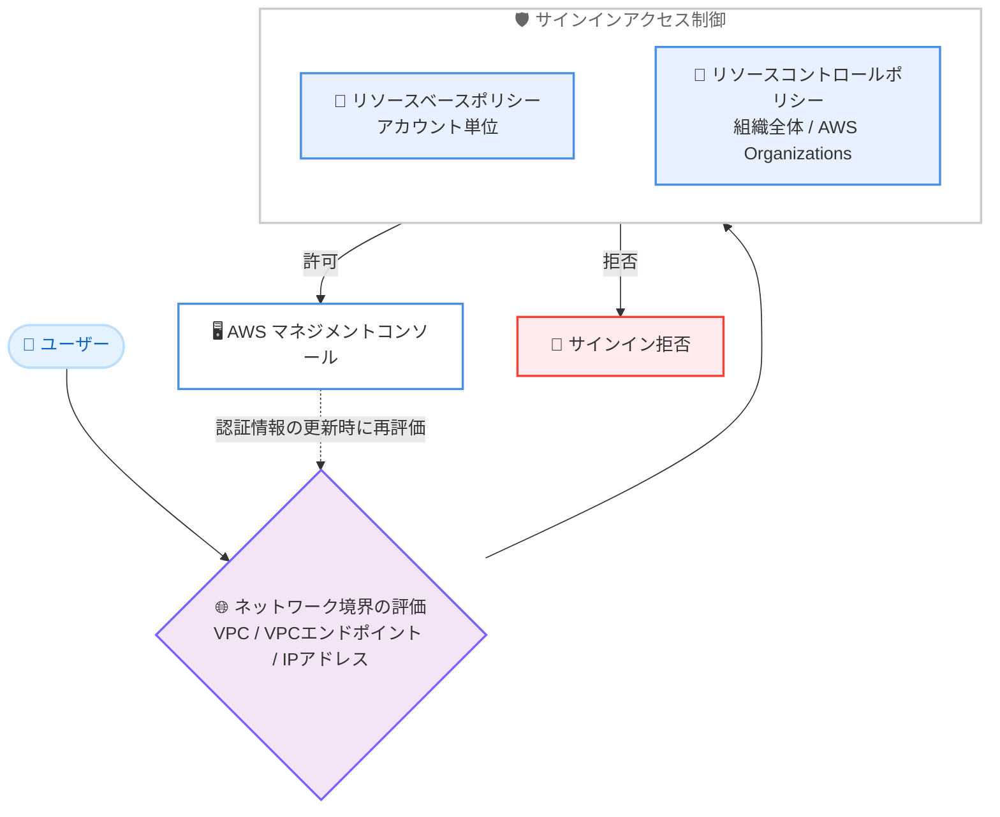

# AWS Sign-in - リソースベースポリシーとリソースコントロールポリシーのサポート

**リリース日**: 2026 年 6 月 16 日
**サービス**: AWS Sign-in
**機能**: AWS マネジメントコンソールに対するリソースベースポリシーおよびリソースコントロールポリシー (RCP) のサポート

📊 [このアップデートのインフォグラフィックを見る](https://takech9203.github.io/aws-news-summary/20260616-aws-sign-in.html)
<!-- INFOGRAPHIC_BASE_URL は環境変数から取得 -->

## 概要

AWS Sign-in が、AWS マネジメントコンソールへのサインインに対してリソースベースポリシーおよびリソースコントロールポリシー (RCP) を適用できるようになりました。これにより、お客様はコンソールへのサインインを想定したネットワークからのアクセスのみに制限できます。たとえば、特定の VPC、VPC エンドポイント、IP アドレスからのコンソールサインインのみを許可するといった制御が可能です。

リソースベースポリシーは個々の AWS アカウント単位で適用でき、RCP は AWS Organizations を通じて組織全体に一括で適用できます。これらのポリシーは、サインイン時だけでなく、コンソールセッションが新しい認証情報を要求するタイミング (認証情報の更新時) にも評価されます。そのため、セッションの途中であっても想定外のネットワークからのアクセスを継続的に防止できます。

この機能は、AWS マネジメントコンソール Private Access と組み合わせて利用できます。Private Access がアクセス可能なアカウントの範囲を制御するのに対し、本機能はユーザーがサインインしてくるネットワークの範囲を制御します。両者を組み合わせることで、コンソールアクセスに対してネットワーク境界とアカウント境界の双方を一元的に管理できます。

**アップデート前の課題**

- 従来、コンソールサインインに対するネットワークベースのアクセス制限は、SCP や IAM ポリシーの条件キー、VPC エンドポイントポリシーなど複数の仕組みを組み合わせて間接的に実現する必要があった
- アカウント単位やネットワーク単位でサインイン経路を直接的に制限する統一的な仕組みが存在しなかった
- 組織全体のすべてのアカウントに対して、コンソールサインインのネットワーク境界を一括で強制することが難しかった

**アップデート後の改善**

- リソースベースポリシーにより、アカウント単位でコンソールサインインを許可するネットワークを宣言的に定義できるようになった
- RCP により、AWS Organizations 配下のすべてのアカウントに対して、組織全体でサインインのネットワーク境界を一括強制できるようになった
- サインイン時に加えて認証情報の更新時にもポリシーが評価されるため、セッション継続中の想定外ネットワークからのアクセスも防止できるようになった

## アーキテクチャ図



ユーザーのコンソールサインインは、ネットワーク境界の条件に基づいてリソースベースポリシーまたは RCP で評価され、許可された場合のみコンソールへのアクセスが成立します。認証情報の更新時にも同じ評価が再度行われます。

## サービスアップデートの詳細

### 主要機能

1. **リソースベースポリシーによるアカウント単位の制御**
   - 個々の AWS アカウントに対して、コンソールサインインを許可するネットワーク境界を定義できる
   - VPC ID、VPC エンドポイント、IP アドレスといったネットワークパラメータに基づいて、想定したネットワークからのサインインのみを許可できる
   - アカウントごとに異なるネットワーク要件を柔軟に表現できる

2. **リソースコントロールポリシー (RCP) による組織全体の制御**
   - AWS Organizations を通じて、組織全体のすべてのアカウントにサインインのネットワーク境界を一括適用できる
   - 個々のアカウント管理者がポリシーを緩和できない、組織レベルのガードレールとして機能する
   - 大規模なマルチアカウント環境において、一貫したサインインの境界を強制できる

3. **サインイン時と認証情報更新時の継続的な評価**
   - ポリシーはサインインの瞬間だけでなく、コンソールセッションが新しい認証情報を要求するタイミングでも評価される
   - セッション継続中にネットワーク条件を満たさなくなった場合にも、想定外のアクセスを防止できる
   - AWS マネジメントコンソール Private Access と組み合わせることで、ネットワーク境界とアカウント境界の双方を管理できる

## 技術仕様

### 機能の特性

| 項目 | 詳細 |
|------|------|
| 適用範囲 | AWS マネジメントコンソールへのサインイン |
| リソースベースポリシー | 個々の AWS アカウント単位で適用 |
| リソースコントロールポリシー (RCP) | AWS Organizations を通じて組織全体に適用 |
| ネットワーク境界の条件 | VPC ID、VPC エンドポイント、IP アドレス |
| ポリシー評価のタイミング | サインイン時および認証情報の更新時 |
| 連携機能 | AWS マネジメントコンソール Private Access |

### API変更履歴

| 日付 | サービス | 変更内容 |
|------|----------|----------|
| 2026/06/10 | [signin](https://awsapichanges.com/archive/changes/0ffcb2-signin.html) | 7 new api methods - リソースベースポリシーによるコンソールアクセス制御の追加。VPC ID、VPC エンドポイント、IP アドレスなどのネットワーク境界に基づくコンソールアクセス制限をサポート |

## 設定方法

### 前提条件

1. 制御対象の AWS アカウント、または RCP を利用する場合は AWS Organizations が有効化されていること
2. ポリシーを作成・適用するための適切な管理者権限を有していること
3. 許可するネットワーク境界 (VPC ID、VPC エンドポイント ID、IP アドレス範囲) が事前に整理されていること

### 手順

#### ステップ1: 許可するネットワーク境界の整理

社内ネットワークの IP アドレス範囲、AWS マネジメントコンソール Private Access で使用する VPC エンドポイント、対象 VPC を洗い出し、コンソールサインインを許可する範囲を定義します。この情報がポリシーの条件として利用されます。

#### ステップ2: リソースベースポリシーまたは RCP の作成

単一アカウントに適用する場合はリソースベースポリシーを、組織全体に適用する場合は AWS Organizations の RCP を作成します。整理したネットワーク境界を条件として、許可するサインインの範囲を記述します。具体的なポリシー構文は AWS Sign-in ユーザーガイドおよび API リファレンスを参照してください。

#### ステップ3: ポリシーの適用と検証

作成したポリシーを対象アカウントまたは組織に適用します。適用後、許可したネットワークからのサインインが成功し、許可していないネットワークからのサインインが拒否されることを検証します。セッション継続中の認証情報更新時にも意図したとおりに評価されることを確認します。

## メリット

### ビジネス面

- **コンプライアンス強化**: コンソールアクセスを想定したネットワークに限定することで、社内ネットワークや承認済み経路からのアクセスのみを許可する要件に対応しやすくなる
- **追加コストなし**: すべての AWS 商用リージョンで追加料金なしで利用できるため、コストをかけずにセキュリティ態勢を強化できる
- **組織全体のガバナンス**: RCP により、組織配下のすべてのアカウントに一貫したサインイン境界を強制でき、ガバナンスを一元化できる

### 技術面

- **宣言的なネットワーク境界の定義**: VPC、VPC エンドポイント、IP アドレスを条件としたポリシーで、サインイン経路を明示的に制御できる
- **継続的な評価**: サインイン時だけでなく認証情報更新時にも評価されるため、セッション途中の経路変更にも対応できる
- **既存機能との統合**: AWS マネジメントコンソール Private Access と組み合わせ、ネットワーク境界とアカウント境界を統合的に管理できる

## デメリット・制約事項

### 制限事項

- 本機能はすべての AWS 商用リージョンで利用可能だが、AWS GovCloud (US) や中国リージョンでの提供状況は別途確認が必要
- ポリシーの条件設定を誤ると、正規のユーザーがコンソールにサインインできなくなるおそれがある

### 考慮すべき点

- ネットワーク境界を厳格に設定する前に、緊急時のアクセス経路 (ブレークグラス手順) を確保しておくことが望ましい
- RCP は組織全体に影響するため、本番適用前にステージング環境や限定的なスコープで十分に検証する
- VPC エンドポイントを条件とする場合は、AWS マネジメントコンソール Private Access の構成と整合させる必要がある

## ユースケース

### ユースケース1: 社内ネットワークからのコンソールアクセスへの限定

**シナリオ**: 企業が、AWS マネジメントコンソールへのアクセスを社内オフィスや VPN 経由の既知の IP アドレス範囲のみに限定したい。

**実装例**:
```
リソースベースポリシーまたは RCP で、許可する IP アドレス範囲を
ネットワーク境界の条件として指定する
```

**効果**: 想定外のネットワークからのコンソールサインインが拒否され、認証情報が漏洩した場合でも外部からの利用リスクを低減できる。

### ユースケース2: 組織全体での統一されたサインイン境界の強制

**シナリオ**: マルチアカウント環境を運用する組織が、すべてのメンバーアカウントに対して、承認済みネットワークからのコンソールサインインのみを一括で強制したい。

**実装例**:
```
AWS Organizations の RCP で、組織全体に適用するネットワーク境界を定義し、
個々のアカウント管理者が緩和できないガードレールとして設定する
```

**効果**: アカウントごとの設定漏れを防ぎ、組織全体で一貫したサインインのセキュリティ境界を維持できる。

### ユースケース3: Console Private Access との組み合わせ

**シナリオ**: VPC 経由でコンソールにプライベートアクセスする構成において、アクセス可能なアカウントとサインイン元ネットワークの双方を制御したい。

**実装例**:
```
AWS マネジメントコンソール Private Access でアカウント境界を制御し、
リソースベースポリシー / RCP で VPC エンドポイントを条件としたネットワーク境界を制御する
```

**効果**: ネットワーク境界とアカウント境界を組み合わせた多層的なコンソールアクセス制御を実現できる。

## 料金

本機能は、すべての AWS 商用リージョンで追加料金なしで利用できます。リソースベースポリシーおよび RCP の適用自体に対する課金はありません。

## 利用可能リージョン

すべての AWS 商用リージョンで利用可能です。

## 関連サービス・機能

- **AWS マネジメントコンソール Private Access**: アクセス可能な AWS アカウントを制御する機能。本機能のネットワーク境界制御と組み合わせて利用できる
- **AWS Organizations**: RCP を組織全体のアカウントに適用するための基盤となるサービス
- **AWS IAM**: コンソールサインインの認証・認可を担うサービス。本機能はネットワーク境界の観点からアクセス制御を補完する

## 参考リンク

- 📊 [インフォグラフィック](https://takech9203.github.io/aws-news-summary/20260616-aws-sign-in.html)
- [公式発表 (What's New)](https://aws.amazon.com/about-aws/whats-new/2026/06/aws-sign-in/)
- [AWS Sign-in ユーザーガイド](https://docs.aws.amazon.com/signin/latest/userguide/)
- [AWS Sign-in API リファレンス](https://docs.aws.amazon.com/signin/latest/APIReference/)
- [AWS マネジメントコンソール Private Access](https://docs.aws.amazon.com/awsconsolehelpdocs/latest/gsg/aws-management-console-private-access.html)
- [API 変更履歴 (awsapichanges.com)](https://awsapichanges.com/archive/changes/0ffcb2-signin.html)

## まとめ

このアップデートにより、AWS マネジメントコンソールへのサインインをアカウント単位 (リソースベースポリシー) または組織全体 (RCP) でネットワーク境界に基づいて制御できるようになりました。追加料金なしで利用でき、認証情報の更新時にも継続的に評価されるため、認証情報漏洩時のリスク低減やネットワーク境界の強制に有効です。AWS マネジメントコンソール Private Access と組み合わせて、ネットワーク境界とアカウント境界の双方を満たすコンソールアクセス制御の導入を検討してください。
