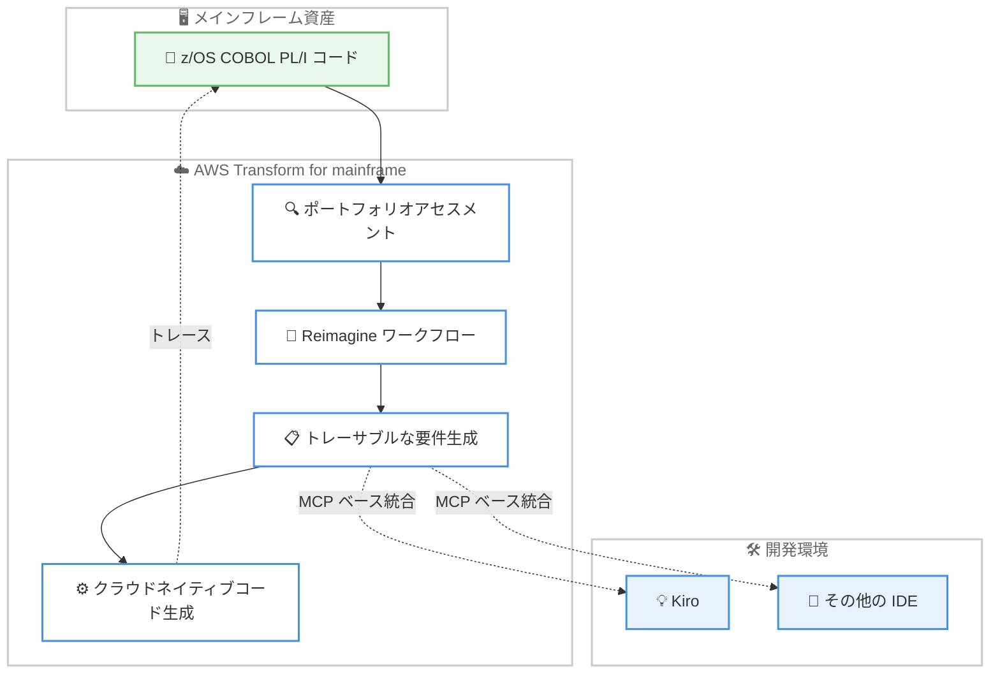

# AWS Transform for mainframe - トレーサブルな Reimagine ワークフロー

**リリース日**: 2026 年 6 月 16 日
**サービス**: AWS Transform
**機能**: トレーサブルな Reimagine ワークフロー (Traceable Reimagine Workflow)

📊 [このアップデートのインフォグラフィックを見る](https://takech9203.github.io/aws-news-summary/20260616-aws-transform-mainframe-traceable-reimagine-workflow.html)
<!-- INFOGRAPHIC_BASE_URL は環境変数から取得 -->

## 概要

AWS Transform for mainframe は、メインフレームのモダナイゼーションを支援するエージェント型 AI サービスです。今回のアップデートにより、アセスメント (評価) からコード生成までを 1 つの連続したプロセスとして接続する、エンドツーエンドの「Reimagine (再構想)」ワークフローが提供されるようになりました。これにより、従来必要だった複数の独立したツールの利用や、手作業による引き継ぎ作業が不要になります。

このワークフローでは、ポートフォリオアセスメントが個別のビジネス機能を体系的に特定してカタログ化し、選択されたビジネス機能がそのまま Reimagine ワークフローに引き継がれます。生成される成果物は完全なトレーサビリティ (追跡可能性) を備えた開発準備済みの要件であり、すべての要件がソースコードまで遡って追跡できます。これにより、モダナイゼーションの判断を後から監査できます。

対象となるのは、z/OS 上で COBOL や PL/I のワークロードを実行しており、メインフレームアプリケーションをモダナイズしたい企業です。AWS は、このアプローチによって従来数年かかっていた手作業を、エビデンス (証拠) に基づく自動化されたモダナイゼーションとして数か月に短縮できるとしています。

**アップデート前の課題**

- 以前はアセスメントとコード生成が分断されており、複数の独立したツールを使い分ける必要がありました
- 以前はツール間でのデータの引き継ぎを手作業で行う必要がありました
- 以前は生成された要件とソースコードの対応関係を追跡することが難しく、モダナイゼーションの判断を監査することが困難でした

**アップデート後の改善**

- 今回のアップデートにより、アセスメントからコード生成までが 1 つの連続したワークフローとして接続されました
- 今回のアップデートにより、要件が MCP ベースの統合を通じて Kiro やその他の IDE に直接連携できるようになりました
- 今回のアップデートにより、すべての要件がソースコードまで遡って追跡できる完全なトレーサビリティが実現されました

## アーキテクチャ図

メインフレームのソースコードがアセスメントから Reimagine ワークフロー、要件生成、コード生成へと連続して流れ、要件は MCP ベースの統合を通じて Kiro などの IDE に連携されます。生成されたコードはソースコードまでトレースできます。

## サービスアップデートの詳細

### 主要機能

1. **ポートフォリオアセスメント**
   - 既存のメインフレーム資産を分析し、個別のビジネス機能を体系的に特定します
   - 特定したビジネス機能をカタログ化します
   - 選択したビジネス機能を後続の Reimagine ワークフローに引き継ぎます

2. **接続された Reimagine ワークフロー**
   - 選択されたビジネス機能がそのまま Reimagine ワークフローに直接フィードされます
   - アセスメントからコード生成までを 1 つの連続したプロセスとして扱います
   - 従来必要だったツール間の手作業による引き継ぎを排除します

3. **トレーサブルな要件生成**
   - 完全なトレーサビリティを備えた開発準備済みの要件を生成します
   - すべての要件がソースコードまで遡って追跡できます
   - モダナイゼーションの判断を後から監査できます

4. **IDE 連携とドキュメント生成**
   - 要件は MCP ベースの統合を通じて Kiro やその他の IDE に直接連携されます
   - 任意の要件やコードに対して、IDE 内でインタラクティブなドキュメントを生成できます

## 技術仕様

### 対応ワークロードと連携

| 項目 | 詳細 |
|------|------|
| 対応言語 | z/OS COBOL、PL/I |
| 対象プラットフォーム | z/OS メインフレーム |
| IDE 連携 | Kiro およびその他の IDE (MCP ベースの統合) |
| 主要ケイパビリティ | ディスカバリー、リバースエンジニアリング、ビジネスルール抽出、クラウドネイティブコード生成 |

## メリット

### ビジネス面

- **モダナイゼーション期間の短縮**: 従来数年かかっていた手作業を、自動化により数か月に短縮できる可能性があります
- **監査可能性の向上**: すべての要件がソースコードまで追跡できるため、モダナイゼーションの判断を後から検証できます
- **エビデンスベースの意思決定**: 推測ではなく、ソースコードに基づいたエビデンスをもとにモダナイゼーションを進められます

### 技術面

- **エンドツーエンドの一貫性**: アセスメントからコード生成までが 1 つのワークフローで完結し、ツール間の分断がなくなります
- **既存ツールとの統合**: MCP ベースの統合により、Kiro やその他の IDE をそのまま活用できます
- **ドキュメントの自動生成**: 要件やコードに対するインタラクティブなドキュメントを IDE 内で生成できます

## デメリット・制約事項

### 制限事項

- 対応ワークロードは z/OS 上の COBOL および PL/I に限定されます
- 利用できるのは AWS Transform for mainframe が提供されているリージョンに限られます

### 考慮すべき点

- IDE 連携を活用するには、MCP ベースの統合に対応した Kiro やその他の IDE の準備が必要です
- 自動生成された要件やコードは、トレーサビリティを活用して内容を検証することが推奨されます

## ユースケース

### ユースケース1: COBOL 基幹システムのモダナイゼーション

**シナリオ**: 長年運用してきた z/OS 上の COBOL 基幹システムを、クラウドネイティブなアプリケーションへ移行したい。

**効果**: ポートフォリオアセスメントでビジネス機能を特定し、Reimagine ワークフローを通じて要件生成からコード生成までを一貫して実施できます。

### ユースケース2: モダナイゼーション判断の監査対応

**シナリオ**: 金融機関などで、モダナイゼーションの各判断について監査要件を満たす必要がある。

**効果**: すべての要件がソースコードまで追跡できるため、どのビジネスロジックがどのコードに由来するかを明確にし、監査に対応できます。

### ユースケース3: 開発チームへの要件の受け渡し

**シナリオ**: メインフレームから抽出した要件を、開発チームが使い慣れた IDE で扱いたい。

**効果**: MCP ベースの統合により、要件を Kiro やその他の IDE に直接連携し、IDE 内でインタラクティブなドキュメントを参照しながら開発を進められます。

## 料金

今回の発表では、料金に関する詳細は提供されていません。AWS Transform の料金については、公式の料金ページを参照してください。

## 利用可能リージョン

AWS Transform for mainframe が提供されているすべての AWS リージョンで利用できます。詳細は AWS のリージョン表を参照してください。

## 関連サービス・機能

- **Kiro**: AWS が提供する AI 搭載 IDE。MCP ベースの統合を通じて、生成された要件を直接受け取れます
- **AWS Mainframe Modernization**: メインフレームワークロードの移行・モダナイゼーションを支援する関連サービスです
- **Model Context Protocol (MCP)**: AWS Transform と IDE を接続するためのプロトコルとして利用されます

## 参考リンク

- 📊 [インフォグラフィック](https://takech9203.github.io/aws-news-summary/20260616-aws-transform-mainframe-traceable-reimagine-workflow.html)
- [公式発表 (What's New)](https://aws.amazon.com/about-aws/whats-new/2026/06/aws-transform-mainframe-traceable-reimagine-workflow/)
- [AWS Transform](https://aws.amazon.com/transform/)

## まとめ

今回のアップデートにより、AWS Transform for mainframe はアセスメントからコード生成までを完全なトレーサビリティとともに 1 つのワークフローで接続できるようになりました。z/OS 上の COBOL や PL/I のモダナイゼーションを検討している企業にとって、ツールの分断や手作業の引き継ぎを排除し、監査可能なモダナイゼーションを進められる点が大きな価値となります。まずは対象ワークロードのポートフォリオアセスメントから着手することを推奨します。
