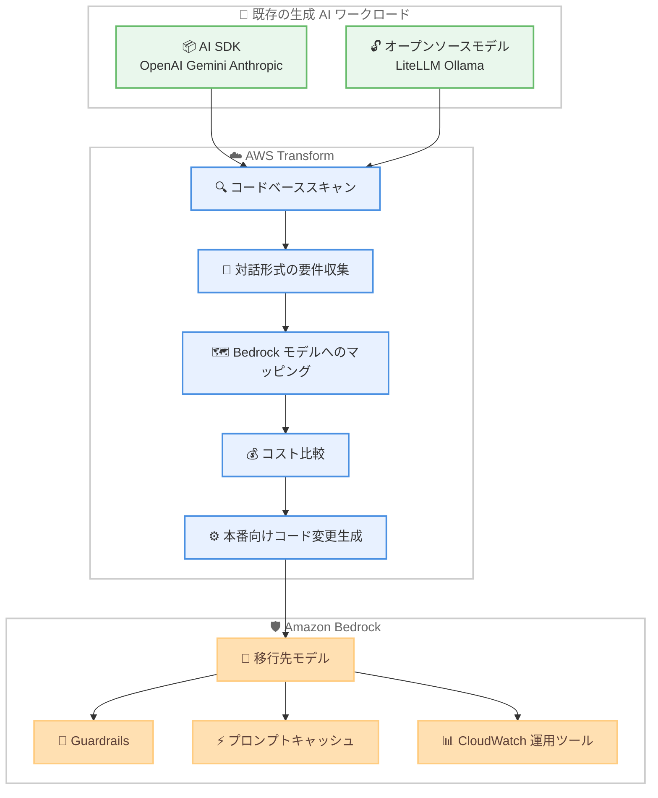

# AWS Transform - 生成 AI ワークロード向けモデル間移行アセスメント

**リリース日**: 2026 年 6 月 16 日
**サービス**: AWS Transform
**機能**: モデル間移行アセスメント (Model-to-Model Migration Assessment)

📊 [このアップデートのインフォグラフィックを見る](https://takech9203.github.io/aws-news-summary/20260616-aws-transform-model-to-model-assessments.html)
<!-- INFOGRAPHIC_BASE_URL は環境変数から取得 -->

## 概要

AWS Transform は、レガシーワークロードのモダナイゼーションを支援するエージェント型 AI サービスです。今回のアップデートにより、生成 AI ワークロードを評価し、サードパーティのモデルプロバイダーから Amazon Bedrock へ移行するための計画を作成するカスタムトランスフォーメーションが提供されるようになりました。

この AI エージェントは、移行アセスメントのプロセスを自動化します。コードベースをスキャンして使用中のすべての AI SDK とモデルを特定し、対話形式の質問を通じて移行要件を収集します。そのうえで、各モデルを Amazon Bedrock の同等モデルにマッピングし、コスト比較と本番環境にそのまま適用できるコード変更を提示します。

対象となるのは、OpenAI、Google Gemini、Anthropic SDK の直接利用、または LiteLLM や Ollama 経由のオープンソースモデルを使用しており、AI ワークロードを AWS 上に統合したい組織です。Amazon Bedrock に集約することで、IAM ベースのセキュリティ、VPC エンドポイントによる分離、プロンプトキャッシュ、Amazon Bedrock Guardrails、Amazon CloudWatch による運用ツールといった利点を活用できます。

**アップデート前の課題**

- 以前はコードベース内で使用されている AI SDK やモデルを手作業で洗い出す必要がありました
- 以前は移行先となる Amazon Bedrock のモデルや、移行に伴うコスト影響を個別に調査する必要がありました
- 以前はアプリケーションのアーキテクチャを維持したままモデル層だけを置き換えるためのコード変更を、手作業で設計する必要がありました

**アップデート後の改善**

- 今回のアップデートにより、コードベースのスキャンから移行計画の作成までが 1 つの自動化されたプロセスとして提供されるようになりました
- 今回のアップデートにより、移行元モデルと Amazon Bedrock の同等モデルのマッピングおよびコスト比較が自動で得られるようになりました
- 今回のアップデートにより、アプリケーションのアーキテクチャを保持したままモデル層のみを置き換える、本番環境向けのコード変更が生成されるようになりました

## アーキテクチャ図



既存の生成 AI ワークロードを AWS Transform がスキャン・評価し、Amazon Bedrock への移行計画とコード変更を生成する流れを示しています。

## サービスアップデートの詳細

### 主要機能

1. **コードベースの自動スキャンとモデル特定**
   - コードベースをスキャンし、使用中のすべての AI SDK とモデルを特定します
   - 対話形式の質問を通じて移行要件を収集します
   - 特定したモデルを Amazon Bedrock の同等モデルにマッピングします

2. **幅広い移行元と統合パターンへの対応**
   - 移行元として OpenAI、Google Gemini、Anthropic SDK の直接利用、LiteLLM や Ollama 経由のオープンソースモデルに対応します
   - 直接的な SDK 統合、フレームワークでラップされたパターン (LangChain、LlamaIndex)、エージェント型アーキテクチャ (CrewAI、LangGraph)、マルチプロバイダーのルーティング層といった統合パターンを処理します
   - アプリケーションのアーキテクチャを維持しながら、モデル層のみを置き換えます

3. **コスト最適化とライフサイクル考慮**
   - 階層型モデルルーティングの推奨や、プロンプトキャッシュの分析を提供します
   - モデルのライフサイクルを考慮し、提供終了 (end-of-life) まで 90 日以内のモデルをすべての推奨対象から除外します
   - 一部のワークロードに対しては、Amazon Bedrock の OpenAI 互換エンドポイントをコード変更なしの移行パスとして提案します

## 技術仕様

### 対応する移行元と統合パターン

| 項目 | 詳細 |
|------|------|
| 移行元モデルプロバイダー | OpenAI、Google Gemini、Anthropic SDK の直接利用、LiteLLM / Ollama 経由のオープンソースモデル |
| 統合パターン | 直接的な SDK 統合、フレームワークラップ (LangChain、LlamaIndex)、エージェント型アーキテクチャ (CrewAI、LangGraph)、マルチプロバイダールーティング層 |
| 移行先 | Amazon Bedrock の同等モデル、または OpenAI 互換エンドポイント |
| コスト最適化 | 階層型モデルルーティング推奨、プロンプトキャッシュ分析、モデルライフサイクル考慮 |
| 提供形態 | ATX CLI から実行するカスタムトランスフォーメーション |

### API 変更履歴

今回のアップデートに直接関連する AWS API の変更は、awsapichanges.com では確認されませんでした。本機能は ATX CLI のカスタムトランスフォーメーションとして提供されます。

## 設定方法

### 前提条件

1. AWS Transform を利用可能な AWS アカウントとリージョン
2. 移行対象となる生成 AI ワークロードのコードベースへのアクセス
3. ATX CLI のインストール

### 手順

#### ステップ1: ATX CLI のインストール

```bash
# ATX CLI をインストール
# 詳細なインストール手順は AWS Transform Custom Transformations のドキュメントを参照
```

ATX CLI は、AWS Transform のカスタムトランスフォーメーションを実行するためのコマンドラインツールです。

#### ステップ2: モデル移行トランスフォーメーションの実行

```bash
# 対象のコードベースに対してモデル移行トランスフォーメーションを実行
atx run mke-genai-model-migration
```

`mke-genai-model-migration` カスタムトランスフォーメーションを実行すると、エージェントがコードベースをスキャンし、使用中の AI SDK とモデルを特定したうえで、対話形式で移行要件を収集します。

#### ステップ3: 移行計画とコード変更の確認

エージェントが生成するモデルマッピング、コスト比較、本番環境向けのコード変更を確認し、Amazon Bedrock への移行を進めます。

## メリット

### ビジネス面

- **移行アセスメントの工数削減**: コードベースのスキャンからモデルマッピング、コスト比較までを自動化し、手作業による調査負荷を軽減します
- **コストの可視化と最適化**: 移行に伴うコスト比較に加え、階層型ルーティングやプロンプトキャッシュによる最適化の余地を提示します
- **AWS 上への AI ワークロード統合**: Amazon Bedrock に集約することで、セキュリティ、ガバナンス、運用を AWS の仕組みに一元化できます

### 技術面

- **アーキテクチャを保持した移行**: アプリケーションのアーキテクチャを維持し、モデル層のみを置き換えるため、影響範囲を限定できます
- **幅広い統合パターンへの対応**: 直接的な SDK 統合からエージェント型アーキテクチャ、マルチプロバイダールーティングまで対応します
- **Amazon Bedrock のネイティブ機能の活用**: IAM ベースのセキュリティ、VPC エンドポイント分離、プロンプトキャッシュ、Amazon Bedrock Guardrails、Amazon CloudWatch による運用ツールを利用できます

## デメリット・制約事項

### 制限事項

- 利用には ATX CLI のインストールと、対象コードベースへのアクセスが必要です
- 移行元として明示的に対応しているのは OpenAI、Google Gemini、Anthropic SDK、LiteLLM / Ollama 経由のオープンソースモデルです
- 提供終了まで 90 日以内のモデルは推奨対象から除外されます

### 考慮すべき点

- 生成されたコード変更は本番環境向けとされていますが、適用前にレビューとテストを行うことが推奨されます
- コスト比較や推奨は移行判断の材料であり、実際の運用コストはワークロードの利用状況により変動します
- OpenAI 互換エンドポイントによるコード変更なしの移行パスは一部のワークロードが対象です

## ユースケース

### ユースケース1: OpenAI から Amazon Bedrock への移行

**シナリオ**: OpenAI の API を直接利用しているアプリケーションを、セキュリティとガバナンスの強化のために Amazon Bedrock へ移行したい。

**実装例**:
```bash
atx run mke-genai-model-migration
```

**効果**: 使用中のモデルが自動的に特定され、Amazon Bedrock の同等モデルへのマッピングとコスト比較が得られます。一部のワークロードでは OpenAI 互換エンドポイントを利用したコード変更なしの移行パスが提示されます。

### ユースケース2: マルチプロバイダー構成の統合

**シナリオ**: LangChain や LiteLLM を用いて複数のモデルプロバイダーを使い分けているアプリケーションを、Amazon Bedrock に統合したい。

**実装例**:
```bash
atx run mke-genai-model-migration
```

**効果**: フレームワークラップやマルチプロバイダールーティング層を含む統合パターンが解析され、アーキテクチャを維持したままモデル層を Amazon Bedrock に置き換えるコード変更が生成されます。

### ユースケース3: コスト最適化を伴う移行

**シナリオ**: 生成 AI ワークロードのコストを抑えつつ、Amazon Bedrock へ移行したい。

**実装例**:
```bash
atx run mke-genai-model-migration
```

**効果**: 階層型モデルルーティングの推奨やプロンプトキャッシュ分析が提供され、コスト効率の高い構成での移行を検討できます。提供終了が近いモデルは推奨から除外されます。

## 料金

このカスタムトランスフォーメーションは、標準の AWS Transform の料金以外に追加料金なしで利用できます。

## 利用可能リージョン

AWS Transform が提供されているすべての AWS リージョンで利用できます。

## 関連サービス・機能

- **Amazon Bedrock**: 移行先となる基盤モデルサービス。Guardrails、プロンプトキャッシュ、OpenAI 互換エンドポイントなどの機能を提供します
- **AWS Identity and Access Management (IAM)**: Amazon Bedrock 上でのモデル利用に対するアクセス制御を提供します
- **Amazon CloudWatch**: 移行後のワークロードの運用監視に利用します
- **Amazon Bedrock Guardrails**: 移行後のワークロードに安全性とコンプライアンスのガードレールを適用します

## 参考リンク

- 📊 [インフォグラフィック](https://takech9203.github.io/aws-news-summary/20260616-aws-transform-model-to-model-assessments.html)
- [公式発表 (What's New)](https://aws.amazon.com/about-aws/whats-new/2026/06/aws-transform-model-to-model-assessments)
- [AWS Transform 製品ページ](https://aws.amazon.com/transform/)
- [Amazon Bedrock](https://aws.amazon.com/bedrock/)

## まとめ

このアップデートにより、サードパーティの生成 AI モデルから Amazon Bedrock への移行アセスメントが、コードスキャンからコスト比較、本番向けコード変更の生成まで自動化されます。AI ワークロードを AWS 上に統合し、セキュリティ・ガバナンス・運用を一元化したい組織は、標準の AWS Transform 料金の範囲内で本機能を試すことを検討するとよいでしょう。
