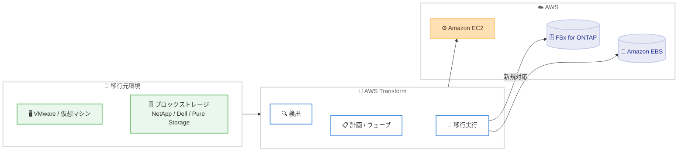

# AWS Transform - Amazon FSx for NetApp ONTAP 移行サポート (パブリックプレビュー)

**リリース日**: 2026年6月16日
**サービス**: AWS Transform
**機能**: Amazon FSx for NetApp ONTAP へのブロックストレージ移行 (パブリックプレビュー)

📊 [このアップデートのインフォグラフィックを見る](https://takech9203.github.io/aws-news-summary/20260616-aws-transform-vmware-fsx-for-ontap-preview.html)

## 概要

AWS は、AWS Transform において Amazon FSx for NetApp ONTAP (FSx for ONTAP) へのブロックストレージ移行をサポートする新機能をパブリックプレビューとして発表しました。これにより、オンプレミスまたはクラウドの任意のソースから、ブロックストレージワークロードを FSx for ONTAP へ移行できるようになりました。これまで AWS Transform がサポートしていた Amazon EBS への移行を拡張するものです。

AWS Transform for migrations は、ワークロードの検出、計画、移行を自動化するエージェント型 AI サービスであり、インフラストラクチャのモダナイゼーションを加速します。従来はコンピューティングのリホスト時に、直接接続されたブロックストレージを Amazon EBS へ移行できましたが、今回のアップデートにより、接続されたブロックストレージを FSx for ONTAP へも移行できるようになりました。

FSx for ONTAP は、NetApp の ONTAP ファイルシステム上に構築されたフルマネージド共有ストレージサービスです。お客様はデータの管理方法を変更することなく移行できるため、NetApp、Dell、Pure Storage、VMware といったさまざまなソースベンダーの環境からの移行に対応します。対象ユーザーは、データセンターの移行やモダナイゼーションを推進するインフラストラクチャ担当者および移行プロジェクトチームです。

**アップデート前の課題**

- 従来、AWS Transform でコンピューティングをリホストする際、接続されたブロックストレージの移行先は Amazon EBS に限定されていました。
- NetApp などの共有ストレージから移行する場合、データの管理方法を維持したまま移行することが困難でした。
- ストレージ移行のために中間的なストレージプラットフォームや別の移行ツールを用意する必要があり、追加コストやリスクが発生していました。

**アップデート後の改善**

- 今回のアップデートにより、ブロックストレージを FSx for ONTAP へ直接移行できるようになりました。
- コンピューティングとネットワークを処理するのと同じ移行ウェーブの一部として、ブロックストレージデータを FSx for ONTAP ボリュームへ複製できるようになりました。
- 中間ストレージプラットフォームや別個の移行ツールが不要になり、追加コストとリスクが削減されました。

## アーキテクチャ図

AWS Transform が同一の移行ウェーブ内でコンピューティングを Amazon EC2 へ移行すると同時に、接続されたブロックストレージを FSx for ONTAP ボリュームへ複製する流れを示しています。

## サービスアップデートの詳細

### 主要機能

1. **FSx for ONTAP への直接移行**
   - 接続されたブロックストレージデータを FSx for ONTAP ボリュームへ直接複製します。
   - 従来の Amazon EBS への移行に加えて、新たな移行先として FSx for ONTAP を選択できます。
   - NetApp の ONTAP ファイルシステム上に構築されたフルマネージド共有ストレージへ移行するため、データの管理方法を変更する必要がありません。

2. **任意のソースベンダーからの移行**
   - NetApp、Dell、Pure Storage、VMware などの環境からの移行に対応します。
   - VMware 環境のブロックストレージや NFS データストアを扱えます。
   - オンプレミスまたはクラウドの任意のソースを移行元として利用できます。

3. **移行ウェーブへの統合**
   - コンピューティングとネットワークを処理するのと同じ移行ウェーブの一部としてストレージ移行を実行します。
   - 中間ストレージプラットフォームや別個の移行ツールが不要になります。
   - 追加コストとリスクを削減しながら移行を完了できます。

## 技術仕様

### 機能比較

| 項目 | 詳細 |
|------|------|
| 移行元 | オンプレミスまたはクラウドの任意のソース (NetApp、Dell、Pure Storage、VMware など) |
| 移行先 | Amazon FSx for NetApp ONTAP (今回追加)、Amazon EBS (従来から対応) |
| 対象データ | 接続されたブロックストレージ、VMware 環境の NFS データストア |
| 実行単位 | コンピューティングおよびネットワークと同一の移行ウェーブ |
| 提供形態 | パブリックプレビュー |

## 設定方法

### 前提条件

1. AWS Transform for migrations を利用できる AWS アカウントを用意します。
2. 移行元環境 (VMware、NetApp などのブロックストレージ) へのネットワーク接続を確保します。
3. 移行先となる FSx for ONTAP ファイルシステムを利用する前提のネットワーク構成を準備します。

### 手順

#### ステップ 1: 検出と評価

AWS Transform で移行元環境を検出し、サーバー仕様、ストレージ構成、アプリケーションの依存関係を収集します。エージェント型 AI が収集したデータを分析し、移行計画の基礎情報を生成します。

#### ステップ 2: 移行ウェーブの計画

AI がワークロードを移行ウェーブにグループ化します。ブロックストレージの移行先として FSx for ONTAP を選択し、コンピューティングおよびネットワークと同一のウェーブで処理するよう構成します。

#### ステップ 3: 移行の実行

移行ウェーブを実行すると、AWS Transform がコンピューティングを Amazon EC2 へ移行すると同時に、接続されたブロックストレージデータを FSx for ONTAP ボリュームへ複製します。

## メリット

### ビジネス面

- **移行コストとリスクの削減**: 中間ストレージプラットフォームや別個の移行ツールが不要になり、追加コストとリスクを削減できます。
- **モダナイゼーションの加速**: エージェント型 AI による自動化により、検出から移行までのプロセスを高速化します。
- **既存運用の継続**: NetApp の ONTAP ファイルシステムをベースとしたマネージドサービスへ移行するため、データ管理方法を変えずに運用を継続できます。

### 技術面

- **統合された移行フロー**: コンピューティング、ネットワーク、ストレージを同一の移行ウェーブで処理できます。
- **多様なソースへの対応**: NetApp、Dell、Pure Storage、VMware など、複数のベンダー環境からの移行に対応します。
- **フルマネージド共有ストレージ**: FSx for ONTAP により、移行後のストレージ運用負荷を軽減できます。

## デメリット・制約事項

### 制限事項

- 本機能はパブリックプレビューとして提供されており、本番環境での利用にあたっては事前の検証が必要です。
- 発表時点で、対応する AWS リージョンの詳細は公表されていません。
- 料金に関する情報は発表時点で公表されていません。

### 考慮すべき点

- 移行元環境とソースベンダーの構成によって、移行可能なデータ種別や前提条件が異なる可能性があります。実際の移行前に検証することを推奨します。
- FSx for ONTAP の運用コストや設計要件は、移行先のストレージ構成によって変わるため、別途見積もりが必要です。

## ユースケース

### ユースケース 1: VMware 環境からの大規模移行

**シナリオ**: NetApp ストレージを利用する VMware 環境をデータセンターから AWS へ移行したいが、ストレージのデータ管理方法を維持したい。

**効果**: VMware ワークロードを Amazon EC2 へリホストすると同時に、ブロックストレージを FSx for ONTAP へ複製できます。ONTAP ベースの管理方法を維持したまま移行を完了できます。

### ユースケース 2: 中間ツールを排除した移行の効率化

**シナリオ**: 従来はストレージ移行のために中間ストレージや専用の移行ツールを用意しており、コストと運用負荷が高かった。

**効果**: AWS Transform の移行ウェーブにストレージ移行を統合することで、中間ツールを排除し、コストとリスクを削減しながら移行できます。

### ユースケース 3: 共有ストレージワークロードのモダナイゼーション

**シナリオ**: 複数のサーバーから共有される NFS データストアを含む環境を AWS へ移行し、マネージドサービスで運用したい。

**効果**: VMware 環境の NFS データストアやブロックストレージを FSx for ONTAP へ移行し、フルマネージドの共有ストレージとして運用負荷を軽減できます。

## 料金

発表時点で、本機能に関する料金情報は公表されていません。AWS Transform および Amazon FSx for NetApp ONTAP の利用にあたっては、それぞれの料金が適用される可能性があります。最新の料金情報は公式の料金ページを参照してください。

## 利用可能リージョン

発表時点で、対応する AWS リージョンの詳細は公表されていません。本機能はパブリックプレビューとして提供されます。最新の提供状況は公式発表を参照してください。

## 関連サービス・機能

- **AWS Transform for migrations**: ワークロードの検出、計画、移行を自動化するエージェント型 AI サービスです。本機能の基盤となります。
- **Amazon FSx for NetApp ONTAP**: NetApp の ONTAP ファイルシステム上に構築されたフルマネージド共有ストレージサービスで、今回の新しい移行先です。
- **Amazon EBS**: 従来から AWS Transform でサポートされているブロックストレージの移行先です。
- **Amazon EC2**: コンピューティングのリホスト先であり、ストレージ移行と同一の移行ウェーブで処理されます。

## 参考リンク

- 📊 [インフォグラフィック](https://takech9203.github.io/aws-news-summary/20260616-aws-transform-vmware-fsx-for-ontap-preview.html)
- [公式発表 (What's New)](https://aws.amazon.com/about-aws/whats-new/2026/06/aws-transform-vmware-fsx-for-ontap-preview)
- [AWS Transform for migrations](https://aws.amazon.com/transform/migrations/)
- [Amazon FSx for NetApp ONTAP 製品ページ](https://aws.amazon.com/fsx/netapp-ontap/)

## まとめ

このアップデートにより、AWS Transform はブロックストレージの移行先として Amazon FSx for NetApp ONTAP をサポートし、NetApp や VMware などの環境からデータ管理方法を維持したまま移行できるようになりました。中間ツールを排除して移行ウェーブに統合できるため、コストとリスクの削減が期待できます。パブリックプレビューであるため、本番移行を計画する際はまず検証環境で対応データ種別やリージョンの提供状況を確認することを推奨します。
