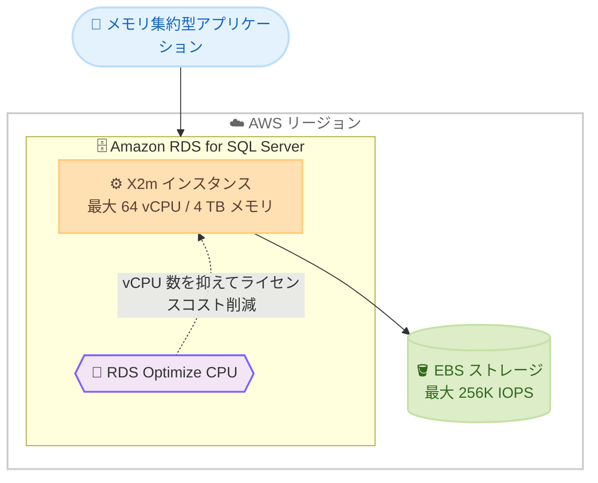

# Amazon RDS for SQL Server - X2m メモリ最適化インスタンスのサポート

**リリース日**: 2026 年 6 月 16 日
**サービス**: Amazon RDS for SQL Server
**機能**: X2m メモリ最適化データベースインスタンス

📊 [このアップデートのインフォグラフィックを見る](https://takech9203.github.io/aws-news-summary/20260616-rds-sqlserver-supports-x2m.html)
<!-- INFOGRAPHIC_BASE_URL は環境変数から取得 -->

## 概要

AWS は、Amazon RDS for SQL Server において、メモリ最適化された X2m データベースインスタンスのサポートを開始しました。X2m インスタンスは Amazon EC2 X2iedn インスタンスをベースにしており、メモリ集約型ワークロードに適した高いメモリ対 vCPU 比を提供します。

X2m インスタンスは RDS Optimize CPU 機能を備えています。AWS の公表値によると、この機能によりメモリ集約型ワークロードにおいて、x2iedn データベースインスタンスと比較して SQL Server のソフトウェアライセンスコストを 50% 以上削減できます。X2m インスタンスは最大 64 vCPU、最大 4 TB メモリ、最大 256K IOPS、そして最大 32:1 のメモリ対 vCPU 比を提供します。

このアップデートは、大容量メモリを必要とする一方で vCPU 数を抑えたいお客様、特に SQL Server のライセンスコストを最適化しながらメモリ集約型のデータベースワークロードを運用するお客様にとって価値があります。お客様は RDS マネジメントコンソール、AWS SDK、または AWS CLI を使用して、既存の RDS インスタンスの変更や新規インスタンスの作成を行えます。

**アップデート前の課題**

- メモリ集約型の SQL Server ワークロードでは、必要なメモリ容量を確保するために vCPU 数の多いインスタンスを選択する必要があり、vCPU 数に連動する SQL Server のライセンスコストが増大していた
- x2iedn データベースインスタンスを利用する場合、メモリ要件は満たせても、ライセンスコストの最適化余地が限られていた
- 高いメモリ対 vCPU 比を必要とするワークロードに最適化された選択肢が不足していた

**アップデート後の改善**

- 最大 32:1 のメモリ対 vCPU 比を持つ X2m インスタンスにより、少ない vCPU 数で大容量メモリを確保できるようになった
- RDS Optimize CPU 機能との組み合わせにより、x2iedn データベースインスタンスと比較して SQL Server ライセンスコストを 50% 以上削減できるようになった
- 最大 4 TB メモリ、最大 256K IOPS を備えたインスタンスを、コンソール、SDK、CLI から容易に利用できるようになった

## アーキテクチャ図



X2m インスタンスは高いメモリ対 vCPU 比を提供し、RDS Optimize CPU 機能によって vCPU 数を抑えることで、メモリ要件を満たしながら SQL Server のライセンスコストを削減します。

## サービスアップデートの詳細

### 主要機能

1. **X2m メモリ最適化インスタンス**
   - Amazon EC2 X2iedn インスタンスをベースとしたメモリ最適化インスタンスファミリー
   - 最大 64 vCPU、最大 4 TB メモリを提供
   - 最大 32:1 という高いメモリ対 vCPU 比により、大容量メモリを必要とするワークロードに対応

2. **RDS Optimize CPU の活用**
   - X2m インスタンスは RDS Optimize CPU 機能を備える
   - AWS の公表値で、x2iedn データベースインスタンスと比較して SQL Server ソフトウェアライセンスコストを 50% 以上削減
   - vCPU 数を最適化することで、メモリ要件を維持しつつライセンスコストを抑制

3. **高い I/O 性能**
   - 最大 256K IOPS をサポート
   - メモリ集約型かつ I/O 要求の高いデータベースワークロードに対応

## 技術仕様

### X2m インスタンスの主要スペック

| 項目 | 詳細 |
|------|------|
| ベースインスタンス | Amazon EC2 X2iedn |
| 最大 vCPU | 64 vCPU |
| 最大メモリ | 4 TB |
| 最大 IOPS | 256K IOPS |
| メモリ対 vCPU 比 | 最大 32:1 |
| ライセンス最適化 | RDS Optimize CPU をサポート |

### 利用方法

X2m インスタンスは、以下の方法で利用できます。

- RDS マネジメントコンソールからの新規インスタンス作成、または既存インスタンスの変更
- AWS SDK
- AWS CLI

## 設定方法

### 前提条件

1. Amazon RDS for SQL Server を利用できる AWS アカウント
2. X2m インスタンスが提供されているリージョンでの運用（提供状況は RDS for SQL Server 料金ページで確認）
3. 新規作成または既存インスタンス変更に必要な IAM 権限

### 手順

#### ステップ1: 新規インスタンスを作成する場合

```bash
aws rds create-db-instance \
    --db-instance-identifier my-sqlserver-x2m \
    --db-instance-class db.x2iedn.xlarge \
    --engine sqlserver-se \
    --allocated-storage 100
```

新しい RDS for SQL Server インスタンスを X2m 系のインスタンスクラスで作成します。実際に指定可能なインスタンスクラス名は RDS for SQL Server 料金ページおよびドキュメントで確認してください。

#### ステップ2: 既存インスタンスを変更する場合

```bash
aws rds modify-db-instance \
    --db-instance-identifier my-existing-sqlserver \
    --db-instance-class db.x2iedn.xlarge \
    --apply-immediately
```

既存の RDS for SQL Server インスタンスのインスタンスクラスを X2m 系に変更します。`--apply-immediately` を指定すると変更を即時適用しますが、再起動を伴うため、本番環境ではメンテナンスウィンドウの利用を検討してください。

## メリット

### ビジネス面

- **ライセンスコストの削減**: RDS Optimize CPU との組み合わせにより、AWS の公表値で x2iedn データベースインスタンスと比較して SQL Server ライセンスコストを 50% 以上削減できる
- **コスト最適化の選択肢拡大**: オンデマンド料金に加え、AWS Database Savings Plan の対象となり、長期利用でのコスト最適化が可能
- **柔軟なリソース選択**: メモリ要件を満たしつつ、不要な vCPU の課金を抑えられる

### 技術面

- **大容量メモリ**: 最大 4 TB メモリにより、大規模なインメモリ処理やバッファプールを必要とするワークロードに対応
- **高いメモリ対 vCPU 比**: 最大 32:1 の比率により、メモリ集約型ワークロードに最適化されたリソース配分が可能
- **高い I/O 性能**: 最大 256K IOPS により、I/O 負荷の高いデータベース処理を支える

## デメリット・制約事項

### 制限事項

- 利用可能なインスタンスサイズおよびリージョンは、RDS for SQL Server 料金ページで確認する必要がある
- インスタンスクラスの変更には再起動を伴うため、ダウンタイムを考慮する必要がある
- メモリ最適化インスタンスのため、CPU 集約型ワークロードには適さない場合がある

### 考慮すべき点

- ワークロードのメモリ要件と vCPU 要件のバランスを確認し、X2m が最適かどうかを評価する
- RDS Optimize CPU を利用する際は、SQL Server エディションのライセンス条件と vCPU 数の関係を理解しておく
- Savings Plan を利用する場合は、長期的な利用見込みを踏まえてコミットメントを検討する

## ユースケース

### ユースケース1: 大規模なインメモリデータベースワークロード

**シナリオ**: 大量のデータをメモリ上にキャッシュして高速なクエリ応答を実現したいが、vCPU 数を増やすとライセンスコストが膨らむ。

**効果**: 最大 4 TB メモリと高いメモリ対 vCPU 比により、必要なメモリを確保しつつ vCPU 数を抑えてライセンスコストを最適化できます。

### ユースケース2: SQL Server ライセンスコストの最適化

**シナリオ**: 既存の x2iedn データベースインスタンスで運用しているメモリ集約型ワークロードのライセンスコストを削減したい。

**効果**: RDS Optimize CPU を備えた X2m インスタンスへ移行することで、AWS の公表値で 50% 以上のライセンスコスト削減が見込めます。

### ユースケース3: I/O 負荷の高い基幹データベース

**シナリオ**: 大量のトランザクションと高い I/O スループットを要求する基幹システムのデータベースを運用している。

**効果**: 最大 256K IOPS と大容量メモリにより、I/O とメモリの両面で高い性能を確保できます。

## 料金

X2m インスタンスはオンデマンド料金で利用できます。また、AWS Database Savings Plan の対象となり、1 年または 3 年の利用コミットメントによりコストを最適化できます。インスタンス、ストレージ、データ転送の最新の料金、および利用可能リージョンについては、RDS for SQL Server 料金ページを参照してください。

## 利用可能リージョン

利用可能なリージョンは RDS for SQL Server 料金ページで確認できます。本アップデートの公式発表では具体的なリージョン一覧は明示されていません。

## 関連サービス・機能

- **Amazon EC2 X2iedn インスタンス**: X2m データベースインスタンスのベースとなるメモリ最適化インスタンス
- **RDS Optimize CPU**: vCPU 数を最適化し、SQL Server のライセンスコストを削減する機能
- **AWS Database Savings Plan**: 利用コミットメントによりデータベースのコストを最適化する料金プラン

## 参考リンク

- 📊 [インフォグラフィック](https://takech9203.github.io/aws-news-summary/20260616-rds-sqlserver-supports-x2m.html)
- [公式発表 (What's New)](https://aws.amazon.com/about-aws/whats-new/2026/06/rds-sqlserver-supports-x2m/)
- [Amazon RDS for SQL Server](https://aws.amazon.com/rds/sqlserver/)
- [RDS for SQL Server 料金ページ](https://aws.amazon.com/rds/sqlserver/pricing/)

## まとめ

X2m メモリ最適化インスタンスのサポートにより、Amazon RDS for SQL Server のメモリ集約型ワークロードにおいて、高いメモリ対 vCPU 比とライセンスコスト削減を両立できるようになりました。x2iedn データベースインスタンスを利用しているお客様や、大容量メモリを必要とするワークロードを運用しているお客様は、X2m インスタンスへの移行によるコスト最適化を検討することを推奨します。
