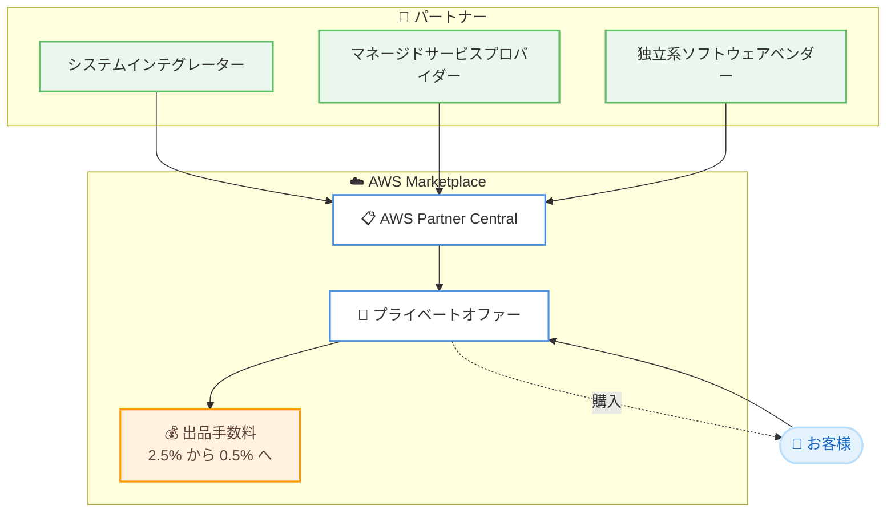

# AWS Marketplace - プロフェッショナルサービスの出品手数料を 0.5% に引き下げ

**リリース日**: 2026年6月16日
**サービス**: AWS Marketplace
**機能**: プロフェッショナルサービス出品手数料の引き下げ

📊 [このアップデートのインフォグラフィックを見る](https://takech9203.github.io/aws-news-summary/20260616-reduce-listing-fee-professional-services-aws-marketplace.html)

## 概要

AWS Marketplace は、プロフェッショナルサービスの出品手数料 (リスティング手数料) を従来の 2.5% から 0.5% へ引き下げました。この引き下げにより、コンサルティングパートナー、システムインテグレーター、マネージドサービスプロバイダー、独立系ソフトウェアベンダー (ISV) は、AWS Marketplace を通じてプロフェッショナルサービスを販売する際のコストを大幅に削減できます。

プロフェッショナルサービスは AWS Marketplace において確立され、成長を続けているカテゴリーであり、数百のパートナーがアクティブに取引を行っています。今回の手数料引き下げは、新規に作成されるプライベートオファーに適用され、AWS Marketplace が利用可能なすべての AWS リージョン、すべての価格モデル、すべての通貨を対象とします。

既存の出品を持つパートナーは、特別な操作を行うことなく自動的にこの恩恵を受けられます。新しいプライベートオファーには引き下げ後の手数料が適用される一方で、既存のオファーやサブスクリプションは元の契約条件が維持されます。

**アップデート前の課題**

- プロフェッショナルサービスの取引には 2.5% の出品手数料が発生し、パートナーの取り分が圧迫されていた
- 手数料負担が大きく、AWS Marketplace 経由での取引を選択するインセンティブが限定的だった
- ソフトウェア製品と比較して、サービス販売のコスト効率が課題となっていた

**アップデート後の改善**

- 出品手数料が 0.5% に引き下げられ、パートナーの取り分が増加した
- 既存の出品を持つパートナーは追加操作なしで自動的に恩恵を受けられる
- すべての AWS リージョン、価格モデル、通貨で一律に適用される

## アーキテクチャ図

パートナーが AWS Partner Central を通じてプロフェッショナルサービスを出品し、プライベートオファーでお客様に提供する流れを示しています。プライベートオファー成約時の出品手数料が 0.5% に引き下げられました。

## サービスアップデートの詳細

### 主要機能

1. **出品手数料の引き下げ**
   - プロフェッショナルサービスの出品手数料を 2.5% から 0.5% へ引き下げ
   - 新規に作成されるすべてのプライベートオファーに適用
   - 既存のオファーやサブスクリプションは元の契約条件を維持

2. **自動適用**
   - 既存の出品を持つパートナーは追加操作不要で自動的に適用
   - パートナー側での設定変更や再申請は必要ない

3. **幅広い適用範囲**
   - AWS Marketplace が利用可能なすべての AWS リージョンで適用
   - すべての価格モデルと通貨に対応
   - 従量課金やタイムアンドマテリアルなどの可変課金モデルにも対応

## 技術仕様

### 出品手数料の比較

| 項目 | 詳細 |
|------|------|
| 従来の手数料 | 2.5% |
| 新しい手数料 | 0.5% |
| 適用対象 | 新規プライベートオファー |
| 適用範囲 | 全リージョン、全価格モデル、全通貨 |
| 既存オファー | 元の契約条件を維持 |

### API変更履歴

このアップデートは AWS Marketplace のビジネス条件 (手数料体系) の変更であり、API の追加・変更は確認されていません。

## 設定方法

### 前提条件

1. AWS Partner Network (APN) のメンバーであること
2. AWS Marketplace の販売者 (Seller) として登録済みであること
3. プロフェッショナルサービスの出品要件を満たしていること

### 手順

#### ステップ1: AWS Partner Central での出品

AWS Partner Central にアクセスし、プロフェッショナルサービスを製品として登録します。コンサルティング、移行支援、マネージドサービスなどのサービス内容を定義します。

#### ステップ2: プライベートオファーの作成

特定のお客様向けにカスタマイズしたプライベートオファーを作成します。価格、課金モデル (定額、従量課金、タイムアンドマテリアルなど)、契約期間を設定します。新規に作成するオファーには自動的に 0.5% の出品手数料が適用されます。

#### ステップ3: お客様への提供と成約

作成したプライベートオファーをお客様に提示します。お客様は AWS Marketplace 上で内容を確認し、サブスクリプションを購入します。成約時に引き下げ後の出品手数料が適用されます。

## メリット

### ビジネス面

- **コスト削減**: 出品手数料が 2.5% から 0.5% へ引き下げられ、パートナーの取り分が増加する
- **追加操作不要**: 既存の出品を持つパートナーは自動的に恩恵を受けられる
- **取引促進**: 手数料負担の軽減により、AWS Marketplace 経由での取引を選択しやすくなる

### 技術面

- **既存ワークフローの維持**: 出品や請求のワークフローを変更することなく手数料引き下げが適用される
- **幅広い課金モデル対応**: 従量課金やタイムアンドマテリアルなど、多様な課金モデルで利用できる
- **統合された取引**: ソフトウェアとサービスを 1 つの取引に組み合わせるマルチプロダクトソリューションにも対応する

## デメリット・制約事項

### 制限事項

- 引き下げ後の手数料は新規に作成されるプライベートオファーにのみ適用される
- 既存のオファーやサブスクリプションは元の契約条件のままで、引き下げは適用されない
- プロフェッショナルサービスのカテゴリーが対象であり、ソフトウェア製品の手数料体系には影響しない

### 考慮すべき点

- 既存の長期契約を持つパートナーは、新規オファーへの切り替えによる影響を確認する必要がある
- 手数料引き下げのメリットを最大化するため、新規取引でのプライベートオファー活用を検討する

## ユースケース

### ユースケース1: システムインテグレーターによる移行支援サービス

**シナリオ**: システムインテグレーターが、エンタープライズのお客様にクラウド移行支援サービスを提供する。AWS Marketplace を通じてプライベートオファーを作成し、移行プロジェクトの契約を締結する。

**効果**: 出品手数料が 0.5% に引き下げられることで、大規模な移行プロジェクトにおいてもコスト効率よくサービスを提供できる。

### ユースケース2: マネージドサービスプロバイダーの継続的運用支援

**シナリオ**: マネージドサービスプロバイダーが、お客様のワークロードを継続的に運用・監視するマネージドサービスを月額課金で提供する。

**効果**: 継続的な課金モデルにおいても低い手数料が適用され、長期契約での収益性が向上する。

### ユースケース3: ISV によるソフトウェアと導入支援のセット提供

**シナリオ**: 独立系ソフトウェアベンダーが、自社ソフトウェア製品と導入支援サービスを 1 つの取引にまとめて提供する。

**効果**: マルチプロダクトソリューションとしてソフトウェアとサービスを組み合わせ、サービス部分には引き下げ後の手数料が適用される。

## 料金

AWS Marketplace のプロフェッショナルサービス出品手数料が従来の 2.5% から 0.5% に引き下げられました。この手数料は、パートナーがプライベートオファーを通じて成約した取引額に対して課されます。

### 料金例

| 取引額 | 従来の手数料 (2.5%) | 新しい手数料 (0.5%) |
|--------|---------------------|---------------------|
| 100,000 USD | 2,500 USD | 500 USD |
| 500,000 USD | 12,500 USD | 2,500 USD |
| 1,000,000 USD | 25,000 USD | 5,000 USD |

上記は出品手数料の概算であり、実際の金額は取引条件によって異なります。

## 利用可能リージョン

AWS Marketplace が利用可能なすべての AWS リージョンで適用されます。すべての価格モデルおよび通貨が対象です。

## 関連サービス・機能

- **AWS Partner Central**: パートナーがプロフェッショナルサービスを出品・管理するためのポータル
- **AWS Marketplace プライベートオファー**: 特定のお客様向けにカスタマイズした条件でサービスを提供する仕組み
- **AWS Professional Services**: AWS 第一者のプロフェッショナルサービスも AWS Marketplace で提供されている

## 参考リンク

- 📊 [インフォグラフィック](https://takech9203.github.io/aws-news-summary/20260616-reduce-listing-fee-professional-services-aws-marketplace.html)
- [公式発表 (What's New)](https://aws.amazon.com/about-aws/whats-new/2026/06/reduce-listing-fee-professional-services-aws-marketplace)
- [AWS Blog: Accelerate your cloud journey with AWS Professional Services in AWS Marketplace](https://aws.amazon.com/blogs/awsmarketplace/accelerate-your-cloud-journey-with-aws-professional-services-in-aws-marketplace/)
- [AWS Marketplace](https://aws.amazon.com/marketplace/)
- [AWS Partner Central](https://partnercentral.awspartner.com/)

## まとめ

AWS Marketplace のプロフェッショナルサービス出品手数料が 2.5% から 0.5% へ大幅に引き下げられたことで、パートナーは AWS Marketplace を通じたサービス販売のコスト効率を大きく改善できます。既存の出品を持つパートナーは追加操作なしで自動的に恩恵を受けられるため、新規のプライベートオファー作成時にこの引き下げを活用することを推奨します。プロフェッショナルサービスの提供を検討しているパートナーは、AWS Partner Central での出品を進めるとよいでしょう。
