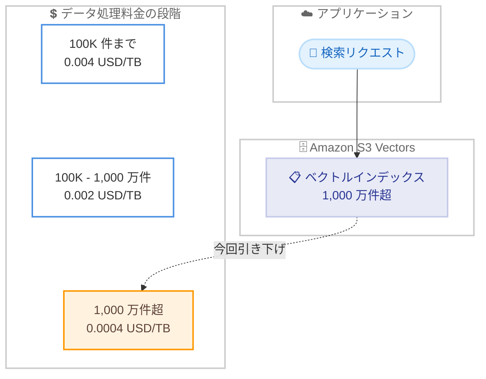

# Amazon S3 Vectors - 大規模ベクトルインデックスのクエリ料金を最大 80% 削減

**リリース日**: 2026年6月16日
**サービス**: Amazon S3 Vectors
**機能**: 大規模ベクトルインデックスに対するクエリのデータ処理料金引き下げ

📊 [このアップデートのインフォグラフィックを見る](https://takech9203.github.io/aws-news-summary/20260616-s3-vectors-reduces-query-charges-80-percent-large-indexes.html)
<!-- INFOGRAPHIC_BASE_URL は環境変数から取得 -->

## 概要

Amazon S3 Vectors は、1,000 万件を超えるベクトルを含むベクトルインデックスに対するクエリの「データ処理 (data processed)」料金を最大 80% 引き下げました。これにより、大規模な AI、RAG (検索拡張生成)、セマンティック検索ワークロードで類似検索を実行するお客様のコストが削減されます。

S3 Vectors は、ベクトルデータを低コストで保存し、類似検索を実行できるストレージサービスです。クエリ料金は「クエリリクエスト数」「データ処理量」「返却データ量」の 3 つの要素で構成されますが、今回の引き下げは、このうち「データ処理量」に対する料金が対象です。具体的には、1,000 万件超のベクトルを含むインデックスの $/TB 単価が引き下げられ、大規模インデックスを運用するほど効果が大きくなります。

この新料金はアプリケーションの変更なしに自動的に適用され、S3 Vectors が利用可能なすべての AWS リージョンで本日付けで有効です。なお、AWS はクエリパフォーマンスの向上のため、引き続き複数のインデックスにベクトルを分散させることを推奨しています。

**アップデート前の課題**

- 大規模なベクトルインデックスに対する類似検索では、データ処理量に応じたコストが運用規模に比例して増加していた
- 数億件規模のベクトルを扱う RAG やセマンティック検索ワークロードでは、クエリのデータ処理料金が無視できないコスト要因となっていた
- コスト最適化のためにインデックス設計やクエリ頻度を調整する必要があった

**アップデート後の改善**

- 1,000 万件を超えるベクトルを含むインデックスに対するクエリのデータ処理料金が最大 80% 削減された
- 新料金はアプリケーションの変更なしに自動的に適用される
- S3 Vectors が利用可能なすべてのリージョンで即座に有効となり、大規模ワークロードのコスト効率が向上した

## アーキテクチャ図

1,000 万件を超えるベクトルを含むインデックスに対するクエリのデータ処理単価が引き下げられ、最大の段階 (1,000 万件超) で大きなコスト削減効果が得られます。

## サービスアップデートの詳細

### 主要機能

1. **大規模インデックスのデータ処理料金引き下げ**
   - 1,000 万件を超えるベクトルを含むインデックスに対するクエリのデータ処理料金が最大 80% 削減された
   - データ処理量は、クエリ実行時にスキャンされるベクトルデータ量に応じて課金される

2. **自動適用**
   - 新料金はアプリケーションの変更なしに自動的に適用される
   - 既存のインデックスやクエリコードを変更する必要はない

3. **全リージョンで即時有効**
   - S3 Vectors が利用可能なすべての AWS リージョンで本日付けで有効
   - 段階的なロールアウトではなく、即座に新料金が適用される

## 技術仕様

### データ処理料金の段階 (米国東部 / バージニア北部リージョン)

クエリのデータ処理料金は、インデックスに含まれるベクトル数に応じた段階制です。今回のアップデートで、1,000 万件超の段階の単価が引き下げられました。

| インデックスのベクトル数 | データ処理単価 |
|------|------|
| 最初の 100K 件 | 0.004 USD/TB |
| 100K - 1,000 万件 | 0.002 USD/TB |
| 1,000 万件超 | 0.0004 USD/TB |

1,000 万件超の段階の単価 (0.0004 USD/TB) は、直前の段階 (0.002 USD/TB) と比較して 80% 低い水準であり、大規模インデックスほどデータ処理コストが抑えられます。

### API 変更履歴

今回のアップデートは料金体系の変更であり、API の追加・変更は含まれません。このため、API 変更履歴の記載はありません。

## メリット

### ビジネス面

- **大規模ワークロードのコスト削減**: 1,000 万件超のベクトルインデックスに対するクエリのデータ処理料金が最大 80% 削減され、運用コストが抑えられる
- **変更不要での適用**: アプリケーションやインデックスの変更なしに新料金が自動適用されるため、移行作業や追加の運用負荷が発生しない
- **スケールメリットの強化**: 大規模インデックスほど単価が下がる段階制により、AI / RAG / セマンティック検索ワークロードの拡大が促進される

### 技術面

- **既存アーキテクチャの維持**: コードやインデックス構成を変更せずにコスト削減効果が得られる
- **全リージョンでの一貫した適用**: S3 Vectors が利用可能なすべてのリージョンで即時有効となり、リージョン間の料金差を意識せずに設計できる

## デメリット・制約事項

### 制限事項

- 料金引き下げの対象は、1,000 万件を超えるベクトルを含むインデックスに対するクエリのデータ処理料金に限定される
- クエリリクエスト料金 (0.0004 USD/1,000 件相当の課金要素) や返却データ料金は今回の対象外
- 具体的な料金は AWS S3 料金ページの値が正であり、リージョンによって異なる場合がある

### 考慮すべき点

- AWS はクエリパフォーマンスの向上のため、引き続き複数のインデックスにベクトルを分散させることを推奨している。単一の巨大なインデックスに集約する設計は、データ処理コストの観点では有利でも、パフォーマンス面では推奨されない点に注意が必要
- 1 つのインデックスを 1,000 万件超に拡大して料金段階の恩恵を得る設計と、パフォーマンスのために分散する設計はトレードオフとなるため、ワークロード特性に応じた判断が求められる

## ユースケース

### ユースケース1: 大規模 RAG ナレッジベースの検索

**シナリオ**: 数億件のドキュメントチャンクをベクトル化し、生成 AI アプリケーションの RAG バックエンドとして S3 Vectors に保存している。検索クエリが高頻度で発生し、データ処理料金が運用コストの主要因となっていた。

**効果**: 1,000 万件超のインデックスに対するデータ処理料金が最大 80% 削減され、検索頻度を維持したままコストを抑えられる。

### ユースケース2: 大規模セマンティック検索プラットフォーム

**シナリオ**: 製品カタログや記事の大規模なセマンティック検索基盤を構築しており、インデックスには 1 億件以上のベクトルが含まれる。

**効果**: 大規模インデックスのデータ処理単価が下がるため、検索基盤の総保有コストが低減され、ユーザー数やコンテンツ量の拡大に対応しやすくなる。

### ユースケース3: 既存 S3 Vectors ワークロードのコスト最適化

**シナリオ**: すでに S3 Vectors で 1,000 万件を超えるインデックスを運用しているが、コスト削減のための追加施策を検討していた。

**効果**: アプリケーションの変更なしに新料金が自動適用されるため、追加作業なしで請求額が削減される。

## 料金

クエリ料金は「クエリリクエスト数」「データ処理量」「返却データ量」の 3 要素で構成されます。今回引き下げられたのは「データ処理量」に対する料金で、1,000 万件を超えるベクトルを含むインデックスが対象です。

米国東部 (バージニア北部) リージョンにおける主な料金の目安は以下のとおりです。

| 料金要素 | 料金（概算） |
|--------|------------------|
| ベクトルストレージ | 0.06 USD/GB / 月 |
| アップロード (PUT) | 0.20 USD/GB (PUT あたり最小 128KB) |
| クエリリクエスト | 2.50 USD/100 万クエリ |
| データ処理 (100K 件まで) | 0.004 USD/TB |
| データ処理 (100K - 1,000 万件) | 0.002 USD/TB |
| データ処理 (1,000 万件超) | 0.0004 USD/TB |
| 返却データ | 0.01 USD/GB (クエリあたり最初の 512KB は無料) |

正確な料金およびリージョンごとの差異は、AWS S3 料金ページを参照してください。

## 利用可能リージョン

S3 Vectors が利用可能なすべての AWS リージョンで、本日 (2026年6月16日) 付けで新料金が有効です。

## 関連サービス・機能

- **Amazon S3**: S3 Vectors は S3 の機能として提供され、ベクトルデータを低コストで保存・検索できる
- **Amazon Bedrock**: RAG (検索拡張生成) のナレッジベースとして S3 Vectors を活用し、生成 AI アプリケーションの検索基盤を構築できる
- **Amazon OpenSearch Service**: 低レイテンシが求められる類似検索では OpenSearch との使い分けが検討対象となる

## 参考リンク

- 📊 [インフォグラフィック](https://takech9203.github.io/aws-news-summary/20260616-s3-vectors-reduces-query-charges-80-percent-large-indexes.html)
- [公式発表 (What's New)](https://aws.amazon.com/about-aws/whats-new/2026/06/s3-vectors-reduces-query-charges-80-percent-large-indexes/)
- [Amazon S3 料金ページ](https://aws.amazon.com/s3/pricing/)
- [Amazon S3 ユーザーガイド](https://docs.aws.amazon.com/AmazonS3/latest/userguide/s3-vectors.html)

## まとめ

今回のアップデートは、1,000 万件を超える大規模ベクトルインデックスに対するクエリのデータ処理料金を最大 80% 削減するもので、大規模な AI / RAG / セマンティック検索ワークロードのコスト効率を大きく改善します。新料金はアプリケーション変更なしに全リージョンで自動適用されるため、すでに S3 Vectors を利用しているお客様は追加作業なしでコスト削減の恩恵を受けられます。一方で、クエリパフォーマンスの観点ではベクトルの分散が引き続き推奨されるため、コストとパフォーマンスのバランスを踏まえたインデックス設計を検討することを推奨します。
