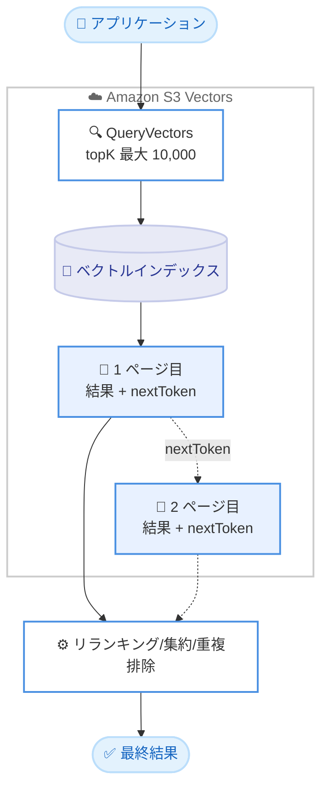

# Amazon S3 Vectors - 1 クエリあたり最大 10,000 件の類似検索結果に対応

**リリース日**: 2026 年 6 月 16 日
**サービス**: Amazon S3 Vectors
**機能**: 1 クエリあたりの類似検索結果数の上限拡張 (最大 10,000 件)

📊 [このアップデートのインフォグラフィックを見る](https://takech9203.github.io/aws-news-summary/20260616-s3-vectors-supports-10000-search-results-per-query.html)
<!-- INFOGRAPHIC_BASE_URL は環境変数から取得 -->

## 概要

Amazon S3 Vectors は、1 回の類似検索クエリで返却できる結果数の上限を、従来の 100 件から最大 10,000 件へと拡張しました。これは従来の上限と比較して 100 倍の増加にあたります。S3 Vectors は、ベクトルデータをネイティブにサポートする Amazon S3 のオブジェクトストレージで、大規模なベクトルデータセットを低コストで保存および検索できるサービスです。

このアップデートにより、1 回のクエリでより広範な候補集合を取得できるようになりました。とくに、リランキング、集約、重複排除といった追加処理を行う多段階の検索パイプライン (multi-stage retrieval pipeline) を持つアプリケーションにとって有用です。アプリケーション側で大量の候補を取得し、その後段で絞り込む構成が容易になります。

結果はページネーションで返却されるため、最初のページの処理を開始しながら後続のページを取得できます。最新の AWS SDK を使用し、QueryVectors API リクエストで最大 10,000 件の topK (最近傍数) を指定するようにコードを更新することで利用できます。

**アップデート前の課題**

このアップデート以前は、1 回の類似検索クエリで取得できる結果数に制約がありました。

- 以前は 1 クエリあたり最大 100 件しか結果を取得できなかった
- 以前は多段階検索で多くの候補が必要な場合、複数回のクエリを発行して結果を組み合わせる必要があった
- 以前は広範な候補集合を前提とするリランキングや重複排除の実装が煩雑になりがちだった

**アップデート後の改善**

今回のアップデートにより、1 回のクエリで大量の結果を効率的に取得できるようになりました。

- 今回のアップデートにより 1 クエリで最大 10,000 件の結果取得が可能になった
- 今回のアップデートによりページネーションを通じて結果を段階的に処理できるようになった
- 今回のアップデートにより多段階検索パイプラインの実装が簡素化された

## アーキテクチャ図



アプリケーションが QueryVectors で最大 10,000 件の候補を要求し、ページネーションで結果を取得しながら後段のリランキングや重複排除を行う流れを示しています。

## サービスアップデートの詳細

### 主要機能

1. **結果数上限の 100 倍拡張**
   - 1 クエリあたりの類似検索結果数が最大 100 件から最大 10,000 件へ拡張された
   - QueryVectors API リクエストの topK パラメータで最大 10,000 を指定できる
   - より広範な候補集合を 1 回のクエリで取得できる

2. **ページネーション対応**
   - QueryVectors のレスポンスに nextToken が追加され、結果をページ単位で取得できる
   - 最初のページの処理を進めながら後続のページを取得する並行処理が可能
   - 大量の結果を扱う際のメモリ効率とレイテンシ管理に寄与する

3. **多段階検索パイプラインの強化**
   - リランキング、集約、重複排除などの後段処理に十分な候補数を供給できる
   - 候補取得とフィルタリングを分離した検索アーキテクチャを構築しやすくなる

## 技術仕様

### 主要な仕様

| 項目 | 詳細 |
|------|------|
| 旧上限 | 1 クエリあたり 100 件 |
| 新上限 | 1 クエリあたり 10,000 件 (100 倍) |
| 結果取得方式 | ページネーション (nextToken による継続取得) |
| 対象 API | QueryVectors |
| 必要条件 | 最新の AWS SDK の利用 |

### API変更履歴

| 日付 | サービス | 変更内容 |
|------|----------|----------|
| 2026/06/16 | [s3vectors](https://awsapichanges.com/archive/changes/e078c6-s3vectors.html) | 1 updated api methods - QueryVectors がページネーションに対応し、1 クエリで最大 10,000 件の結果を返却可能に |

### QueryVectors API のリクエスト/レスポンス例

```python
# QueryVectors リクエスト (topK と nextToken を指定)
response = client.query_vectors(
    vectorBucketName='string',
    indexName='string',
    topK=10000,                # 最大 10,000 件まで指定可能
    queryVector={'float32': [ ... ]},
    returnMetadata=True,
    returnDistance=True,
    nextToken='string'         # 後続ページ取得用 (任意)
)

# レスポンス (nextToken が付与される)
# {
#     'vectors': [
#         {'distance': ..., 'key': 'string', 'metadata': {...}},
#     ],
#     'distanceMetric': 'cosine',
#     'nextToken': 'string'    # 次ページが存在する場合に返却される
# }
```

QueryVectors API に nextToken が追加され、リクエストでページ継続トークンを指定し、レスポンスで次ページの有無を判定できるようになりました。

## 設定方法

### 前提条件

1. Amazon S3 Vectors が利用可能なリージョンであること
2. ベクトルバケットとベクトルインデックスが作成済みであること
3. 最新の AWS SDK を利用していること

### 手順

#### ステップ1: AWS SDK の更新

```bash
# Python の場合 (boto3 を最新版へ更新)
pip install --upgrade boto3
```

最新の topK 上限とページネーションパラメータを利用するため、AWS SDK を最新バージョンへ更新します。

#### ステップ2: topK の指定

```python
response = client.query_vectors(
    vectorBucketName='my-vector-bucket',
    indexName='my-index',
    topK=10000,
    queryVector={'float32': query_embedding},
    returnMetadata=True,
    returnDistance=True
)
```

QueryVectors リクエストで topK に最大 10,000 を指定し、1 回のクエリで広範な候補集合を取得します。

#### ステップ3: ページネーション処理

```python
next_token = None
while True:
    kwargs = {
        'vectorBucketName': 'my-vector-bucket',
        'indexName': 'my-index',
        'topK': 10000,
        'queryVector': {'float32': query_embedding},
        'returnMetadata': True,
    }
    if next_token:
        kwargs['nextToken'] = next_token
    response = client.query_vectors(**kwargs)
    # ここで response['vectors'] を処理 (リランキング、重複排除など)
    next_token = response.get('nextToken')
    if not next_token:
        break
```

レスポンスの nextToken を用いて後続ページを取得し、ページごとに後段処理を行います。次ページが存在しない場合は nextToken が返却されないためループを終了します。

## メリット

### ビジネス面

- **検索品質の向上**: より広範な候補集合を取得し、後段処理で精度を高めることで、検索やレコメンデーションの品質を向上できる
- **開発工数の削減**: 複数クエリの結合処理が不要になり、検索ロジックの実装と保守が容易になる
- **コスト効率**: 返却データの最初の 512 KB が無料であり、低コストなオブジェクトストレージ上で大規模なベクトル検索を実現できる

### 技術面

- **多段階検索の実現**: リランキングや重複排除を前提とした検索パイプラインを 1 回のクエリベースで構築できる
- **パフォーマンス管理**: ページネーションにより結果を段階的に処理でき、メモリ使用量とレイテンシを制御しやすい
- **シンプルな API**: 既存の QueryVectors API の拡張であり、topK と nextToken の指定だけで利用できる

## デメリット・制約事項

### 制限事項

- 1 クエリあたりの結果数上限は最大 10,000 件
- 大量の結果を返却する場合、返却データサイズに応じた少額のデータ返却料金が発生する (最初の 512 KB は無料)
- 最新の AWS SDK が必要であり、古い SDK では新しい上限やページネーションを利用できない場合がある

### 考慮すべき点

- topK を大きくすると返却データサイズが増えるため、料金とレイテンシへの影響を考慮する
- ページネーション処理を適切に実装し、nextToken のループ制御を確実に行う必要がある

## ユースケース

### ユースケース1: RAG におけるリランキング前の候補拡大

**シナリオ**: 検索拡張生成 (RAG) のパイプラインで、リランキングモデルに渡す候補ドキュメントをより多く取得したい。

**実装例**:
```python
# 1 クエリで大量候補を取得し、後段のリランカーへ渡す
candidates = client.query_vectors(
    vectorBucketName='docs-bucket',
    indexName='docs-index',
    topK=2000,
    queryVector={'float32': query_embedding},
    returnMetadata=True
)['vectors']
# reranker.rerank(candidates) で上位を選定
```

**効果**: リランキング対象の候補数が増え、最終的な回答の関連性と網羅性が向上します。

### ユースケース2: 重複排除を伴う大規模検索

**シナリオ**: 類似コンテンツが多いデータセットで、重複を排除した多様な結果集合を提示したい。

**実装例**:
```python
results = client.query_vectors(
    vectorBucketName='media-bucket',
    indexName='media-index',
    topK=5000,
    queryVector={'float32': query_embedding},
    returnMetadata=True
)['vectors']
# メタデータを用いて重複排除を実施し、多様な結果を抽出
```

**効果**: 十分な候補数から重複を取り除き、多様性のある検索結果をユーザーに提示できます。

### ユースケース3: 集約分析のための広範なベクトル取得

**シナリオ**: クエリベクトルに近い大量のアイテムを集約し、傾向分析やクラスタリングを行いたい。

**実装例**:
```python
# ページネーションで最大 10,000 件まで取得し集約処理を実施
next_token = None
all_vectors = []
while True:
    resp = client.query_vectors(
        vectorBucketName='analytics-bucket',
        indexName='items-index',
        topK=10000,
        queryVector={'float32': query_embedding},
        returnMetadata=True,
        **({'nextToken': next_token} if next_token else {})
    )
    all_vectors.extend(resp['vectors'])
    next_token = resp.get('nextToken')
    if not next_token:
        break
```

**効果**: 広範な近傍アイテムを取得して集約でき、より精緻な分析結果を得られます。

## 料金

このアップデート自体に追加の基本料金は発生しません。ただし、大規模なクエリでは返却される結果の合計サイズに応じた少額のデータ返却料金が適用されます。1 クエリあたり返却されるデータの最初の 512 KB は無料です。詳細は S3 の料金ページを参照してください。

### 料金例

| 使用量 | 月額料金 (概算) |
|--------|------------------|
| 1 クエリあたり返却データ 512 KB 以内 | データ返却料金は無料 |
| 512 KB を超える返却データ | 超過分に対しデータ返却料金が発生 (詳細は料金ページ参照) |

## 利用可能リージョン

Amazon S3 Vectors が利用可能なすべての AWS リージョンで本機能を利用できます。

## 関連サービス・機能

- **Amazon S3**: S3 Vectors はベクトルデータをネイティブに保存・検索する S3 の機能であり、本アップデートはその検索 API を強化する
- **Amazon Bedrock**: RAG や生成 AI アプリケーションの埋め込み生成・検索基盤として S3 Vectors と組み合わせて利用できる
- **Amazon OpenSearch Service**: 大規模かつ低レイテンシのベクトル検索が必要な場合の選択肢として比較対象になる

## 参考リンク

- 📊 [インフォグラフィック](https://takech9203.github.io/aws-news-summary/20260616-s3-vectors-supports-10000-search-results-per-query.html)
- [公式発表 (What's New)](https://aws.amazon.com/about-aws/whats-new/2026/06/s3-vectors-supports-10000-search-results-per-query)
- [API 変更履歴 (awsapichanges.com)](https://awsapichanges.com/archive/changes/e078c6-s3vectors.html)
- [Amazon S3 料金ページ](https://aws.amazon.com/s3/pricing/)

## まとめ

Amazon S3 Vectors の 1 クエリあたりの類似検索結果数が最大 10,000 件へと 100 倍に拡張され、ページネーションにも対応しました。これにより、RAG やレコメンデーションなどの多段階検索パイプラインを 1 回のクエリベースでより簡潔かつ高品質に構築できます。最新の AWS SDK へ更新し、topK と nextToken を活用した検索ロジックの最適化を検討することをおすすめします。
