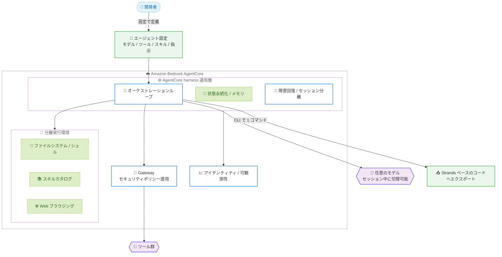

# Amazon Bedrock AgentCore - AgentCore harness 一般提供開始

**リリース日**: 2026 年 6 月 17 日
**サービス**: Amazon Bedrock AgentCore
**機能**: AgentCore harness (マネージドエージェントハーネス)

📊 [このアップデートのインフォグラフィックを見る](https://takech9203.github.io/aws-news-summary/20260617-amazon-bedrock-agentcore-harness-generally-available.html)
<!-- INFOGRAPHIC_BASE_URL は環境変数から取得 -->

## 概要

AWS は、Amazon Bedrock AgentCore のマネージドエージェントハーネス (AgentCore harness) の一般提供を開始しました。AgentCore harness は、AI エージェントを本番環境で動作させるために必要な運用層をフルマネージドで提供する機能です。公式発表では「モデルが脳であれば、ハーネスは身体である」と表現されており、モデル (脳) が思考した内容を実際の作業として実行するためのすべての処理を担います。

従来、エージェントを本番運用するには、オーケストレーションループ、ツール実行、コンテキストウィンドウ管理、状態の永続化、障害回復、セッションの分離といった処理を開発者自身がコードで実装する必要がありました。AgentCore harness では、モデル、ツール、スキル、指示 (instructions) を設定として定義するだけで、AgentCore がこれらを組み立てて実行します。これにより、ファイルシステム、シェル、クロスセッションメモリ、スキル (AWS がキュレーションしたカタログを含む)、Web ブラウジングを備えた分離環境上で、本番グレードのエージェントを数分で構築できます。

対象ユーザーは、AI エージェントを開発・運用するアプリケーション開発者、機械学習エンジニア、プラットフォームチームです。エージェントの運用基盤を自前で構築・保守する負担を軽減し、エージェントのロジックそのものに集中できるようになります。

**アップデート前の課題**

このアップデート以前は、本番グレードのエージェントを構築・運用するうえで以下の課題がありました。

- オーケストレーションループ、ツール実行、コンテキスト管理、状態永続化、障害回復、セッション分離などの運用層を開発者がコードで実装する必要があった
- モデルプロバイダーを切り替える際にエージェントのロジックやコンテキストへの影響を考慮する必要があった
- ツール接続、アイデンティティ、メモリ、可観測性などを個別に配線する必要があり、ガバナンスやトレースの一貫性を確保しにくかった
- プロトタイプから本番運用へ移行する際にエージェントの再構築が必要になることがあった

**アップデート後の改善**

今回のアップデートにより、以下が可能になりました。

- 設定ベースでエージェントを定義するだけで、AgentCore が運用層を組み立てて実行するため、ループの手書き実装が不要になった
- セッションの途中でモデルプロバイダーを切り替えても、コンテキストを失わずエージェントロジックに手を加える必要がなくなった
- ツールは同一ゲートウェイ経由で接続され、アイデンティティ、メモリ、可観測性が単一プラットフォームから提供されるため、最初の呼び出しから追加配線なしでガバナンスとトレースが効くようになった
- 開始時の設定をそのまま大規模運用に利用でき、再構築なしでスケールできるようになった

## アーキテクチャ図



開発者が設定でエージェントを定義すると、AgentCore harness が運用層 (ループ、状態管理、障害回復) と分離実行環境を組み立て、Gateway 経由でツールを呼び出してガバナンスを効かせる流れを示しています。

## サービスアップデートの詳細

### 主要機能

1. **設定ベースのエージェント定義と運用層の自動実行**
   - モデル、ツール、スキル、指示を設定として定義するだけでエージェントを構築できる
   - オーケストレーションループの実行、ツール実行、コンテキストウィンドウ管理、状態の永続化、障害回復、セッション分離を AgentCore が自動的に処理する
   - ファイルシステム、シェル、クロスセッションメモリ、スキルカタログ、Web ブラウジングを備えた分離環境で本番グレードのエージェントを数分で構築できる

2. **モデルの柔軟性 (プロバイダー切替)**
   - 任意のモデルを選択できる
   - セッションの途中でモデルプロバイダーを切り替えても、コンテキストを失わず、エージェントロジックを変更する必要がない
   - 例: 計画 (planning) はあるモデルで実行し、コーディングは別のモデルで実行するといった使い分けが可能

3. **統合プラットフォームによるガバナンス**
   - ツールは、セキュリティポリシーを適用する同一の Gateway 経由で接続される
   - アイデンティティ、メモリ、可観測性がすべて単一プラットフォームから提供される
   - 最初の呼び出しから追加の配線なしで、アクションがガバナンスされ、トレースされる

4. **コードエクスポート**
   - CLI の 1 コマンドで、ハーネスを同一コンピュート上の Strands ベースのコードにエクスポートできる
   - エクスポート先として Claude Agent SDK のサポートが近日提供予定 (coming soon)

5. **スケーラビリティ**
   - 開始時の構成を、再構築することなくそのまま大規模運用で利用できる

## 技術仕様

### AgentCore harness が担う運用層

| 項目 | 詳細 |
|------|------|
| オーケストレーションループ | エージェントの思考と行動のループを実行 |
| ツール実行 | ツールの呼び出しと実行を管理 |
| コンテキスト管理 | コンテキストウィンドウを管理 |
| 状態永続化 | ターンをまたいで状態を永続化 |
| 障害回復 | 失敗からの回復を処理 |
| セッション分離 | 各セッションを分離 |
| 分離環境 | ファイルシステム、シェル、クロスセッションメモリ、スキルカタログ、Web ブラウジングを提供 |

### API 変更履歴

今回のアップデートに直接対応する awsapichanges.com の該当エントリは確認できませんでした。API の詳細は公式ドキュメントを参照してください。

## 設定方法

### 前提条件

1. AgentCore が利用可能な AWS コマーシャルリージョンの AWS アカウント
2. AgentCore および基盤モデルへのアクセスに必要な IAM 権限
3. 利用するツールやスキルへのアクセス設定 (必要に応じて Gateway の構成)

### 手順

#### ステップ 1: エージェントを設定として定義する

```text
# 設定で指定する主な要素
- model:        使用するモデル
- tools:        利用するツール
- skills:       利用するスキル (AWS キュレーションカタログを含む)
- instructions: エージェントへの指示
```

モデル、ツール、スキル、指示を設定として定義します。コードでオーケストレーションループを実装する必要はありません。

#### ステップ 2: AgentCore でエージェントを実行する

AgentCore が設定に基づいて運用層と分離環境を組み立て、本番グレードのエージェントを実行します。ツールは Gateway 経由で接続され、アイデンティティ、メモリ、可観測性が自動的に適用されます。

#### ステップ 3: 必要に応じてコードへエクスポートする

```bash
# CLI の 1 コマンドでハーネスを Strands ベースのコードにエクスポート
# (Claude Agent SDK へのエクスポートは近日提供予定)
```

設定ベースのハーネスを、同一コンピュート上で動作する Strands ベースのコードにエクスポートできます。詳細なカスタマイズが必要になった場合に有用です。

## メリット

### ビジネス面

- **市場投入までの時間短縮**: 本番グレードのエージェントを数分で構築でき、アイデアから本番運用までの時間を短縮できる
- **開発コストの削減**: 運用層を自前で実装・保守する必要がなくなり、エンジニアリングリソースをエージェントの価値創出に集中できる
- **スケール時の手戻り防止**: 開始時の構成をそのまま大規模運用に利用できるため、再構築のコストを回避できる

### 技術面

- **ガバナンスとトレーサビリティの一貫性**: アイデンティティ、メモリ、可観測性が単一プラットフォームから提供され、最初の呼び出しから追加配線なしでガバナンスとトレースが効く
- **モデルの柔軟性**: セッション中にコンテキストを保持したままモデルプロバイダーを切り替えられ、タスクごとに最適なモデルを使い分けられる
- **運用負荷の軽減**: 障害回復やセッション分離などの運用処理がマネージドで提供される

## デメリット・制約事項

### 制限事項

- AgentCore harness は AWS GovCloud (US-West) では未対応 (AgentCore Runtime など一部の機能は GovCloud で対応)
- コードエクスポート先として現時点で対応するのは Strands ベースのコードのみで、Claude Agent SDK へのエクスポートは近日提供予定 (coming soon)

### 考慮すべき点

- 利用するモデルやツール、その他 AgentCore の各コンポーネントに応じた料金が発生する点を考慮する必要がある (本発表に料金詳細の記載はないため、各料金ページを確認)
- マネージドな運用層を利用するため、細かなオーケストレーション制御が必要な場合はコードエクスポートを併用する設計が望ましい

## ユースケース

### ユースケース 1: アイデアから本番エージェントへの迅速な立ち上げ

**シナリオ**: 社内業務を自動化するエージェントを短期間で本番投入したいが、運用層の実装に時間をかけたくない。

**実装例**:
```text
モデル / ツール / スキル / 指示を設定として定義し、AgentCore harness で実行
```

**効果**: オーケストレーションループや状態管理を自前で実装せずに、本番グレードのエージェントを数分で立ち上げられます。

### ユースケース 2: タスクに応じたモデルの使い分け

**シナリオ**: 計画フェーズでは推論重視のモデルを使い、コード生成フェーズでは別のモデルを使いたい。

**実装例**:
```text
セッション中にモデルプロバイダーを切り替え (コンテキストとロジックは維持)
```

**効果**: コンテキストを失わずにモデルを切り替えられ、各タスクに最適なモデルを活用してコストと品質を最適化できます。

### ユースケース 3: ガバナンスを重視したエンタープライズエージェント

**シナリオ**: エージェントのアクションをすべてトレースし、セキュリティポリシーを一貫して適用したい。

**実装例**:
```text
ツールを Gateway 経由で接続し、アイデンティティ / メモリ / 可観測性を単一プラットフォームで管理
```

**効果**: 最初の呼び出しから追加配線なしでアクションがガバナンスされ、トレースされるため、監査やコンプライアンス要件に対応しやすくなります。

## 料金

本発表に料金の詳細は記載されていません。AgentCore および利用するモデル、ツール、各コンポーネントに応じた料金が発生します。最新の料金体系は Amazon Bedrock AgentCore の料金ページを確認してください。

## 利用可能リージョン

AgentCore harness は、AgentCore が利用可能なすべての AWS コマーシャルリージョンで一般提供されています。ドキュメントのリージョン対応表では、以下のリージョンで AgentCore harness が利用可能です。

- 米国東部 (バージニア北部、オハイオ)
- 米国西部 (オレゴン)
- 欧州 (フランクフルト、アイルランド、ロンドン、パリ、ストックホルム)
- アジアパシフィック (ムンバイ、シンガポール、シドニー、東京、ソウル)
- カナダ (中部)
- 南米 (サンパウロ)

東京リージョンを含む主要なコマーシャルリージョンで利用できます。なお、AWS GovCloud (US-West) では AgentCore harness は対象外です。最新の対応状況は公式ドキュメントを確認してください。

## 関連サービス・機能

- **AgentCore Gateway**: ツールへの接続とセキュリティポリシーの適用を担い、harness のツール実行の基盤となる
- **AgentCore Memory**: クロスセッションメモリを提供し、ターンをまたいだ状態の保持を支える
- **AgentCore Identity / Observability**: アイデンティティ管理と可観測性を単一プラットフォームから提供し、ガバナンスとトレースを実現する
- **Strands / Claude Agent SDK**: コードエクスポート先のフレームワーク (Claude Agent SDK は近日対応予定)
- **AgentCore Built-in Tools / スキルカタログ**: Web ブラウジングや AWS がキュレーションしたスキルを harness の分離環境で利用可能

## 参考リンク

- 📊 [インフォグラフィック](https://takech9203.github.io/aws-news-summary/20260617-amazon-bedrock-agentcore-harness-generally-available.html)
- [公式発表 (What's New)](https://aws.amazon.com/about-aws/whats-new/2026/06/amazon-bedrock-agentcore-harness-generally-available/)
- [AWS Blog: Amazon Bedrock AgentCore harness is now generally available](https://aws.amazon.com/blogs/machine-learning/amazon-bedrock-agentcore-harness-is-now-generally-available-go-from-idea-to-production-grade-agent-in-minutes/)
- [ドキュメント: AgentCore harness](https://docs.aws.amazon.com/bedrock-agentcore/latest/devguide/harness.html)
- [ドキュメント: 対応リージョン](https://docs.aws.amazon.com/bedrock-agentcore/latest/devguide/agentcore-regions.html)

## まとめ

AgentCore harness の一般提供により、エージェントの運用層を自前で実装することなく、設定ベースで本番グレードの AI エージェントを数分で構築できるようになりました。モデルの柔軟な切替、Gateway を通じた一貫したガバナンス、Strands へのコードエクスポートにより、プロトタイプから大規模運用までシームレスに移行できます。AI エージェントの開発・運用を検討しているチームは、まず東京リージョンを含む対応リージョンで設定ベースのエージェント構築を試し、自前実装からの移行効果を評価することを推奨します。
