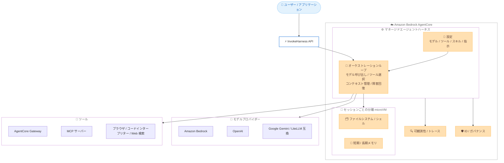

# Amazon Bedrock AgentCore - マネージドエージェントハーネス

**リリース日**: 2026 年 6 月 17 日
**サービス**: Amazon Bedrock AgentCore
**機能**: マネージドエージェントハーネス (AgentCore harness)

📊 [このアップデートのインフォグラフィックを見る](https://takech9203.github.io/aws-news-summary/20260617-amazon-bedrock-agentcore-harness-generally-available.html)

## 概要

AWS は、Amazon Bedrock AgentCore のマネージドエージェントハーネス (AgentCore harness) の一般提供 (GA) を発表しました。このハーネスは、アイデアから動作するエージェントまでを数分で実現することを目的とした、本番環境向けのマネージド実行基盤です。

AgentCore のドキュメントでは、モデルを「頭脳」、ハーネスを「身体」に例えています。ハーネスはオーケストレーションループを実行し、ツールを呼び出し、コンテキストウィンドウを管理し、ターンをまたいで状態を永続化し、障害から回復し、各セッションを分離します。これまでは、各チームがこれらの仕組みを自前で実装する必要がありました。今回のハーネスは、その作業を「コーディング」から「設定 (configuration)」へと置き換えます。お客様はエージェントの動作 (モデル、ツール、スキル、指示) を宣言するだけで、AgentCore が環境、コンピューティング、メモリ、ID、ネットワーク、可観測性を引き受け、設定を稼働中のエージェントへと組み立てます。

ハーネスはオープンソースのエージェントフレームワークである Strands Agents を基盤としています。エージェント開発者やプラットフォームエンジニアが、本番品質のエージェントをインフラ管理の負担なく構築、実行、運用できることを狙いとしています。

**アップデート前の課題**

- ローカルでエージェントを立ち上げるのは容易でも、本番環境では同時実行、セッション分離、ID、状態管理、スケーリングといった一連の作業を各チームが自前で実装する必要がありました。
- オーケストレーションループ (モデル呼び出し、ツール選択、結果の受け渡し、コンテキスト管理、障害処理) を手作業でコーディングする必要がありました。
- モデルの変更やツールの追加のたびにコードの書き換えが発生し、可観測性や ID 管理も個別に組み込む必要がありました。

**アップデート後の改善**

- 本番品質のエージェントを、セッションごとに分離された安全な環境で数分以内に実行できるようになりました。
- エージェントの定義が「設定」に置き換わり、モデルの切り替えやツールの追加が、コードの書き換えではなく設定変更だけで済むようになりました。
- ID、メモリ、可観測性が組み込まれており、すべてのエージェント動作が最初の呼び出しから追加実装なしでガバナンスおよびトレースの対象になります。

## アーキテクチャ図



ユーザーやアプリケーションからの呼び出しを受けたハーネスが、設定に基づきオーケストレーションループを実行し、分離された microVM 上でモデルとツールを連携させながらエージェントを稼働させる構成を示しています。

## サービスアップデートの詳細

### 主要機能

1. **設定によるエージェント定義**
   - エージェントの動作 (モデル、ツール、スキル、指示) を宣言するだけで、AgentCore が環境、コンピューティング、メモリ、ID、ネットワーク、可観測性を組み立てます。
   - 別のモデルを試す、新しいツールを追加するといった変更が、コードの書き換えではなく設定変更で完結します。
   - オーケストレーションループ自体は AgentCore が実行するため、ループの実装が不要です。

2. **セッションごとに分離された実行環境**
   - すべてのハーネスセッションはデフォルトでステートフルであり、セッションごとに安全な分離 microVM 上で実行されます (AgentCore runtime が基盤)。
   - エージェントは独自のファイルシステムとシェルを持ち、コードの記述と実行が可能です。
   - 短期および長期のメモリとファイルを、microVM セッションが期限切れになり新しいセッションに置き換わった後も、セッションをまたいで永続化できます。

3. **モデルの柔軟性とプロバイダーの動的切り替え**
   - Amazon Bedrock、OpenAI、Google Gemini、または LiteLLM 互換の任意のプロバイダーが提供するモデルを利用できます。
   - コンテキストを失うことなくセッション中にプロバイダーを切り替えられるため、あるモデルで計画を立て、別のモデルで実行する、あるいは会話を再構築せずに価格性能のテストを行うといった使い方が可能です。
   - モデルを指定しない場合、ハーネスは Amazon Bedrock 上の Anthropic Claude Sonnet 4.6 をデフォルトで使用します。

4. **ツール連携とスキル**
   - AgentCore Gateway、MCP サーバー、組み込みのブラウザ、コードインタープリター、Web 検索を通じてツールに接続できます。
   - Git、S3、または AWS が厳選したスキルカタログから AWS スキルを単一のトグルでアタッチでき、エージェントが必要に応じてドメイン知識を獲得します。
   - 独自の依存関係を持つカスタム環境が必要な場合は、独自のコンテナ (BYOC) を持ち込めます。S3 Files や EFS をマウントして、セッションやハーネスをまたいでデータを共有することも可能です。

5. **可観測性、評価、安全なロールアウト**
   - すべての動作が AgentCore observability を通じて自動的にトレースされ、エージェントが行ったことを 1 か所で統合的に確認できます。
   - AgentCore evaluations と optimization により、動作のスコアリング、プロンプトおよびツール説明の推奨、統計的有意性を伴う A/B テストが可能です。
   - イミュータブルなバージョンと名前付きエンドポイントによって変更を安全にロールアウトでき、エンドポイントを以前のバージョンに向けることで即座にロールバックできます。

6. **パイプライン統合とコードへのエクスポート**
   - AWS Step Functions の AgentCore InvokeHarness ステートを通じて、ハーネスをより大きなパイプラインに組み込めます。
   - 設定だけでは不十分な場合、単一の CLI コマンドでハーネスを Strands ベースのコードにエクスポートし、同じ AgentCore runtime 上で実行できます (Claude Agent SDK へのエクスポートは近日対応予定)。

## 技術仕様

### 主要な機能項目

| 項目 | 詳細 |
|------|------|
| 実行環境 | セッションごとに分離された microVM (AgentCore runtime ベース) |
| 状態管理 | デフォルトでステートフル、短期 / 長期メモリをセッションをまたいで永続化 |
| 対応モデル | Amazon Bedrock、OpenAI、Google Gemini、LiteLLM 互換プロバイダー |
| デフォルトモデル | Anthropic Claude Sonnet 4.6 (Amazon Bedrock 上) |
| ツール接続 | AgentCore Gateway、MCP サーバー、組み込みブラウザ / コードインタープリター / Web 検索 |
| スキル | Git、S3、AWS 厳選カタログからアタッチ |
| ストレージ | S3 Files、EFS のマウントに対応、BYOC に対応 |
| エクスポート | Strands コードへのエクスポート (Claude Agent SDK は近日対応) |
| 基盤フレームワーク | Strands Agents (AWS のオープンソースエージェントフレームワーク) |

### API 変更履歴

| 日付 | サービス | 変更内容 |
|------|----------|----------|
| 2026/06/17 | [Amazon Bedrock AgentCore Control](https://awsapichanges.com/archive/changes/ecddc1-bedrock-agentcore-control.html) | 6 new 34 updated methods - ハーネスの GA に伴い、CreateHarness / GetHarness / InvokeHarness などのハーネス関連 API を追加。qualifier パラメーターによる特定エンドポイントの呼び出し、事前構築済みエージェント機能向けの AWS Skills、スキル Git ソース URL の検証強化に対応 |
| 2026/06/17 | [Amazon Bedrock AgentCore](https://awsapichanges.com/archive/changes/ecddc1-bedrock-agentcore.html) | 3 updated methods - データプレーン側のハーネス呼び出し関連の更新 |

### 主要な API メソッド

```text
# コントロールプレーン (bedrock-agentcore-control)
CreateHarness / GetHarness / UpdateHarness / DeleteHarness / ListHarnesses
ListHarnessVersions
CreateHarnessEndpoint / GetHarnessEndpoint / UpdateHarnessEndpoint / DeleteHarnessEndpoint / ListHarnessesEndpoint

# データプレーン (bedrock-agentcore)
InvokeHarness
InvokeAgentRuntimeCommand
```

## 設定方法

### 前提条件

1. サポート対象リージョンのいずれかで AWS の認証情報が構成されていること。
2. CLI を使用する場合は Node.js 20 以上、SDK / boto3 を使用する場合は Python 3.10 以上と boto3 のインストール。
3. ハーネスが引き受けることのできる IAM 実行ロール (最小権限はドキュメントの実行ロールポリシーを参照)。

### 手順

#### ステップ 1: AgentCore CLI のインストール

```bash
npm install -g @aws/agentcore@preview
```

プレビューチャネルから AgentCore CLI をインストールします。CLI はほとんどの開発者にとって最も速い利用方法です。

#### ステップ 2: ハーネスプロジェクトの作成

```bash
agentcore create --name myresearchagent --model-provider bedrock
```

フラグを指定して、対話なしでハーネスプロジェクトを作成します。フラグなしで `agentcore create` を実行すると、プロジェクト名、プロジェクトタイプ、モデルプロバイダー、環境、メモリなどを順に設定する対話ウィザードが起動します。

#### ステップ 3: デプロイと呼び出し

```bash
agentcore deploy
agentcore invoke --harness myresearchagent \
  --session-id "$(uuidgen)" \
  "Research three tropical vacation options under $3k, within five hours of NYC."
```

ハーネスをデプロイし、セッション ID を指定して呼び出します。応答はターミナルにストリーミングされます。同じ `--session-id` を再利用すると、同一環境内で会話を継続できます。なお `runtimeSessionId` は 33 文字以上である必要があります。

#### 参考: AWS CLI と boto3 での利用

```bash
# 実行ロールを指定してハーネスを作成
aws bedrock-agentcore-control create-harness \
  --harness-name "MyHarness" \
  --execution-role-arn "arn:aws:iam::123456789012:role/MyHarnessRole"
```

`get-harness` をポーリングして `"status": "READY"` になるまで待機し、応答に含まれる ARN を控えます。SDK からは `bedrock-agentcore` クライアントの `invoke_harness` を呼び出してストリーミング応答を処理します。

## メリット

### ビジネス面

- **市場投入までの時間短縮**: 本番品質のエージェントを数分で実行できるため、アイデアから稼働までの期間を大幅に短縮できます。
- **インフラ運用コストの削減**: 同時実行、分離、スケーリングといった本番運用に必要な作業を自前で構築する必要がなくなります。
- **ベンダーロックインの回避**: 複数のモデルプロバイダーを横断して利用でき、価格性能の比較を会話の再構築なしに行えます。

### 技術面

- **設定主導の開発**: モデルやツールの変更が設定変更で完結し、コードの書き換えやループの再実装が不要です。
- **組み込みのガバナンスとトレース**: ID、メモリ、可観測性が標準で組み込まれ、すべてのエージェント動作が追加実装なしで追跡されます。
- **安全なリリース運用**: イミュータブルなバージョンと名前付きエンドポイントにより、段階的なロールアウトと即時ロールバックが可能です。

## デメリット・制約事項

### 制限事項

- 現時点でのコードエクスポート先は Strands ベースのコードのみであり、Claude Agent SDK へのエクスポートは近日対応予定です。
- CLI の利用には Node.js 20 以上、SDK の利用には Python 3.10 以上が必要です。
- `runtimeSessionId` は 33 文字以上である必要があります。

### 考慮すべき点

- microVM セッションには有効期限があるため、セッションをまたいで保持したい状態はメモリやマウントしたストレージ (S3 Files / EFS) を活用して永続化する必要があります。
- LiteLLM 互換を含む外部モデルプロバイダーを利用する場合、それぞれのプロバイダーの認証情報や利用条件の管理を考慮する必要があります。

## ユースケース

### ユースケース 1: 本番運用するリサーチエージェントの迅速な構築

**シナリオ**: 複数ユーザーが同時に利用するリサーチアシスタントを、インフラ構築の負担なく本番運用したい。

**実装例**:
```bash
agentcore create --name researchagent --model-provider bedrock
agentcore deploy
agentcore invoke --harness researchagent --session-id "$(uuidgen)" \
  "条件に合う候補を 3 つ調査して比較してください。"
```

**効果**: セッションごとの分離、状態の永続化、スケーリングをマネージド基盤に任せ、本番品質のエージェントを短時間で立ち上げられます。

### ユースケース 2: モデルの価格性能テスト

**シナリオ**: 計画フェーズと実行フェーズで異なるモデルを使い分け、コストと品質のバランスを検証したい。

**実装例**:
```text
セッション内で、計画には高性能モデル、実行には低コストモデルへと
プロバイダーをコンテキストを保持したまま切り替える。
```

**効果**: 会話を再構築することなくプロバイダーを切り替えられ、価格性能の A/B テストを統計的有意性とともに評価できます。

### ユースケース 3: 大規模ワークフローへのエージェント組み込み

**シナリオ**: 既存の業務パイプラインの一部として、エージェントによる処理を組み込みたい。

**実装例**:
```text
AWS Step Functions のステートマシンに AgentCore InvokeHarness ステートを配置し、
前後のステップと連携させる。
```

**効果**: エージェントをワークフローのステップとして扱え、可観測性とガバナンスを維持したまま既存の自動化に統合できます。

## 料金

ハーネス自体に対する個別の料金は発生しません。利用した基盤となる AgentCore の各機能 (コンピューティング、メモリ、ツールなど) に対してのみ課金されます。詳細は AgentCore の料金ページを参照してください。

## 利用可能リージョン

AgentCore harness は、AgentCore が利用可能なすべての AWS 商用リージョンで一般提供されています。対応リージョンの最新情報は、AgentCore のリージョンドキュメントを参照してください。

## 関連サービス・機能

- **AgentCore Gateway**: エージェントがセキュリティポリシーを適用したうえでツールにアクセスするためのゲートウェイ機能です。
- **AgentCore Runtime**: ハーネスのセッションごとの分離 microVM を提供する実行基盤です。
- **AgentCore Observability**: エージェントのすべての動作を自動的にトレースし、統合ビューで可視化します。
- **Strands Agents**: ハーネスの基盤となる、AWS が提供するオープンソースのエージェントフレームワークです。
- **AWS Step Functions**: AgentCore InvokeHarness ステートを通じて、ハーネスをワークフローに組み込めます。

## 参考リンク

- 📊 [インフォグラフィック](https://takech9203.github.io/aws-news-summary/20260617-amazon-bedrock-agentcore-harness-generally-available.html)
- [公式発表 (What's New)](https://aws.amazon.com/about-aws/whats-new/2026/06/amazon-bedrock-agentcore-harness-generally-available)
- [ドキュメント (AgentCore harness)](https://docs.aws.amazon.com/bedrock-agentcore/latest/devguide/harness.html)
- [入門ガイド (Get started)](https://docs.aws.amazon.com/bedrock-agentcore/latest/devguide/harness-get-started.html)
- [対応リージョン](https://docs.aws.amazon.com/bedrock-agentcore/latest/devguide/agentcore-regions.html)
- [料金ページ](https://aws.amazon.com/bedrock/agentcore/pricing/)

## まとめ

AgentCore harness の GA により、本番品質の AI エージェントの構築が「インフラのコーディング」から「設定の宣言」へと大きく変わります。モデルの柔軟な切り替え、組み込みのメモリ / ID / 可観測性、安全なバージョン管理が標準で提供されるため、運用負荷を抑えつつ迅速にエージェントを本番投入できます。エージェント開発に取り組むチームは、まず AgentCore CLI でリサーチエージェントなどの小さなハーネスを作成し、デフォルトの Claude Sonnet 4.6 で挙動を確認したうえで、必要に応じてモデルやツール、スキルを設定で拡張していくことを推奨します。
