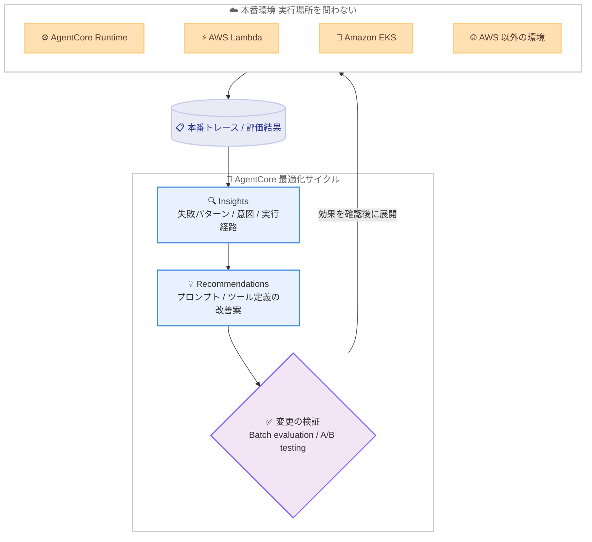

# Amazon Bedrock AgentCore - 本番環境のエージェントを継続的に改善する新しい最適化機能

**リリース日**: 2026 年 6 月 17 日
**サービス**: Amazon Bedrock AgentCore
**機能**: エージェント最適化機能 (Insights、Recommendations、Batch evaluation、A/B testing)

📊 [このアップデートのインフォグラフィックを見る](https://takech9203.github.io/aws-news-summary/20260617-amazon-bedrock-agentcore-new-optimization-capabilities.html)
<!-- INFOGRAPHIC_BASE_URL は環境変数から取得 -->

## 概要

AWS は、Amazon Bedrock AgentCore に新しい最適化機能を追加したことを発表しました。この機能群は、本番環境で収集したトレースデータを、エージェントの継続的な改善につなげることを目的としています。具体的には、エージェントの挙動を理解する「Insights」、データに基づいた修正案を提示する「Recommendations」、そして変更を検証する「Batch evaluation」と「A/B testing」で構成されます。

AWS はこのアップデートで、最も危険な障害は「ダッシュボード上では問題なく見えるサイレントな失敗」であると指摘しています。エラーシグナルを出さないまま、後になってお客様からの問い合わせで顕在化する問題に対処することが、本番環境のエージェント運用における大きな課題でした。AgentCore の最適化機能は、こうした見えにくい問題を検出し、根本原因を説明し、本番データに基づいた修正案を生成して検証するという一連のサイクルを支援します。

これらの機能は、エージェントがどこで実行されていても利用できます。AgentCore Runtime はもちろん、AWS Lambda、Amazon EKS、さらには AWS 以外の環境で動作するエージェントにも適用できる点が特徴です。

**アップデート前の課題**

- 本番環境でエラーを出さずに失敗する「サイレントな障害」を、早期に検出する手段が限られていた
- 大量のトレースデータから繰り返し発生する失敗パターンや、ユーザーの意図を手動で分析する必要があった
- システムプロンプトやツール定義の改善を、実際のエージェント挙動の根拠なしに勘や経験で行う必要があった
- 変更がリグレッションを引き起こさないか、本番環境への全面展開前に統計的な裏付けをもって検証する仕組みがなかった

**アップデート後の改善**

- 失敗パターンを影響範囲の広さでランク付けし、最も影響の大きい問題から優先的に対処できるようになった
- ユーザーの意図やエージェントの実行経路を自動でクラスタリングし、挙動を短時間で把握できるようになった
- 本番トレースと評価結果に基づいた、根拠付きのシステムプロンプトおよびツール定義の改善案が得られるようになった
- バッチ評価と A/B テストにより、変更の効果を統計的に検証してから安全に展開できるようになった

## アーキテクチャ図



本番環境のトレースを起点に、挙動の理解 (Insights)、改善案の生成 (Recommendations)、検証 (Batch evaluation / A/B testing) を経て、検証済みの変更を本番に反映する継続的な最適化サイクルを示しています。

## サービスアップデートの詳細

### 主要機能

1. **Insights (エージェント挙動の理解)**
   - **Failure insights**: サイレントな失敗を含む、繰り返し発生する失敗パターンを検出します。根本原因を説明し、影響範囲の広さでランク付けすることで、最も影響の大きい問題から優先的に対処できます。
   - **Intent insights**: ユーザーが何をしようとしていたかという意図に基づいて、リクエストをクラスタリングします。
   - **Trajectory insights**: エージェントがタスクを処理する際にたどる経路をグループ化し、共通パターンと外れ値を可視化します。
   - 継続的なモニタリングを有効にするか、対象を絞った調査を数分で実行するかを選択できます。

2. **Recommendations (問題の修正)**
   - トレースと評価出力を分析し、システムプロンプトやツール定義に対する具体的な改善案を提示します。
   - 各推奨事項は、実際に観測された失敗に紐づいた根拠を含み、本番データから導出された「検証可能な」ターゲットを絞った変更として提供されます。
   - 推奨事項の出力には、変更理由を説明する explanation フィールドが含まれます。

3. **変更の検証 (Batch evaluation と A/B testing)**
   - **Batch evaluation**: 定義したテストデータセットに対して推奨事項をテストし、複数の評価器にわたる集計スコアを報告します。お客様自身が「良い状態」を定義し、リグレッションを早期に検出できます。
   - **A/B testing**: ライブの本番トラフィックを分割し、エージェントのバージョン間で制御された比較を行います。結果を並べて測定することで、全面展開の前に変更が本番環境で機能することの統計的な裏付けを得られます。

## 技術仕様

### 主要な技術要素

| 項目 | 詳細 |
|------|------|
| Insights の種類 | Failure insights、Intent insights、Trajectory insights |
| データソース | 本番トレース、評価出力 (Amazon CloudWatch Logs など) |
| クラスタリング頻度 | DAILY、WEEKLY、MONTHLY から選択 |
| 推奨対象 | システムプロンプト、ツール定義 |
| 検証手法 | Batch evaluation (テストデータセット)、A/B testing (本番トラフィック分割) |
| 実行環境 | AgentCore Runtime、AWS Lambda、Amazon EKS、AWS 以外の環境 |
| 暗号化 | カスタマーマネージドキー (CMK) のサポート |

### API変更履歴

| 日付 | サービス | 変更内容 |
|------|----------|----------|
| 2026/06/12 | [Amazon Bedrock AgentCore Control](https://awsapichanges.com/archive/changes/77da2d-bedrock-agentcore-control.html) | 8 updated api methods - 最適化機能全体にタグ付けと CMK サポートを追加、推奨出力に explanation フィールドを追加、失敗パターンの特定 / ユーザー意図の抽出 / 実行挙動の要約を行う insights 機能を追加 |
| 2026/06/12 | [Amazon Bedrock AgentCore](https://awsapichanges.com/archive/changes/77da2d-bedrock-agentcore.html) | 6 updated api methods - 上記と同様にタグ付けと CMK サポート、explanation フィールド、insights 機能を追加 |

### オンライン評価設定の例

```json
{
  "onlineEvaluationConfigName": "production-agent-eval",
  "rule": {
    "samplingConfig": { "samplingPercentage": 10.0 },
    "sessionConfig": { "sessionTimeoutMinutes": 30 }
  },
  "dataSourceConfig": {
    "cloudWatchLogs": {
      "logGroupNames": ["/aws/bedrock-agentcore/my-agent"]
    }
  },
  "evaluators": [{ "evaluatorId": "string" }],
  "insights": [{ "insightId": "string" }],
  "clusteringConfig": { "frequencies": ["DAILY"] },
  "enableOnCreate": true
}
```

上記は `CreateOnlineEvaluationConfig` API のリクエスト例です。サンプリング率や対象ログ、評価器、insights、クラスタリング頻度を指定し、本番トラフィックに対する継続的な評価を設定します。

## 設定方法

### 前提条件

1. Amazon Bedrock AgentCore でエージェントが本番環境にデプロイされていること
2. トレースおよび評価出力が Amazon CloudWatch Logs などのデータソースに収集されていること
3. 最適化機能を利用する AWS リージョンが対応していること
4. オンライン評価実行用の IAM ロール (evaluationExecutionRoleArn) が設定されていること

### 手順

#### ステップ1: Insights で挙動を把握する

継続的なモニタリングを有効にするか、対象を絞った調査を実行して、失敗パターン、ユーザー意図、実行経路を確認します。影響範囲の広い失敗パターンを優先的に特定します。

#### ステップ2: Recommendations で改善案を取得する

```bash
# 例: 推奨事項の取得 (擬似コマンド)
aws bedrock-agentcore-control get-recommendation \
  --recommendation-id <recommendation-id>
```

Insights で特定した問題に対し、システムプロンプトやツール定義の改善案と、その根拠 (explanation) を取得します。

#### ステップ3: Batch evaluation と A/B testing で検証する

改善案をテストデータセットに対してバッチ評価し、集計スコアでリグレッションを確認します。問題がなければ、A/B テストで本番トラフィックを分割して効果を統計的に検証し、確認後に全面展開します。

## メリット

### ビジネス面

- **顧客体験の保護**: ダッシュボードに現れないサイレントな失敗を早期に検出し、顧客からの問い合わせで顕在化する前に対処できます。
- **改善の優先順位付け**: 失敗パターンを影響範囲の広さでランク付けするため、限られたリソースを最も効果の大きい改善に集中できます。
- **安全な展開**: A/B テストによる統計的な裏付けにより、変更を全面展開する際のリスクを低減できます。

### 技術面

- **データに基づく改善**: 勘や経験ではなく、実際の本番トレースに基づいたプロンプトやツール定義の改善案が得られます。
- **実行環境に依存しない**: AgentCore Runtime、Lambda、EKS、AWS 以外の環境のいずれで動作するエージェントにも適用できます。
- **継続的な最適化サイクル**: 理解、修正、検証のサイクルを仕組みとして回せるため、エージェントを継続的に改善できます。

## デメリット・制約事項

### 制限事項

- Insights (Failure、Intent、Trajectory) は、本日時点で 13 の AWS リージョンでプレビュー提供です。
- Batch evaluation、Recommendations、A/B testing は、本日時点で 14 の AWS リージョンで一般提供です。
- 最適化の品質は、収集されるトレースおよび評価データの量と質に依存します。

### 考慮すべき点

- A/B テストは本番トラフィックを分割するため、評価設計やサンプリング率の設定を慎重に行う必要があります。
- バッチ評価では、お客様自身が「良い状態」を定義する必要があり、評価器や評価基準の設計が重要になります。

## ユースケース

### ユースケース1: サイレントな失敗の検出と修正

**シナリオ**: カスタマーサポート向けエージェントが、エラーは返さないものの的外れな回答を生成しており、顧客満足度が低下している。

**効果**: Failure insights で影響範囲の広い失敗パターンを特定し、Recommendations で根拠付きのプロンプト改善案を取得、A/B テストで効果を確認してから展開できます。

### ユースケース2: ユーザー意図に基づく機能改善

**シナリオ**: 社内業務エージェントに対して、想定していなかった種類のリクエストが多く寄せられている。

**効果**: Intent insights でリクエストを意図ごとにクラスタリングし、需要の高いタスクを把握してツール定義やプロンプトを最適化できます。

### ユースケース3: マルチクラウド環境での一貫した最適化

**シナリオ**: 一部のエージェントが AWS 以外の環境や Amazon EKS 上で動作しており、運用方法が統一できていない。

**効果**: 実行環境に依存しない最適化機能により、AgentCore Runtime 上のエージェントと同じ手法で挙動の理解、改善、検証を行えます。

## 料金

本発表時点では、最適化機能に関する個別の料金情報は公開されていません。料金の詳細は Amazon Bedrock AgentCore の料金ページを確認してください。

## 利用可能リージョン

- **Insights (Failure、Intent、Trajectory)**: 本日時点で 13 の AWS リージョンでプレビュー提供
- **Batch evaluation、Recommendations、A/B testing**: 本日時点で 14 の AWS リージョンで一般提供

対応リージョンの最新情報は、公式ドキュメントの対応リージョン一覧を確認してください。

## 関連サービス・機能

- **Amazon CloudWatch Logs**: トレースおよび評価出力のデータソースとして利用されます。
- **AWS Lambda / Amazon EKS**: 最適化機能が対象とするエージェントの実行環境です。
- **AWS KMS**: 最適化機能全体でカスタマーマネージドキー (CMK) による暗号化をサポートします。

## 参考リンク

- 📊 [インフォグラフィック](https://takech9203.github.io/aws-news-summary/20260617-amazon-bedrock-agentcore-new-optimization-capabilities.html)
- [公式発表 (What's New)](https://aws.amazon.com/about-aws/whats-new/2026/06/amazon-bedrock-agentcore-new-optimization-capabilities)
- [Amazon Bedrock AgentCore](https://aws.amazon.com/bedrock/agentcore/)
- [最適化機能ドキュメント](https://docs.aws.amazon.com/bedrock-agentcore/latest/devguide/optimization.html)
- [対応リージョン一覧](https://docs.aws.amazon.com/bedrock-agentcore/latest/devguide/agentcore-regions.html)

## まとめ

今回のアップデートは、本番環境のエージェントを「デプロイして終わり」ではなく、トレースデータに基づいて継続的に改善する運用へと進化させるものです。特にサイレントな失敗の検出と、A/B テストによる安全な変更展開は、信頼性の高いエージェント運用に直結します。本番でエージェントを運用しているチームは、まず Insights を有効にして現状の挙動を把握し、Recommendations と検証機能を組み合わせた最適化サイクルの構築を検討することをお勧めします。
